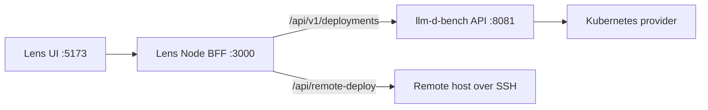

# Deploy API Usage Guide

This document describes the Deploy APIs used by the current Lens UI. It is an
implementation guide for the running services, rather than the longer-lived
domain contract in [deploy-contract.md](deploy-contract.md).

## Service Topology

The normal local development path is:



The UI calls same-origin `/api/...` paths. Vite proxies these calls to the Node
backend. The Node backend forwards `/api/v1/deployments` to the Python
llm-d-bench API and implements `/api/remote-deploy` itself.

For local development, start the services with these relevant settings:

```bash
PORT=3000 \
SIMULATION_API_URL=http://127.0.0.1:8081 \
npx tsx watch server/server.js
```

The BFF resolves its v1 upstream in this order:

1. `LLM_D_DEPLOY_API_URL`
2. `SIMULATION_API_URL`
3. `OPTIMALBENCH_URL`
4. `http://127.0.0.1:8081`

By default, local benchmark reports are read from
`/root/.llm_d_bench/run_store`, and Cluster Overview reads its server list from
`/root/.llm_d_bench/run_store/server_list.json`. Set `PRISM_LOCAL_DIR` or
`LLM_D_BENCH_SERVER_LIST` only to override those locations.

`LLM_D_ROOT` is optional on this host: its default is `/root/wenxin/llm-d` for
both application configuration and Remote Deploy. `SIMULATION_API_URL` is also
optional when the Python API listens on its default `http://127.0.0.1:8081`;
set it only to use a different upstream.

Evaluate workflow and benchmark records are stored by default under
`/root/.llm_d_bench/run_store/evaluate`. Python Cluster sessions share
`/root/.llm_d_bench/run_store/cluster_sessions` and call the local BFF at
`http://127.0.0.1:3000` unless their corresponding environment variables are
set.

## Benchmark entry-point parity

Both Configuration → Deployment → Benchmark and **Use existing endpoint** use
`POST /api/v1/evaluate/runs` and the same benchmark executor after a deployment
is ready. Workflow orchestration only adds deployment lifecycle management and
multi-case comparison. `deployment_ownership` controls cancellation/cleanup, not
which benchmark evidence can be collected.

The standalone request inherits the workflow's `BenchmarkSpec`, including its
validation and defaults: 1 worker, 1800-second execution timeout, 8 GiB host
memory per worker, and 2 matrix warm-up requests. Explicit caller settings remain
unchanged. Clients previously relying on standalone-only defaults of 7200 seconds
and 32 GiB should now send those values explicitly if needed.

- Monitoring preparation first checks for a healthy Prometheus target (`up == 1`).
  Healthy targets are reused without applying monitor resources. Otherwise, both
  entry points attempt ServiceMonitor/PodMonitor and supporting RBAC setup.
  The complete discovery/setup/readiness operation has a **30-second deadline**;
  failures and timeouts are recorded but do not fail the benchmark.
- Benchmark-window Prometheus queries are attempted even when setup failed, since
  existing targets may still provide data. Collection has a **120-second deadline**.
  Missing series, exporters, permissions, or connectivity remain unavailable, not
  zero and not fabricated. Only the configured cluster's central Prometheus is
  discovered; an arbitrary external Prometheus URL is not inferred from the endpoint.
- KV collection uses existing instrumented model containers for either entry point.
  It starts/stops a capture session via `kubectl exec`; it does **not** install a
  probe, change model manifests, or restart a service. Missing instrumentation,
  unsupported cache layouts, concurrent capture conflicts, missing request IDs,
  or worker parallelism other than one produce an explicit unavailable trace.
- Client metrics, request evidence, capacity/SLO analysis, configuration mechanism
  facts and diagnostics use one enrichment pipeline on completion and detail reads.
  Resource snapshots are captured at benchmark completion, before workflow cleanup;
  snapshot collection is best-effort with a 30-second deadline.
- `GET /api/v1/evaluate/runs/{id}` retains its top-level benchmark record shape and
  additionally returns `configuration`, `deployment_configuration`, model/namespace/
  endpoint facts where known, and `deployment_cases` containing read-only execution,
  monitoring and diagnostic links. This does not transfer deployment ownership.
  `GET /api/v1/evaluate/workflow-runs/{id}/details` uses the same benchmark enrichment
  and nests it alongside workflow-specific case/comparison data.
- Both UI entry points use the same structured results, resources and comparison
  views. Logs do not replace structured results. Existing endpoints expose read-only
  deployment evidence; benchmark cancellation never stops the existing model service.

Equal workloads on the same deployment with the same available instrumentation have
the same **metric coverage and semantics**, not necessarily identical measured values.
Historical runs can backfill saved client reports and derived analysis, but missing
historical Prometheus samples/KV captures/resource snapshots cannot be reconstructed
from current live data. Rerun the benchmark to collect newly enabled evidence.

## Evaluation baseline resource budgets

`POST /api/v1/evaluate/evaluations` returns `202` with a queued workflow and saved
configuration snapshots for its deployment cases. For a `pd-disaggregation`
source, independently deployed baselines (including `direct-vllm`) now default to
the **total prefill + decode GPU budget**, rather than only the decode pool:

`baseline replicas = (prefill replicas * prefill TP + decode replicas * decode TP) / baseline TP`

- Baseline TP inherits source decode/serving TP unless
  `benchmark_plans[].baseline_parameters[baseline_type].tensor_parallel_size`
  overrides it. A TP-only override recalculates the replica count.
- For example, **2P2D with both TP=1 produces 4 plain vLLM replicas at TP=1**;
  each plain instance performs both prefill and decode.
- Explicit `baseline_parameters[baseline_type].replicas` takes precedence. This
  permits deliberate unequal-budget experiments; such experiments must not be
  interpreted as equal-hardware comparisons.
- Automatic matching must produce an exact integer between 1 and 32. Otherwise
  creation returns `409` before saving/queueing the workflow. Select a compatible
  baseline TP or explicitly specify replicas to choose a different budget; Lens
  does not silently round or cap the result.
- Non-PD sources continue to inherit decode/serving replicas. Same-pod
  `kubernetes-service` comparisons reuse the candidate deployment and do not
  allocate an independent GPU pool.

This default applies to **new evaluations**. Stored/running evaluation snapshots
and retries are not rewritten. Create a new evaluation to obtain a corrected
baseline; a historical 4-card PD vs 2-card vLLM result remains an unequal-budget
comparison.

## V1 Deployment Runs

These are the APIs used by the current Optimization Workspace for configuration
driven, provider-backed deployments. They persist runs under
`~/.llm-d-bench/deploy/{runs,executions}` by default. Existing records in
`<current working directory>/.llm_d_bench/deploy_store` are migrated on first
use when no explicit store path is supplied.

All requests and responses use JSON. Send `Content-Type: application/json` for
requests with a body.

### List Deployment Executions

`GET /api/v1/deployments/executions`

This is the shared, side-effect-free discovery API for Evaluate, Simulation,
and Observability consumers. Optional `status` and `cluster_id` query
parameters filter the flattened execution list. For example:

`GET /api/v1/deployments/executions?status=ready&cluster_id=cluster-1`

The response is `{ "items": [...] }`. Each item contains the `execution_id`;
lifecycle status; model; namespace; internal endpoint; any already-persisted
forwarded endpoint; cluster identity; guide; and creation time. `run_id` and
`case_id` are deliberately omitted: `execution_id` is the only deployment
reference Deploy exposes to other modules. Listing executions never creates a
port-forward. Call the execution endpoint action below when a locally reachable
endpoint is required.

### Get One Deployment Execution

`GET /api/v1/deployments/executions/{executionId}`

Returns the same projection as the list entry, or `404` when no execution
matches.

### Connect a Deployment Execution

`POST /api/v1/deployments/executions/{executionId}/endpoint`

Ensures a host-reachable endpoint by reusing a healthy `kubectl port-forward`
or rebuilding a dead one, then returns
`{ success, execution_id, id, local_port, endpoint, forwarded_endpoint, namespace, service, remote_port }`.
This is required because a stored `endpoint` is an in-cluster ClusterIP URL and
tunnels do not survive a backend restart.

### Create a Run

`POST /api/v1/deployments/runs`

Starts one deployment case for each supplied configuration. The BFF rejects a
request with `provenance.cluster_session_id` unless that session was previously
connected through the Cluster Overview API.

```json
{
  "configurations": [
    {
      "schema_version": "deployable-configuration.v1",
      "type": "optimized-baseline",
      "format": "json",
      "content": {
        "model": { "name": "Qwen/Qwen3-0.6B" },
        "decode": { "replicaCount": 1, "tensorParallelSize": 1 },
        "runtime": { "image": "ghcr.io/llm-d/llm-d-xpu:v0.8.0" }
      },
      "provider_ref": "optimized-baseline",
      "checksum": "sha256:replace-with-content-checksum",
      "provenance": {}
    }
  ],
  "failure_policy": "continue",
  "provenance": {
    "cluster_session_id": "optional-connected-session-id"
  }
}
```

Required configuration fields are `type`, `format`, and `checksum` with at
least one configuration. `schema_version` defaults to
`deployable-configuration.v1`; `content`, `provider_ref`, and `provenance` have
safe defaults. `failure_policy` is either `continue` (default) or `stop`.

The response is a `DeploymentRun` containing an `id`, run-level `status`, and a
`cases` list. Retain the returned run and case IDs for lifecycle operations.

### List or Search Runs

`GET /api/v1/deployments/runs?query=<text>`

Returns an array of `DeploymentRun` records in newest-first order. `query`
matches run ID, provider reference, deployment name, or execution namespace.

`GET /api/v1/deployments?query=<text>` is an equivalent collection endpoint.

### Get or Delete a Run

| Method | Path | Result |
| --- | --- | --- |
| `GET` | `/api/v1/deployments/runs/{runId}` | Returns the full `DeploymentRun`. |
| `DELETE` | `/api/v1/deployments/runs/{runId}` | Deletes the stored run and its stored executions; response is `204 No Content`. |
| `POST` | `/api/v1/deployments/runs/{runId}/cluster-session` | Rebinds a run to a newly connected session for its original Cluster Overview server; body: `{ "cluster_session_id": "..." }`. |

Cluster sessions are temporary and are invalidated by a BFF restart. A new
session for the same Cluster Overview server can be rebound before mutating an
existing deployment. New runs persist that server identity automatically.
Historical runs without a stored server identity may be rebound explicitly;
this is the caller's confirmation that the selected cluster owns the recorded
namespace.

### Inspect a Case

`GET /api/v1/deployments/runs/{runId}/cases/{caseId}`

Returns:

```json
{
  "case": { "id": "...", "status": "ready", "execution_id": "..." },
  "execution": {
    "execution_id": "...",
    "status": "ready",
    "namespace": "llm-d-bench-example",
    "endpoint": { "url": "http://...", "protocol": "http" }
  },
  "deployment": {
    "run_id": "...",
    "case_id": "...",
    "status": "ready",
    "namespace": "llm-d-bench-example",
    "endpoint": "http://...",
    "guide": "optimized-baseline",
    "backend": "vllm"
  }
}
```

The `deployment` field is a Lens-oriented summary. `case` and `execution` are
the durable lifecycle records.

### Refresh, Stop, Restart, and Clean a Case

| Method | Path | JSON body | Result |
| --- | --- | --- | --- |
| `POST` | `/api/v1/deployments/runs/{runId}/cases/{caseId}/refresh` | `{}` | Refreshes provider state and returns the case response. |
| `POST` | `/api/v1/deployments/runs/{runId}/cases/{caseId}/stop` | `{}` | Stops a ready case and returns the case response. |
| `POST` | `/api/v1/deployments/runs/{runId}/cases/{caseId}/restart` | `{}` | Restarts a stopped or failed case and returns `{ "case": ... }`. |
| `POST` | `/api/v1/deployments/runs/{runId}/cases/{caseId}/clean` | `{ "preserve_rendered_overlay": false }` | Cleans provider resources and returns the case response. |

Set `preserve_rendered_overlay` to `true` when the rendered deployment files
must remain available after cleanup.

In the Lens UI, **Delete deployment** invokes `clean`. It deletes the case's
Kubernetes namespace and its workload resources, then marks the case as
`cleaned` or `cleaned_up`. This is distinct from `DELETE /runs/{runId}`, which
first cleans remaining cases and then removes the persisted run and execution
records.

### Read Case Logs

`GET /api/v1/deployments/runs/{runId}/cases/{caseId}/logs?limit=200`

`limit` is clamped to the range `1..1000`. The exact log page is provider
defined; callers should treat it as an evidence/log response rather than assume
a Kubernetes pod log schema.

### Deployment States

Run states include `queued`, `running`, `succeeded`, `partially_succeeded`,
`failed`, `cleaned`, `cancelling`, and `cancelled`.

Case states include `queued`, `rendering`, `deploying`, `ready`, `failed`,
`stopped`, `cancelling`, `cancelled`, `cleaned`, and `cleaned_up`.

An execution with state `ready` includes an endpoint. Do not start a benchmark
against an execution before it reaches `ready`.

## Remote SSH Deployment API

These endpoints are used by the older remote deployment controls. Unlike v1
runs, the Node BFF opens SSH connections and invokes `llm-d-bench` on the
target host. Use them only when the caller needs direct SSH deployment rather
than the configuration-driven v1 lifecycle.

Remote deployment is enabled when `PRISM_REMOTE_DEPLOY_ENABLED=true` or when
`NODE_ENV` is not `production`. In production, hosts must also appear in the
comma-separated `PRISM_REMOTE_HOST_ALLOWLIST`.

### Get Defaults and Verify a Host

| Method | Path | Body | Result |
| --- | --- | --- | --- |
| `GET` | `/api/remote-deploy/defaults` | None | Repository, branch, proxy, and model mount defaults from environment. |
| `POST` | `/api/remote-deploy/fingerprint` | `{ "target": { "host", "port", "username" } }` | SSH host fingerprint that must be confirmed for later calls. |
| `POST` | `/api/remote-deploy/test` | `{ "target": RemoteTarget, "credentials": {} }` | SSH, `llm-d-bench`, Kubernetes, and XPU discovery probe. |

`RemoteTarget` requires these fields for authenticated operations:

```json
{
  "host": "10.0.0.20",
  "port": 22,
  "username": "root",
  "authMethod": "agent",
  "hostFingerprint": "SHA256:base64-fingerprint",
  "cards": ["0", "1"]
}
```

Supported `authMethod` values are `agent`, `key`, and `password`. For `key`,
`keyPath` must resolve beneath `PRISM_SSH_KEY_DIR` (default: `$HOME/.ssh`). For
`password`, provide `{ "credentials": { "password": "..." } }` per request;
the BFF does not persist or return the password.

### Start and Observe a Remote Deployment

| Method | Path | Required body fields | Result |
| --- | --- | --- | --- |
| `POST` | `/api/remote-deploy/start` | `plan`, `target`, optional per-request `credentials` | Starts `llm-d-bench deploy custom` remotely. |
| `POST` | `/api/remote-deploy/status` | `namespace`, `target`, optional `credentials` | Returns pod status, readiness, endpoint, and failure information. |
| `POST` | `/api/remote-deploy/logs` | `namespace`, `target`, optional `pod`, `tail`, and `credentials` | Returns up to 32 KiB of logs. `tail` is clamped to `1..1000`. |
| `POST` | `/api/remote-deploy/teardown` | `namespace`, `target`, optional `credentials` | Runs forced remote cleanup. |

The remote `plan` must include a valid Kubernetes `namespace`, service `name`,
Intel Data Center GPU/XPU `accelerator`, and a single node. It also needs a
deployment target with a repository path or GitHub HTTPS URL and a branch. The
provider validates accelerator topology against the selected card IDs before it
opens the remote deployment.

## Error Responses

The Node BFF returns Problem Details for proxy-level failures and JSON objects
with an `error` field for direct remote deployment failures. The Python API
returns FastAPI validation errors or `{ "detail": "..." }` for lifecycle
errors. The Lens client reports `detail` first, then `error`.

Common HTTP statuses:

| Status | Meaning |
| --- | --- |
| `400` | Invalid remote target, credentials, namespace, topology, or input validation failure. |
| `404` | Run or case does not exist. |
| `409` | Invalid lifecycle transition, or a supplied cluster session is unavailable. |
| `422` | Invalid v1 request body according to the Pydantic request model. |
| `502` | The deployment/simulation upstream is unavailable, timed out, or a remote command failed. |
| `503` | The v1 deployment manager or remote deployment feature is unavailable. |

## Quick Smoke Test

With 5173, 3000, and 8081 running locally:

```bash
curl -sS http://127.0.0.1:5173/api/v1/deployments/runs
curl -sS http://127.0.0.1:5173/api/remote-deploy/defaults
```

The first request should return a JSON array, and the second should return the
effective remote deployment defaults. A `502` on a v1 route normally indicates
that the Node BFF cannot reach its configured 8081 upstream; verify
`SIMULATION_API_URL` and the running Python API before changing a deployment
payload.