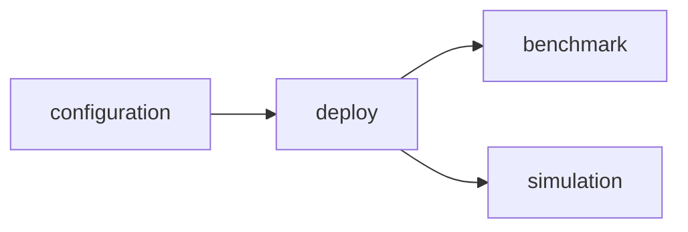

# Deploy Module Contracts

## Purpose

The `deploy` module accepts one or more immutable configuration artifacts from
`configuration`, applies them through a deployment provider, and produces
evidence for `benchmark`, `simulation`, and audit consumers.

It does not validate user configuration or generate deployment files. Those
are `configuration` responsibilities. It also does not receive a workload;
`benchmark` owns workload validation and execution.



## Common Payload

All changeable domain values use the following envelope:

```python
VersionedPayload(
    schema_version: str,
    value: dict[str, Any],
)
```

Examples of producer-managed schema versions are `deployment-policy.v1` and
`cluster-snapshot.v1`.

The deploy module requires a non-empty schema version and an object payload. It
does not require specific keys within `value`.

## Command: DeploymentCreateRequest

`DeploymentCreateRequest` is the create command from `configuration` into
`deploy`.

```python
DeploymentCreateRequest(
    request_id: str,
    input_schema_version: str,
    configuration_artifacts: list[ConfigurationArtifact],
    deployment_policy: VersionedPayload,
    cluster_snapshot_ref: str | None,
    cluster_snapshot: VersionedPayload | None,
    provenance: dict[str, Any],
)
```

| Field | Meaning |
|---|---|
| `configuration_artifacts` | One or more immutable generated files. Each carries its schema version, kind, provider reference, checksum, and either inline content or a content reference. |
| `deployment_policy` | Optional versioned target policy such as namespace selection or admission settings; it must not reinterpret the generated configuration. |
| `cluster_snapshot` | Optional immutable cluster evidence supplied by the future `cluster` module. |
| `provenance` | Request source, actor, upstream recommendation/run references, and audit metadata. |

```python
ConfigurationArtifact(
    artifact_id: str,
    schema_version: str,
    kind: str,
    provider_ref: str,
    media_type: str,
    checksum: str,
    content_ref: str | None,
    content: str | None,
)
```

`configuration` owns the artifact content and checksum. `provider_ref` selects
the deploy-side provider (for example a Helm-release or manifest-apply
provider); it is not a request for deploy to regenerate or reinterpret the
file. At least one of `content` and `content_ref` is required.

## Command: DeploymentKillRequest

`DeploymentKillRequest` is an explicit, auditable request to terminate a
deployment that was created by `deploy`:

```python
DeploymentKillRequest(
    request_id: str,
    input_schema_version: str,
    execution_id: str,
    expected_namespace: str | None,
    reason: str | None,
    provenance: dict[str, Any],
)
```

`execution_id` is required and must resolve to a deployment execution owned by
the deploy module. `expected_namespace` is optional, but when provided the
provider must reject a mismatch. The request deliberately does not offer a
free-form namespace or resource selector: callers cannot use this API to
delete arbitrary cluster resources. The final lifecycle output is the matching
`DeploymentExecution`, normally in `cleaned_up`, `rolled_back`, or `failed`.

## Observation: Status and Logs

`DeploymentExecution` is the sole deployment status model. A status query
returns the latest persisted `DeploymentExecution`; deploy does not expose a
second `get_status` response type.

Deployment logs use a separate cursor-based query because they can be large
and may still be produced while a deployment is running:

```python
DeploymentLogRequest(
    execution_id: str,
    cursor: str | None,
    limit: int,       # 1 through 1000
    follow: bool,
    sources: list[str],
)

DeploymentLogPage(
    execution_id: str,
    entries: list[DeploymentLogEntry],
    next_cursor: str | None,
    complete: bool,
    evidence_refs: list[str],
)

DeploymentLogEntry(
    timestamp: datetime,
    source: str,
    message: str,
    severity: str | None,
)
```

`sources` selects logical provider-defined streams such as `controller`,
`workload`, or `events`. The implementation must validate each requested
source against the selected provider; it must not accept arbitrary Kubernetes
resource selectors.

Log bodies are not embedded in `DeploymentExecution` or the JSON RunStore.
Deploy may persist redacted, immutable log evidence and return its references
in `DeploymentLogPage.evidence_refs`; it also appends those references to
`DeploymentExecution.evidence_refs`. This keeps logs available after cleanup
while allowing a separate retention, compression, access-control, and storage
policy.

## Rendered Output: DeploymentArtifact

`DeploymentArtifact` represents the immutable, rendered deployment before it
mutates Kubernetes.

```python
DeploymentArtifact(
    artifact_id: str,
    artifact_hash: str,
    configuration_artifact_ids: list[str],
    source_ref: str | None,
    manifest_ref: str | None,
    manifest_checksum: str | None,
    values_checksum: str | None,
    rendered_payload: VersionedPayload,
    created_at: datetime,
)
```

The artifact supports approval hash comparison, reproducible rendering,
rollback, audit, and source/manifest provenance.

## Main Output: DeploymentExecution

`DeploymentExecution` is the deployment lifecycle output retained for future
consumers.

```python
DeploymentExecution(
    execution_id: str,
    request_id: str,
    status: DeploymentStatus,
    artifact: DeploymentArtifact,
    endpoint: DeploymentEndpoint | None,
    namespace: str | None,
    configuration_artifacts: list[ConfigurationArtifact],
    resource_snapshot: VersionedPayload | None,
    provenance: dict[str, Any],
    evidence_refs: list[str],
    diagnostics: VersionedPayload | None,
    created_at: datetime,
    updated_at: datetime,
)
```

Supported lifecycle states are:

```text
draft -> validated -> rendered -> deploying -> ready
                                  -> failed
                                  -> rolling_back -> rolled_back
                                  -> cleaned_up
```

When `status` is `ready`, the execution must contain a `DeploymentEndpoint`:

```python
DeploymentEndpoint(
    url: str,
    protocol: str,
    service_ref: str | None,
    model_ref: str | None,
)
```

The endpoint contains service location metadata only. Credentials, kubeconfig,
and authorization values must not be stored in this contract.

## Public Projection for Benchmark

Only a `ready` execution can be projected with
`DeploymentExecution.benchmark_input()`:

```python
BenchmarkDeploymentInput(
    execution_id: str,
    artifact: DeploymentArtifact,
    endpoint: DeploymentEndpoint,
    namespace: str | None,
    provenance: dict[str, Any],
)
```

The initial `benchmark` implementation can use this contract to invoke the
local `llmdbenchmark` harness. It receives a ready endpoint, namespace,
artifact, and provenance without reading the Guide registry or recomputing
deployment configuration. The benchmark request separately supplies its
workload snapshot.

`benchmark` consumes this projection; it does not call deploy lifecycle
operations or inspect provider-specific deployment details.

## Public Projection for Simulation

Any execution can be projected with `DeploymentExecution.simulation_input()`:

```python
SimulationDeploymentInput(
    execution_id: str,
    artifact: DeploymentArtifact,
    deployment_status: DeploymentStatus,
    endpoint: DeploymentEndpoint | None,
    namespace: str | None,
    resource_snapshot: VersionedPayload | None,
    provenance: dict[str, Any],
)
```

This preserves the deployment namespace, endpoint when one exists, immutable
resource, configuration artifact, artifact, and provenance evidence needed by
a future `simulation` module to construct
SimulationSpec, RateCard, and TCOReport inputs. Simulation must not substitute
current mutable cluster state for these execution snapshots.

`simulation` consumes this projection; it does not create, terminate, or
otherwise manage deployments.

## Compatibility

The existing Evaluate API and frontend are not consumers of these contracts
yet. The next refactor step is to adapt the existing Guide adapter lifecycle
into a deploy provider that consumes
`DeploymentCreateRequest -> DeploymentExecution`,
then adapt the local `llmdbenchmark` client to consume
`BenchmarkDeploymentInput` plus its benchmark request.

The planned public deploy command surface is:

```python
async def create(
    self,
    request: DeploymentCreateRequest,
) -> DeploymentExecution: ...


async def kill(
    self,
    request: DeploymentKillRequest,
    execution: DeploymentExecution,
) -> DeploymentExecution: ...


async def get(
    self,
    execution_id: str,
) -> DeploymentExecution: ...


async def get_logs(
    self,
    request: DeploymentLogRequest,
) -> DeploymentLogPage: ...
```

`create` produces the execution that benchmark and simulation subsequently
project into their usable endpoint/namespace inputs. `kill` must verify the
request/execution identity and optional namespace before delegating to the
deployment provider's cleanup path. `get` is the status query. `get_logs`
returns historical or live logs and may create durable evidence references.
