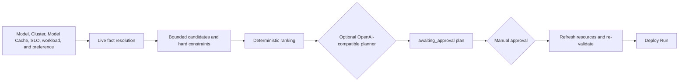

# Agentic Deploy Implementation Plan

## Positioning

Agentic Deploy is Lens's approval-gated deployment planning layer. It generates recommendations from live cluster resources, bounded candidates, optional AIC predictions, and historical Simulation evidence for the same model, then delegates execution to the existing Deploy module. It does not let the LLM create arbitrary Kubernetes configurations, and it will not automatically deploy or automatically start evaluations.

## Current implementation status

### Completed

- Agentic API: create, list, query, recalculate, candidate selection, and approval.
- Bounded candidates for five registered providers: `baseline-vllm`, `optimized-baseline`,
  `pd-disaggregation`, `tiered-prefix-cache`, and `precise-prefix-cache-routing`.
- Hard constraints for VRAM, free GPUs, and CPU buffer; when no deployable candidate exists,
  return `cannot_satisfy` and do not call the external planner.
- Live cluster snapshot, Use case/workload profile derivation, AIC support/search, and
  same-model Simulation historical evidence resolution.
- Use only exact topology-matching AIC predictions for candidate ranking; when no matching
  prediction exists, display it as unknown rather than zero performance.
- Up to three high-similarity historical Simulation measurements can supplement scoring. A
  historical topology enters the external planner catalog only when the persisted deployment
  topology is exactly identical to the current candidate and still satisfies current resources.
- The optional OpenAI-compatible planner may only select from and score Lens-provided deployable
  candidate IDs. When strict JSON schema is incompatible, it can fall back to a normal completion
  constrained by the same JSON contract.
- The server validates candidate IDs, uniqueness, bounds, score completeness, and
  `candidate_id`/highest-score consistency in external results.
- Deterministic normalization for explicit preferences: `offloading`/`offload` ->
  `tiered-prefix-cache`; `distributed`/`disaggregation` -> `pd-disaggregation`;
  `precise-caching`/`precise caching` -> `precise-prefix-cache-routing`. A new preference in
  Recalculate overrides the previous preference.
- The external planner prompt uses the same term mapping and requires the best candidate of the
  mapped provider to receive a higher score when that provider has a valid candidate; the server
  does not modify valid external scores.
- Model Cache is a prerequisite for both Standard and Agentic. The selected volume must be ready,
  must belong to the `model-cache` purpose, must not be a dynamic PVC, and the target model entry
  must be ready.
- Model Market provides a shared Model Cache storage selector below Cluster; the Agentic workspace
  supports SLO, workload, preference, recalculation, evidence, and candidate selection.
- Creating a plan performs no side effects. On approval, the system re-fetches live resources,
  confirms that the selected candidate is still deployable, then uses
  `build_agentic_configuration()` to construct a `DeployableConfiguration` and calls
  `DeploymentRunManager.start_run()`.

### Current boundaries

- The Agentic run exists only in in-process memory and is lost after service restart.
- Without a candidate-exact AIC prediction, TTFT/TPOT SLOs cannot be proven satisfied or
  unsatisfied; they are goals provided to the ranking provider rather than hard performance gates.
- AIC currently matches only exact topologies for aggregate baseline-vLLM and PD; other guides do
  not receive an AIC boost.
- The external planner's preference mapping is prompt guidance, not server-enforced reordering;
  when the external provider is available, the final score/order follows its valid response.
- Agentic does not automatically create an Evaluate workflow, write BenchmarkRecord entries, or
  perform iterative tuning.

## Module boundaries

| Module | How Agentic reuses it |
| --- | --- |
| `cluster` | Uses the active session and reads live hardware/capacity at plan creation and before approval. |
| `storage` / `model_cache` | Validates the selected Model Cache volume and the target model's ready entry; does not manage volume or download lifecycle. |
| `aic` | Queries support/search and binds predictions only to exact candidate topologies. |
| `simulation` / `deploy` | Reads same-model completed Simulation history and its persisted configuration topology. |
| `deploy` | Accepts the `DeployableConfiguration` generated by Agentic and manages the real deployment state machine. |
| OpenAI-compatible provider | Can only return constrained candidate IDs and scores; it has no Kubernetes, Deploy, or Evaluate write permissions. |

## Follow-up plan

1. Surface external planner failures as redacted categories such as rate limit, timeout,
   transport, or invalid provider response, instead of a single unavailable status.
2. Expand AIC coverage, and explicitly display SLO as unknown/confidence state when no exact
   prediction exists.
3. Integrate measured Deploy/Evaluate results to form versioned BenchmarkRecord history retrieval
   with hardware/runtime similarity and time decay.
4. Decide at the product layer whether preference should become a mandatory local policy; the
   current implementation has deterministic mapping and external prompt guidance, but does not
   rewrite the valid ordering from the external provider.
5. Consider automatic Evaluate and multi-round tuning under execution-policy constraints.
