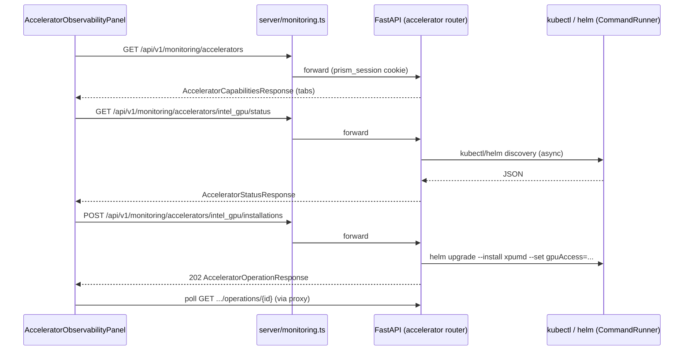

# Proposal: Accelerator Observability Services

- **Status:** Draft — Gate A review decision confirmed (see §10), pending implementation.
- **Change directory:** `accelerator-observability-design.md`
- **Reference architecture:** `llm_d_bench/monitoring/cluster_stack/` (backend),
  `src/components/ClusterMonitoringStack/` (frontend).
- **Upstream documentation:**
  - XPUM Daemon Helm chart: https://github.com/intel/xpumanager/blob/main/xpumd/charts/xpumd/README.md
  - XPUM monitoring guide: https://github.com/intel/xpumanager/blob/main/xpumd/docs/MONITORING.md

---

## 1. Background and goals

The current cluster monitoring stack manages only one thing: the Prometheus/Grafana
"Cluster infrastructure" stack (see the "Observability services" section in
`ClusterMonitoringStackDashboard.jsx`). That panel contains a reserved, disabled
"Deployment monitoring" card, and there is no concept at all of
**accelerator-level** observability.

This change introduces accelerator observability as a **peer capability** of the
existing cluster monitoring stack, under the same monitoring domain, and reuses the
same `/api/v1/monitoring/*` proxy path. The first concrete backend is
**Intel GPU**, monitored through the Intel XPUM Daemon (`xpumd`) Helm chart.

User-facing requirements:

- Add an **"Accelerator Observability services"** panel **below** the "Live
  infrastructure state" section of the monitoring dashboard.
- Use **Tabs** to distinguish different hardware; for now, keep only one tab:
  **Intel GPU**.
- Under Intel GPU, support **two access modes**: `dra` (K8s DRA GPU driver) and
  `plugin` (K8s GPU device plugin). Of the chart's supported `gpuAccess` values,
  these are the only two we need to implement; `i915` / `xe` / `none` are out of
  scope.
- The API and backend architecture must align with the existing monitoring
  architecture (router → service → discovery/operations, Pydantic DTOs, domain
  errors, `CommandRunner` asynchronous execution).

### Non-goals

- v1 does not implement other accelerator providers such as NVIDIA/AMD (the
  registry is the extension point).
- No per-deployment llm-d instance monitoring (this still belongs to the reserved
  "Deployment monitoring" tab / Planned placeholder).
- Do not accept kubeconfig from the browser; discovery logic, like `cluster_stack`,
  runs entirely on the server side based on the current kube context.

---

## 2. Accelerator abstraction (extension point)

To make the panel truly support multiple hardware types, the backend uses an
`AcceleratorType` literal to establish a small **provider registry**. Each provider
implements the same interface as the `cluster_stack` service, so adding new
hardware only requires registering a provider rather than duplicating routes.

```
AcceleratorType = Literal["intel_gpu"]            # v1; future: "nvidia_gpu", "amd_gpu", ...
GpuAccess       = Literal["dra", "plugin"]        # v1; the chart also allows "i915"/"xe"/"none"
```

One provider exposes four asynchronous capabilities:

| Capability | Conceptual signature | Intel GPU implementation |
|---|---|---|
| `discover_status(namespace, runner)` | `AcceleratorStatusResponse` | Query the xpumd DaemonSet + Pods + optional ServiceMonitor/Grafana dashboard |
| `preflight(request)` | `AcceleratorPreflightResponse` | Check kubectl/helm, DRA admin-access label, chart availability, and stack status |
| `install(request, idempotency_key)` | `AcceleratorOperationResponse` | Execute tracked asynchronous `helm upgrade --install xpumd … --set gpuAccess=<dra\|plugin>` (idempotent: install when missing, reconcile when `degraded`) |
| `get_operation(operation_id)` | `AcceleratorOperationResponse` | Read the persisted operation status |

The discovery/install logic of the `intel_gpu` provider is the focus of this
proposal. The registry is intentionally lightweight: a dictionary
`{ "intel_gpu": IntelGpuProvider() }`, plus a capabilities interface for the
frontend to render tabs.

---

## 3. Backend architecture

Add package `llm_d_bench/monitoring/accelerator/`, corresponding one-to-one with
`llm_d_bench/monitoring/cluster_stack/`:

```
llm_d_bench/monitoring/accelerator/
├── __init__.py        # exports router
├── errors.py          # AcceleratorError (same shape as ClusterStackError)
├── models.py          # Pydantic DTOs (StrictModel, extra="forbid")
├── registry.py        # provider registry + AcceleratorProvider protocol
├── intel_gpu.py       # Intel GPU (xpumd) provider: discovery + preflight + install argv
├── operations.py      # AcceleratorOperationManager (persistent async helm upgrade --install)
├── router.py          # FastAPI routes, prefix /api/v1/monitoring/accelerators
└── service.py         # orchestration: resolve provider, validate, dispatch
```

### 3.1 Reuse instead of duplication

- Reuse `llm_d_bench/monitoring/kubernetes.CommandRunner` directly to execute all
  `kubectl` / `helm` subprocess calls.
- `operations.py` generalizes `ClusterStackOperationManager`—the same
  `OperationStore` (JSON files under `LENS_DATA_DIR/metadata/monitoring/operations`),
  the same idempotency-key semantics, the same log redaction and `_MAX_LOG_LINES` /
  byte limits. If needed, it can inherit or reuse the cluster_stack manager and
  replace the verifier; the external interface remains consistent.
- The error model stays consistent: `AcceleratorError(code, message, retryable, status_code)`,
  providing `.detail() -> {"code", "message", "retryable"}`.

### 3.2 Route registration

Add in `llm_d_bench/api/main.py`:

```python
from llm_d_bench.monitoring.accelerator import router as accelerator_router

...
app.include_router(accelerator_router)
```

The existing `server/monitoring.ts` proxy already forwards the entire
`/api/v1/monitoring/*` namespace to the upstream Python API, so **no proxy changes
are required**. The new routes automatically inherit the existing
`requireMonitoringOperator` authorization (GitHub token → `user`/`admin`
permission).

---

## 4. Data models (Pydantic DTOs)

All models use `StrictModel` (`extra="forbid"`) consistently with
`cluster_stack.models`.

```python
AcceleratorType = Literal["intel_gpu"]
GpuAccess = Literal["dra", "plugin"]
AcceleratorStatus = Literal["unknown", "absent", "installing", "ready", "degraded", "unsupported", "unreachable"]
ComponentStatus = Literal["ready", "progressing", "degraded", "missing", "external", "unknown"]
OperationStatus = Literal["queued", "running", "succeeded", "failed"]
```

### 4.1 `AcceleratorCapability` (tab metadata)

```python
class AcceleratorCapability(StrictModel):
    type: AcceleratorType  # "intel_gpu"
    display_name: str  # "Intel GPU"
    access_modes: list[GpuAccess]  # ["dra", "plugin"]
    release_name: str  # "xpumd"
    default_namespace: str  # "intel-xpumd"


class AcceleratorCapabilitiesResponse(StrictModel):
    accelerators: list[AcceleratorCapability]
```

This is the data source for the frontend to render tabs and discover which access
modes are available. The order of `accelerators` is the tab order.

### 4.2 `AcceleratorInstallRequest`

```python
class AcceleratorInstallRequest(StrictModel):
    accelerator: AcceleratorType  # "intel_gpu"
    access_mode: GpuAccess = "dra"
    namespace: str = "intel-xpumd"

    @field_validator("namespace")
    def validate_namespace(cls, v: str) -> str:
        return validate_namespace(v)  # reuse K8s DNS label validation
```

Prometheus / Grafana are **always enabled** (Decision 4): xpumd does not deploy an
independent monitoring stack; instead it reuses the existing Cluster infrastructure
Prometheus and Grafana—`prometheus.release` uses the cluster stack release (`llmd`),
and `grafana.namespace` uses the cluster stack namespace (`llm-d-monitoring`); see
the install command in §6.2. Therefore the request body no longer exposes
`enable_prometheus` / `enable_grafana` switches.

### 4.3 `AcceleratorStatusResponse`

```python
class AcceleratorComponent(StrictModel):
    name: str  # "xpumd", "prometheus_service_monitor", "grafana_dashboard", "gpu_nodes"
    status: ComponentStatus
    kind: Literal["workload", "configmap", "crd", "node"] = "workload"
    ready: int | None = None
    desired: int | None = None
    diagnostics: list[ComponentDiagnostic] = Field(default_factory=list)


class AccessModeAvailability(StrictModel):
    mode: GpuAccess  # "dra" | "plugin"
    available: bool  # whether the environment has the corresponding K8s resources
    detected: bool  # whether actually detected, as distinct from unknown/not checked
    message: str | None = None  # reason when unavailable


class AcceleratorStatusResponse(StrictModel):
    accelerator: AcceleratorType
    access_mode: GpuAccess | None = None  # current or most recently installed mode; None when absent/unknown
    access_modes: list[AccessModeAvailability] = Field(default_factory=list)
    cluster_reachable: bool
    context: str | None = None
    namespace: str
    release: HelmReleaseSummary  # reuses cluster_stack.models.HelmReleaseSummary
    status: AcceleratorStatus
    message: str
    components: list[AcceleratorComponent] = Field(default_factory=list)
    active_operation_id: str | None = None
    observed_at: datetime
    stale: bool = False
```

Intel GPU component semantics (see §6.1):

| Component | Status derivation |
|---|---|
| `xpumd` | DaemonSet `desiredNumberScheduled` vs `numberReady` |
| `prometheus_service_monitor` | ServiceMonitor generated by xpumd and scraped by the existing Cluster infra Prometheus; `missing` means not yet generated |
| `grafana_dashboard` | Grafana dashboard ConfigMap generated by xpumd and loaded by the existing Cluster infra Grafana; `missing` means not yet generated |
| `gpu_nodes` | Nodes labeled `intel.feature.node.kubernetes.io/gpu=true`; `ready` when ≥1 |

### 4.4 Preflight / operation models

`AcceleratorPreflightCheck`, `AcceleratorPreflightResponse`, `OperationLogEntry`,
`OperationError`, and `AcceleratorOperationResponse` are structured copies of the
corresponding cluster_stack models (`PreflightCheck`,
`ClusterStackPreflightResponse`, `OperationLogEntry`, `OperationError`,
`ClusterStackOperationResponse`), where `kind: Literal["install"]`, and the
operation response also adds `access_mode`.

### 4.5 Observability link models

- `ObservabilityLink` —
  `{ kind: Literal["prometheus" | "grafana"], label, available, service, namespace, port, local_port, message }`,
  representing a navigable observability entry. `port` is the remote service port
  (9090/80), and `local_port` is the locally forwarded listening port (see §6.3).
- `AcceleratorLinksResponse` — `{ accelerator, links: list[ObservabilityLink] }`.

---

## 5. API design

Prefix: `/api/v1/monitoring/accelerators`. Authorization is inherited from
`server/monitoring.ts` (`requireMonitoringOperator`). All routes return the DTOs
above and convert `AcceleratorError` into `HTTPException` through shared
`_http_error`.

| Method | Path | Request | Response | Purpose |
|---|---|---|---|---|
| GET | `/api/v1/monitoring/accelerators` | — | `AcceleratorCapabilitiesResponse` | List supported accelerators (tabs) |
| GET | `/api/v1/monitoring/accelerators/{accelerator}/status?namespace=&access_mode=` | query | `AcceleratorStatusResponse` | Current xpumd deployment / health status |
| POST | `/api/v1/monitoring/accelerators/{accelerator}/installations/preflight` | `AcceleratorInstallRequest` | `AcceleratorPreflightResponse` | Preflight + command preview |
| POST | `/api/v1/monitoring/accelerators/{accelerator}/installations` | `AcceleratorInstallRequest` + `Idempotency-Key` header | `AcceleratorOperationResponse` (202) | Start tracked `helm upgrade --install` (install or repair) |
| GET | `/api/v1/monitoring/accelerators/{accelerator}/operations/{operation_id}` | — | `AcceleratorOperationResponse` | Poll install progress |
| GET | `/api/v1/monitoring/accelerators/{accelerator}/links` | — | `AcceleratorLinksResponse` | Return navigable Prometheus / Grafana links (port-forward tunnel) |

`{accelerator}` must be a registered `AcceleratorType`; otherwise return
`404 { "code": "ACCELERATOR_NOT_SUPPORTED", ... }`.

### 5.1 Status semantics (Intel GPU)

- `unreachable` — `kubectl cluster-info` failed (same as cluster_stack).
- `absent` — no `xpumd` Helm release and no xpumd DaemonSet.
- `installing` — there is an active install operation for `(context, namespace)`.
- `ready` — release is `deployed`, the `xpumd` component is `ready`, and enabled
  Prometheus/Grafana components are `ready` (if not enabled, they are treated as
  satisfied).
- `degraded` — xpumd exists but is not fully ready, or an enabled optional
  component is missing/degraded.
- `unsupported` — reserved for platforms that cannot run xpumd; in v1 it is not
  used except for unreachable clusters.

### 5.2 Preflight checks (Intel GPU)

1. `kubectl` is available.
2. `helm` is available (and try to detect whether `oci://ghcr.io/intel` is
   reachable).
3. The `cluster` is reachable.
4. `access_mode_pods` — validate that the K8s resources for the selected
   `access_mode` already exist (Decision 2):
   - `dra`: detect DaemonSet `intel-gpu-resource-driver-kubelet-plugin`
     (namespace `intel-gpu-resource-driver`) ready; otherwise `failed`, prompting
     the user to deploy the DRA driver first.
   - `plugin`: detect DaemonSet `intel-gpu-plugin` (label `app=intel-gpu-plugin`)
     ready, and that its pod spec container args include `-enable-monitoring`;
     otherwise `failed`, prompting the user to deploy the GPU device plugin first
     and add that flag. The Intel GPU plugin only registers the
     `gpu.intel.com/monitoring` extended resource when started with
     `-enable-monitoring`; if missing, xpumd will remain `Pending`
     (`Insufficient gpu.intel.com/monitoring`).
5. `access_label` — when `access_mode == "dra"`, require the namespace label
   `resource.kubernetes.io/admin-access=true` (the chart README requires this
   label for DRA monitoring).
6. `gpu_nodes` — at least one node has the label
   `intel.feature.node.kubernetes.io/gpu=true` (or NFD is enabled). If missing,
   warn only; otherwise xpumd will remain `Pending`.
7. `monitoring_stack` — reuse `cluster_stack.get_status()` to verify the Cluster
   infrastructure is `ready` (Decision 4). If not ready, return `failed`: xpumd's
   ServiceMonitor / dashboard must be scraped by the existing Prometheus / Grafana
   and do not deploy an independent monitoring stack.
8. `stack_state` — allow install/repair when `absent` or `degraded`; when `ready`,
   return `ALREADY_INSTALLED` (409). Installation always uses
   `helm upgrade --install`, so `degraded` (for example missing ServiceMonitor /
   dashboard) can be reconciled.

`command_preview` is the `helm upgrade --install` argv that will be executed (see
§6.2), for review.

---

## 6. Intel GPU provider details (`xpumd`)

### 6.1 Discovery

Discovery runs the following commands through `CommandRunner` and aggregates them
into `AcceleratorStatusResponse` (all supported calls use `-o json`):

```text
kubectl config current-context
kubectl cluster-info
helm status xpumd -n <namespace> -o json
helm list -n <namespace> --filter ^xpumd$ -o json
kubectl get daemonsets,services -n <namespace> -l app.kubernetes.io/name=xpumd -o json
kubectl get servicemonitors -n <namespace> -o json                 # when prometheus is enabled
kubectl get configmaps -n <namespace> -l grafana_dashboard=1 -o json  # when grafana is enabled
kubectl get nodes -l intel.feature.node.kubernetes.io/gpu=true -o json
kubectl get daemonsets --all-namespaces -l app=intel-gpu-plugin -o json
kubectl get daemonsets --all-namespaces -l app.kubernetes.io/name=intel-gpu-resource-driver -o json
```

Automatic access mode detection (Decision 2)—generate
`access_modes: list[AccessModeAvailability]` based on the actual environment, and
the frontend uses this to enable/disable/warn:

| Mode | Availability condition | Detection method |
|---|---|---|
| `dra` | DaemonSet `intel-gpu-resource-driver-kubelet-plugin` (ns `intel-gpu-resource-driver`) ready | `kubectl get daemonsets --all-namespaces` matching name/label |
| `plugin` | DaemonSet `intel-gpu-plugin` (label `app=intel-gpu-plugin`) ready, and container args include `-enable-monitoring` | same as above |

`access_mode` (currently effective / most recently installed mode) is inferred,
when detectable, from the xpumd DaemonSet pod spec / chart values (the chart injects
a DRA claim or device-plugin resource); otherwise it remains `None`.

The `prometheus_service_monitor` and `grafana_dashboard` components are generated
by xpumd, but consumed by the existing Cluster infrastructure Prometheus / Grafana
(Decision 4); discovery locates them using the cluster stack namespace/release,
rather than creating new ones.

### 6.2 Install command

The chart version is fixed to `2.1.0` (Decision 3). Prometheus / Grafana are always
enabled and reference the existing Cluster infrastructure release / namespace
(Decision 4); no independent monitoring stack is deployed:

```text
helm upgrade --install xpumd oci://ghcr.io/intel/xpumanager/charts/xpumd \
  --version 2.1.0 \
  --set gpuAccess=<dra|plugin> \
  --set-string 'nodeSelector.intel\.feature\.node\.kubernetes\.io/gpu=true' \
  --set prometheus.monitor=true \
  --set prometheus.release=<cluster-stack release: llmd> \
  --set grafana.dashboards=true \
  --set grafana.namespace=<cluster-stack namespace: llm-d-monitoring> \
  --set config.service.pipelines.metrics.exporters={intel_xpu_info,prometheus} \
  --namespace <namespace>
```

`config.service.pipelines.metrics.exporters={intel_xpu_info,prometheus}` is
**required**: by default, the chart's metrics pipeline exports only to
`intel_xpu_info` (a local gRPC socket used by the `xpumd` CLI). Although the
Prometheus exporter (`0.0.0.0:8080`) is already defined, it is not wired into the
pipeline, so the port does not listen and ServiceMonitor scraping fails
(`connection refused`, target `down`). Once connected, port 8080 exposes
`/metrics`, and Prometheus can scrape `hw_*` metrics.

Use `helm upgrade --install` (instead of `helm install`) to guarantee idempotency:
install when the release does not exist, reconcile by upgrade when it exists but is
`degraded` (for example missing ServiceMonitor / Grafana dashboard), and block when
`ready` via the preflight `stack_state` check (409 `ALREADY_INSTALLED`).

Here, `<cluster-stack release>` / `<cluster-stack namespace>` are obtained from
`cluster_stack.get_status()` detection (default `llmd` / `llm-d-monitoring`),
consistent with the deployment performed by `install-prometheus-grafana.sh`; both
can be overridden by configuration, but default to following the cluster stack.

When `access_mode == "dra"`, the service layer first ensures that the namespace has
the required label (creating the namespace and applying
`resource.kubernetes.io/admin-access=true` if necessary). Installation runs as a
tracked asynchronous operation (subprocess, streamed logs, phase transitions:
`preflight` → `installing_chart` → `waiting_for_pods` → `verifying` →
`completed`), using exactly the same mechanism as `ClusterStackOperationManager._run`.

### 6.3 Prometheus / Grafana links (port forwarding)

The Cluster infrastructure Prometheus and Grafana services are both ClusterIP and
cannot be accessed directly from the browser; therefore the link buttons in the
"Dashboards" area navigate through a `kubectl port-forward` tunnel established by
the backend, rather than configuring NodePort / Ingress.

- Add a shared backend module `llm_d_bench/monitoring/port_forward.py`, caching
  tunnels keyed by `(namespace, service, remote_port)`, assigning ports from
  `18000–18999`, with 3 retries; all tunnels are cleaned up on application
  shutdown. Tunnels bind to all interfaces with `--address 0.0.0.0`, so they are
  reachable from remote machines too (rather than only `127.0.0.1`). Only the few
  services required by xpumd open temporary tunnels, independent from the existing
  synchronous `port-forward` implementation in `cluster/router.py`.
- `GET /{accelerator}/links` performs service discovery in the cluster stack
  namespace: Prometheus matches `name.endswith("-prometheus")` (correctly hitting
  `llmd-kube-prometheus-stack-prometheus` while avoiding node-exporter), remote
  port `9090`; Grafana matches `name.endswith("-grafana")`, remote port `80`.
  Once matched, call `port_forward.ensure()` to obtain the local listening port and
  fill `local_port`.
- The frontend shows two buttons, Prometheus / Grafana, when `cluster_reachable`
  (positioned above "GPU access mode"). On click, it builds
  `http://<host>:<local_port>` using `window.location.hostname` + `local_port` and
  opens it in a new tab via `window.open()`. Reusing the browser's current host
  ensures that whether the UI is accessed locally or from a remote machine, the
  link points to the externally bound tunnel port on the API host. If tunnel setup
  fails, return `linksError` and prompt the user to retry.

---

## 7. Frontend design

### 7.1 Placement and hierarchy

The change lands in `ClusterMonitoringStackDashboard.jsx`, transforming the
original three side-by-side cards under "Observability services" into a
**service-level tab bar**, where each tab drives its own detail panel:

1. **Service-level tab bar** (`role="tablist"`, reusing `ToggleGroup`,
   `fullWidth`) sits below the "Observability services" section title, containing
   three tabs:
   - **Cluster infrastructure** — active by default.
   - **Accelerator Observability services** — renders the accelerator panel when
     active.
   - **Deployment monitoring** — reserved / Planned placeholder.
2. **Each tab has an independent detail panel**; only the active tab's panel is
   rendered at a time, and content is no longer mixed together below:
   - `cluster` → existing cluster stack content (`status.error` / `installSuccess` /
     `unhealthyStack` banners + `ClusterStackSummary` + operation progress +
     `ClusterStackComponentTable` + absent / degraded empty state).
   - `accelerator` → `<AcceleratorObservabilityPanel />`.
   - `deployment` → Planned placeholder `EmptyState` (`Boxes` icon).
3. The dashboard adds `activeServiceTab` state (default `cluster`); switching tabs
   switches the conditionally rendered panel below. The service-level tab bar itself
   is always visible.

New component files (peer to existing monitoring components):

```
src/components/ClusterMonitoringStack/
├── acceleratorObservabilityBackend.js   # fetch wrapper (mirrors clusterMonitoringStackBackend.js)
├── useAcceleratorObservability.js       # polling hook (mirrors useClusterMonitoringStackStatus.js)
├── AcceleratorObservabilityPanel.jsx    # hardware tabs + per-tab status cards + install modal wiring
└── InstallAcceleratorModal.jsx          # dra/plugin selector (availability driven by environment detection), preflight preview
```

### 7.2 Panel structure

```text
<ClusterMonitoringStackDashboard>
└─ <section> Observability services
   ├─ service-level tab bar (role="tablist", ToggleGroup fullWidth)
   │    [ Cluster infrastructure ● ] [ Accelerator Observability services ] [ Deployment monitoring ·Planned ]
   │
   └─ detail panel for the active tab (only one rendered at a time)
        ├─ cluster: existing cluster stack content
        │     status.error / installSuccess / unhealthyStack banners
        │     + ClusterStackSummary + operation progress + ClusterStackComponentTable
        │     + absent / degraded empty state
        │
        ├─ accelerator: <AcceleratorObservabilityPanel />
        │     ┌─────────────────────────────────────────────────────────┐
        │     │ [GPU] Intel GPU                        [Active Badge]   │
        │     │  Collect Intel GPU telemetry through the xpumd DaemonSet │
        │     │                                                         │
        │     │ Access mode (availability auto-detected from the environment) │
        │     │  (●) dra   ✓ DRA driver pods are ready                  │
        │     │  ( ) plugin ⚠ intel-gpu-plugin not detected → disabled+hint │
        │     │                                                         │
        │     │ Components                                              │
        │     │  xpumd                     ● Ready   2/2                │
        │     │  prometheus_service_monitor ● Ready depends on Cluster infra │
        │     │  grafana_dashboard         ● Ready depends on Cluster infra │
        │     │  gpu_nodes                 ● Ready   3                  │
        │     │                                                         │
        │     │ [Install xpumd / Repair xpumd] [Refresh]                │
        │     └─────────────────────────────────────────────────────────┘
        │
        └─ deployment: Planned placeholder EmptyState (`Boxes` icon)
```

- **Service-level tab bar** — below the "Observability services" section title,
  reusing `ToggleGroup` (`fullWidth`, `role="tablist"`) to render the three
  service tabs, bound to the dashboard's `activeServiceTab` state; switching tabs
  only replaces the panel below and does not jump between cards.
- **Hardware tabs (inside the accelerator panel)** — each
  `AcceleratorCapability` from `GET /api/v1/monitoring/accelerators` corresponds to
  one tab. v1 renders only one tab, **Intel GPU** (using the `Gauge` icon). Tabs
  are a simple `role="tablist"` button group; the active tab drives the status
  query.
- **Active tab content** — reuses the status-card grammar of existing cards:
  - Title "Intel GPU" + status `Badge` (`Active` / `Installing` / `Degraded` /
    `Not installed`).
  - Component details (reusing `ClusterStackComponentTable` style): xpumd, service
    monitor, dashboard, GPU nodes.
  - **Access mode selector** — driven by `access_modes` (§4.3): only modes actually
    available in the environment are enabled; unavailable options are grayed out
    with a reason. If both are unavailable, disable the install CTA and prompt the
    user to deploy the DRA driver or GPU plugin first (Decision 2).
  - **Install CTA** — similar to `InstallClusterStackModal`, showing preflight
    preview before submission; Prometheus/Grafana switches are no longer offered
    (always enabled and dependent on the existing Cluster infra, Decision 4).
    When `absent`, the button is "Install xpumd"; when `degraded` (stack
    incomplete), the button is "Repair xpumd" (or "Repair / reinstall" in the
    empty state), using the same preflight + install modal, while the backend uses
    `helm upgrade --install` to reconcile missing resources.
  - Error banner + "Retry", mirroring the existing `status.error` presentation.
- **Polling** — reuse the retry/backoff + visibility-change pattern in
  `useClusterMonitoringStackStatus.js`; `dra` / `plugin` selection is local UI
  state and is only passed as `access_mode` query/body during install.

### 7.3 Frontend JS

`acceleratorObservabilityBackend.js` mirrors
`clusterMonitoringStackBackend.js` (same `requestJson`, `errorDetails` handling;
authorization is now carried by the login session cookie, and
`X-Prism-Github-Token` has been removed):

```js
const BASE_PATH = '/api/v1/monitoring/accelerators';
getAcceleratorCapabilities({ signal })
getAcceleratorStatus(accelerator, { namespace, accessMode, signal })
preflightAcceleratorInstall(request, { signal })
installAccelerator(request, idempotencyKey)
getAcceleratorOperation(accelerator, operationId, { signal })
```

### 7.4 Local development ports

- FastAPI / uvicorn (shared by simulation + monitoring): **8182**
  (`package.json` `simulation` script; the default upstream for both
  `server/simulation-proxy.ts` and `server/monitoring.ts` is
  `http://127.0.0.1:8182`).
- Express backend (`server/server.js`, default `PORT`): **3010**.
- Vite frontend (`vite.config.js` `server.port` / `--port`): **5174**,
  with `/api` proxy target defaulting to `http://localhost:3010`.

---

## 8. Data flow



---

## 9. Success criteria

- `GET /api/v1/monitoring/accelerators` returns `intel_gpu`, with
  `access_modes: ["dra", "plugin"]`.
- The behavior of the status/preflight/install/operation APIs matches the
  corresponding `cluster-stack` APIs (error codes, 202 + idempotency, operation
  recovery).
- The "Accelerator Observability services" panel renders below "Live
  infrastructure state", shows the Intel GPU tab, and fully supports end-to-end
  `dra` and `plugin` installation flows; when `degraded` (stack incomplete), it
  can "Repair / reinstall" to reconcile the missing pieces.
- `server/monitoring.ts` requires no changes; authorization is inherited
  automatically.
- The new package has corresponding `pytest` tests (mirroring the `cluster_stack`
  `test_*` files), and `npm run lint` and `npm run build` pass.

## 10. Confirmed decisions (Gate A)

1. **Registry (adopted):** use a lightweight provider registry (`registry.py`)
   behind the `{accelerator}` path parameter; future hardware additions only need a
   new provider, not duplicate routes.
2. **Automatic access mode detection:** both `access_mode` values (`dra` /
   `plugin`) require the corresponding K8s resources to already exist in the
   cluster. The backend automatically observes the environment and reflects actual
   availability in status (`access_modes`) and preflight (`access_mode_pods`);
   based on this, the frontend enables only available options and warns about
   unavailable ones.
3. **Chart version:** fixed to `--version 2.1.0`.
4. **Prometheus/Grafana dependency:** xpumd always enables Prometheus + Grafana,
   but depends only on the Prometheus / Grafana deployed by the existing Cluster
   infrastructure (`prometheus.release` uses cluster stack release `llmd`,
   `grafana.namespace` uses cluster stack namespace `llm-d-monitoring`); it does
   not deploy an independent monitoring stack. Preflight adds a
   `monitoring_stack` check and blocks installation when the cluster stack is not
   `ready`.
