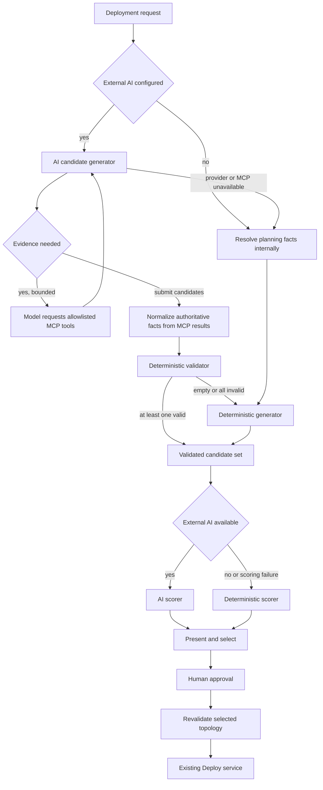

# Agentic Deployment AI Candidate Generation and Scoring Design

## Goal

Agentic Deployment maintains two candidate generators. When external AI is configured,
prefer AI Generator, whose model autonomously selects MCP tools through native tool calling
to gather evidence. Fall back to the existing Deterministic Generator when no provider is
configured, provider/MCP is unavailable, the result is empty, or all proposals fail validation.
Generation and scoring are separate stages; scoring failure does not regenerate candidates.

## Architecture



## Boundaries and trust model

- The normal AI path does not call `resolve_planning_facts` before generation. The model must
  call `get_cluster_overview`; the server normalizes hardware facts from this MCP round and
  validates candidates against the same snapshot.
- Without AI, or on AI/MCP failure, Deterministic Generator gets facts directly through internal
  `resolve_planning_facts`. Approval still refreshes hardware facts internally and revalidates.
- AI Generator outputs only `CandidateProposalSet`; it cannot score, select, render, approve, or deploy.
- AI sees only the explicitly reviewed planning-tool allowlist. Other MCP catalog tools are
  rejected before execution, even if the model guesses their names.
- `CandidateValidator` recomputes GPU, VRAM, and CPU buffer, checks PD fields, and deduplicates.
  Resource claims made by AI are not trusted.
- Only accepted candidates reach the scorer. Rejected candidates remain in the run for audit,
  but do not participate in scoring.
- `approve` reruns the same validator on the selected topology using fresh cluster facts,
  then delegates to the existing Deploy service.

## AI Generator prompt

The system prompt fixes these constraints: provider allowlist, one to ten candidates,
single-role and PD GPU formulas, VRAM/CPU/SLO/preference constraints, complete PD fields,
no fabricated evidence, no duplicate topologies, and no scoring or deployment. Generator
sends reviewed MCP catalog tools in provider-native schemas. Initial user content contains
only deployment intent:

```json
{
  "cluster_id": "target-cluster",
  "model": "model-identifier",
  "operator_preference": "original user preference",
  "deployment_intent": {}
}
```

The model requests tools through OpenAI `tool_calls` or Anthropic `tool_use`; the provider
client normalizes both protocols. MCP results return as the corresponding tool-result
messages. After collecting evidence, the model must call the local terminal tool
`submit_candidate_proposals`, whose arguments are strictly constrained by Pydantic JSON
Schema with unknown fields forbidden.

The backend no longer calls `get_cluster_overview` in advance. The first actual tool batch
must call only `get_cluster_overview` and `search_candidates(sourceIds=["aic"])` in parallel.
Only when ordinary search returns no AIC candidates should it call
`search_aic_with_relaxation(clusterId, workload, searchConfig)` (if available). This tool
extracts the available GPU budget from cluster overview, then calls
`POST /api/candidate-search/relaxed`. With the same model, ISL/OSL, hardware, and GPU budget,
the API tries original TTFT/TPOT limits, 1.25x limits, 1.5x limits, then no latency limits,
stopping at a complete, resource-feasible result. It returns `attempts`, `candidates`, an
`anchor` selected by relative violation of the original targets, `sloSatisfied`, and the
reason no anchor exists. It never fabricates performance predictions.

Results missing required metrics or complete topology cannot be anchors; if all searches
are empty, `anchor` is null. AI may propose scaling from a noncompliant anchor, keeping the
same mode and treating the anchor as a lower bound: first increase replicas for the relevant
role (DP in the current schema); if insufficient or infeasible, consider TP supported by the
current hardware/provider. In PD mode, prioritize prefill replicas for TTFT pressure and
decode replicas for TPOT pressure; never reduce either role's replicas or GPU allocation.
Neither increased replicas nor TP proves single-request TTFT/TPOT compliance; explicit AIC
estimates or benchmarks are still required. The server currently validates GPU/VRAM/CPU
resource constraints but does not enforce the direction of topology changes relative to
the scaling anchor. Prompt constraints are not performance guarantees.

Cluster overview must succeed before submission; otherwise reject the round and fall back.
After the first round, AI may autonomously use the reviewed planning tools below.

AIC applicability has three explicit states: a complete SLO-compliant prediction is
`applicable + valid`; supported aggregated/disaggregated topology without a valid prediction
is `applicable + unknown`; other guides are `not_applicable`. Only the first provides
secondary positive evidence; neither remaining state incurs a penalty. Unsupported guides
such as `tiered-prefix-cache` and `precise-prefix-cache-routing` are not discarded, down-ranked,
or marked SLO-violating for lacking AIC predictions. They remain ranked by preference,
workload/guide fit, history, and resource use.

- Configuration: `get_configuration_capabilities`, `list_configuration_artifacts`
- Historical plans/deployments: `list_agentic_plans`, `list_deployment_executions`
- Evaluation: `list_evaluate_runs`, `get_evaluate_run`, `list_evaluation_workflows`
- Simulation: `list_simulation_tasks`, `get_simulation_task`
- Model Cache: `list_model_cache_entries`

The tool loop permits at most four rounds, eight MCP calls, three concurrent calls per round,
and 200 KB of combined results. Names pass both catalog filtering and pre-execution allowlist
checks. No create/update/delete/deploy/approve/port-forward tools are exposed. Although
`search_candidates` uses POST, it is a reviewed exception with no persistence side effects.

## Fallback rules

| Condition | Generator behavior |
| --- | --- |
| External AI not configured | Use deterministic directly; do not record a fault |
| Some AI candidates valid | Retain valid candidates; no fallback |
| One AI candidate valid | Accept; diversity is not required |
| AIC unavailable, empty, incomplete, or failing explicit SLOs | Retry fixed relaxation steps; return nearest complete anchor or `no_complete_anchor`. Candidates passing cluster hard constraints may still be accepted without proven SLO compliance, but extrapolation is not prediction |
| Provider unavailable or timed out | Fall back to deterministic; record `provider_unavailable` |
| Required cluster MCP call fails | Resolve facts internally; fall back; record `mcp_unavailable` |
| Empty response, invalid structure, or empty candidates | Fall back; record `invalid_response` |
| Validator rejects every proposal | Fall back; record `all_ai_candidates_invalid` |
| AI does not obtain valid cluster overview | Treat as invalid response; resolve facts internally and fall back |
| Neither AI nor internal fallback obtains authoritative cluster facts | Fail the request; do not produce deployable candidates without trusted facts |

Generator and Scorer record their sources and fallbacks separately. AI scoring failure switches
to deterministic scoring without triggering generation again.

## Data contract

Add to `AgenticDeploymentRun`:

- `generator`: `ai-mcp` or `deterministic`
- `generator_model`
- `generator_fallback_reason`
- `generator_tool_trace`: optional tool names, argument/result SHA-256, duration, and status;
  do not save raw content
- `rejected_candidates`

Existing `planner`, `planner_fallback_reason`, and `decision_metadata` continue to describe
scoring, separating candidate origin from ranking origin.

## Delivery stages

1. AI proposals, validator, MCP client, AI-first service integration, and source display.
2. Separate generation/scoring revisions and APIs so the same candidate set can be rescored.
3. Move runs from in-memory dictionaries to repository-standard persistence, saving redacted
   prompt/tool-trace summaries and facts digests.
4. Add configuration dry-run, facts-freshness policy, and real MCP/provider integration tests.

## Verification

- Unit coverage for partial acceptance, all-rejected fallback, MCP/provider failures,
  strict schemas, and approval revalidation.
- Full Agentic Python suite.
- TypeScript checks, frontend build, and MCP catalog generation checks.
- `npm run reuse:check -- --base <task-start-commit>`.
