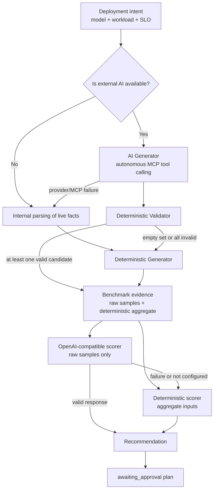
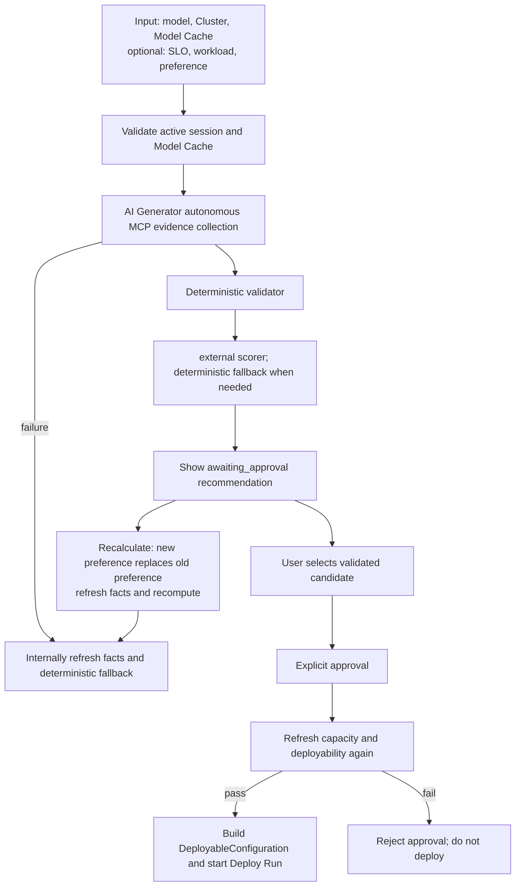
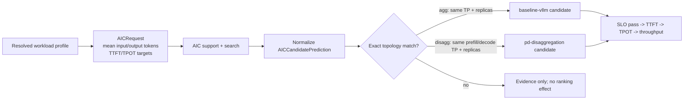

# Agentic Deployment Architecture and Workflow

This document describes the planner layering, end-to-end workflow, current constraints, and
future evolution of Lens Agentic Deployment.
Agentic's responsibility is to generate constrained candidate proposals, perform deterministic
validation, score them, and orchestrate approval. It is not a general-purpose agent that generates
arbitrary Kubernetes configurations.

## Overall planner architecture



`AICandidateGenerator` runs first when external AI is configured. The model receives a restricted
MCP tool schema, and the first actual tool batch must and may only call cluster overview and AIC
candidate search in parallel. Cluster results are non-overridable hard constraints. AIC must be
attempted, but recommendations that are unavailable, have incomplete metrics, or fail explicit
SLOs are discarded; they do not block valid non-AIC candidates. The server normalizes facts from
that same MCP round, then `CandidateValidator` recomputes VRAM, GPU, and CPU buffer independently.
Only validated proposals may be displayed, scored, selected, or deployed. When some proposals are
invalid, the remaining valid candidates are kept and no fallback is triggered.

For each feasible provider, AI Generator must first propose the minimum-resource topology:
the lowest TP satisfying memory constraints and one replica per serving role. User preference
selects the provider/method only; it cannot independently justify more TP or replicas. Larger
topologies require explicit SLOs or complete AIC predictions demonstrating the additional need.

AIC applies only to aggregated and disaggregated topologies. For other guides, the AIC status is
`not_applicable`; a missing prediction is neutral information rather than evidence of failure.
Those guides are not filtered or down-ranked because of it, and cross-guide ordering still obeys
user preference and workload/guide fit first. AIC is only a secondary positive signal within
applicable and comparable topologies.

`DeterministicPlanner` continues to provide generation fallback when AI is absent,
provider/MCP is unavailable, AI output is invalid/empty, or all AI proposals are invalid, and it
always provides a stable scoring fallback.

`OpenAICompatiblePlanner` is an optional scoring layer. It does not generate, modify, or expand
candidate space. When configured and available, it receives every candidate passing provider/topology
and live-resource hard constraints, with at most five raw historical benchmark samples per candidate.
It must return the top three candidates (or all if fewer than three) with scores. The server validates
candidate bounds, uniqueness, score completeness, and highest-score consistency. The external layer
receives no `PerformanceScoreInput`, aggregate confidence, $N_{eff}$, benchmark SLO conclusions,
or deterministic ranking. On failure, use the deterministic result directly.

Live cluster capacity is always the highest-priority hard constraint. External AI may propose
candidates, but AIC, historical Simulation, and external AI cannot override the validator,
configuration contract, or approval, and cannot directly trigger deployment.

## End-to-end workflow



1. The user first chooses a model, target Cluster, and Model Cache storage in Model Market; the
   deployment name and vLLM parameters are submitted with the request.
   SLO, workload profile, and preference are optional inputs.
2. When creating a plan, the backend validates the active cluster session, and verifies that the
   selected storage is ready for the current cluster, has purpose `model-cache`, is not a
   dynamic-PVC volume, and already has a ready cache entry for the target model.
3. When external AI is configured, AI Generator starts from deployment intent and uses native tool
   calling to query cluster and AIC in parallel first; only after that may it query allowlisted
   historical evidence. Before submission it must obtain cluster overview and attempt at least one
   AIC search. The server normalizes facts from this MCP round, filters out invalid AIC
   predictions or those violating explicit SLOs, and then lets the validator independently filter
   candidates.
4. When AI is not configured, provider/MCP is unavailable, or output is invalid,
   `resolve_planning_facts()` refreshes facts through internal domain services and then runs the
   Deterministic Generator; when all AI candidates are invalid, it reuses already normalized MCP
   facts to generate deterministic candidates.
5. The server keeps two internal views for each validated candidate: candidate-level benchmark
   aggregates for the Deterministic scorer, and raw historical samples for the external scorer.
   If external scoring fails, use the Deterministic scorer with aggregate evidence.
6. The recommendation remains in `awaiting_approval`. The user may select a different validated
   candidate or click Recalculate. The new preference in Recalculate **replaces** the old
   preference and reloads live facts and candidates; it does not retain the previous round's
   preference.
7. Deployment starts only after explicit user approval. Before approval, resources and candidate
   deployability are validated again to avoid using a stale plan.

## UI inputs and interaction

The UI is only the input and review surface for the workflow above. The entry points are
`src/components/ModelMarketPage.jsx` and
`src/components/AgenticDeploymentWorkspace.jsx`:

- Model Cache storage sits directly below Cluster in Model Market and is shared by Standard and
  Agentic; users can enter Agentic mode first, and required-field validation runs only when
  generating a recommendation.
- The Agentic workspace provides Use case, optional SLO/workload/preference inputs, plus
  alternatives, score-source, and evidence display.
- The initial response shows the top three scored candidates; the external planner also returns
  at most three candidates.
- Users may only choose an existing deployable candidate; they cannot submit a new provider, TP,
  replica count, or CLI parameters through the UI or prompt.

## Implementation details and constraints

### Live fact resolution

**Current implementation**

`llm_d_bench.agentic.facts.resolve_planning_facts()`:

1. Validates and reads the active cluster session;
2. Calls cluster overview to obtain per-GPU VRAM, free GPU count, and available CPU buffer;
3. Uses `resolve_workload_signals()` to normalize measured workload shape or Use case fallback;
4. Collects AIC support/search, total Deploy history count, and historical performance
   measurements plus persisted deployment topologies from completed Simulation runs of the same
   model;
5. Freezes the cluster snapshot and evidence IDs, then passes them to the planner.

Before freezing facts, a future step will generate versioned, uncertainty-aware
`UseCasePerformanceEstimate` values (TTFT, TPOT, workload capacity) from the user's use case,
resolved workload, target model, and accelerator. When workload is absent, a versioned use-case
mapping produces the query profile; missing required fields prevent historical records from
becoming high-similarity performance evidence. Explicit SLOs take precedence; estimates become
soft targets for generation, retrieval, and scoring only where corresponding SLOs are absent.
The retriever includes the weakest measured TTFT/TPOT/capacity fit relative to these targets in
`match_similarity`: matching model/hardware/workload cannot yield high similarity when performance
is far from the target. Estimates cannot override live capacity or the validator.

**Current fallback**

- When cluster overview lacks available GPU count or VRAM, planning fails; user-submitted resource
  values are not used to replace live facts.
- When AIC, Deploy history, or Simulation retrieval fails, the corresponding evidence is recorded
  as `unavailable`; live resource validation and deterministic planning continue.

For the same model, select at most three observations with the highest workload similarity,
carrying TTFT P95, TPOT P95, throughput, and provider/topology parsed from persisted deployment
configuration. These are independent planning evidence: they neither replace benchmark aggregates
nor narrow the external scorer's candidate set. History without persisted topology links cannot
generate candidates.

**Planned implementation**

- Normalize raw Deploy/Evaluate/Simulation results into versioned `BenchmarkRecord`.
- Introduce `BenchmarkEvidenceRetriever` to apply hardware, runtime version, and time decay, and
  generate candidate-level confidence, negative evidence, and traceable references.

### Bounded candidates and hard constraints

**Current implementation**

`llm_d_bench.agentic.planner.DeterministicPlanner` generates only registered providers that can be
mapped to Deploy:

- `baseline-vllm`
- `optimized-baseline`
- `pd-disaggregation`
- `tiered-prefix-cache`
- `precise-prefix-cache-routing`

Candidate enumeration uses fixed TP values: `1, 2, 4, 8, 16`; and fixed replica counts:
`1, 2, 4`. Every candidate must satisfy:

$$
footprint_{GiB} = 1.2 \times model\_weight_{GiB}
+ \max(1, context\_length / 4096)
$$

$$
footprint_{GiB} \leq 0.9 \times vram\_per\_gpu_{GiB} \times TP
$$

It must also satisfy required GPU count not exceeding the live free GPU count, and CPU buffer not
falling below the requested minimum. For PD candidates, required GPUs are computed across both
prefill and decode resources.

**Current fallback**

- When no candidate passes hard constraints, return `cannot_satisfy` together with all rejection
  reasons, without calling the external provider or deploying.
- Cache/routing candidates are always included in the bounded catalog; shared-prefix signals, Use
  case, and user preference affect only ranking or external model choice. When CPU buffer is
  insufficient, tiered-cache candidates are likewise judged undeployable.

**Planned implementation**

- Add second-pass validation for node/placement, runtime capability, storage, and the allowlist of
  vLLM parameters.
- Replace the current mutually exclusive `provider_ref` with “topology + capability set” to express
  combined optimizations such as PD + cache/offloading.

### Deterministic ranking, workload, and AIC

**Current implementation**

Use case and workload shape affect only candidate priority; they are not hard thresholds for
candidate generation or resource validation. Explicit preference provider mapping takes precedence
over general workload heuristics; otherwise, when shared-prefix ratio is at least $0.5$, or the
user preference explicitly requests cache/routing, tiered cache/routing is preferred; when the
workload is prefill-heavy, PD is preferred; otherwise optimized baseline is preferred. When
workload shape is not measured, `code-generation` defaults to `shared_prefix_ratio=0.6`, and
`long-inputs` plus `summarization` default to `prefill_heavy=true`; old fields explicitly provided
by existing requests remain valid.

AIC integration is controlled and exact:



- AIC `agg` matches only `baseline-vllm` with the same TP and replicas.
- AIC `disagg` matches only `pd-disaggregation` whose prefill/decode TP and replicas are both
  identical.
- When TTFT/TPOT SLO is not set, all exactly matched AIC-predicted candidates rank ahead of purely
  workload-heuristic candidates, and are ordered by TTFT, TPOT, and throughput.
- When either TTFT or TPOT SLO is set, only AIC candidates with exact predictions that satisfy all
  configured targets rank first; then come candidates without AIC predictions; candidates whose AIC
  predictions clearly fail the SLO rank after them.
- Ties within the same tier are still broken by stable ordering of workload guide, GPU count, TP,
  and replicas.

**Current fallback**

- If AIC does not support the model, returns empty, call fails, metrics are missing, or results
  cannot be mapped exactly onto a Lens candidate, the existing workload heuristics and resource-cost
  ordering remain in place.
- Cache/routing guides do not gain ranking boosts from AIC predictions, preventing predictions for
  mismatched topologies from being mislabeled as fact.
- AIC predictions cannot make a candidate deployable if it failed checks on VRAM, free GPUs, or CPU
  buffer.

**Current benchmark integration**

- `BenchmarkEvidenceRetriever` computes model, hardware, workload, and configuration similarity,
  plus time/runtime decay. `BenchmarkPerformanceEvidence.score_inputs()` converts results into
  candidate-level `PerformanceScoreInput`.
- Deterministic scoring prioritizes blocking failures, historical SLOs, confidence, $N_{eff}$,
  and aggregate metrics over AIC. AI scoring receives sorted raw samples, not these aggregates.

**Planned implementation**

- Unify AIC, history, and Simulation into candidate-level `PredictionEvidence`, preserving source,
  schema/producer version, confidence, retrieval parameters, and refs.
- Add complete SLO hard gates, uncertainty penalties, conflict down-weighting, and Pareto frontiers
  to the stable deterministic layer.
- Build RAG projections for controlled cloud benchmark reports. Only retrieved, source-validated,
  fully parsed reports are temporarily normalized into `BenchmarkRecord` within the planning
  request; do not persist them. Compute the same `match_similarity` as local records and provide
  at most five sorted raw evidence samples per candidate.
- Let `UseCasePerformanceEstimate` constrain minimum viable topology during generation and act as
  a soft target where SLOs are absent. Include the weakest measured TTFT/TPOT/workload-capacity fit
  in `match_similarity`; uncertain estimates must not produce high-similarity evidence.

### Optional OpenAI-compatible selection layer

**Current implementation**

`OpenAICompatiblePlanner` receives the complete catalog passing hard constraints and planning
facts without aggregate historical evidence. One strict JSON-schema call selects the top three
existing IDs (all if fewer than three) and scores each selected candidate. For providers lacking
full strict-schema support, schema-validation failure falls back to ordinary completion requiring
the same JSON shape. Plan creation shows only the top three scored candidates; recalculation with
a new preference reloads live facts. An exact AIC match does not suppress the external model call.
The server validates:

- the response satisfies strict schema;
- selected candidate IDs are unique, belong to the input catalog, and the count is within $[1,10]$;
  the score set must exactly match the set of selected IDs;
- the chosen ID must be the highest-scoring one; preserve the provider's `candidate_ids` order;
- the provider does not produce providers, TP, replicas, CLI parameters, or infrastructure actions.

The external prompt uses the same `offloading`, `distributed`, and `precise-caching` term mapping
as the deterministic layer, and requires that when the mapped provider has a valid candidate, its
best candidate score higher than candidates from other providers. This rule is currently prompt-
level guidance: the server validates output format, candidate bounds, and highest-score
consistency, but does not rewrite valid scores or ordering returned by the external provider.

**Current fallback**

- When `AGENTIC_OPENAI_BASE_URL`/`AGENTIC_OPENAI_MODEL` is not configured, the system directly uses
  `DeterministicPlanner`.
- On HTTP failure, timeout, invalid schema, incomplete scores, or illegal selections, it records
  `planner_fallback_reason` and falls back to deterministic ranking again.

**Planned implementation**

- Send schema-validated candidate-level history/AIC/Simulation evidence packets to the provider.
- The provider still retains only selection and explanation authority; it does not gain database,
  configuration-generation, Kubernetes, Deploy, or Evaluate write access.

### Approval, configuration, and deployment

**Current implementation**

```mermaid
sequenceDiagram
    participant U as User
    participant A as Agentic Service
    participant C as Cluster Overview
    participant D as Deploy

    U->>A: POST plan request
    A->>C: read live capacity
    C-->>A: capacity snapshot
    A-->>U: awaiting_approval recommendation
    U->>A: POST approve
    A->>C: refresh live capacity
    alt candidate remains deployable
      A->>D: start run from DeployableConfiguration
        D-->>A: deployment run ID
        A-->>U: deploying
    else capacity changed or constraints fail
        A-->>U: reject approval; no deployment
    end
```

- Creating a plan has no side effects; it only writes in-memory Agentic run state, whose initial
  status is `awaiting_approval`.
- Before approval, live facts and candidates are regenerated, and the selected candidate is checked
  again against capacity constraints.
- After passing, `build_agentic_configuration()` constructs a `DeployableConfiguration`, and the
  system directly calls `DeploymentRunManager.start_run()`. Agentic does not construct or save an
  `officialGuide` Configuration artifact.
- The Deploy provider is responsible for its own rendering and deployment lifecycle; for Kustomize
  directory artifacts, the generic manifest adapter delegates to the registered Guide adapter
  instead of reading the directory as YAML files.
- Agentic run references the Deploy run ID and does not rebuild the Kubernetes or Deploy state
  machine.

**Current fallback**

- If resources have been consumed, VRAM/CPU buffer no longer satisfies constraints, or the selected
  candidate becomes invalid, approval is rejected and no artifact/Deploy run is created.
- `automatic` is rejected directly.

**Planned implementation**

- Persist Agentic runs instead of using the current in-process dictionary.
- Before approval, complete refresh validation for runtime/provider capability and Model Cache
  entry.
- Record artifact digests, approver identity, and more complete audit events.

### Evaluate, feedback, and constrained tuning

**Current implementation**

- Agentic does not yet automatically create an Evaluate workflow.
- The execution policy already contains maximum optimization-iteration count, benchmark count, and
  total duration fields, but it does not start automatic benchmarking or tuning.

**Current fallback**

- After deployment, verification is still started manually from the existing Evaluate/Deployment
  workspace.
- Agentic does not automatically modify a saved artifact or start the next deployment round based
  on performance prediction.

**Planned implementation**

1. After Deploy becomes ready, call the existing Evaluate API to create a workflow carrying
   `BenchmarkPlan` and `BenchmarkSlaTargets`.
2. Read SLA results and generate a `passed`, `failed`, or `inconclusive` report, saving predicted
   and measured references.
3. Write the result back into `BenchmarkRecord`, so historical retrieval and threshold calibration
   have real closed-loop data.
4. Only when approval/policy permits and budget is not exhausted, choose the next-round candidate
   from the deterministically valid candidate set; every round generates a new artifact.

## Status snapshot

| Phase | Current status | Behavior on failure |
| --- | --- | --- |
| UI/API request | Implemented | Rejects plan creation on parameter validation failure |
| workload profile | First version implemented | Falls back to Use case hard thresholds when shape measurements are missing |
| live Cluster facts | Implemented | Fails when valid VRAM/GPU data cannot be obtained; does not trust old resource values |
| bounded candidates and hard constraints | Implemented | Returns `cannot_satisfy`; does not call provider/deploy |
| AIC exact-prediction ranking | First version implemented | Restores heuristic ranking when unsupported, failed, or unmatched |
| Benchmark aggregation and deterministic ranking | Implemented | Blocking failures may reject deterministic candidates; AI scoring retains every hard-constraint-valid candidate |
| same-model Simulation historical measurement and topology reuse | First version implemented | Keeps them only as scoring evidence when there is no matching/deployable topology |
| OpenAI-compatible constrained full-catalog selection | Implemented | Falls back to Deterministic on schema/network/configuration failure |
| user selection of validated candidate | Implemented | Rejects when status is not awaiting approval, or candidate is unknown/undeployable |
| manual approval and deployment | Implemented | Rejects approval when resource refresh fails or candidate becomes invalid |
| Evaluate/SLA/feedback tuning | Planned | Keeps manual Evaluate; does not auto-execute |
| Agentic run persistence | Planned | Agentic runs are not retained after current process restart |
