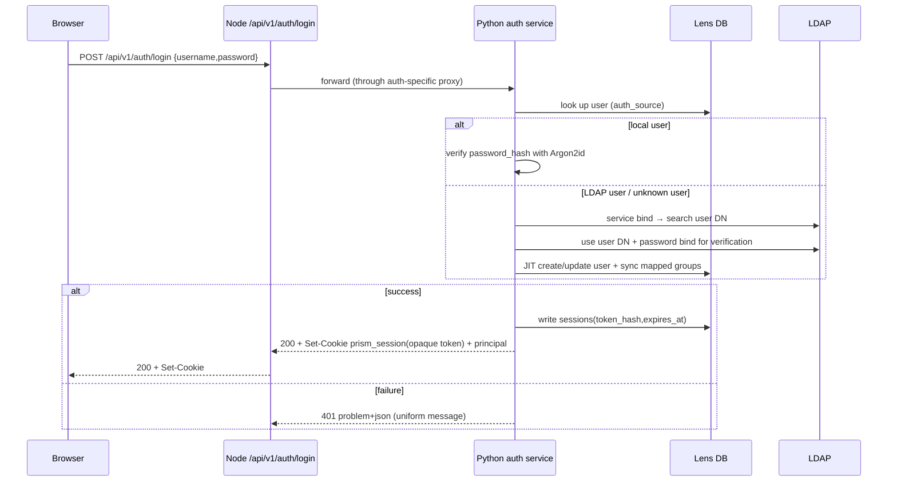
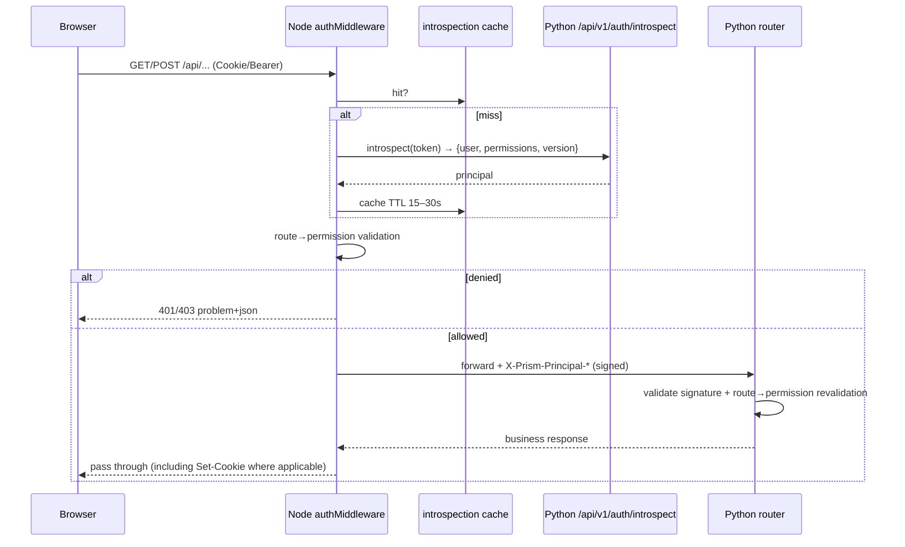
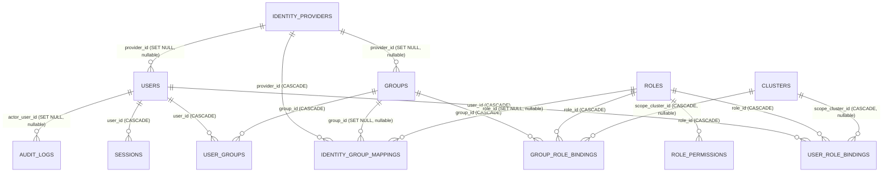

# Lens Login and Authorization System Design (Users / User Groups / LDAP / Fine-Grained RBAC)

> Status: **Design draft (proposal)**. This document defines only the solution and does not modify code.
> Any table-structure (schema) change must be approved by a human before it can be
> implemented following the process in
> `llm_d_bench/db/migrations/README.md` (see §15 and §18).
>
> Related documents: [`AGENTS.md`](../../AGENTS.md),
> [`.agents/skills/workflow/SKILL.md`](../../.agents/skills/workflow/SKILL.md),
> [`.agents/skills/backend/SKILL.md`](../../.agents/skills/backend/SKILL.md),
> [`.agents/skills/database/SKILL.md`](../../.agents/skills/database/SKILL.md),
> [`.agents/skills/ui/SKILL.md`](../../.agents/skills/ui/SKILL.md),
> [`.agents/skills/deployment/SKILL.md`](../../.agents/skills/deployment/SKILL.md),
> [`docs/reuse-map.md`](../../docs/reuse-map.md),
> [`storage-layout.md`](storage-layout.md),
> [`db-table-schema-design.md`](db-table-schema-design.md),
> [`cluster-monitoring-service-design.md`](cluster-monitoring-service-design.md),
> [`accelerator-observability-design.md`](accelerator-observability-design.md).

---

## 0. High-Level Design

> In one sentence: Lens uses “**pluggable identity sources (local / external IdP) + revocable sessions**” to solve authentication,
> and uses “**action permissions × resource scopes**” RBAC to solve authorization; defense in depth across frontend and backend, default deny.

### 0.1 Authentication: who you are

- Two identity-source paths (§5, §20): Lens self-managed (`local`, local users/groups are readable and writable) or an external IdP
  (v1 supports LDAP, with abstractions reserved for OIDC/SCIM). Administrators can manage users/groups inside Lens and can also
  connect an external directory.
- After login succeeds, issue a **revocable** httpOnly session cookie (the DB stores only a hash, with idle/absolute
  TTL); supports logout, password change, admin-forced sign-out, and immediate invalidation on permission changes (`principal_version`).
- For an empty database, use the CLI to create the first admin; the old `X-Prism-Github-Token` is **no longer compatible** (already removed).

### 0.2 Authorization: what you can do + to which resources

Authorization is the product of two **orthogonal** dimensions (§7):

1. **Action permission**: `<domain>:<resource>:<action>`, such as `deployment:run:create`,
   `cluster:cluster:delete` (see §6.3 for the full set).
2. **Resource scope**: `global` (all) / `cluster` (a cluster and its subordinate resources) /
   `resource` (a single shared deployment).

> `allow = action permission matched AND target resource falls within the subject scope`; list/detail/write operations are all
> filtered on the server by scope. Hiding buttons on the frontend is not a security boundary.

### 0.3 Three built-in roles (RBAC)

A role defines only the “action set + default scope”; **which concrete instances are visible is determined by the bound scope**
(see §7.8 for the full matrix).

**`admin` — platform administrator, global by default**
- All actions: users/user groups/roles/identity sources/audit/sessions/database configuration, cluster creation and deletion,
  and granting access at any scope.

**`maintainer` — cluster maintainer, scoped to all clusters or specified clusters**
- Within authorized clusters: cluster editing/node cordon/port forwarding/bootstrap, storage volume create/delete, model cache,
  monitoring installation, full lifecycle of deployments/evaluations/simulations/configurations, and remote deployment.
- Cannot: manage users/groups/roles/identity sources/audit/database configuration; without a `global` binding, **cannot
  create or delete clusters**.

**`end-user` — end user / experimenter, scoped to specified clusters + their own/team resources**
- Within authorized clusters: read read-only resources; create deployments/evaluations/simulations/configurations; use Lens Assistant.
- Can only **operate resources created by themselves or owned by their owner group**, including installing/managing
  deployment monitoring for **their own deployments**; **deletion and sharing are limited to resources they created themselves**.
- Cannot create/delete clusters or storage, cannot install **cluster-level** monitoring (cluster-stack / accelerator /
  gpu-driver), and cannot modify other users' resources.

### 0.4 How resource visibility and operability are defined

Each resource belongs to **one cluster only** (`cluster_id`) and records `owner_user_id` (creator) and an
optional `owner_group_id` (team ownership, §7.4/§7.14).

- **Visibility** (list/detail) = `visible within scope` ∪ `created by self` ∪ `member of owner group` ∪
  `explicit resource sharing`; **never crosses clusters**.
- **Operability** = action permission matched ∧ scope covered, then layered by ownership:

| Rights on a resource | Creator | Owner-group member | This cluster's maintainer/admin | Share recipient |
| --- | :---: | :---: | :---: | :---: |
| View / Operate (read/update/stop/restart/cancel/connect/logs/deployment monitoring) | ✅ | ✅ | ✅ | ✅ (that resource only) |
| Delete / Share / Transfer owner | ✅ | ❌ | ✅ (only admin may transfer owner) | ❌ |

- **Create**-type actions have no target resource: verify against the `cluster_id` in the request whether there is a binding
  covering that cluster; `cluster:cluster:create` requires a `global` binding.
- Example: two `end-user`s in the same cluster can each see only their own deployments; that cluster's `maintainer`
  can see all of them; resources in another cluster are not visible to them (unless they also have a binding for that cluster).

### 0.5 Framework choices (what is used / what is not used)

- **Authentication (AuthN)**: **no full authentication framework is introduced** (FastAPI Users / Keycloak /
  Casdoor etc. are not used). Only mature **primitive libraries** are used: `argon2-cffi` (Argon2id password hashing),
  `cryptography` (stored-secret encryption); external directories use `ldap3` (optional extra `[ldap]`).
  Sessions, login, CSRF, and TTL are custom-built (`llm_d_bench/auth/security.py` / `service.py`) to fit the
  “Node front door + Python authority” topology and Lens-internal management needs.
- **Authorization (AuthZ)**: uses **embedded Casbin** (RBAC-with-domains) for “role → permission +
  cluster scope” decisions (`llm_d_bench/auth/casbin_adapter.py`); it is **not** an independent service
  (`casbin-server` is not used). **Resource-level sharing/ownership** are dynamic resources and are not covered by Casbin;
  they are handled by custom `policy.py` / `scope.py`.
- **Frontend / Node**: no third-party authentication framework is introduced; reuse existing repository UI primitives and
  `httpClient`; the Node side uses a custom `authMiddleware`.
- See **§20** for option comparisons and rationale; see **§18.2 (D11/D14 etc.)** for decisions.

### 0.6 Enforcement and default deny

- The browser goes only through Node/Express; **Node performs primary validation** and protects Node-native routes,
  while **Python performs secondary validation using an internal signature** (§8/§9); interfaces that are not registered are denied by default.
- Authorization failures uniformly return `403` (`404` means only “resource does not exist”); login/authorization changes/resource sharing are all audited.

### 0.7 Reading guide

| Want to understand | See |
| --- | --- |
| Current-state evidence and goals | §1–§2 |
| Data table structure | §4 |
| Login/LDAP/session/TTL | §5 |
| Third-party framework choices (Casbin / primitive libs / IdP) | §20 |
| Full permission codes and page mapping | §6 |
| Roles, scopes, ownership, decision algorithm | §7 |
| Node/Python enforcement, frontend integration | §8–§10 |
| Migration, testing, phases, reuse, decision log | §14–§18 |

---

# Detailed Design

> §1–§21 below are the **detailed design**, expanding the high-level summary in §0: current state and goals, data model,
> login/IdP/session, complete permission codes, authorization and scope, frontend/backend enforcement, migration testing, and decision logs.

## 1. Background and Goals

### 1.1 Background

- Lens (the web application in this repository) currently has **no login, user, role, or permission checks at all**:
  - The frontend `src/App.jsx` directly switches pages using the `?view=` query string; neither `SUPPORTED_VIEWS`
    (`src/App.jsx:43`) nor the sidebar `MENU_GROUPS` (`src/components/LeftNavigation.jsx:7`)
    filters by permissions.
  - The shared HTTP client `src/api/httpClient.js` does not attach any identity headers and has no 401/403
    handling.
  - Python FastAPI (`llm_d_bench/api/main.py:58-76`) registers all routers without auth;
    the hit count for `Depends(`, `Security(`, CORS, and middleware is 0.
  - Node/Express (`server/server.js:34-63`) also has no auth middleware.
  - The only leftover “authentication contract” is the `X-Prism-Github-Token` header: the frontend reads
    `localStorage.prism_github_access_token` in `src/api/monitoringClient.js:5`, `src/utils/download.js:41`,
    and `src/components/SimulationDashboard.jsx:123/1353`, but there is **no writer anywhere**
    in the repository; the roles `user`/`admin` appear only in documentation
    (`cluster-monitoring-service-design.md:100-101`). **This header has been removed in this implementation
    and replaced by login sessions.**
- Key structural fact: the browser communicates only with Node/Express, and Python is accessed only on loopback
  behind the Node proxy; moreover, `server/backend-api-proxy.ts:52` and `server/monitoring.ts:21`
  **forward only `accept` / `content-type` / `Idempotency-Key`, not Cookie or Authorization**.
  Therefore the identity chain must be completed explicitly at the Node layer.

### 1.2 Goals

1. Provide login/logout and session management (local accounts + optional external LDAP).
2. Manage **users**, **user groups**, **roles**, and their permission bindings inside Lens.
3. Support **two paths** for user/group management: (a) Lens self-managed (local accounts/local groups, readable and writable);
   (b) external IdP (LDAP/OpenLDAP/AD first, later extended under the same abstraction to OIDC/SCIM, etc.),
   including connection configuration, user search, group sync and mapping, and connectivity testing.
4. Refine an executable set of permission codes based on the **current pages and backend features**,
   covering all existing APIs and page actions.
5. Apply permissions to **resource instances** at the same time: control which clusters are visible/operable and which deployments
   are visible/operable; visibility and operation rights are filtered on the server by scope, rather than only hiding buttons.
6. Form **defense-in-depth** enforcement on both Node and Python, without relying on frontend button hiding.
7. Fully audit login, authorization denials, and all write operations.
8. Remove the old `X-Prism-Github-Token` header and uniformly use login sessions; keep a local-development bypass switch.

### 1.3 Non-goals (v1)

- v1 first implements the `local` and `ldap` providers; OIDC / SAML / SCIM are **future providers**
  under the same `IdentityProvider` abstraction (see §20) and are not delivered in v1.
- **Hard guarantees** for multi-tenant quotas and cross-cluster data isolation: v1 provides only scope-based visibility/operation rights
  (§7), and does not implement resource quotas, cross-cluster aggregation isolation, or network-level isolation.
- Self-service issuance of API Tokens / Service Accounts for third-party developers (reserved for future work; see §16 P6).
- Retrospective ownership backfill for historical data with `owner_id` (only newly created objects carry owners).

---

## 2. Current-State Evidence (design inputs)

| Concern | Current state | Evidence |
| --- | --- | --- |
| Frontend routing | No routing library; hand-written `?view=` routing; unknown views fall back to `model-market` | `src/App.jsx:36-48` |
| Sidebar | Static `MENU_GROUPS`, filtered only by `disabled` | `src/components/LeftNavigation.jsx:7-36,105-109` |
| HTTP client | No identity headers, no 401 interception, relative-path `fetch` | `src/api/httpClient.js:23-36` |
| Backend app | All routers unauthenticated; no middleware/CORS/Depends | `llm_d_bench/api/main.py:38-86` |
| Node proxy | Forwards only accept/content-type, discards Cookie/Authorization | `server/backend-api-proxy.ts:52`, `server/monitoring.ts:21` |
| Native Node write routes | `deploy.ts` / `remoteDeploy.ts` / `guidePlanning.ts` / `configuration.ts` / `candidateSearch.ts` / `playground/chat.ts` / `mcp/router.ts` are all unauthenticated | `server/server.js:55-63` |
| DB | 16 tables, all in business domains; no user/role/audit tables | `llm_d_bench/db/models/*`, `llm_d_bench/db/README.md:29-57` |
| Existing risk vocabulary | MCP already has `read` / `write` / `approve` risk tiers | `server/mcp/specialTools.ts:36`, `server/mcp/tools.ts:20-24` |
| Session concept | Only “cluster sessions” (kubeconfig), no owner | `llm_d_bench/cluster/sessions.py:22-27`, `server/clusterSession.ts:15-32` |
| Configuration pattern | frozen dataclass + `from_environment()` | `llm_d_bench/db/settings.py:56-101`, `llm_d_bench/cluster/settings.py:12-30` |
| Tests | `node:test` + `pytest`, DB uses in-memory SQLite | `Makefile:24-43`, `conftest.py:20-64` |

Conclusion: this is a **greenfield capability**, but it must be embedded into the repository's existing DTO/DAO/router/test/reuse
conventions.

---

## 3. Overall Architecture

### 3.1 Trust boundaries

```text
Browser ──HTTPS──▶ Node/Express (primary PEP, browser's only entry point, same-origin)
                     │  ├─ validate session (httpOnly Cookie / Bearer)
                     │  ├─ authorize by route→permission mapping
                     │  ├─ after passing validation, attach internal identity headers (with internal-network signature)
                     │  ├─ forward Cookie/Authorization/Set-Cookie
                     ▼
                  Python FastAPI (secondary PEP, defense in depth, loopback)
                     ├─ validate internal signature/shared secret, parse principal
                     ├─ re-authorize by route→permission mapping
                     └─ business routers unchanged
```

- The **single identity authority** is Python: users/groups/roles/sessions/LDAP all live in the
  `llm_d_bench/auth/` domain and are persisted with the existing SQLAlchemy + DAO stack.
- **Node is the primary policy enforcement point** (the browser's only entry point, and it also has native write routes).
- **Python is the secondary policy enforcement point**: even if someone connects directly to loopback, they must still carry
  the internal identity headers injected by Node and signed/encrypted with `LENS_INTERNAL_AUTH_SECRET`;
  client-supplied `X-Prism-Principal-*` headers are stripped at the Node entry point without exception.

### 3.2 Login (local / LDAP) sequence



### 3.3 Request authorization sequence



---

## 4. Identity and Permission Data Model

> Add 11 new tables, with names following the existing `models/<name>.py` + `dao/<name>.py` convention
> (`llm_d_bench/db/README.md:29-57`). New models must also be registered in
> `llm_d_bench/db/migrations/env.py:11-28` and the root `conftest.py:27-44`.

### 4.1 ER diagram



### 4.2 Per-table fields

#### 4.2.1 `users`

| Column | SQLAlchemy type | Nullable | PK | FK | Default | Description |
|---|---|---|---|---|---|---|
| `id` | `String(36)` | No | Yes | | uuid4 | Primary key |
| `username` | `String(150)` | No | | | | Login name, unique (case-insensitive; recommend storing lowercase + `lower()` unique index) |
| `display_name` | `String(200)` | No | | | `""` | Display name |
| `email` | `String(320)` | Yes | | | | Unique (nullable, LDAP sync) |
| `password_hash` | `String(255)` | Yes | | | | Argon2id; empty for external-provider users |
| `provider_id` | `String(36)` | Yes | | `identity_providers.id` SET NULL | | Source IdP; empty for `local` users |
| `auth_source` | `String(32)` | No | | | `local` | provider `type`: `local` / `ldap` / `oidc` / … |
| `external_id` | `String(512)` | Yes | | | | IdP subject identifier (LDAP DN / OIDC `sub`) |
| `status` | `String(16)` | No | | | `active` | `active` \| `disabled` \| `locked` |
| `failed_login_count` | `Integer` | No | | | 0 | Consecutive failure count |
| `locked_until` | `UTCDateTime` | Yes | | | | Lock expiration time |
| `must_change_password` | `Boolean` | No | | | false | Force password change after first login/reset |
| `password_changed_at` | `UTCDateTime` | Yes | | | | |
| `last_login_at` | `UTCDateTime` | Yes | | | | |
| `principal_version` | `Integer` | No | | | 1 | Authorization-change version: +1 on binding/group-membership/status/password changes, used for cache invalidation (§7.12) |
| `created_at` / `updated_at` | `UTCDateTime` | No | | | `now()` | |
| `version_id` | `Integer` | No | | | 1 | Optimistic lock, consistent with `ClusterRow` |

Indexes: `uq_users_username_lower` (unique, `func.lower(username)`),
`uq_users_email`, `ix_users_provider_external` (unique, `(provider_id, external_id)`),
`ix_users_auth_source`.

#### 4.2.2 `groups`

| Column | Type | Nullable | PK | FK | Default | Description |
|---|---|---|---|---|---|---|
| `id` | `String(36)` | No | Yes | | uuid4 | |
| `name` | `String(150)` | No | | | | Unique (case-insensitive) |
| `description` | `Text` | No | | | `""` | |
| `source` | `String(32)` | No | | | `local` | provider `type`: `local` / `ldap` / `oidc` / … |
| `provider_id` | `String(36)` | Yes | | `identity_providers.id` SET NULL | | Source IdP; empty for local groups |
| `external_id` | `String(512)` | Yes | | | | IdP group identifier (LDAP group DN / name) |
| `authz_version` | `Integer` | No | | | 1 | +1 when members are added/removed; merged into principal computation and used for cache invalidation (§7.12) |
| `created_at` / `updated_at` | `UTCDateTime` | No | | | `now()` | |
| `version_id` | `Integer` | No | | | 1 | Optimistic lock |

#### 4.2.3 `user_groups` (membership relation)

| Column | Type | Nullable | PK | FK | Description |
|---|---|---|---|---|---|
| `user_id` | `String(36)` | No | Composite PK | `users.id` CASCADE | |
| `group_id` | `String(36)` | No | Composite PK | `groups.id` CASCADE | |
| `source` | `String(16)` | No | | | `manual` \| `external` (from provider sync) |
| `created_at` | `UTCDateTime` | No | | | |

#### 4.2.4 `roles`

| Column | Type | Nullable | PK | Default | Description |
|---|---|---|---|---|---|
| `id` | `String(36)` | No | Yes | uuid4 | |
| `name` | `String(100)` | No | | | Unique; built-ins: `admin` / `maintainer` / `end-user` |
| `description` | `Text` | No | | `""` | |
| `is_builtin` | `Boolean` | No | | false | Built-in roles cannot be deleted; permissions cannot be changed |
| `created_at` / `updated_at` | `UTCDateTime` | No | | `now()` | |
| `version_id` | `Integer` | No | | 1 | |

#### 4.2.5 `role_permissions`

| Column | Type | Nullable | PK | FK | Description |
|---|---|---|---|---|---|
| `role_id` | `String(36)` | No | Composite PK | `roles.id` CASCADE | |
| `permission` | `String(100)` | No | Composite PK | | Permission code, see §6 |

> The permission **catalog** (which codes exist, what each means, and which routes they map to)
> uses the code constant `llm_d_bench/auth/permissions.py` as the single source of truth and is exposed to the frontend through the API;
> the table stores only role → permission-code bindings. When permission codes are added/removed, update the catalog and built-in roles accordingly,
> and backfill built-in roles in migrations.

#### 4.2.6 `user_role_bindings` (user → role + scope)

| Column | Type | Nullable | PK | FK | Description |
|---|---|---|---|---|---|
| `id` | `String(36)` | No | Yes | | uuid4 |
| `user_id` | `String(36)` | No | | `users.id` CASCADE | Subject |
| `role_id` | `String(36)` | No | | `roles.id` CASCADE | Granted role |
| `scope_type` | `String(16)` | No | | | `global` \| `cluster` \| `resource` |
| `scope_cluster_id` | `String(8)` | Yes | | `clusters.id` CASCADE | Owning cluster when `cluster` / `resource` |
| `scope_resource_type` | `String(32)` | Yes | | | For `resource`: `deployment_run` / … |
| `scope_resource_id` | `String(64)` | Yes | | | Resource id when `resource` |
| `granted_by_user_id` | `String(36)` | Yes | | `users.id` SET NULL | Grantor (audit) |
| `expires_at` | `UTCDateTime` | Yes | | | Optional expiry |
| `created_at` | `UTCDateTime` | No | | | |

Unique constraint `(user_id, role_id, scope_type, scope_cluster_id, scope_resource_type,
scope_resource_id)`; when `scope_type='global'`, all three scope columns are `NULL`.
Indexes `(user_id)`, `(scope_cluster_id)`.

#### 4.2.7 `group_role_bindings` (user group → role + scope)

Fields are the same as `user_role_bindings`, except `user_id` / `granted_by_user_id` are replaced by
`group_id` (FK `groups.id` CASCADE) and `granted_by_user_id`. User-group members inherit
these bindings. Indexes `(group_id)`, `(scope_cluster_id)`.

#### 4.2.8 `sessions`

| Column | Type | Nullable | PK | Description |
|---|---|---|---|---|
| `id` | `String(36)` | No | Yes | Session id (not the token) |
| `user_id` | `String(36)` | No | | FK `users.id` CASCADE |
| `token_hash` | `String(64)` | No | | SHA-256(opaque token), unique index |
| `created_at` | `UTCDateTime` | No | | Login time |
| `expires_at` | `UTCDateTime` | No | | `created_at + absolute TTL`, not sliding |
| `idle_expires_at` | `UTCDateTime` | No | | Materialized value of `last_seen_at + idle TTL`, convenient for indexed scans |
| `last_seen_at` | `UTCDateTime` | No | | Updated with throttling via `PRISM_SESSION_TOUCH_INTERVAL_SECONDS` |
| `revoked_at` | `UTCDateTime` | Yes | | Non-null means invalid |
| `auth_source` | `String(16)` | No | | Login source |
| `ip` / `user_agent` | `String(64)` / `String(512)` | Yes | | For audit purposes |

Indexes: `uq_sessions_token_hash` (unique), `ix_sessions_sweep(expires_at, idle_expires_at)`,
`ix_sessions_user(user_id, revoked_at)`; supports the validation, forced sign-out, and scheduled cleanup in §5.3.

> The token itself appears only in the Cookie; the DB stores only its hash. Logout / password change / admin-forced sign-out =
> set `revoked_at`, therefore the session is **revocable**. This is the core reason for choosing server-side sessions over self-contained JWTs.
> TTL (idle + absolute) and expired-row cleanup are described in §5.3; expiration/revocation is **enforced at validation time**, and does not depend
> on the cleanup task running first.

#### 4.2.9 `identity_providers` (generic IdP / identity source)

> Replaces the LDAP-specific `directory_configs`: type/protocol differences go into the `config` JSON,
> and adding a new IdP only adds an `IdentityProvider` implementation (§20), **without changing the table**.
> `type` is either `local` (Lens self-managed, unique and undeletable) or an external type such as `ldap` / `oidc` / …

| Column | Type | Nullable | Description |
| --- | --- | --- | --- |
| `id` | `String(36)` | No | PK |
| `type` | `String(32)` | No | `local` \| `ldap` \| `oidc` \| … (provider registry key) |
| `name` | `String(150)` | No | Unique, display name |
| `enabled` | `Boolean` | No | Whether it appears in login options |
| `is_default` | `Boolean` | No | Selected by default on the login page; at most one globally |
| `config` | `JSONVariant` | No | Non-sensitive config (LDAP: `server_url` / `start_tls` / `verify_tls` / `user_base_dn` / `user_filter` / attribute mappings / group config; OIDC: `issuer` / `client_id` / `scopes` …) |
| `secret_encrypted` | `Text` | Yes | Sensitive items (LDAP bind password / OIDC client_secret), encrypted with `LENS_SECRET_KEY`, never returned in API output |
| `sync_mode` | `String(16)` | No | `login` (sync at login) \| `manual` |
| `last_sync_at` | `UTCDateTime` | Yes | |
| `created_at` / `updated_at` | `UTCDateTime` | No | |
| `version_id` | `Integer` | No | |

Constraint: at most one row where `type='local'`; uniqueness of `is_default` is guaranteed at the application layer.

#### 4.2.10 `identity_group_mappings`

| Column | Type | Nullable | Description |
| --- | --- | --- | --- |
| `id` | `String(36)` | No | PK |
| `provider_id` | `String(36)` | No | FK `identity_providers.id` CASCADE |
| `external_group` | `String(512)` | No | IdP group identifier (LDAP group DN / name, OIDC group claim value) |
| `group_id` | `String(36)` | Yes | FK `groups.id` SET NULL (map to a Lens group) |
| `role_id` | `String(36)` | Yes | FK `roles.id` SET NULL (direct role mapping) |
| `scope_type` | `String(16)` | No | `global` (default) or `cluster`; role mapping only |
| `scope_cluster_id` | `String(36)` | Yes | FK `clusters.id` SET NULL; required when `scope_type = cluster` |
| `created_at` | `UTCDateTime` | No | |

Unique constraint `(provider_id, external_group)`.

**Deprecated / unused.** Directory groups are no longer mapped indirectly: on sign-in and on
`POST /api/v1/identity-providers/{id}/sync`, every group under the provider's `group_base_dn` is
materialized directly as a `groups` row with `source=ldap`, `provider_id` and `external_id` (the DN), and
its members become users plus `user_groups` rows with `source=external`. Those groups and users are then
granted roles and shared to like local ones. The table is retained for compatibility but no longer applied,
and its UI/API were removed. Deleting a provider cascades: its external users and groups are deleted, which
in turn cascades their role bindings, memberships and resource shares (§4.2.1/§4.2.2).

#### 4.2.11 `audit_logs`

| Column | Type | Nullable | Description |
|---|---|---|---|
| `id` | `String(36)` | No | PK |
| `created_at` | `UTCDateTime` | No | Index |
| `actor_user_id` | `String(36)` | Yes | FK SET NULL (retain history) |
| `actor_username` | `String(150)` | No | Redundant snapshot |
| `event_type` | `String(32)` | No | `login` / `logout` / `login_failed` / `access_denied` / `mutation` / `admin` |
| `permission` | `String(100)` | Yes | Permission code that triggered validation |
| `method` / `path` | `String(8)` / `String(500)` | Yes | Request coordinates |
| `target_type` / `target_id` | `String(64)` / `String(128)` | Yes | Affected object |
| `cluster_id` | `String(8)` | Yes | Redundant context |
| `result` | `String(16)` | No | `allow` / `deny` / `success` / `failure` |
| `detail` | `JSONVariant` | Yes | Structured detail; **passwords/tokens/keys must never be written** |
| `ip` | `String(64)` | Yes | |

Indexes: `(created_at)`, `(actor_user_id, created_at)`, `(event_type, created_at)`.

#### 4.2.12 Owner columns on existing resource tables (column additions)

To implement the ownership scope in §7.4, add two nullable columns to **existing** resource tables:

- `owner_user_id String(36)` (FK `users.id` SET NULL): creator.
- `owner_group_id String(36)` (FK `groups.id` SET NULL): **optional** team ownership
  (group-owned, explicit, single group; see §7.14).

| Table | Description |
| --- | --- |
| `clusters` | Creator; used for cluster-level default ownership (v1 only `owner_user_id`) |
| `deployment_batches` (run) | Owner of deployment runs (supports group-owned) |
| `deployment_evidences` (execution) | Owner of execution snapshots (inherits from run) |
| `configuration_artifacts` | Owner of configuration artifacts (supports group-owned) |
| `evaluate_runs` / `evaluate_workflows` | Evaluation owner (supports group-owned) |
| `simulation_tasks` | Simulation owner (supports group-owned) |
| `storage_volumes` / `model_cache_entries` | Optional, convenient for ownership display; delete rights still limited to maintainers, not group-owned |

- These are **structural changes to existing tables**, and like the new tables in §4, require human approval (§18.1);
  for new and old data: the two columns are null on old data and are treated as “no owner, visible only by scope”; no historical backfill is done.
- List visibility is implemented by overlaying §7.6's `accessible_cluster_ids` plus owner (including owner-group) / sharing;
  DAO list methods must support filter parameters `cluster_ids`, `owner_user_id`,
  `owner_group_id`.
- Constraint: when `owner_group_id` is non-null, that group must either have a binding in the same cluster as the resource or be explicitly set by an admin;
  resources always belong to a single cluster (§7.3).

---

## 5. Login Authentication Design

### 5.1 Authentication sources: pluggable providers (two paths)

Authentication is no longer a single enum mode, but **a set of enabled `identity_providers`**:

| provider `type` | Path | Login method | Manageability inside Lens |
| --- | --- | --- | --- |
| `local` | Lens self-managed | Username/password (Lens DB) | Users/groups fully readable and writable |
| `ldap` | External IdP | Username/password (backend bind) | Users/groups read-only + sync + mapping |
| `oidc` (future) | External IdP | Browser redirect (code+PKCE) | Same as above |

- `GET /api/v1/auth/providers` returns enabled providers (with secrets removed), and the login page renders
  one or more login entries based on that; the `local` provider always exists (that is, the Lens self-managed path).
- There is no global `PRISM_AUTH_MODE` local/external/hybrid switch: `POST /api/v1/auth/login` resolves each
  username to whichever source actually owns that account. A username already provisioned with
  `auth_source=local` is verified against its local password hash; a username already provisioned from a
  directory (`auth_source` set to a provider type by a prior login or a directory sync) is verified against
  that one provider only, never the local hash; a username not provisioned yet is a first-time directory
  login, so every enabled external provider is tried in turn and the first match JIT-provisions the account.
  `PRISM_AUTH_MODE` is retained only for its unrelated `disabled` value (**development only**, skip
  validation, map everyone to built-in `admin`; requires `PRISM_ALLOW_UNAUTHENTICATED=true` and
  `NODE_ENV!=production`, with a conspicuous warning logged on startup).
- Backward compatibility for old switch: recognize `SIMULATION_ALLOW_UNAUTHENTICATED=true` as an alias for `disabled`
  (`cluster-monitoring-service-design.md:100-101`), to be deprecated in the next major version.
- **Two-path conflicts** (decisions D15/D18): `(provider_id, external_id)` is unique; when usernames conflict,
  **reject creation and show a prompt**; v1 does not support account linking. Multiple external providers
  may be enabled at the same time in v1 (decision D16).

### 5.1.1 JIT and group sync for external login

After an external provider authenticates successfully:

1. Upsert the Lens user by `(provider_id, external_id)`, recording `auth_source` /
   `provider_id` / `external_id`, without storing the external password.
2. Read the external group set, add/remove `source=external`
   `user_groups` according to `identity_group_mappings`; **preserve** manually granted `source=manual` relations to avoid accidentally removing administrator grants.
3. For mappings to Lens groups, they take effect indirectly through `group_role_bindings`; for direct role mappings,
   write to `user_role_bindings` with the scope specified by the mapping config (default `global` or an explicitly specified scope),
   and mark the source as the provider.
4. When `sync_mode=manual`, do not add/remove on login; sync only when an administrator triggers “sync now”.

### 5.2 Local accounts

- Passwords are stored with **Argon2id** (new dependency `argon2-cffi`), in the `$argon2id$...` format.
- Password policy (configurable): minimum length 12, must contain at least 3 of uppercase/lowercase/digits/symbols,
  may not equal the username, optional password-history reuse prevention.
- After first login or admin reset, set `must_change_password=true`; before changing the password, only allow
  `GET /api/v1/auth/session` and `POST /api/v1/auth/password`.
- Failure lockout: after `PRISM_LOGIN_MAX_FAILURES` (default 5), lock for
  `PRISM_LOGIN_LOCKOUT_SECONDS` (default 900); rate-limit by both `username+IP`.
- Login failures uniformly return `401` + a generalized message, without distinguishing “user not found / wrong password”.
- **The login identifier is only `username`** (decision D9): v1 does not accept email login; `email` remains
  a profile field and external-sync field, is nullable, and need not be unique under LDAP.

### 5.3 Session and TTL lifecycle

Basics:

- On successful login, generate a 32-byte random token (`secrets.token_urlsafe(32)`),
  return the httpOnly Cookie `prism_session`; the DB stores a SHA-256 hash, not the plaintext.
- Cookie attributes: `HttpOnly`, `Secure` (when `PRISM_COOKIE_SECURE != false`;
  may be disabled for development self-signed TLS), `SameSite=Lax`, `Path=/`,
  `Max-Age=absolute` (absolute upper bound; **not** `min(idle, absolute)`—see the
  2026-09-23 decision update below).
- Also accepts `Authorization: Bearer <token>` for CLI-like clients.
- On logout, password change, or admin disable/delete of a user, **revoke all sessions of that user**.
- **`X-Prism-Github-Token` is no longer accepted** (decision update, 2026-09-19): the new session Cookie
  has replaced it, and the old header is ignored in all cases; frontend-related reads and Node forwarding have been removed (§14.4, §22.3.1).

TTL semantics (two independent thresholds; both are required):

- **Idle timeout** `PRISM_SESSION_IDLE_SECONDS` (default 1800 = 30min):
  `now - last_seen_at > idle` means invalid. This is the logout signal that actually takes effect in everyday usage—
  as long as the user has made any request within 30 minutes, `idle_expires_at` slides forward.
- **Absolute upper bound** `PRISM_SESSION_TTL_SECONDS` (default 43200 = 12h):
  `expires_at = created_at + absolute`; `now > expires_at` means invalid; this prevents sessions from
  sliding forever and serves only as a hard upper bound, not as the day-to-day “how long of inactivity logs you out” rule.
- **Decision update (2026-09-23)**: in the early implementation, the two thresholds both defaulted to 1800, and Cookie
  `Max-Age` used `min(idle, absolute)`—this made the absolute upper bound exactly equal to the idle threshold, causing
  the session to log out **30 minutes after login regardless of activity** (Cookie expiration + DB-side
  `expires_at` both hit), making idle sliding renewal meaningless. The fix is: raise the absolute upper bound
  to a value decoupled from “normal usage duration” (default 12h), and change Cookie `Max-Age` to use the absolute
  upper bound rather than the minimum of the two; the real “log out after how long of inactivity” is determined entirely by server-side validation
  of `idle_expires_at` on every request, independent of Cookie lifetime.
- **Keep me logged in**: when the login request has `remember=true`, use the longer
  `PRISM_REMEMBER_SESSION_TTL_SECONDS` / `PRISM_REMEMBER_SESSION_IDLE_SECONDS`
  (both default 2592000 = 30 days); Cookie `Max-Age` is extended accordingly.
- **Validation is authoritative**: on every request, fetch the row by `token_hash`, requiring
  `revoked_at IS NULL AND now < expires_at AND now - last_seen_at < idle`.
  Even if the cleanup task has not yet deleted the row, expired/revoked sessions are still **unusable**—cleanup only affects storage usage,
  not correctness.

Sliding updates (avoid write amplification on every request):

- Do not `UPDATE last_seen_at` on every request. Only update when
  `now - last_seen_at > PRISM_SESSION_TOUCH_INTERVAL_SECONDS` (default 60s),
  reducing write amplification to roughly once per minute.
- When the Node introspection cache hits, follow the same threshold; the cache TTL (§9.5) should be
  ≤ `TOUCH_INTERVAL` to avoid bypassing visibility of sliding updates/revocations.

Expired-row cleanup (the GC TTL really needs, filling in the design gap):

1. **Lazy cleanup**: when login or validation hits an expired/revoked session, delete that row opportunistically (single row, low cost).
2. **Periodic sweep**: on FastAPI `startup`, launch a background task (reusing the existing
   `@router.on_event("startup")` pattern, such as `simulation/router.py:283`), and every
   `PRISM_SESSION_SWEEP_INTERVAL_SECONDS` (default 900 = 15min) + random jitter:
   delete rows where `expires_at < now - grace` or
   `revoked_at < now - PRISM_SESSION_REVOKED_RETENTION_SECONDS`
   (default 86400 = 24h, kept for the “active sessions” page and audit correlation).
   - Delete in batches (≤ 1000 rows each time), with short transactions, to avoid long locks and scan buildup.
3. **Per-user limit**: when effective sessions of the same user exceed `PRISM_SESSION_MAX_PER_USER`
   (default 10), delete the oldest ones (by `created_at`) to prevent a single account from blowing up the session table.
4. **Single session (enabled by default)**: when `PRISM_SESSION_SINGLE_ACTIVE` (default `true`),
   every new login **revokes all other effective sessions for that account** (`revoked_at`, preserving the new session),
   and `bump principal_version`; the displaced old sessions become invalid immediately,
   meeting the requirement that “only one live session exists per account at a time”. If this switch is disabled, fall back to the behavior in item 3:
   “keep the latest N”.

Clocks and multi-instance behavior:

- Use application UTC uniformly for `now` (`datetime.now(UTC)`, aligned with `UTCDateTime`),
  never mixing application time and DB time.
- Sweeps are **idempotent** predicate deletes, so multiple uvicorn workers running them simultaneously is safe (at worst, repeated
  scanning); no distributed lock is required. If leader election is introduced later, execution can be converged to a single runner.
- Indexes must support sweeps and forced sign-out: unique `token_hash`, `ix_sessions_sweep(expires_at)`,
  `ix_sessions_user(user_id, revoked_at)`.

Why DB sessions instead of JWT/Redis:

- Stateless JWTs are hard to revoke (password changes, forced sign-out, disabled users); DB sessions + TTL columns + scheduled sweeping are sufficient
  on the existing Postgres/SQLite with zero new components.
- Redis `EXPIRE` provides the easiest native TTL, but would introduce a new service/dependency; at the current scale, indexed columns +
  scheduled sweeping are enough. If later multi-instance, high-frequency sessions become a bottleneck, the session backend can be swapped to Redis
  while keeping the upper-layer interface (`create/validate/revoke`) unchanged.

### 5.4 Bootstrap for first use

- When the `users` table is empty and authentication is not disabled, **automatically seed** one global admin on startup
  (`llm_d_bench/auth/bootstrap.py::ensure_initial_admin`, can be disabled with
  `PRISM_ADMIN_AUTOSEED=false`):
  - Username comes from `PRISM_ADMIN_USERNAME` (default `admin`); password comes from
    `PRISM_ADMIN_PASSWORD`.
  - If no password is provided, use the **fixed initial password `admin`** (weak password; the seeded account skips strength validation),
    write it to `$LENS_DATA_DIR/credentials/initial_admin.txt` (mode 0600), and print a conspicuous banner in startup logs
    (username/password/file path) for first login. In production, explicitly setting
    `PRISM_ADMIN_PASSWORD` is recommended.
  - Regardless of source, the account is set with `must_change_password=true`; after login, `App` forcibly enters
    the password-change page, and after a successful password change, the credential file is automatically deleted.
  - `dev.sh start/restart` reads and prints the file contents after services are ready (if it exists).
- Other bootstrap/recovery methods: `POST /api/v1/auth/bootstrap` (only when there are no users; returns
  `409` if the table is non-empty); CLI `python -m llm_d_bench.auth.cli {create-admin|reset-password|list-users}`
  (already implemented, used for operations recovery; `reset-password` unlocks the account and forces a password change).
- In production, explicitly set `PRISM_ADMIN_USERNAME` / `PRISM_ADMIN_PASSWORD` to avoid using the fixed
  weak password `admin` (the file still exists on disk; after login, a password change is forced and it is automatically deleted).

### 5.5 Login/logout APIs

| Method | Path | Permission | Description |
| --- | --- | --- | --- |
| GET | `/api/v1/auth/providers` | public | Returns enabled login methods (local/ldap) for login page rendering |
| POST | `/api/v1/auth/login` | public | `{username,password}` → Set-Cookie + principal |
| POST | `/api/v1/auth/logout` | authenticated | Revoke current session, clear Cookie |
| GET | `/api/v1/auth/session` | authenticated | Current principal + permission set + whether password change is required |
| POST | `/api/v1/auth/password` | authenticated | Change your own password; on success revoke other sessions |
| POST | `/api/v1/auth/bootstrap` | public (only when there are no users) | Create the first admin |
| POST | `/api/v1/auth/introspect` | internal secret | Node→Python session validation (never exposed as a browser route) |

---

## 6. Permission Code Design (refined)

### 6.1 Naming convention

```text
<domain>:<resource>:<action>
```

- `domain`: lowercase kebab matching the backend router / Node capability domain.
- `resource`: object inside the domain (`cluster`, `volume`, `run`, …).
- `action`: `read | create | update | delete | execute | download | connect | use | manage | approve | install | cancel`.
- Wildcards: role bindings allow `domain:*:*`; runtime matching supports segment-level `*`.

### 6.2 Permission catalog (code source of truth)

`llm_d_bench/auth/permissions.py` defines:

```python
@dataclass(frozen=True)
class Permission:
    code: str  # "deployment:run:create"
    domain: str
    description: str  # description for frontend display
    risk: str  # read | write | approve (aligned with MCP ToolRiskTier)
```

and exports `ALL_PERMISSIONS`, `BUILTIN_ROLE_PERMISSIONS` (built-in role → code set).
`GET /api/v1/auth/permissions` exposes the catalog, and the frontend uses it to render the role editor and button gates.
The catalog is code, not stored in a table; new permissions must be synced to built-in roles and migrations.

### 6.3 Full permission-code × route mapping

The table below is the core of “refined permissions”. `R` = read-like, `W` = write, `A` = approve/high risk.

#### 6.3.1 New management domains

| Permission code | Description | Routes |
| --- | --- | --- |
| `user:user:read` | View user list/details | `GET /api/v1/users[/{id}]` |
| `user:user:create` | Create local user | `POST /api/v1/users` |
| `user:user:update` | Edit user profile/status | `PATCH /api/v1/users/{id}` |
| `user:user:delete` | Delete user | `DELETE /api/v1/users/{id}` |
| `user:user:reset-password` | Reset another user's password | `POST /api/v1/users/{id}/password` |
| `group:group:read` | View user groups | `GET /api/v1/groups[/{id}]` |
| `group:group:create` | Create user group | `POST /api/v1/groups` |
| `group:group:update` | Edit user group | `PATCH /api/v1/groups/{id}` |
| `group:group:delete` | Delete user group | `DELETE /api/v1/groups/{id}` |
| `group:group:manage-members` | Add/remove group members | `PUT /api/v1/groups/{id}/members` |
| `role:binding:manage` | Add/remove role bindings for users/groups (including scope) | `GET/POST/DELETE /api/v1/users/{id}/role-bindings`, `/groups/{id}/role-bindings` |
| `role:role:read` | View roles and permission catalog | `GET /api/v1/roles[/{id}]`, `GET /api/v1/auth/permissions` |
| `role:role:create` | Create custom role | `POST /api/v1/roles` |
| `role:role:update` | Edit permissions of custom roles | `PATCH /api/v1/roles/{id}`, `PUT /{id}/permissions` |
| `role:role:delete` | Delete custom role | `DELETE /api/v1/roles/{id}` |
| `idp:provider:read` | View identity-source configuration | `GET /api/v1/identity-providers[/{id}]` |
| `idp:provider:configure` | Create/edit/delete identity sources, test connections | `POST/PATCH/DELETE /identity-providers`, `POST /{id}/test` |
| `idp:mapping:manage` | Manage external-group → group/role mappings | `GET/POST/DELETE /identity-providers/{id}/mappings` |
| `idp:sync:execute` | Trigger external-directory sync | `POST /identity-providers/{id}/sync` |
| `session:session:read` | View sessions (self; admin globally) | `GET /api/v1/auth/sessions`, `GET /api/v1/sessions` |
| `session:session:revoke` | Force-revoke any session | `DELETE /api/v1/sessions/{id}` |
| `audit:log:read` | View audit logs | `GET /api/v1/audit-logs` |
| `system:database:read` | View database configuration status | `GET /api/v1/system/database` |
| `system:database:configure` | Modify global database configuration (Step 0) | `POST /api/v1/system/database` |

#### 6.3.2 Clusters / sessions / bootstrap (`llm_d_bench/cluster`, `utils/kubernetes.py`)

| Permission code | Description | Routes |
| --- | --- | --- |
| `cluster:cluster:read` | View clusters / overview / model secrets | `GET /clusters`, `GET /overview`, `GET /model-secrets`, `GET /session` |
| `cluster:cluster:create` | Register/create a cluster (kubeconfig upload) | `POST /clusters` |
| `cluster:cluster:update` | Edit cluster / trigger source downloads | `PATCH /clusters/{id}`, `POST /clusters/{id}/software-downloads` |
| `cluster:cluster:delete` | Delete cluster | `DELETE /clusters/{id}` |
| `cluster:hf-token:create` | Create HF_TOKEN Secret | `POST /clusters/{id}/hf-token-secrets` |
| `cluster:node:operate` | cordon/uncordon nodes | `POST /clusters/{id}/nodes/cordon|uncordon` |
| `cluster:session:connect` | Open cluster session | `GET /session` (write semantics), `POST /cluster-overview/sessions/{id}/disconnect` |
| `cluster:port-forward:connect` | Create/close port forwarding | `POST /port-forward`, `DELETE /port-forwards/{id}`, `DELETE /sessions/{id}/port-forwards` |
| `cluster:planning:read` | Planning discovery read-only queries | `GET /sessions/{id}/planning-discovery/{resource}` |
| `cluster:bootstrap:read` | View bootstrap status | `GET /bootstrap/{id}` |
| `cluster:bootstrap:execute` | preflight/start/cancel bootstrap | `POST /bootstrap/preflight`, `POST /bootstrap`, `POST /bootstrap/{id}/cancel` |
| `cluster:endpoint:read` | Discover endpoints | `GET /endpoints` |
| `cluster:cluster:grant-access` | Grant/revoke cluster-scope access to users/groups | `GET/POST/DELETE /clusters/{id}/access` |

#### 6.3.3 Storage (`storage`)

| Permission code | Description | Routes |
| --- | --- | --- |
| `storage:volume:read` | View volumes / resource status / directories / nodes | `GET /volumes[/{id}]`, `GET /volume-resource-status`, `GET /storage-classes`, `GET /nodes` |
| `storage:volume:create` | Create volume | `POST /volumes` |
| `storage:volume:delete` | Delete volume | `DELETE /volumes/{id}` |
| `storage:volume:acknowledge` | Acknowledge node drift | `POST /volumes/{id}/acknowledge-nodes` |
| `storage:volume:scan` | Rescan model files | `POST /volumes/{id}/scan-models` |

#### 6.3.4 Model cache (`model_cache`)

| Permission code | Description | Routes |
| --- | --- | --- |
| `model-cache:entry:read` | View entries / logs / HF search | `GET /entries[/{id}]`, `GET /entries/{id}/logs`, `GET /huggingface/**` |
| `model-cache:entry:create` | Start download | `POST /entries` |
| `model-cache:entry:retry` | Retry download | `POST /entries/{id}/retry` |
| `model-cache:entry:sync` | Sync nodes | `POST /entries/sync-nodes`, `POST /entries/{id}/sync-nodes` |
| `model-cache:entry:delete` | Delete entry/file | `DELETE /entries/{id}` |

#### 6.3.5 Deployments (`deploy`, `agentic`)

| Permission code | Description | Routes |
| --- | --- | --- |
| `deployment:run:read` | View runs / executions / cases / pods / logs | `GET /runs**`, `GET /executions**`, `GET /cluster/{id}`, `GET /runs/{id}/cases/{cid}[/logs]`, `GET /executions/{id}/pods[/{pod}/logs]` |
| `deployment:run:create` | Create run / standard-vllm | `POST /runs`, `POST /standard-vllm-runs` |
| `deployment:execution:update` | Edit display metadata | `PATCH /executions/{id}` |
| `deployment:execution:delete` | Delete execution/run (including namespace) | `DELETE /executions/{id}`, `DELETE /runs/{id}` |
| `deployment:execution:connect` | Create local endpoint | `POST /executions/{id}/endpoint` |
| `deployment:run:cancel` | Cancel run | `POST /runs/{id}/cancel` |
| `deployment:case:execute` | refresh/stop/restart/clean | `POST /runs/{id}/cases/{cid}/refresh|stop|restart|clean` |
| `deployment:session:rebind` | Rebind cluster session | `POST /runs/{id}/cluster-session` |
| `deployment:agentic:read` | View agentic deployments | `GET /api/agentic-deployments[/{id}]` |
| `deployment:agentic:create` | create/refine/select | `POST /api/agentic-deployments`, `POST /{id}/refine`, `POST /{id}/select` |
| `deployment:agentic:approve` | Approve and actually deploy | `POST /api/agentic-deployments/{id}/approve` |
| `deployment:run:share` | Share/revoke access to a single deployment (resource scope) | `GET/POST/DELETE /executions/{id}/access`, `/runs/{id}/access` |

#### 6.3.6 Evaluation (`evaluate`, `configuration`, `aic`)

| Permission code | Description | Routes |
| --- | --- | --- |
| `evaluate:run:read` | View benchmark runs / workflows / details / defaults | `GET /runs**`, `GET /workflow-runs**`, `GET /benchmark-defaults` |
| `evaluate:run:create` | Start a benchmark against an **existing** deployment | `POST /runs` |
| `evaluate:workflow:create` | Start an evaluation workflow that **creates a new deployment** | `POST /workflow-runs`, `POST /evaluations` |
| `evaluate:run:cancel` | Cancel run/workflow/case | `POST /runs/{id}/cancel`, `POST /workflow-runs/{id}/cancel`, `POST /workflow-runs/{id}/cases/{cid}/cancel` |
| `evaluate:run:retry` | Retry workflow | `POST /workflow-runs/{id}/retry` |
| `evaluate:run:delete` | Delete run/workflow | `DELETE /runs/{id}`, `DELETE /workflow-runs/{id}` |
| `configuration:artifact:read` | View/download artifacts and bundles | `GET /artifacts**`, `GET /capabilities` (read-only) |
| `configuration:artifact:save` | Save configuration artifact | `POST /save` |
| `configuration:artifact:delete` | Delete configuration artifact | `DELETE /artifacts/{id}` |
| `configuration:artifact:render` | resolve/render | `POST /resolve`, `POST /render` |
| `candidate:candidate:search` | Candidate search / supportability | `POST /api/candidate-support`, `POST /api/candidate-search`, `POST /api/v1/aic/support`, `/search`, `/estimate`, `/experiments` |
| `guide:plan:execute` | guide planning catalog/plan/prepare | `GET /api/guide-planning/catalog`, `POST /plan`, `POST /prepare` |

#### 6.3.7 Simulation (`simulation`)

| Permission code | Description | Routes |
| --- | --- | --- |
| `simulation:task:read` | View tasks/catalog/timeline/issues | `GET /tasks**`, `GET /backends`, `/scenarios`, `/trace-datasets`, `/trace-datasets/{n}/timeline`, `/tasks/{id}/response-code-issues` |
| `simulation:task:create` | Create task | `POST /tasks`, `POST /models/discover` |
| `simulation:task:stop` | Stop task | `POST /tasks/{id}/stop` |
| `simulation:task:rerun` | Rerun task | `POST /tasks/{id}/rerun` |
| `simulation:task:delete` | Delete task | `DELETE /tasks/{id}` |
| `simulation:dataset:download` | Download trace dataset | `POST /trace-datasets/download` |
| `simulation:artifact:download` | Download simulation artifact | `GET /tasks/{id}/artifacts/{kind}` |

#### 6.3.8 External AI providers (`ai_providers`)

| Permission code | Description | Routes |
| --- | --- | --- |
| `ai-provider:provider:read` | View (masked keys) | `GET /`, `GET /{id}` |
| `ai-provider:provider:create` | Create | `POST /` |
| `ai-provider:provider:update` | Edit | `PUT /{id}` |
| `ai-provider:provider:delete` | Delete | `DELETE /{id}` |
| `ai-provider:provider:test` | Test connectivity | `POST /test`, `POST /{id}/test` |
| `ai-provider:provider:chat` | Chat through server-side key proxy | `POST /{id}/chat/completions` |

#### 6.3.9 Observability (`monitoring/*`)

| Permission code | Description | Routes |
| --- | --- | --- |
| `monitoring:cluster-stack:read` | View status/links | `GET /cluster-stack/status`, `/links` |
| `monitoring:cluster-stack:install` | preflight/install | `POST /cluster-stack/installations/preflight`, `POST /installations` |
| `monitoring:operation:read` | Poll operation | `GET /cluster-stack/operations/{id}`, `GET /accelerators/{a}/operations/{id}` |
| `monitoring:accelerator:read` | Accelerator capability/status/links | `GET /accelerators`, `GET /{a}/status`, `GET /{a}/links` |
| `monitoring:accelerator:install` | preflight/install | `POST /{a}/installations/preflight`, `POST /installations` |
| `monitoring:gpu-driver:read` | Driver status | `GET /gpu-driver/status` |
| `monitoring:gpu-driver:install` | Install driver | `POST /gpu-driver/install` |
| `monitoring:deployment:read` | Deployment monitoring status | `GET /deployments`, `GET /deployments/{id}` |
| `monitoring:deployment:action` | install/enable/disable/uninstall | `POST /deployments/{id}/{action}` |
| `monitoring:profiling:read` | profiling flow-map | `GET /profiling/flow-map` |

> **Deployment monitoring follows resource scope** (supplementary decision): `monitoring:deployment:read` /
> `:action` acts on a particular `execution_id` and is a **operate**-level action under §7.4. Therefore
> `end-user` may install/enable/disable/uninstall
> monitoring for deployments **created by themselves or owned by their owner group**; they have no right to do so for deployments created by others (`403`).
> By contrast, `monitoring:cluster-stack:install` /
> `monitoring:accelerator:install` / `monitoring:gpu-driver:install` are
> **cluster-level infrastructure** and remain executable only by `maintainer` / `admin`.
> Note: deployment monitoring depends on the cluster monitoring stack being `ready` (see
> [`cluster-monitoring-service-design.md`](cluster-monitoring-service-design.md));
> when it is not ready, end-user operations fail with a prompt, but their permissions are not elevated because of that.

#### 6.3.10 Assistant and MCP (`playground`, `server/mcp`)

| Permission code | Description | Source |
| --- | --- | --- |
| `playground:chat:use` | Use Lens Assistant (read-only turns) | `POST /api/playground/chat` |
| `playground:tool:write` | Assistant executes write-tier tools | MCP `riskTier=write` (`server/mcp/tools.ts:20-24`) |
| `playground:tool:approve` | Assistant executes approve-tier tools | MCP `riskTier=approve` (`server/playground/chat.ts:596-650`) |

> `playground:chat:use` is the base permission; `write` / `approve` are additive permissions. If they are missing,
> the corresponding tools are removed from the available list rather than the whole turn being rejected (consistent with the current read-only turn behavior,
> `server/playground/chat.ts:517,580`).

#### 6.3.11 Native Node capabilities

| Permission code | Description | Routes |
| --- | --- | --- |
| `remote-deploy:target:read` | Read default credentials/configuration | `GET /api/remote-deploy/defaults` |
| `remote-deploy:target:connect` | fingerprint/test | `POST /api/remote-deploy/fingerprint`, `/test` |
| `remote-deploy:deploy:execute` | start/status/logs | `POST /api/remote-deploy/start`, `/status`, `/logs` |
| `remote-deploy:deploy:teardown` | teardown | `POST /api/remote-deploy/teardown` |
| `deploy-poc:job:read` | Read configuration/status/validation | `GET /api/deploy-poc/config`, `/status`, `/validate` |
| `deploy-poc:job:execute` | start | `POST /api/deploy-poc/start` |
| `deploy-poc:job:teardown` | teardown | `POST /api/deploy-poc/teardown` |
| `config:runtime:read` | Read frontend runtime config | `GET /api/config` (public, allowlisted fields only) |
| `mcp:tool:invoke` | Invoke MCP directly | `POST /api/mcp` (guarded by both session + tool-level risk). **Implementation correction**: `/api/mcp` also accepts `playground:chat:use` (the Playground assistant loops back with the current user's signed internal identity); the actual action of each tool is still enforced by the target-route permissions, so this does not create privilege escalation |

### 6.4 Page → permission mapping

| `?view=` / page component | Minimum visibility permission (any one) | Main action permissions |
| --- | --- | --- |
| `model-market` `ModelMarketPage.jsx` | `deployment:run:read` | create/agentic approve |
| `optimization-deployments` `DeploymentManagementPage.jsx` | `deployment:run:read` | update/delete/connect/case |
| `optimization-evaluate` `EvaluationDashboard.jsx` | `evaluate:run:read` | `evaluate:workflow:create` (New Task) / cancel/delete/retry |
| `optimization-evaluate-new` `EvaluationTaskWizard.jsx` | `evaluate:workflow:create` / `deployment:run:create` (deployment path); `evaluate:run:create` (**benchmark existing deployment only**, wizard locks to "Use existing endpoint" and disables "Design configurations") | configuration save/render |
| `optimization-evaluation-details` | `evaluate:run:read` | simulation transfer |
| `optimization-simulate` `SimulationDashboard.jsx` | `simulation:task:read` | create/stop/rerun/delete/download |
| `playground` `PlaygroundPage.jsx` | `playground:chat:use` | tool:write / tool:approve |
| `clusters` `OptimizationClusterOverview.jsx` | `cluster:cluster:read` | create/update/delete/bootstrap/node/secret |
| `storage-management` | `storage:volume:read` | create/delete/acknowledge/scan |
| `model-cache` | `model-cache:entry:read` | create/retry/sync/delete |
| `ai-providers` | `ai-provider:provider:read` | create/update/delete/test/chat |
| `cluster-monitoring-stack` | `monitoring:cluster-stack:read` or `monitoring:accelerator:read` | install/action |
| `optimization-explore` `OptimizationConfiguration.jsx` | `configuration:artifact:read` | resolve/render/save/delete |
| `optimization-deploy` `OptimizationEvaluateWorkspaceV2.jsx` | `deployment:run:read` | create workflow |
| `optimization-workspace` / `opt-*` | `configuration:artifact:read` | candidate/guide/deploy |
| **new** `admin/users` | `user:user:read` | create/update/delete/reset-password |
| **new** `admin/groups` | `group:group:read` | create/update/delete/manage-members |
| **new** `admin/roles` | `role:role:read` | create/update/delete |
| **new** `admin/identity-providers` | `idp:provider:read` | configure/test/mapping/sync |
| **new** `admin/sessions` | `session:session:read` | revoke |
| **new** `admin/audit` | `audit:log:read` | — |

> The entry point for deployment monitoring (`monitoring:deployment:*`) should be placed in **deployment details / deployment management**, with
> visibility controlled by whether the resource belongs to the current user; it **must not** require end-users to have
> `monitoring:cluster-stack:read` before operating on their own deployments. The cluster observability page
> (`cluster-monitoring-stack`) still displays based on cluster-level monitoring permissions (§6.3.9).

---

## 7. Authorization Model

> Authorization is determined by **two orthogonal dimensions** together: **action permission** (whether you can do this kind of operation) and
> **resource scope** (which instances it applies to). Both are required.

### 7.1 Two orthogonal dimensions

1. **Action permission**: `<domain>:<resource>:<action>`, see §6.
2. **Resource scope**: which specific instances the subject may perform the action on—
   which clusters are visible/operable and which deployments are visible/operable.
3. Decision rule: `allow = action permission matched AND target resource falls within the subject scope`.
4. Resource filtering must be executed on **every backend get/list/write**; frontend hiding by visibility is for UX only.

### 7.2 Built-in roles (admin / maintainer / end-user)

| Role | Positioning | Default scope | Permission boundary |
| --- | --- | --- | --- |
| `admin` | Platform administrator | `global` | All actions: users/groups/roles/IdP/audit/database config, cluster creation/deletion, granting access at any scope |
| `maintainer` | Cluster maintainer | All clusters or specified `cluster`s (determined by binding) | Within authorized clusters, manages infrastructure and all workloads: cluster editing/nodes/storage/model cache/monitoring installation/deployment/evaluation/simulation/configuration/remote deployment; **cannot** manage users/roles/IdP/database; without a `global` binding cannot create/delete clusters |
| `end-user` | End user / model experimenter | Specified `cluster`s + own resources | Can read resources within authorized clusters, and create deployments/evaluations/simulations/configurations and use the assistant there; can modify/delete only resources **they created themselves**; **cannot** create/delete clusters or storage, cannot install monitoring, and cannot modify other users' resources |

- A role defines only the “action set + default scope”; **which concrete instances are visible depends on the bound scope**.
- `create`-type actions have no target resource; validate against the target `cluster_id` in the request body/query parameters whether there is
  a binding covering that cluster; `cluster:cluster:create` requires a `global` binding.

### 7.3 Scope model

A binding = `(subject, role, scope)`, where `subject` may be a user or a user group; one subject may have multiple
bindings (for example, “maintainer of cluster A + end-user of cluster B”).

| `scope_type` | Meaning | Matching rule |
| --- | --- | --- |
| `global` | All resources | Any resource |
| `cluster` | A specified cluster and its **subordinate resources** | `resource.cluster_id == scope_cluster_id` |
| `resource` | A single concrete resource (shared) | Exact match on `resource_type + resource_id` |

- **Subordinate resources**: storage volume, model cache entry, deployment run/execution,
  evaluation, simulation, and configuration all carry `cluster_id`
  (see [`db-table-schema-design.md`](db-table-schema-design.md)), so a
  `cluster` binding naturally covers their visibility and operation rights.
- **Resource-level bindings** (enabled in v1): share a **single deployment** (run/execution) to a
  user/group, see §7.7. storage volume / model cache entry stay at the `cluster`
  level in v1 and do not support single-resource sharing.
- **Cross-cluster resource sharing is not allowed**: resource-level sharing takes effect only within the context of the cluster the resource belongs to, and the **recipient
  must already have reachability to that resource's cluster** (have a `global` or that `cluster` binding).
  Sharing only adds permissions for **that one deployment**, and **does not** grant cluster access.
- The same owner may have bindings for multiple clusters and thereby manage their resources separately;
  ownership does not cross clusters, and each resource always belongs to one cluster only.

### 7.4 Ownership

- New resources record `owner_user_id` (creator), and may optionally record `owner_group_id` (team ownership,
  **explicit, single group**, see §7.14); resources always belong to a single cluster.
- Ownership is **scope**, not action permission: the owner must still have that action in their role (§7.8) in order to execute it.
- Rights layering (all constrained by “the cluster the resource belongs to must be reachable”; rights cannot go beyond cluster boundaries):

| Right | Creator | Owner-group member | This cluster's maintainer / admin |
| --- | :---: | :---: | :---: |
| View / Operate (read/update/stop/restart/cancel/connect/logs/**deployment monitoring**) | ✅ | ✅ | ✅ |
| Delete (`delete`) | ✅ | ❌ | ✅ |
| Share / revoke share (`share`) | ✅ | ❌ | ✅ |
| Transfer owner | ✅ | ❌ | ✅ (admin) |

- `owner_group_id` **grants rights only up to the operate layer**; deletion and access management still belong to the creator or the cluster's
  maintainer, to avoid “anyone in the group can delete team assets”.
- Membership changes (joining/leaving the owner group) automatically change operate rights on the resource and trigger
  `principal_version` invalidation (§7.12).
- List visibility = `visible within scope` ∪ `created by self` ∪ `member of owner group` ∪ `explicit resource sharing`.

### 7.5 Authorization decision algorithm

```text
grants(user) = user_bindings(user)
             ∪ { (group, role, scope) for g in user.groups for group_bindings(g) }

# Ownership as a "synthetic resource-level scope", no new table introduced
ownership(user, resource) =
      (resource.owner_user_id == user)                              -> all actions
    | (resource.owner_group_id in user.groups)                      -> operate only
    # both require resource.cluster_id in reachable_clusters(user)

applicable(grant, resource) =
      grant.scope == global
   or (grant.scope == cluster and resource.cluster_id == grant.scope_cluster_id)
   or (grant.scope == resource and resource matches grant.scope_resource_*
       and resource.cluster_id in reachable_clusters(user))   # sharing never crosses clusters

authorize(user, required, resource):
    if admin_binding(user, global): return allow
    # 1) action gate: required must appear in the role of a binding that applies to this resource
    if not role_has_permission(user, required, resource):
        return deny
    # 2) scope gate: covered by a role binding, or by ownership (operate level)
    if resource is None:            # list: filtered separately using accessible_cluster_ids
        return any(binding_applicable(b, target) for b in grants(user))
    return binding_covered(user, required, resource) or ownership_covers(user, required, resource)
```

> Key correction: **ownership provides only scope, not action permissions** (consistent with §7.4). The owner must first
> possess the action in the role of a binding that applies to the resource before ownership can allow it; therefore
> an `end-user` will not gain `cluster:cluster:delete` merely because “they created the cluster” (their role
> does not contain that action in the first place).

- `reachable_clusters(user)`: the set of clusters covered by all `global` / `cluster` bindings;
  for `admin`, “all” (represented by `None`).
- The operate set in `ownership` excludes `delete` / `share` / owner transfer (§7.4); membership changes
  invalidate caches via `principal_version` (§7.12).
- **List filtering**: `accessible_cluster_ids(principal)` returns `None` (all) or a set,
  and DAO queries append `WHERE cluster_id IN (...)`; deployments additionally overlay
  `owner_user_id = user OR owner_group_id IN user.groups OR resource sharing`.
- `permission_matches` supports segment wildcards (`*`).
- The decision is a **pure function**, placed in `llm_d_bench/auth/policy.py`; the Node side gets `{permissions, reachable_clusters}` from introspection and performs equivalent matching to avoid policy drift.

### 7.6 Implementation points for resource scope

- `llm_d_bench/auth/scope.py`:
  - `accessible_cluster_ids(principal) -> set[str] | None`
  - `can_access(principal, permission, *, cluster_id=None, resource_type=None, resource_id=None, owner_user_id=None) -> bool`
  - `require_cluster_access(principal, cluster_id)` (used for create / dependent resources)
- List endpoints: service calls `accessible_cluster_ids` and passes the result to DAO/Store
  `list(cluster_ids=...)`; this is a cross-domain change and requires covering list methods and call sites in storage/model_cache/deploy/
  evaluate/simulation/configuration.
- Single-resource endpoints: before get/update/delete, validate with `can_access`; **authorization failures uniformly return
  `403 forbidden`**. `404` indicates only that the resource truly does not exist, and **is not used as an authorization code** (decision:
  404 is not an authorization code). To avoid existence leakage, the response body should not return resource details for “not allowed to view”.
- Frontend: cluster selectors, deployment lists, and storage/cache lists all display only the backend-filtered results;
  inaccessible clusters do not appear in selectors.

### 7.7 Resource sharing and access management

| Permission code | Description |
| --- | --- |
| `cluster:cluster:grant-access` | Grant a cluster as `scope=cluster` to a user/group |
| `deployment:run:share` | Grant a particular run/execution as `scope=resource` to a user/group |

- Reuse the `user_role_bindings` / `group_role_bindings` in §4 (including
  `scope_cluster_id` / `scope_resource_type` / `scope_resource_id`).
- **Sharing rules (decisions)**:
  1. The recipient of `resource` sharing **must already be able to reach the cluster the resource belongs to** (have a `global` or that
     `cluster` binding); otherwise reject (`400` or `403`). Sharing cannot be used to bypass cluster boundaries.
  2. Sharing grants access only to **that one deployment**, and does not grant cluster, storage, model cache, or other deployments in the same cluster;
     **cross-cluster resource sharing is not allowed**.
  3. **Only the creator or this cluster's maintainer/admin** may perform sharing (requires
     `deployment:run:share`); ordinary members of `owner_group_id` **may not** share or revoke sharing.
  4. When a cluster is deleted, related `resource` bindings are cleaned up by `scope_cluster_id` CASCADE.
  5. Sharing is an **explicit** action; group membership itself does not create sharing and does not propagate implicitly (§7.14).
- UI: “Access management” on the cluster detail page; “Share” on the deployment detail page; list the direct grants on a resource and allow revocation.
- Grant, revocation, and scope changes are all written to the audit log (§12).

### 7.8 Permission matrix (3 built-in roles; key actions excerpt)

> Scope is determined by bindings and is not shown in this table; ✅ means that role has that action **within allowed scope**.

| Permission code | admin | maintainer | end-user |
| --- | :---: | :---: | :---: |
| `cluster:cluster:read` / `storage:volume:read` / `model-cache:entry:read` | ✅ | ✅ | ✅ |
| `cluster:cluster:create` | ✅ | ✅ (requires `global`) | ❌ |
| `cluster:cluster:update` / `:delete` / `:node:operate` / `:bootstrap:execute` | ✅ | ✅ | ❌ |
| `cluster:cluster:grant-access` | ✅ | ✅ | ❌ |
| `cluster:hf-token:create` | ✅ | ✅ | ❌ |
| `storage:volume:create` / `:delete` / `:acknowledge` / `:scan` | ✅ | ✅ | ❌ |
| `model-cache:entry:create` / `:retry` | ✅ | ✅ | ✅ |
| `model-cache:entry:sync` / `:delete` | ✅ | ✅ | ❌ |
| `deployment:run:create` | ✅ | ✅ | ❌ (**correction D26**: end-users may not create deployments) |
| `deployment:run:share` | ✅ | ✅ | ✅ (**creator only**, owner group excluded) |
| `deployment:execution:update` / `:connect` / `deployment:run:cancel` | ✅ | ✅ | ✅ (creator or owner-group operate) |
| `deployment:execution:delete` | ✅ | ✅ | ✅ (**creator only**, owner group excluded) |
| `deployment:case:execute` / `deployment:session:rebind` | ✅ | ✅ | ✅ (creator or owner group) |
| `deployment:agentic:create` / `:select` / `:refine` / `:approve` | ✅ | ✅ | ❌ (**correction D26**: approve starts a deployment) |
| `evaluate:run:create` (benchmark existing deployment) | ✅ | ✅ | ✅ (creator or owner group) |
| `evaluate:workflow:create` (evaluation that creates a new deployment) | ✅ | ✅ | ❌ (**correction D26**) |
| `evaluate:run:cancel` / `:retry` | ✅ | ✅ | ✅ (creator or owner group) |
| `evaluate:run:delete` | ✅ | ✅ | ✅ (**creator only**) |
| `simulation:task:create` / `:stop` / `:rerun` | ✅ | ✅ | ✅ (creator or owner group) |
| `simulation:task:delete` | ✅ | ✅ | ✅ (**creator only**) |
| `configuration:artifact:save` / `:render` | ✅ | ✅ | ✅ (creator or owner group) |
| `configuration:artifact:delete` | ✅ | ✅ | ✅ (**creator only**) |
| `ai-provider:provider:create` / `:update` / `:delete` | ✅ | ❌ | ❌ |
| `ai-provider:provider:test` | ✅ | ✅ | ❌ |
| `ai-provider:provider:chat` | ✅ | ✅ | ✅ |
| `monitoring:cluster-stack:install` / `monitoring:accelerator:install` / `monitoring:gpu-driver:install` (cluster-level) | ✅ | ✅ | ❌ |
| `monitoring:deployment:action` (deployment-level) | ✅ | ✅ | ✅ (only own / owner-group deployments) |
| `monitoring:*:read` | ✅ | ✅ | ✅ |
| `remote-deploy:deploy:execute` | ✅ | ✅ | ❌ |
| `remote-deploy:deploy:teardown` | ✅ | ✅ | ❌ |
| `playground:chat:use` | ✅ | ✅ | ✅ |
| `playground:tool:write` | ✅ | ✅ | ❌ |
| `playground:tool:approve` | ✅ | ✅ | ❌ |
| `user/group/role/idp/audit/session:revoke` | ✅ | ❌ | ❌ |
| `role:binding:manage` | ✅ | ❌ | ❌ |
| `system:database:configure` | ✅ | ❌ | ❌ |

The full matrix is defined by `BUILTIN_ROLE_PERMISSIONS`; `read` / `download`-type permissions are open to all three roles by default
(and are still filtered by scope).

**Self-scoped actions** — implementation correction (§21): the “deployment/evaluation/
simulation/configuration” actions of `end-user` (resource read plus operate/delete beyond create) exist in
its role, but a `cluster` binding must not apply them to other users' resources. Therefore the role additionally declares `BUILTIN_ROLE_SELF_SCOPED`:
- `admin` / `maintainer`: empty set (a cluster binding covers everything in the cluster);
- `end-user`: `deployment:*`, `evaluate:*`, `simulation:*`, `configuration:*`,
  and operate/read on `monitoring:deployment:*` (see
  `llm_d_bench/auth/permissions.py`).

At decision time, for resource actions: if a global/cluster binding role matches `required`, but that
`required` belongs to that role's self-scoped set, that binding does **not directly allow** access; it must still be covered by
**ownership / owner group** or **resource sharing**. Infrastructure-class reads (storage,
model-cache, cluster overview, monitoring stack) are not self-scoped and remain cluster-visible.
Create-type actions are still validated by target `cluster_id` and are not part of self-scoped behavior.

### 7.9 Custom roles

- `admin` may create custom roles and select from the permission catalog; **scope is specified at binding grant time**.
- Built-in roles cannot be deleted, and their permissions cannot be modified (to prevent accidentally locking the system out); a built-in role can be copied and then adjusted.
- Custom roles can be granted to users or user groups, and scope may be `global` / `cluster` / `resource`.

### 7.10 User groups

- A user group is the “bulk carrier” of permissions: `group_role_bindings` determine the roles and
  scopes inherited by group members.
- Supports local groups (CRUD inside Lens) and externally synced groups (`source=external`, members overwritten by login/sync,
  UI members are read-only).
- Manual membership relations (`source=manual`) are **preserved** during external sync; sync only takes over `source=external` membership relations produced by mappings,
  avoiding accidental removal of manual administrator grants.
- External group → group/role mappings (§5.1.1) grant only **global or mapping-configured scope**;
  cluster-level authorization still requires an explicit admin binding, preventing IdP groups from automatically receiving overly broad resource access.
- **v1 uses flat groups**: no nesting/parent groups; hierarchical rules and sync flattening are in §7.14.
- Groups can be used for team asset ownership (`owner_group_id`, §7.14) and for bulk role/scope bindings.

### 7.11 Default deny and allowlist

- Backend routes are denied by **default**: routes not declared in the permission catalog always return `403`
  (to avoid missing permission mappings when adding new routes).
  Public routes must be explicitly registered (login, health, docs, static resources).
- Node native routes also need their permission codes registered in the Node-side route table.

### 7.12 Immediate effect for authorization changes and cache invalidation

> Self-review gap filled: if permissions are loaded only at login / over long-lived sessions, after changing a role or removing a user from a group, the old permissions would continue to be effective,
> potentially until the session upper bound—this is an over-privilege risk.

- `users.principal_version` (§4.2.1) increments by 1 whenever any of the following changes:
  role bindings added/removed, group membership added/removed, user `status` changed, password changed, IdP sync changes mappings.
- Session validation and introspection return `principal_version`; the Node introspection cache key
  must include it. Version change = immediate cache invalidation; old permissions linger for at most one request.
- Audit, forced sign-out, and version increments commit in the same transaction, avoiding the case where “the DB was updated but invalidation has not happened yet”.
- Group changes affect **all** members (decision D12): maintain `groups.authz_version`, incrementing it
  when members are added/removed; principal computation incorporates the “`authz_version` of each group the user belongs to” into the version summary
  (e.g. sort and hash `(group_id, authz_version)`). This avoids batch-updating every user and avoids table locks for large groups.

### 7.13 Anti-lockout and self-protection

> Self-review gap filled: avoid locking out the administrator or the system itself.

- Forbid deleting/disabling the **last** user who has a `global` `admin` binding; return `409`.
- Forbid an admin from revoking their own last `global` admin binding.
- Forbid a user from deleting/disabling themselves (except changing their own password).
- Built-in roles cannot be deleted, and their permissions cannot be changed; `role:binding:manage` cannot grant non-existent or empty
  scopes.
- When a cluster/resource is deleted, its scope bindings are cleaned up by CASCADE (§4.2.6); `owner_user_id`
  becomes SET NULL when the user is deleted, and the resource becomes “ownerless”, to be taken over by the cluster's maintainer.

### 7.14 Team assets (group-owned) and group hierarchy

> Decision (user conversation, 2026-09-19): personal ownership by default; team assets may optionally be
> group-owned; no implicit propagation; v1 uses flat groups; cluster-level maintainers provide the operational fallback.

**Team assets (explicit, single-select group)**:

- When creating a resource, `owner_group_id` may be specified, but **only groups the creator belongs to may be selected**, and that group
  must already be reachable within the resource's cluster.
- Group members receive **operate** rights (view/stop/restart/connect/logs), **excluding delete, share,
  and transfer owner** (see the rights table in §7.4).
- The resource still belongs to a single cluster; using a group as owner or share target **across clusters is not allowed** (§7.3).
- The owner group can be specified at creation time (limited to the creator's own groups, first bullet of §7.14); **after creation, only `admin`
  may modify/clear `owner_user_id` / `owner_group_id`** (decision D13), and the change is audited.

**Explicitly not doing implicit propagation**:

- When a user joins a group, they **do not** thereby gain access to resources created by other members of that group; only when
  `owner_group_id=that group`, explicit `resource` sharing, or a `cluster`-level role binding held by that group exists do they gain access.
- Creating a “team asset” is an **active choice** at creation time, not an automatic inheritance of all the creator's groups.

**Group hierarchy (flat in v1)**:

- In v1, `groups` have **no `parent_id`**; membership is direct members only, with no tree traversal at runtime.
- If hierarchy is introduced later, the rules are fixed as:
  1. inheritance only **downward for authorization** (parent-group role bindings apply to child-group members);
  2. **resources are never visible upward** (a parent group does not gain visibility to a resource just because a child-group member created it);
  3. hierarchy is **flattened during sync** (materialize effective members into `user_groups`), and runtime computes on flat
     membership to avoid recursion and cache amplification.
- The same applies to nested groups in LDAP/AD: expand them into direct members during the sync phase, and the application side does not parse nesting.

---

## 8. Backend Enforcement (Python)

### 8.1 Domain module layout

```text
llm_d_bench/auth/
├── __init__.py
├── contracts.py          # User/Group/Role/Session/IdentityProvider DTOs
├── permissions.py        # Permission catalog + built-in role permissions (single source of truth)
├── policy.py             # Pure-function authorization decisions (optional Casbin adapter, see §20.4)
├── scope.py              # Resource scope: reachable clusters, owner, resource-sharing decisions
├── service.py            # Orchestration: login, password change, revocation, sync, mapping
├── security.py           # Argon2, token generation/hashing, secret encryption/decryption
├── context.py            # Principal and dependency injection (current_principal / require_permission)
├── middleware.py         # Internal-signature validation + default deny
├── router.py             # /api/v1/auth/*
├── users_router.py       # /api/v1/users
├── groups_router.py      # /api/v1/groups
├── roles_router.py       # /api/v1/roles
├── providers_router.py   # /api/v1/identity-providers
├── audit.py              # Audit writes + /api/v1/audit-logs
├── providers/            # Identity-source abstractions (§20)
│   ├── base.py           # IdentityProvider ABC, ExternalIdentity/Group, Capabilities
│   ├── local.py          # LocalProvider (Lens DB)
│   ├── ldap.py           # LdapProvider (ldap3)
│   ├── oidc.py           # OidcProvider (future, authlib)
│   └── registry.py       # type -> provider implementation
└── test_*.py             # Domain tests
```

Naming follows the table in the [backend skill](../../.agents/skills/backend/SKILL.md):
Python domain capabilities under `llm_d_bench/<domain>/` + `snake_case.py`.

### 8.2 Route enforcement plan (minimal intrusion)

Current state: 100+ handlers have no `Request` / `Depends` parameters; changing each signature one by one is expensive and easy to miss.
Recommended two levels:

1. **Route-level dependency**: attach
   `dependencies=[Depends(enforce_route_permission)]` to `include_router(...)` in `main.py`. The dependency is resolved after route matching,
   reads `request.scope["route"].path` + `request.method`, and uses
   `AUTH_ROUTE_PERMISSIONS` (code constant, consistent with the table in §6) to look up the permission code and validate it.
   - Confirm in an implementation spike that `request.scope["route"]` is available; if not, degrade to path-template matching against `app.routes`.
2. **Middleware backstop**: `middleware.py` validates the internal identity signature injected by Node, parses the
   `Principal` into `request.state`, and denies **unregistered** routes by default.

Public allowlist (explicit, unauthenticated):
`/api/health`, `/healthz`, `/api/simulation/health`, `/api/simulation/docs|redoc|openapi.json`,
`/api/v1/auth/login`, `/api/v1/auth/providers`, `/api/v1/auth/bootstrap` (only when there are no users).

### 8.3 Internal identity signature

- After Node validates the session, it injects into the backend:
  - `X-Prism-Principal-Id`, `X-Prism-Principal-Name`
  - `X-Prism-Principal-Permissions` (comma-separated, or pass only roles and let Python recompute permissions)
  - `X-Prism-Internal-Ts`, `X-Prism-Internal-Sig`
    = `HMAC-SHA256(LENS_INTERNAL_AUTH_SECRET, ts + method + path + principal_id)`
- Python rejects requests when:
  - the signature is missing or does not match;
  - `ts` is outside the ±60s window (replay protection);
  - there is a direct loopback connection without a signature (unless `PRISM_AUTH_MODE=disabled` and not production).
- **Recommendation**: Node sends only principal id + `principal_version` (§7.12), and Python recomputes
  permissions from the DB. This makes permission-catalog / binding updates take effect immediately and avoids privilege extension caused by Node caching.
  Node-side authorization is used for fast denial and for protecting Node-native routes.

### 8.4 Route/permission registry table

`AUTH_ROUTE_PERMISSIONS` is a centralized constant mapping `(method, path_template) -> permission`,
registered completely according to §6.3. On startup, self-check:
- every non-allowlisted route must have an entry, otherwise `fail fast` (configuration error);
- every permission code in an entry must exist in `ALL_PERMISSIONS`, otherwise startup fails.

### 8.5 Error contract

Reuse RFC-7807 (`llm_d_bench/api/problems.py`):

| Scenario | Status | code |
| --- | --- | --- |
| Not logged in / no token | 401 | `unauthenticated` |
| token expired/revoked | 401 | `session_expired` |
| Logged in but unauthorized (including over-scoped resource) | 403 | `forbidden` |
| CSRF validation failed | 403 | `csrf_failed` |
| Must change password first | 403 | `password_change_required` |
| Deleting/disabling the last admin | 409 | `last_admin` |
| LDAP unavailable and fail-closed | 503 | `directory_unavailable` |

The response body continues to use `application/problem+json`, adding a `code` field that remains compatible with the existing frontend
`problemError` (`src/api/httpClient.js:2-16`).

### 8.6 Audit

Write `audit_logs` uniformly in `service.py` and middleware:
- authentication events (success/failure/logout/lockout);
- all authorized non-GET/HEAD operations, and all denials;
- administrator operations (user/group/role/LDAP changes).
- Audit async/failure handling: audit write failures must not block business flow, but they must be logged in backend logs and counted.

---

## 9. Node Gateway Enforcement

### 9.1 New files

```text
server/auth.ts              # authMiddleware + route→permission table + introspection cache + internal header injection
server/authProxy.ts         # /api/v1/auth/* dedicated proxy (correctly forwards Cookie/Set-Cookie)
server/auth.test.ts         # unit + proxy integration tests (refer to backend-api-proxy.test.ts)
```

Naming follows the [backend skill](../../.agents/skills/backend/SKILL.md): shared Node capabilities
under `server/` + `camelCase.ts`.

### 9.2 Mount points

In `server/server.js:44`, after that point and before the routers at `:55`:

```js
app.use(authMiddleware);          // public allowlist + session validation + permission validation
app.use('/api/v1/auth', authProxyRouter);   // Cookie/Set-Cookie pass-through
```

- Must come after `express.json` (login needs request body) and before business routers.
- Static assets and the SPA fallback (`server.js:83-101`) are not intercepted.
- **Public allowlist (Node side, explicit)**: `/api/v1/auth/login`, `/api/v1/auth/logout`
  (idempotent), `/api/v1/auth/providers`, `/api/v1/auth/bootstrap` (only when there are no users),
  `/api/health`, `/healthz`, `/api/config` (returns only de-sensitized allowlist fields),
  and static assets. All other `/api/**` require login + permission.
- **Internal loopback calls**: if the loopback in `server/mcp/internal.ts`, SSE/streaming, and
  monitoring proxy are backend-internal calls, allow them through a **separate internal-token header** (not browser Cookie)
  and only from a loopback source; browser-reachable paths must not be added to the allowlist to bypass authentication.
  This is the same trust boundary as the Python-side internal signature (§8.3).
- **Ordering pitfall**: `authMiddleware` must be mounted before `backendApiProxyRouter` and similar routes,
  otherwise the proxy executes before authentication; at the same time, it must not intercept the login flow on `/api/v1/auth/*` itself.

### 9.3 Cookie / header pass-through fixes

- `server/backend-api-proxy.ts:52` and `server/monitoring.ts:21`: add forwarding of
  `cookie` (upstream) and `set-cookie` (downstream). `Set-Cookie` may be an array, so use
  `res.append` instead of `setHeader`.
- No longer forward `x-prism-github-token` (the old header has been removed).
- Strip client-supplied `x-prism-principal-*` / `x-prism-internal-*`, then re-inject them from Node after validation.

### 9.4 Permissions for native Node routes

The Node-side registry table covers: `/api/config`, `/api/deploy-poc/*`, `/api/remote-deploy/*`,
`/api/guide-planning/*`, `/api/candidate-*`, `/api/configurations/*`,
`/api/playground/chat`, `/api/mcp`. Only after validation does the Node native executor (SSH/kubectl)
get invoked.

- `/api/config` returns only the de-sensitized allowlist (keep existing `server/server.js:66-80` behavior) and stays public.
- For `/api/playground/chat`, `readOnly` voice turns still require `playground:chat:use`;
  write/approve tier tools require additional permissions per §6.3.10.
- `/api/mcp` requires a session; its internal loopback tool calls use the internal token in §9.2 and do not re-authenticate.

### 9.5 Introspection cache

> Decision D8 (finalized): **v1 does not cache by default** (`PRISM_AUTH_INTROSPECT_TTL_MS=0`).

- Introspect on every request (loopback overhead is small, and correctness is best). If pressure testing later proves caching is necessary, enable
  short-TTL caching; the key must include token hash **+ `principal_version`** (§7.12),
  with value = `{principal, permissions, reachable_clusters, principal_version, exp}`,
  and TTL ≤ `PRISM_SESSION_TOUCH_INTERVAL_SECONDS` (§5.3).
- Regardless of caching, high-risk operations (delete/install/approve/share) **must perform real-time introspection**.
- `principal_version` changes cause an immediate cache miss, so permission changes linger for at most one request.

---

## 10. Frontend Integration

### 10.1 New files and naming

```text
src/features/auth/authClient.js        # login/logout/session/password APIs
src/features/auth/permissions.js       # pure permission-matching functions + page→permission mapping
src/features/auth/AuthProvider.jsx     # React context + state
src/features/auth/useAuth.js           # hook
src/features/auth/PermissionGate.jsx   # render child nodes by permission
src/features/auth/LoginPage.jsx        # login page
src/features/auth/*.test.js(x)         # node:test tests
src/components/Administration/         # UsersPage/GroupsPage/RolesPage/DirectoryPage/SessionsPage/AuditPage
```

- `useAuth` belongs under **`src/features/auth/`** (decision D10): it is strongly coupled to the auth domain contract and belongs in the same domain as
  `AuthProvider`, making it easier to move the domain as a whole; this is an intentional exception to the [ui skill table](../../.agents/skills/ui/SKILL.md)
  rule “Hooks go under `src/hooks/`”, and should be explained in the implementation PR.
- All components reuse primitives in `src/components/ui/` (`Button` / `Input` / `Modal` / `Panel` /
  `EmptyState` / `StatusChip` / `PageHeader`, etc.), use only design tokens for colors, and support both themes.

### 10.2 `App.jsx` integration

- Wrap the outermost layer in `<AuthProvider>`; inside the `ErrorBoundary` at `App.jsx:153`.
- If `status === 'anonymous'` → render `<LoginPage/>`, and do not render navigation or business pages.
- If logged in but lacking the permissions required by `currentView` → render `<ForbiddenState/>` (reusing
  `EmptyState`), without changing the URL or redirecting to the first visible page.
- The route-permission mapping comes from `permissions.js` and stays consistent with the table in §6.4; it is recommended to merge
  `SUPPORTED_VIEWS` (`src/App.jsx:43`) and `MENU_GROUPS`
  (`src/components/LeftNavigation.jsx:7`) into a single `routeCatalog`
  (including `requiredAny`) to eliminate duplicate registration (they are currently maintained independently).

### 10.3 Sidebar filtering

- `LeftNavigation` receives the permission set from `useAuth()` and filters by `routeCatalog.requiredAny`,
  then removes empty groups (reusing the existing `visibleGroups` logic at `:105-109`).
- Add a new “Administration” group: Users / Groups / Roles / Directory / Sessions /
  Audit, shown/hidden by the corresponding `:read` permissions.

### 10.4 HTTP client

- In `src/api/httpClient.js`, `requestJson`:
  - uniformly uses `credentials: 'include'`;
  - automatically attaches the CSRF header for modifying requests (read from the `prism_csrf` Cookie, see §12);
  - on `401`, notifies `AuthProvider` through events/callbacks to invalidate login, avoiding per-page handling;
  - on `403`, branches by `code` into `forbidden` (show no-permission prompt) / `csrf_failed` (refresh and retry) /
    `password_change_required` (go to password-change flow);
  - keeps the existing `problemError` semantics (including the new `code`).
- **Streaming / SSE / downloads must carry credentials**: direct `fetch` calls in `playgroundBackend.js` (SSE read of `POST /api/playground/chat`),
  `src/utils/download.js`, and the local `requestJson` wrappers in `SimulationDashboard.jsx`
  must explicitly set
  `credentials: 'include'`; otherwise the Cookie is not sent and causes 401.
  This was a self-review omission (direct call sites outside the shared `httpClient`).
- **Remove `X-Prism-Github-Token`**: token reads/forwards in `monitoringClient.js`, `SimulationDashboard.jsx`,
  and `download.js` are removed; downloads use the credential Cookie instead.
- **Do not add a second general client**; the local `requestJson` wrappers in `monitoringClient.js` /
  `SimulationDashboard.jsx` should gradually move to the unified entry point
  (this is an independent refactor and is not forcibly merged into this task, following workflow guidance against unrelated refactors).

### 10.5 Button-level gating

- Use `PermissionGate` or `useAuth().can(permission)` to control create/delete/install/
  approve and other buttons; when unauthorized, hide or disable them and provide a tooltip.
- Frontend hiding is **not** a security boundary; it is only for UX, and the backend still enforces.

### 10.6 Tests

- `permissions.test.js`: permission matching, wildcards, page mapping.
- `authClient.test.js`: `fetch` mocking, covering 401/403, CSRF header, error mapping.
- `LoginPage.test.jsx`: `renderToStaticMarkup` static render + error states.
- `PermissionGate.test.jsx`: render with and without permission.

---

## 11. API Overview (new)

### 11.1 Authentication

See §5.5, plus:
`GET /api/v1/auth/sessions` (your own sessions).

### 11.2 Users

| Method | Path | Permission |
| --- | --- | --- |
| GET | `/api/v1/users?query=&status=&group=&page=&pageSize=` | `user:user:read` |
| POST | `/api/v1/users` | `user:user:create` |
| GET | `/api/v1/users/{id}` | `user:user:read` |
| PATCH | `/api/v1/users/{id}` | `user:user:update` |
| DELETE | `/api/v1/users/{id}` | `user:user:delete` |
| POST | `/api/v1/users/{id}/password` | `user:user:reset-password` |
| PUT | `/api/v1/users/{id}/groups` | `group:group:manage-members` |
| GET/POST/DELETE | `/api/v1/users/{id}/role-bindings` (body includes `role_id` + scope) | `role:binding:manage` |
| GET/POST/DELETE | `/api/v1/clusters/{id}/access` (grant cluster to user/group) | `cluster:cluster:grant-access` |
| GET/POST/DELETE | `/api/v1/executions/{id}/access` (share a single deployment) | `deployment:run:share` |

### 11.3 User groups / roles / identity sources / sessions / audit

| Resource | Routes |
| --- | --- |
| Group | `GET/POST /api/v1/groups`, `GET/PATCH/DELETE /api/v1/groups/{id}`, `PUT /{id}/members`, `GET/POST/DELETE /{id}/role-bindings` |
| Role | `GET/POST /api/v1/roles`, `GET/PATCH/DELETE /api/v1/roles/{id}`, `PUT /{id}/permissions` |
| Permission catalog | `GET /api/v1/auth/permissions` |
| Identity source | `GET/POST /api/v1/identity-providers`, `GET/PATCH/DELETE /identity-providers/{id}`, `POST /{id}/test`, `POST /{id}/sync`, `GET/POST/DELETE /{id}/mappings` |
| Session | `GET /api/v1/sessions`, `DELETE /api/v1/sessions/{id}` |
| Audit | `GET /api/v1/audit-logs?actor=&event=&from=&to=&page=` |

Pagination/filtering reuse the existing DTO + DAO conventions; import/export is not added (v1 does not do bulk CSV).

---

## 12. Security Design

| Risk | Countermeasure |
| --- | --- |
| Credential leakage | Passwords use Argon2id; session tokens store hash only; LDAP bind passwords are encrypted with `LENS_SECRET_KEY`; API outputs never return hashes/ciphertext/tokens |
| Session fixation | Regenerate token after login; revoke other sessions after password change / privilege elevation |
| CSRF | `SameSite=Lax` + modifying requests require custom header `X-Prism-CSRF`, and `Origin` / `Referer` must validate as same-origin. **Mechanism detail**: on login, also issue a **non-httpOnly** `prism_csrf` Cookie (`SameSite=Lax`) and a response-body token; the frontend reads the Cookie and puts it into the `X-Prism-CSRF` header; the server compares “header value == Cookie value == value stored in session” (double-submit). Only GET/HEAD/OPTIONS are exempt; missing/mismatched values return `403 csrf_failed`. This avoids extra frontend token storage |
| XSS stealing tokens | httpOnly Cookie; frontend does not store tokens; `prism_csrf` is readable but still requires XSS to exploit, so CSP is still necessary |
| Brute-force cracking | Rate-limit by `username+IP` + failure lockout; generalized error messages. **External IdP users**: lockout counts are recorded on the Lens user, but LDAP-side errors (wrong password vs service unreachable) must be classified separately; service unreachable does not count as a failure (avoid false lockout) |
| Replay of internal requests | Internal signature includes timestamp + path + method, with a ±60s window |
| Header forgery | Node strips `x-prism-principal-*` / `x-prism-internal-*` at entry; Python trusts only signed ones |
| LDAP injection | RFC-4515 escaping on `{username}`; group names escaped the same way; no string concatenation |
| LDAP plaintext | Allow only `ldaps://` or `start_tls`; `verify_tls` defaults to true; support custom CA |
| Audit tampering | `audit_logs` is append-only; no delete API is provided; **retention** is controlled by `PRISM_AUDIT_RETENTION_DAYS` (default 180), with batch deletes by `created_at` in a background task, and **no manual delete** |
| Privilege escalation | Built-in roles cannot be changed; only `admin` may change roles/members; users may not change their own roles; see §7.13 for anti-lockout |
| Default-open behavior | Unregistered routes denied by default + startup self-check |
| Key rotation | `LENS_SECRET_KEY` uses multiple keys: `LENS_SECRET_KEY` (current) + `LENS_SECRET_KEYS_OLD` (comma-separated old keys) for fallback decryption; after rotation, re-encrypt LDAP/OIDC secrets; rotating `LENS_INTERNAL_AUTH_SECRET` requires Node and Python to restart together (otherwise signatures mismatch) |
| Documentation exposure | `/api/simulation/docs`, `/redoc`, `/openapi.json` are disabled by default in production (`PRISM_EXPOSE_API_DOCS=false`), or placed behind authentication, to avoid exposing the full route and permission registry |
| Sensitive logging | Audit/access logs must not record passwords/tokens/keys/Secret contents (aligned with `cluster-monitoring-service-design.md:417-419`) |
| Rate limiting | login/logout/password-change/bootstrap endpoints get independent limits (stricter than global `/api`), keyed by both `IP` and `username`; the existing global limiter is effectively disabled (`server/server.js:47-54`) and cannot serve as authentication protection |

---

## 13. Configuration and Deployment

### 13.1 New environment variables (Python)

| Variable | Default | Description |
| --- | --- | --- |
| `PRISM_AUTH_MODE` | `local` | `disabled` (dev/test only: skip auth entirely) \| any other value (no effect — login routing is decided per-username, see §5) |
| `PRISM_ALLOW_UNAUTHENTICATED` | `false` | Development only; prerequisite for `disabled` |
| `LENS_SECRET_KEY` | — | Encrypts LDAP secrets and signatures |
| `LENS_INTERNAL_AUTH_SECRET` | — | Internal signature between Node↔Python |
| `PRISM_SESSION_TTL_SECONDS` | `43200` | Absolute session lifetime (not sliding, default 12 hours; hard upper bound only; everyday “logout after 30 minutes” is determined by the idle threshold) |
| `PRISM_SESSION_IDLE_SECONDS` | `1800` | Idle lifetime (default 30 minutes; activity renews it, logout happens only after 30 consecutive minutes without requests) |
| `PRISM_REMEMBER_SESSION_TTL_SECONDS` | `2592000` | “Keep me logged in” absolute lifetime (30 days) |
| `PRISM_REMEMBER_SESSION_IDLE_SECONDS` | `2592000` | “Keep me logged in” idle lifetime (30 days) |
| `PRISM_SESSION_TOUCH_INTERVAL_SECONDS` | `60` | Sliding-write throttle for `last_seen_at` |
| `PRISM_SESSION_SWEEP_INTERVAL_SECONDS` | `900` | Expired-session sweep interval |
| `PRISM_SESSION_MAX_PER_USER` | `10` | Effective session limit per user |
| `PRISM_SESSION_REVOKED_RETENTION_SECONDS` | `86400` | Retention for revoked sessions (for active-session / audit correlation) |
| `PRISM_COOKIE_SECURE` | `true` | Can be disabled for development self-signed certs |
| `PRISM_LOGIN_MAX_FAILURES` / `PRISM_LOGIN_LOCKOUT_SECONDS` | `5` / `900` | Lockout policy |
| `PRISM_ADMIN_AUTOSEED` | `true` | Auto-create admin when starting with an empty DB (§5.4) |
| `PRISM_ADMIN_USERNAME` / `PRISM_ADMIN_PASSWORD` | `admin` / `admin` | Initial admin account; if password is empty, use fixed `admin` and write a credential file, then force password change on first login |
| `PRISM_AUDIT_RETENTION_DAYS` | `180` | Audit log retention (§12) |
| `PRISM_EXPOSE_API_DOCS` | `true` | Set to `false` in production to disable docs (§12) |
| `LENS_SECRET_KEYS_OLD` | — | Old keys (comma-separated), decryption fallback for rotation (§12) |
| `PRISM_AUTH_INTROSPECT_TTL_MS` | `0` | Introspection cache TTL; 0 = no cache (most correct, §9.5) |

### 13.2 Node

- `authMiddleware` reads `LENS_INTERNAL_AUTH_SECRET`, `PRISM_AUTH_MODE`,
  `PRISM_AUTH_INTROSPECT_TTL_MS`.
- See §9.2 for the adjusted mount order in `server.js`.
- `.deploy_config.example` and the installer-written environment: inject `LENS_SECRET_KEY`,
  `LENS_INTERNAL_AUTH_SECRET` through secrets; in production set `PRISM_COOKIE_SECURE=true`.
- `scripts/dev.sh`: for development paths other than the default `PRISM_AUTH_MODE=disabled`,
  provide a bootstrap admin; keep `SIMULATION_ALLOW_UNAUTHENTICATED` compatibility.
- In production, `NODE_ENV=production` must be set and both keys must be non-empty; otherwise startup fails fast.

### 13.3 Dependencies

- Python:
  - `argon2-cffi` (required) — password hashing;
  - `casbin` (**required**, pycasbin project, same PyPI package name) — authorization engine
    (decision D11, §20.4), with an adapter built on existing DAO;
  - `cryptography` (encryption, if not already introduced transitively);
  - `ldap3` (**optional extra `[ldap]`**, decision D19, needed only by the `ldap` provider).
- Node: **no additions required** (use built-in `crypto` and `fetch`; introspection uses existing fetch;
  Node does not embed Casbin and instead matches introspection results, decisions D8/D11).
- New dependencies must be explained in the PR; `ldap3` stays an extra so slim or custom builds can omit it, while the default
  development and installer install paths include `[ldap]` so the Administration directory provider "Test" action works out of
  the box.

---

## 14. Migration and Compatibility

1. **Data migration** (Alembic): add 11 new tables, and add the nullable columns `owner_user_id` listed in §4.2.12 to existing resource tables.
   Migration scripts require **human review** (database skill requirement).
   The new columns are nullable and require no default backfill, making production risk low; old data has null owners and remains visible only by scope.
2. **Built-in role seeding (idempotent)**: during migration or startup, upsert
   `admin` / `maintainer` / `end-user` by `name`; keep built-in role permissions aligned with the code catalog (startup self-check).
   Repeated execution must not produce duplicate rows or overwrite custom roles (distinguished by `is_builtin`).
   As permission-code sets evolve, migrations backfill missing bindings for built-in roles and delete deprecated ones.
3. **First admin**: see §5.4. In existing deployments, it is recommended to create via CLI to avoid writing the password to
   environment variables. **Bootstrap race**: use “the `users` table is empty” as the sole condition and validate again in the same transaction
   (or add a unique DB sentinel for the bootstrap endpoint), so that only one of two concurrent requests can succeed;
   the loser returns `409`.
4. **`X-Prism-Github-Token` (decision update, 2026-09-19)**: **remove directly**. The old
   `X-Prism-Github-Token` / `prism_github_access_token` is no longer read or forwarded; it is replaced by the login
   session Cookie. No compatibility window.
5. **`SIMULATION_ALLOW_UNAUTHENTICATED`**: recognized as an alias for `disabled`, with a warning in logs.
6. **Existing sessionStorage cluster sessions**: unrelated to user sessions and not changed; however, assigning `owner_user_id`
   to them is a future enhancement (§16 P6).
7. **Existing frontend behavior**: before login, `App` does not render business pages; after login, the default `model-market`
   page still falls back by permissions if it is not visible.
8. **Migration downgrade**: every added table/column must provide an executable `downgrade()`,
   with deletion order inverse to FK dependencies; the `owner_user_id` column may be dropped safely; do not delete existing business data
   in downgrade. Before release, rehearse `upgrade → downgrade → upgrade` on a throwaway database (part of migration review, not touching production).
9. **Rollback and switch**: authentication rollout is controlled by `PRISM_AUTH_MODE`, and may be gradually deployed with `disabled` / `local` first;
   if an emergency rollback to unauthenticated operation is needed, switch back to `disabled` while keeping all tables (do not delete data).
10. **Risk of existing data becoming invisible**: before rollout, make clear that “old data with no owner and no binding → only admin /
    maintainer can see it”; for existing deployments, a `global` binding must be created for operations accounts first, otherwise after switching
    nobody may be able to see them. This must be done manually and is not granted automatically.

---

## 15. Testing Strategy

| Layer | Tooling | Coverage |
| --- | --- | --- |
| Python unit | `pytest` (in-memory SQLite) | `security` (hashing/encryption/signatures/key-rotation fallback), `policy` (matching/wildcards/roles), `scope` (reachable clusters, owner, resource sharing requiring cluster reachability, create-target validation, no cross-cluster), `permissions` (catalog integrity), `principal_version` (changes invalidate immediately), `ldap` (mock `ldap3`) |
| Python API | `TestClient` | login/logout/session/password change/401/403/forced password change/route-registry self-check; **cross-scope isolation for lists** (A cannot see B's clusters/deployments); **authorization failure = 403, nonexistence = 404**; **TTL**: rejection after idle/absolute thresholds, immediate rejection after revocation, sliding-write throttling effective; **anti-lockout**: deleting/disabling the last admin → 409; **bootstrap race**; CSRF missing/mismatch → 403 |
| Python DAO | `pytest` | CRUD and concurrency for user/group/role/binding/session/audit DAOs; `list(cluster_ids=…)` filtering; **session sweeps delete only expired / over-retention rows, in batches, with threshold-boundary coverage**; batched audit-retention cleanup |
| Node | `node:test` | `auth.ts` route→permission matching, allowlist, signature injection, **stripping forged internal headers**, Cookie/Set-Cookie pass-through, internal loopback tokens (reference `server/backend-api-proxy.test.ts:40-58`); **streaming requests with Cookie** |
| Frontend | `node:test` + `renderToStaticMarkup` | permission mapping, client 401/403/CSRF/`code` branching, LoginPage (including multi-provider), PermissionGate, direct fetch with `credentials` |
| Regression | `make test-js`, `make test-python`, `npm run type-check`, `npm run build` | Existing callers are not affected |

- Tests **must not hit real LDAP/Postgres**: use a fake server or monkeypatch
  `llm_d_bench.auth.ldap` for LDAP; use the in-memory engine from root `conftest.py` for the DB.
- New models must be registered in `conftest.py:27-44`, otherwise `create_all` will not create the tables.

---

## 16. Phased Implementation Plan

| Phase | Deliverable | Dependency |
| --- | --- | --- |
| **P0 Directory and skeleton** | `permissions.py` / `policy.py` (thin Casbin wrapper + DAO adapter) / `scope.py` / `contracts.py` / `security.py`; table models + DAO + migration (including `owner_user_id` / `owner_group_id`, **requires approval in §18.1**); `test_permissions/policy/security` | §18.1 approval |
| **P1 Authentication closed loop + scope (backend)** | login/logout/session/password change/bootstrap; `middleware.py` + route dependencies; **resource filtering for list/get** (cluster/creator/owner group/resource sharing); audit; full Python route enforcement | P0 |
| **P2 Node gateway** | `server/auth.ts` / `authProxy.ts`; Cookie/Set-Cookie pass-through; protection for native Node routes; end-to-end 401/403 | P1 |
| **P3 Frontend** | `AuthProvider` / `LoginPage` / `permissions.js` / `PermissionGate`; `App.jsx` guard; `LeftNavigation` filtering; cluster/deployment visibility linkage; cluster selector shows only reachable clusters; `httpClient` refactor | P2 |
| **P4 Management UI** | Users/Groups/Roles/Bindings/Sessions/Audit pages; cluster “access management”; deployment “share”; selecting owner group at creation | P3 |
| **P5 IdP abstraction + LDAP** | `providers/` (base/local/ldap/registry) + identity-source config/test/sync + mapping UI; hybrid login | P4 |
| **P6 Enhancements** | OIDC/SCIM providers; group hierarchy (downward inheritance only + sync flattening), API Token/Service Account, forced real-time introspection | P5 |

Each phase is independently testable and releasable; after P1+P2, a minimally usable authentication system with “default deny” is formed,
and P3 is required before there is a usable login interface.

---

## 17. Reuse and Code Placement (follow workflow)

### 17.1 Candidate and decision table

| Capability | Existing candidate | Difference | Decision |
| --- | --- | --- | --- |
| Error responses | `llm_d_bench/api/problems.py` RFC-7807 | Already has 400/404/409; need 401/403 codes | **Reuse and extend**, do not create a new error layer |
| Domain exceptions | `llm_d_bench/core/exceptions.py` | Need `UnauthenticatedError` / `ForbiddenError` | **Extend** `DomainError` subclasses |
| Persistence | `db/models` + `db/dao` + Alembic | New tables | **Reuse** the pattern, do not create a new JSON Store |
| Configuration | `frozen dataclass + from_environment()` | Add AuthSettings | **Reuse** the pattern (`cluster/settings.py:12-30`) |
| Frontend dialogs | `src/components/ui/Modal.jsx` | none | **Reuse** |
| Frontend form errors | `src/components/ui/FormError.jsx` | none | **Reuse** |
| Frontend loading/empty states | `AsyncState` / `EmptyState` / `Spinner` | none | **Reuse** |
| Pagination | `PaginationControls` / `utils/pagination.js` | Pagination for users/audit lists | **Reuse** |
| Submission flow | `src/hooks/useSubmission.js` | Login/management forms | **Reuse** |
| Notifications | `src/hooks/useNotice.js` | Operation feedback | **Reuse** |
| Downloads | `src/utils/download.js` | none | **Reuse** |
| Risk tiers | MCP `ToolRiskTier` (`server/mcp/specialTools.ts:36`) | User permissions vs tool risk | **Align terminology**, do not share implementation |
| JSON transport | `src/api/httpClient.js` | No auth | **Extend**, do not duplicate |
| Node upstream JSON | `server/http.ts` `fetchJsonWithTimeout` | none | **Reuse** (for introspection calls) |
| Node proxy | `server/backend-api-proxy.ts` | Missing Cookie forwarding | **Extend**, do not create a second proxy |
| Password hashing/token | No existing implementation | Greenfield | **Introduce primitives** `argon2-cffi` (§20.3) |
| Authorization engine | No existing implementation | Greenfield | **Introduce Casbin** (optional, §20.4) or a custom pure-function policy |
| Identity source | No existing implementation | Greenfield | **Build `IdentityProvider` abstraction + `ldap3`** (§20.2) |

### 17.2 New capabilities that must be registered in `.reuse/catalog.json`

Must be registered during implementation (this design does not register them on the user's behalf; the implementation PR must):

- `auth-policy`: `llm_d_bench/auth/policy.py` / `permission_matches` / pure-function decisions.
- `auth-permissions`: `llm_d_bench/auth/permissions.py` / `ALL_PERMISSIONS`.
- `auth-route-guard`: `llm_d_bench/auth/context.py` / `require_permission`.
- `authz-scope`: `llm_d_bench/auth/scope.py` / `accessible_cluster_ids`, `can_access`.
- `casbin-dao-adapter`: `llm_d_bench/auth/casbin_adapter.py` / construct policies from existing DAO.
- `identity-provider`: `llm_d_bench/auth/providers/base.py` / `IdentityProvider`.
- `node-auth-gateway`: `server/auth.ts` / `authMiddleware`.
- `frontend-auth-context`: `src/features/auth/AuthProvider.jsx` / `AuthProvider`.
- `frontend-permission-gate`: `src/features/auth/PermissionGate.jsx` / `PermissionGate`.

And per workflow, run
`npm run reuse:check -- --base <task-start-commit>` to analyze the report.

### 17.3 Documentation consistency

- Update `docs/reuse-map.md` (generated by `npm run reuse:map`, do not edit by hand).
- If this design conflicts with the `X-Prism-Github-Token` description in `cluster-monitoring-service-design.md:100-101`,
  follow the compatibility strategy in this design and link back.
- The permission matrix is a product contract; future page/interface changes must update both this file and `permissions.py`.

---

## 18. Decision Log (finalized)

> All design decisions have been finalized by adopting the recommended options confirmed by the user (2026-09-19, user conversation). This file
> is design only and does not implement. The only remaining manual action is the schema approval in §18.1 (cannot self-approve).

### 18.1 Schema approval (approved, implementation in progress)

**Approval**: the user explicitly said “Approved, continue” in this conversation (2026-09-19), satisfying the
human-review requirement from the [database skill](../../.agents/skills/database/SKILL.md)
“Schema changes require human review”.

**Completed** (models + DAO + migrations):
- 11 new tables: `users`, `groups`, `user_groups`, `roles`, `role_permissions`,
  `user_role_bindings`, `group_role_bindings`, `sessions`,
  `identity_providers`, `identity_group_mappings`, `audit_logs`.
- Migration script `llm_d_bench/db/migrations/versions/9c1f0a7b4d22_create_auth_tables.py`
  (`down_revision = d54cf30d823b`); `upgrade → downgrade → upgrade` has been rehearsed locally.
- Models registered in `llm_d_bench/db/migrations/env.py` and root `conftest.py`.

**Still to complete** (covered by the same approval, not yet implemented):
- Add `owner_user_id` / `owner_group_id` columns to existing resource tables in §4.2.12 (requires a second migration).
- Materialize `Principal` / `role_self_scoped` from DAO data (Casbin adapter).
- Route layer, Node gateway, and frontend (P1–P3).

### 18.2 Finalized decisions

| # | Decision point | Conclusion |
| --- | --- | --- |
| D1 | Session carrier | **Server-side revocable sessions**: httpOnly Cookie + `sessions` table (§5.3) |
| D2 | Identity authority | **Python as the single authority + Node as primary enforcement point**, with Node not building a second user store (§3/§8/§9) |
| D3 | Resource scope | **Down to deployment**: v1 enables `resource` single-deployment sharing; storage/model-cache stay at `cluster` level; **no cross-cluster** sharing (§7.3/§7.7) |
| D4 | Authorization failure status code | Uniformly `403` for unauthorized access; **`404` is not an authorization code** (§7.6/§8.5) |
| D5 | Ownership model | Personal owner by default; optional explicit group-owned (single group, group members can operate); delete/share/transfer limited to creator or maintainer; no implicit propagation; v1 flat groups; cluster-level maintainers provide operational fallback (§7.4/§7.14) |
| D6 | Session TTL | Idle 30min / absolute 30min / revoked retention 24h / sweep 15min; **no “remember me”** (§5.3) |
| D7 | Legacy token | **Removed**: no longer accept `X-Prism-Github-Token`, use login sessions uniformly (user decision, 2026-09-19) |
| D8 | Introspection cache | **No cache by default** (`PRISM_AUTH_INTROSPECT_TTL_MS=0`); high-risk operations must validate in real time (§9.5) |
| D9 | Login identifier | **`username` only**; email login is not accepted (§5.2) |
| D10 | `useAuth` placement | `src/features/auth/` (within the auth domain) (§10.1) |
| D11 | Authorization engine | **Introduce Casbin**, embedded and Python-side only, with policies built from existing DAO through an adapter (§20.4) |
| D12 | Group-change effect | Maintain `groups.version`, and merge group versions into principal computation; avoid batch writes (§7.12) |
| D13 | Ownership transfer | Only **admin** may modify `owner_user_id` / `owner_group_id` (§7.14) |
| D14 | v1 provider scope | `local + ldap` only; OIDC/SCIM abstractions reserved, implemented in P6 (§5.1/§16) |
| D15 | Default external-group mapping | Prefer mapping to **Lens user groups**, with direct role mapping as secondary (§5.1.1) |
| D16 | Multiple providers | v1 allows **multiple external providers enabled at once** (already supported by the table) (§5.1) |
| D17 | LDAP target | General-purpose LDAP; built-in **OpenLDAP (default) and AD attribute presets**; AD nested groups expanded with matching-rule (§20.5) |
| D18 | Two-path conflicts | `(provider_id, external_id)` unique; username conflicts **reject creation and show a prompt**; no account linking in v1 (§5.1.1) |
| D19 | `ldap3` dependency | **optional extra `[ldap]`**, required only by the ldap provider (§13.3) |
| D20 | LDAP operations semantics | Connect timeout 5s / read timeout 10s / pagination 500; nested-group sync flattened; external-user disablement → **disable account + revoke sessions + keep audit, do not delete historical resources** (§20.5) |
| D21 | Initial administrator | Prefer **CLI creation**; bootstrap endpoint only for empty-DB initialization; avoid putting the password in environment variables (§5.4/§14.3) |
| D22 | Audit retention | 180 days, cleaned in background batches, no manual deletion; **no export in v1** (§12) |
| D23 | Production API docs | **Disable** `docs` / `redoc` / `openapi.json` (`PRISM_EXPOSE_API_DOCS=false`) (§12) |
| D24 | Authentication observability | v1 uses **structured logs** to expose login-failure/lockout/403 counts and alert thresholds; Prometheus metrics will be added later after the repo introduces a metrics stack (§21.3) |
| D25 | Deployment monitoring permissions | `end-user` may execute `monitoring:deployment:action` (install/enable/disable/uninstall) on deployments **created by themselves / owned by their owner group**; **cluster-level** monitoring installation (cluster-stack/accelerator/gpu-driver) remains limited to maintainer/admin (§6.3.9/§7.8) |
| D26 | end-user forbidden from creating deployments | Remove `deployment:run:create` from built-in `end-user` (covering `POST /runs`, `POST /standard-vllm-runs`), and remove `deployment:agentic:create` / `approve` (approve starts a deployment); add `evaluate:workflow:create` (`POST /evaluations`, `POST /workflow-runs`) to distinguish “benchmark an existing deployment” (`evaluate:run:create` retained) from “evaluation that creates a deployment”. end-users may use only existing or explicitly shared deployments (they can still use `evaluate:run:create` to benchmark existing deployments: the wizard locks to "Use existing endpoint" and disables "Design configurations"); all other read/operate capabilities remain unchanged. **Implementation correction (§21)**: change the Casbin matcher to `keyMatch`; otherwise `keyMatch2` treats `:` in permission codes as wildcards, causing `deployment:agentic:create` and similar to unexpectedly match `deployment:run:create` |
| D27 | Single-session policy | **Finalized (user)**: an account may have only one active session at a time—new login revokes all other sessions for that account (`PRISM_SESSION_SINGLE_ACTIVE`, default `true`) and audits with `session_revoked`; when disabled, fall back to “keep the latest `PRISM_SESSION_MAX_PER_USER`” (§5.3) |

> D1–D24 correspond to the “recommended” paths in the preceding sections and have been synced into the relevant chapters; implementation should follow them,
> and there are no remaining blocking undecided items other than the schema approval in §18.1.

---

## 19. AI Development Rules Compliance Checklist (verify at delivery)

- [x] Reuse search plus candidate/difference/decision tables were produced based on [`.agents/skills/workflow/SKILL.md`](../../.agents/skills/workflow/SKILL.md)
      (§17).
- [x] Covered the four domain skills involved in the task (UI/Backend/Database/Deployment), and gave file paths following their naming and
      placement conventions.
- [x] Storage-related: authentication sessions / LDAP configuration do not introduce a new storage root and are all stored in the DB; no file-path changes,
      while still complying with [`storage-layout.md`](storage-layout.md).
- [x] Clearly marked schema changes as requiring human approval (§18.1, database skill).
- [x] Listed the capabilities that must be registered into `.reuse/catalog.json` during implementation (§17.2).
- [ ] During implementation: run `npm run reuse:check`, `make test-js`, `make test-python`,
      `npm run type-check`, `npm run build`, and report the results in the PR reuse section.

---

## 20. Third-Party Framework Selection and Identity-Source Abstraction

### 20.1 Conclusion

| Concern | Choice | Reason |
| --- | --- | --- |
| Authentication / identity | **Self-built thin abstraction + primitive libraries**: `IdentityProvider` ABC + `argon2-cffi` + `ldap3` | Must support both “Lens self-managed” and “external IdP”, while preserving Lens-internal management UI; full authentication frameworks impose their own user model/routes and would make Node a second authority |
| Authorization | **Casbin (optional, embedded)** or the custom pure-function policy in §7.5 | RBAC-with-domains covers roles/wildcards/future cluster-scoped authorization; use a library rather than a service |
| Full IdP | Keycloak / authentik / Casdoor etc. as **deployment forms of an external provider**, integrated via OIDC/SAML | Users/groups/login page handled by the IdP, while business-level fine-grained permissions are still enforced inside Lens |

### 20.2 Identity-source abstraction (two paths)

```python
# llm_d_bench/auth/providers/base.py
class ProviderCapabilities(NamedTuple):
    password_auth: bool  # whether username/password form is supported
    browser_redirect: bool  # whether OIDC redirect is used
    group_sync: bool  # whether external groups can be read
    writable: bool  # whether users/groups can be created/edited inside Lens
    jit_provisioning: bool


@dataclass(frozen=True)
class ExternalIdentity:
    external_id: str  # LDAP DN / OIDC sub
    username: str
    display_name: str = ""
    email: str = ""
    groups: tuple[str, ...] = ()  # external group identifiers

class IdentityProvider(ABC):
    type: ClassVar[str]  # "local" | "ldap" | "oidc" | ...
    capabilities: ClassVar[ProviderCapabilities]

    @abstractmethod
    async def authenticate(self, credentials: Credentials) -> ExternalIdentity | None: ...
    @abstractmethod
    async def lookup(self, external_id: str) -> ExternalIdentity | None: ...
    async def search_users(self, query: str) -> list[ExternalIdentity]: ...
    async def test_connection(self) -> ConnectionResult: ...
```

- Implementations: `LocalProvider` (Lens DB, `writable=True`), `LdapProvider` (`ldap3`),
  and future `OidcProvider` (`authlib`) / `ScimProvider`.
- `providers/registry.py`: `type -> implementation class`; the `type` in the `identity_providers` table
  is exactly the registry key. Adding a new IdP = add one class + register it, **without changing the table or login orchestration**.
- The login orchestration in `service.py` calls providers uniformly; `local` uses password validation,
  `ldap` uses bind, `oidc` uses redirect callbacks, with differences encapsulated inside each provider.

### 20.3 Authentication primitives vs authentication frameworks

| Candidate | Adoption recommendation | Notes |
| --- | --- | --- |
| `argon2-cffi` | ✅ adopt | Password hashing, no framework constraints |
| `ldap3` | ✅ adopt (optional extra) | LDAP provider client, includes filter escaping |
| `PyJWT` / `Authlib` | ⏳ not yet | Use Authlib only if/when the OIDC provider is implemented |
| `FastAPI Users` | ❌ do not use | Brings its own user model/routes/JWT and conflicts with “dual path + DAO boundaries”; limited payoff |
| `Passport.js` / `Better Auth` | ❌ do not use | Would move identity authority to Node, violating the single-source-of-truth design |
| ~~Lucia~~ | ❌ | No longer maintained |

### 20.4 Casbin: embedded, not an independent service

> Decision D11 (finalized and implemented): **adopt Casbin** (`llm_d_bench/auth/casbin_adapter.py`).

- **Form**: `casbin` (the pycasbin project, same name on PyPI) is an **in-process library**,
  with no service dependency. **`casbin-server` is not introduced** (that is a multi-service PDP approach not needed for a single Lens application). Policies are not stored in files; the adapter constructs them from existing tables.
- **Embedded usage**: embed Casbin only on the Python authority side; `model.conf` uses
  RBAC-with-domains (`sub, dom, obj, act`), where `dom` carries `global` / `cluster`
  scope (§7.3). `obj/act` map to permission codes `domain:resource:action`, using `keyMatch`
  to support segment wildcards.
- **`resource`-level sharing** (single deployment) does not go into Casbin `p` rules and remains handled by the
  ADO/owner decisions in §7.5, to avoid pouring instance ids into the policy table.
- **Comply with DAO conventions**: do not use the official `sqlalchemy-adapter` (it bypasses DAO and creates tables directly).
  Write a thin adapter that uses existing DAOs (`role_permissions` / `user_role_bindings` /
  `group_role_bindings`) to construct Casbin `p` / `g` rules; Casbin only performs in-process
  `enforce`; `policy.py` remains a thin wrapper over Casbin, and the external contract
  (`permission_matches` / `authorize`) stays unchanged.
- **Node side does not embed Casbin**: Node uses the permission set returned by `/api/v1/auth/introspect`
  for matching (§8.3, decision D8), so there is no drift between two strategy engines.
- See §18.2 (D11) for the decision record.

### 20.5 External IdP deployment forms (optional path)

If choosing the “use external IdP” path, the recommended approach is to terminate the IdP's OIDC/SAML into an `OidcProvider`,
rather than letting business code directly call the IdP product API:

| Product | Form | Suitable for |
| --- | --- | --- |
| Keycloak | Java service | Standards-based, mature, LDAP federation + full SSO |
| authentik | Python service | Python ecosystem, LDAP as a Source |
| Casdoor | Go service | LDAP sync + OIDC/SAML, API-friendly |
| Zitadel / Logto / SuperTokens / Ory | Go/TS services | Hosted IdP scenarios |

Unified note: after external IdP groups/roles are mapped into Lens, business-level permissions are still enforced inside the application by the permission codes in §6/§7;
IdP roles usually serve only as coarse-grained claims.

### 20.5.1 LDAP presets and operational semantics (decisions D17/D20)

- **Two built-in attribute presets**, default `openldap`:
  - `openldap`: `uid` / `cn` / `mail`, group `groupOfNames.member`;
  - `active-directory`: `sAMAccountName` / `displayName` / `mail`, group
    `group.member`, with nested groups expanded via the matching-rule
    `1.2.840.113556.1.4.1941`.
  - Presets are only defaults; administrators may override them in `identity_providers.config`.
- **Connection and reads**: connection timeout 5s, read timeout 10s (configurable); for large directories, page size 500;
  failures are classified (bad credentials vs service unreachable), and service-unreachable does not count toward login lockout (§12).
- **Group sync**: nested groups are **flattened** during sync into direct members written to `user_groups`
  (`source=external`); no recursion is performed at runtime (§7.14).
- **Disable/delete handling**: when an external user is disabled/deleted → on the Lens side set `status=disabled` +
  revoke all their sessions + keep the audit trail; do **not delete** their historical resources; owned resources are
  taken over by the owner group or the cluster maintainer.

### 20.6 Impact on preceding sections (already synchronized)

- §4: `directory_configs` / `directory_group_mappings` become generic
  `identity_providers` / `identity_group_mappings`; `users` / `groups` gain
  `provider_id` / `external_id`.
- §5.1: authentication sources become a list of “enabled providers”, and §5.1.1 adds JIT/group sync.
- §6.3.1: `directory:*` permission codes become `idp:*`.
- §8.1: add the `llm_d_bench/auth/providers/` subsystem.
- §11.3: LDAP configuration routes become `/api/v1/identity-providers`.
- §16: P5 becomes “IdP abstraction + LDAP”, and P6 adds OIDC/SCIM.
- Related decisions in §18.2: D11 (Casbin), D14–D20 (provider/LDAP).

---

## 21. Design Self-Review: Findings and Gaps Filled This Round

> Method: review authentication, authorization, resource scope, backend enforcement, Node gateway, frontend, data/migrations,
> security, and operations one by one to “look for omissions similar to the TTL issue”. The findings and where they were handled are below.

### 21.1 Security / correctness (already folded into the main text)

| # | Finding | Handling |
| --- | --- | --- |
| A1 | If permissions are loaded only at login/into long sessions, old permissions remain effective after changing roles/removing from groups | Added `users.principal_version` + §7.12; introspection cache key includes the version |
| A2 | The last admin might be deleted/disabled, locking out the system | Added anti-lockout in §7.13; error code `last_admin` (409) |
| A3 | CSRF mentioned only “double submit” without defining token issuance/comparison | §12 details `prism_csrf` Cookie + `X-Prism-CSRF` header + comparison against the session-stored value |
| A4 | Loopback in `server/mcp/internal.ts` and streaming/monitoring proxies might either be blocked by auth middleware or become bypasses | §9.2 defines a public allowlist + internal loopback token (loopback-only), forbidding browser paths from being allowlisted |
| A5 | Direct `fetch` calls outside shared `httpClient` (SSE/download/SimulationDashboard) would not carry Cookies | §10.4 explicitly requires `credentials:'include'` on all direct calls |
| A6 | Missing key rotation would make LDAP ciphertext undecryptable / internal signatures mismatch after rotation | §12 / §13.1 add multi-key decryption fallback + synchronized restart requirement for internal-key rotation |
| A7 | The audit table would grow without bound | §12 introduces `PRISM_AUDIT_RETENTION_DAYS` with background batched cleanup |
| A8 | Production could expose the full OpenAPI routes and permission registry | §12 adds `PRISM_EXPOSE_API_DOCS` (off by default in production) |
| A9 | Global rate limiting is effectively disabled and cannot protect authentication | §12 explicitly requires strict, dedicated limits for login-class endpoints |
| A10 | LDAP service-unreachable errors might count as failures and falsely lock users | §12 classifies external errors so that service-unreachable does not count as failure |

### 21.2 Lifecycle / migration (already folded into the main text)

| # | Finding | Handling |
| --- | --- | --- |
| B1 | Session table lacked cleanup and DB would grow forever; sliding writes on every request | §5.3 (TTL / sweep / throttling / indexes), §4.2.8 |
| B2 | Migration had no downgrade | §14.8 requires executable downgrade + rehearsal |
| B3 | Role/permission seeding might be non-idempotent | §14.2 upsert by name + permission backfill/deprecation |
| B4 | Bootstrap race could create multiple admins | §14.3 validates again inside the transaction + `409` |
| B5 | Existing data might become invisible after rollout | §14.10 requires manually granting a global binding to operations before rollout |
| B6 | Rollback path was undefined | §14.9 uses `PRISM_AUTH_MODE=disabled` for rollout/rollback while preserving table data |

### 21.3 Lower priority / later phases (non-blocking)

- ~~Batch `principal_version` updates on group changes~~ **finalized**: merge `groups.authz_version` into
  principal computation (decision D12, §4.2.2 / §7.12).
- OIDC state/nonce/PKCE and the detail of callbacks landing in Node (designed in P6).
- Self-service “forgot password” email flow (no email infrastructure at present; v1 relies on administrator reset).
- Prometheus metrics (decision D24: v1 uses structured logs first; add later after a metrics stack is introduced).
- Cross-instance consistency for audit writes (not needed with the current single database).
- `claims` / email login, account linking (D9/D18 explicitly make them out of scope for v1).

---

## 22. Implementation Status (this delivery)

### 22.1 Completed

**Python backend**
- Pure-logic core: `llm_d_bench/auth/{permissions,contracts,scope,policy,security,principal,service,routes,context,access}.py`.
- 11 table models + DAO + two migrations (`9c1f0a7b4d22` table creation, `b7e2a4c1d9f0` owner columns), already
  registered in `env.py` / `conftest.py` and rehearsed with up/down/up.
- Authentication closed loop: local login, revocable sessions, TTL, password change, bootstrap, audit;
  LDAP provider (pluggable `IdentityProvider` + registry) and JIT/group-mapping sync on login.
- Enforcement: global `require_route_permission` dependency + `AuthContextMiddleware` +
  permissions registered for 200 routes with startup self-check; `403` / `401` / `csrf_failed` / `password_change_required`
  error contracts; CSRF double-submit. Resource-visibility filtering has been connected for `clusters` lists.

**Node gateway**
- `server/auth.ts`: session validation, permissions on native Node routes, stripping forged internal headers;
- `backend-api-proxy.ts` / `monitoring.ts` forward Cookie/Authorization and Set-Cookie;
- new auth-domain proxy prefix; `server/auth.test.ts` (7 cases).

**Frontend**
- `httpClient` carries credentials, CSRF header, 401 events; `AuthProvider` / `useAuth` / `PermissionGate` /
  `LoginPage` / `ChangePasswordPage`; `App` login gate + view guard;
  `LeftNavigation` filters by permission and adds an Administration group; users/groups/roles/identity-source/
  session/audit management pages.

### 22.2 Progress on resource-scope filtering

Connected through `llm_d_bench/auth/access.py` (`current_principal` / `visible_cluster_ids` /
`filter_by_cluster` / `require_cluster_access`; no-op when authentication is disabled):

| Domain | List filtering | Single-resource access validation |
| --- | --- | --- |
| clusters | ✅ `/api/cluster/clusters` | — |
| storage | ✅ `/volumes`; `/storage-classes`, `/nodes` validate `cluster_id` | ✅ `get_volume` |
| model-cache | ✅ `/entries` | ✅ `get_entry` |
| evaluate | ✅ `/runs`, `/workflow-runs` | ✅ `get_run`, `get_workflow_run` |
| deployments | ✅ `/runs`, `/deployments`, `/executions`; **includes owner-level** (end-users see only their own / owner-group, maintainers see the full cluster) | ✅ `get_execution` (owner-aware) |
| simulation | ✅ `/tasks` (by `endpoint_cluster_id`) | ✅ `get` task |
| configurations | ✅ `/artifacts` (by `provenance.cluster_ref.id`) | ✅ get/manifest/bundle/delete |

### 22.3 Completed in this round

- **Background maintenance tasks**: `auth/maintenance.py` periodically (with jitter) performs session-TTL sweeps and audit-
  retention cleanup; `main.py` starts it on startup and cancels it on shutdown.
- **Manual full LDAP sync**: `LdapProvider.list_group_members` +
  `AuthService.sync_directory`; `POST /identity-providers/{id}/sync` now reconciles
  group members by mapping (JIT-create users, write external members/roles).
- **Deployment configuration**: `.deploy_config.example` adds examples for
  `PRISM_AUTH_MODE` / `LENS_SECRET_KEY` / `LENS_INTERNAL_AUTH_SECRET` /
  `PRISM_EXPOSE_API_DOCS` (local default is disabled).
- **Frontend account UI**: show the current user and “Sign out” at the bottom of the sidebar.
- **First-login prompt**: on empty-DB startup, automatically seed an admin, generate/read credentials and print a banner, and write to
  `credentials/initial_admin.txt` (0600); `dev.sh` prints it after services are ready; login then forces a password change,
  and changing the password deletes the file (§5.4).
- **Centralized model registration**: `llm_d_bench/db/models/__init__.py` becomes the single model registration list,
  and `system_router._create_tables` / root `conftest.py` / `migrations/env.py` all switch to using it,
  fixing DB creation failures caused by missed registration of `clusters.owner_user_id -> users.id`.

### 22.3.1 Remaining items (require user decisions or later tasks)

- ~~**Casbin adapter (D11)**~~ **decided and implemented**: the user confirmed Casbin for D11.
  `llm_d_bench/auth/casbin_adapter.py` embeds RBAC-with-domains; `policy.py` delegates the action
  + scope gate to Casbin, while resource sharing/ownership remains in `policy.py`, keeping the external contract unchanged.
  `global` bindings are expanded to the target domain at decision time, so no domain-matching function is needed; Node does not embed it.
- ~~**Legacy `X-Prism-Github-Token`**~~ **decided and removed** (user decision, 2026-09-19):
  frontend reads (`monitoringClient.js` / `SimulationDashboard.jsx` / `download.js`) and
  Node forwarding have both been removed, and login sessions are used uniformly.
- **Owner capture for other create entry points**: agentic approve, evaluation deployment, etc. still need to connect to
  `owner_for_create` (the main deployments path is complete).
- **Owner-level filtering in other domains**: storage/model-cache/evaluate/simulation/configuration
  currently filter to the `cluster` level; if end-users should see only their own resources, extend using the deployments'
  `owner_map + resource_readable` pattern.
- Prometheus metrics (D24), OIDC provider (P6).

### 22.4 Validation

- Python: the full `pytest tests llm_d_bench` baseline failure set remains exactly unchanged (21 existing failures,
  unrelated to authentication), and all new authentication cases are green.
- Node: `server/auth.test.ts` 7/7; existing proxy tests pass; `tsc --noEmit` passes.
- Frontend: `npm run build` passes; `make test-js` 330/330; no new related eslint errors.
- Reuse: new capabilities have been registered in `.reuse/catalog.json` and `reuse:map` has run; the
  `WAITING_FOR_USER` in `reuse:check` still comes from existing `ca783e76` (unrelated to this task).
