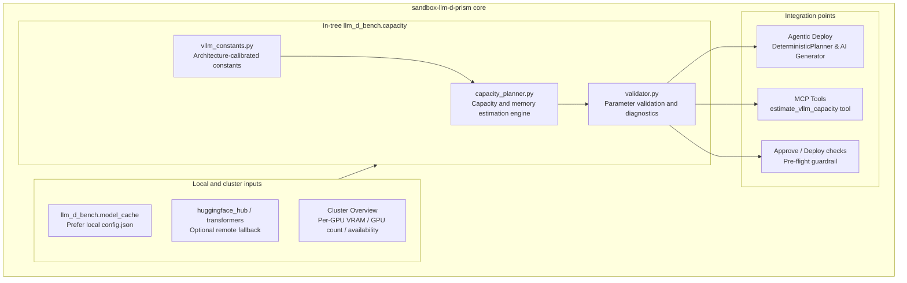

# In-Tree Capacity Planner Integration: Design and Implementation Plan

## 1. Background and goals

Before running an LLM serving system such as vLLM, accurately estimating model memory, context length, tensor parallelism (TP), and available KV cache is essential to avoiding GPU out-of-memory failures and maintaining concurrent throughput.

`llm-d-benchmark` provides this capability by using the `planner.capacity_planner` module from the external `llm-d-planner` repository. Bringing `llm-d-planner` into `sandbox-llm-d-prism` as an external Git or pip dependency would introduce several problems:
1. **Network and environment dependencies**: fetching a Git dependency can fail in private or restricted environments, such as offline clusters or environments requiring a specific proxy.
2. **Fragmented package management**: an unnecessary external dependency increases deployment complexity and version-locking risks.
3. **Poor architectural cohesion**: the capacity planner core in `llm-d-planner` is fundamentally a self-contained mathematical model and rules engine implemented in pure Python.

**Core goal**:
Integrate `llm-d-planner`'s algorithms for parsing model parameters, estimating memory usage and KV cache, and validating TP configurations directly into `sandbox-llm-d-prism` as in-tree code (with no required external planner dependency). Use them in the existing **Agentic Deploy** candidate planner, the pre-deployment guardrail, and the MCP decision tools.

---

## 2. Integration architecture



---

## 3. Capabilities and benefits

| Planning dimension | Previous sandbox-llm-d-prism approach | With the in-tree Capacity Planner |
| :--- | :--- | :--- |
| **Model memory** | Coarse heuristic: `weight * 1.2 + max(1.0, ctx / 4096)` | Breakdown of **model weights, architecture-specific activation memory, CUDA graphs, and non-Torch communication overhead** |
| **TP validity** | Enumerate powers of two without considering model head counts | Validate against attention and KV heads, excluding TP values that do not divide the relevant head counts |
| **KV cache** | No accurate estimate of available KV cache or concurrency limits | Estimate allocatable KV cache (GiB), per-request usage at the requested context length, and maximum concurrent requests |
| **Pre-deployment rejection** | Check only that the cluster has enough GPUs | Reject configurations certain to run out of memory or unable to serve a request, with concrete suggestions |
| **Dependency burden** | No external planner dependency | Continue without a required external planner dependency (self-contained core) |

---

## 4. Module structure

Add a separate `capacity` module under `sandbox-llm-d-prism/llm_d_bench`:

```text
sandbox-llm-d-prism/
└── llm_d_bench/
    └── capacity/
        ├── __init__.py               # Public API
        ├── vllm_constants.py         # In-tree activation and communication constants (Python dict; no file I/O)
        ├── capacity_planner.py       # Estimation engine (local model cache first, optional HF fallback)
        ├── validator.py              # ValidationParams and topology diagnostics
        └── test_capacity.py          # Offline unit tests with mocked and representative model configurations
```

### 4.1 In-tree constants (`vllm_constants.py`)
Convert the original `vllm_memory_constants.json` into static Python definitions to avoid runtime path lookup or missing package data:
- `ACTIVATION_PROFILES`: common architectures including Llama, Qwen2, Qwen3, Mistral, DeepSeek, Gemma, and Granite.
- `ACTIVATION_BASE_GIB`: base activation memory by category (dense, MoE, multimodal).
- `NON_TORCH_OVERHEAD_GIB`: baseline distributed communication overhead for TP1/PP1, TPN/PP1, and TPN/PPN.

### 4.2 Estimation engine (`capacity_planner.py`)
Provide the following functions:
- `model_total_params(model_name, hf_token=None, local_config_path=None)`
- `model_memory_req(model_name, model_config, ...)`
- `estimate_vllm_activation_memory(model_config, tp=1)`
- `estimate_vllm_cuda_graph_memory(...)`
- `estimate_vllm_non_torch_memory(tp=1)`
- `allocatable_kv_cache_memory(...)` -> estimate memory remaining for KV cache (`< 0` means an inevitable OOM)
- `find_possible_tp(text_config)` -> return valid TP values, such as `[1, 2, 4, 8]`
- `max_concurrent_requests(...)` -> estimate maximum concurrency

### 4.3 Validator and diagnostics (`validator.py`)
Port `validate_vllm_params` and `run_capacity_planner` from `llm-d-benchmark`. For Prism's deployment modes (`baseline-vllm`, `optimized-baseline`, `pd-disaggregation`, `tiered-prefix-cache`, `precise-prefix-cache-routing`), validate the `prefill` and `decode` roles independently.

---

## 5. Integration details

### 5.1 Agentic Deploy deterministic planner (`llm_d_bench/agentic/planner.py`)

When `DeterministicPlanner.candidates()` generates candidates:
1. Load the model's actual configuration, preferring the local `model_cache` manifest.
2. Before enumerating `tensor_parallel_size`, call `find_possible_tp()`. If the current TP is not valid, mark it rejected with `"TP={tp} is invalid for model architecture"`.
3. Call `allocatable_kv_cache_memory()` to determine the memory available at that TP:
   - If `avail_kv < 0`, mark the candidate undeployable with `"insufficient GPU memory to load model weights and activation"`.
   - If `avail_kv < per_request_kv`, mark it undeployable with `"insufficient KV cache for context length"`.
4. Add capacity estimates to `PlannedCandidate` for the UI and scorer:
   ```python
   class PlannedCandidate(BaseModel):
       ...
       allocatable_kv_cache_gib: float | None = None
       per_request_kv_cache_gib: float | None = None
       max_concurrent_requests: int | None = None
   ```

### 5.2 Pre-deployment guardrail

Before approving via `POST /api/agentic-deployments/{id}/approve` or deploying via `llm_d_bench/deploy/`:
1. Extract the selected topology's actual vLLM parameters (`tp`, `max_model_len`, `gpu_memory_utilization`, `gpu_memory`).
2. Run `validate_vllm_params()` as a pre-flight check.
3. If fatal errors are found and `ignore_failures` is not enabled, stop deployment and return structured rejection reasons and remediation suggestions, such as increasing TP, reducing `maxModelLen`, or lowering concurrency.

### 5.3 MCP capacity-estimation tool

Register `estimate_vllm_capacity` in `llm_d_bench/agentic/generator.py` and `server/mcp/specialTools.ts`:
- **Inputs**:
  - `model`: model name or local cache path
  - `gpu_memory_gib`: per-GPU memory in GiB (for example, 80)
  - `tensor_parallel_size`: TP value
  - `max_model_len`: maximum context length
  - `gpu_memory_utilization`: memory utilization (default 0.9)
- **Outputs**:
  - `is_deployable`: whether the configuration can run
  - `memory_breakdown`: weights, activations, CUDA graphs, and KV cache (GiB)
  - `max_concurrent_requests`: maximum supported concurrency
  - `diagnostics`: warnings and optimization suggestions
- **Benefit**: during multi-round planning, the agent can compare memory efficiency across TP and context configurations for large models.

---

## 6. Implementation steps

The implementation is divided into five phases, each protected by tests and designed for backward compatibility:

### Phase 1: Build a self-contained capacity module
- [x] **Step 1.1**: Create `llm_d_bench/capacity/` and its `__init__.py`.
- [x] **Step 1.2**: Add `llm_d_bench/capacity/vllm_constants.py` with in-tree activation profiles, base activation costs, and non-Torch overhead.
- [x] **Step 1.3**: Port and simplify `capacity_planner.py` to:
  - Prefer a local path or `model_cache` for `config.json`;
  - Dynamically import optional `transformers` and `huggingface_hub`, degrading gracefully with a clear message when they are absent;
  - Handle errors and floating-point boundaries robustly in the mathematical estimates.
- [x] **Step 1.4**: Add `llm_d_bench/capacity/validator.py` with `ValidationParams` and `validate_vllm_params`.
- [x] **Step 1.5**: Add offline tests in `llm_d_bench/capacity/test_capacity.py` for representative models (such as Llama-3-8B and Qwen-72B) on different GPU sizes.

### Phase 2: Improve the Agentic Deploy deterministic planner
- [x] **Step 2.1**: Add memory and concurrency capacity fields to `PlannedCandidate` in `llm_d_bench/agentic/planner.py`.
- [x] **Step 2.2**: Update `DeterministicPlanner.candidates()` to use strict TP and memory checks when the model configuration is known; fall back to the previous heuristic when neither configuration nor network/cache is available.
- [x] **Step 2.3**: Update `llm_d_bench/agentic/test_planner.py` to check invalid TP filtering and precise exclusion when GPU memory is insufficient.

### Phase 3: Add pre-flight deployment validation
- [x] **Step 3.1**: Add capacity validation to the approval logic (`approve`) in `llm_d_bench/agentic/service.py`.
- [x] **Step 3.2**: Return blocking errors when parameters could cause runtime OOM, preventing `CrashLoopBackOff` Pods.

### Phase 4: Expose the MCP capacity-estimation tool
- [x] **Step 4.1**: Register `estimate_vllm_capacity` as an optional MCP tool in `llm_d_bench/agentic/generator.py`.
- [x] **Step 4.2**: Add its signature and handler to `server/mcp/specialTools.ts`.

### Phase 5: End-to-end verification and documentation
- [x] **Step 5.1**: Run regression tests: `pytest llm_d_bench/agentic/ llm_d_bench/capacity/`.
- [x] **Step 5.2**: Verify the frontend/backend integration by selecting a model, cluster, and topology in the UI and checking memory allocation and concurrency metadata on the candidates.
- [x] **Step 5.3**: Update the main project documentation and user guide.