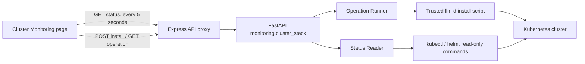
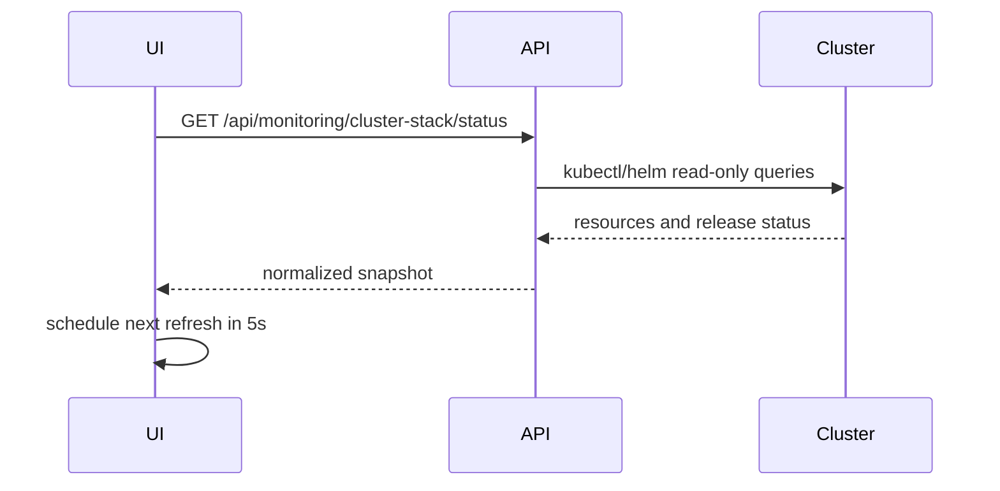
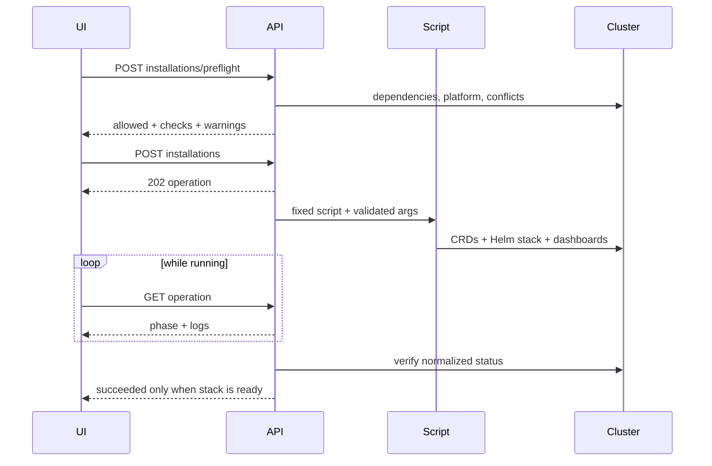

# Cluster Monitoring Stack Service Design

## 1. Background and Goals

`llm-d-monitoring-enable.md` describes the complete llm-d monitoring enablement flow. This design first implements the **cluster monitoring stack service** within it: maintaining the Prometheus, Grafana, and related Kubernetes resources created by the llm-d upstream script
`guides/recipes/observability/install-prometheus-grafana.sh`.

The **cluster stack** here refers specifically to cluster-level Prometheus/Grafana infrastructure, and does not represent monitoring for a particular llm-d guide instance. A separate
**deployment monitoring service** will be added later to manage instances deployed through llm-d guides within a namespace, along with their ServiceMonitor, PodMonitor, scrape targets, and business metrics.

MVP goals:

1. Lens can identify whether the monitoring stack exists in the current Kubernetes cluster.
2. The page refreshes component status every 5 seconds and displays aggregated results such as `ready`, `degraded`, and `absent`.
3. When the stack does not exist, users can deploy it from Lens by calling the upstream script.
4. Deployment runs as an asynchronous task, and the frontend can continuously view phases, logs, and final results.
5. The backend provides explicit Pydantic DTOs, stable error codes, and testable Kubernetes command boundaries.

The MVP does not include:

- Creating ServiceMonitor, PodMonitor, and router Helm values in llm-d workload namespaces.
- Prometheus metric queries, Grafana dashboard embedding, or tracing management.
- Automatic uninstall, automatic repair of a degraded stack, or automatic upgrade of an existing Helm release.
- Allowing users to submit arbitrary script paths, command arguments, or kubeconfig file paths.

## 2. Upstream Script Constraints

The design follows the current behavior of the script on the llm-d `main` branch:

- The default namespace is `llm-d-monitoring`.
- The Helm release is fixed as `llmd`.
- The installed chart is `prometheus-community/kube-prometheus-stack`.
- Central mode is used by default, and Prometheus discovers ServiceMonitor, PodMonitor, and PrometheusRule across namespaces.
- Individual mode, TLS, specifying a namespace, specifying a kubeconfig, and CRD-only installation are supported.
- llm-d dashboards are loaded during installation.
- If the cluster already has a Prometheus Operator or node-exporter, the script may reuse or disable the corresponding component, so “no operator/node-exporter in this namespace” cannot be treated directly as a fault.
- When the script detects that the `llmd` release already exists, it returns immediately and does not repair or upgrade it.
- On OpenShift, built-in user workload monitoring is used and the script does not install that stack; the MVP reports it as `unsupported` and does not show an install button.

The upstream script will not be copied into Lens. At runtime, an environment variable points to a trusted, version-controlled llm-d checkout:

```text
LLM_D_REPO_ROOT=/path/to/llm-d
```

The backend only allows execution of the fixed relative path
`${LLM_D_REPO_ROOT}/guides/recipes/observability/install-prometheus-grafana.sh`,
and validates at startup or during preflight that the file exists, is within the repo root, and is executable. Lens does not download remote scripts during requests.

## 3. Overall Architecture



Backend modules:

```text
llm_d_bench/monitoring/
  __init__.py
  kubernetes.py                 # secure kubectl/helm execution boundary shared by both services
  cluster_stack/
    __init__.py
    errors.py                   # cluster stack domain errors
    models.py                   # ClusterStack* API DTO
    discovery.py                # Prometheus/Grafana stack resource discovery
    operations.py               # stack installation tasks, logs, concurrency control
    service.py
    router.py
    test_*.py
  guide_deployments/            # implemented later; not to be confused with the Kubernetes Deployment type
    __init__.py
    errors.py
    models.py                   # DeploymentMonitoring* API DTO
    discovery.py                # guide instance, monitor CR, and scrape target discovery
    operations.py               # enabling/repairing monitoring for a deployment
    service.py
    router.py
    test_*.py
```

`llm_d_bench/api/main.py` registers `cluster_stack.router` and, in the future,
`guide_deployments.router` separately. The two share only common Kubernetes execution facilities and do not share state machines, DTOs, or domain services, preventing the Helm release state of the cluster stack from contaminating the monitoring enablement state of guide deployments.

The API namespace is fixed by layer:

```text
/api/monitoring/cluster-stack/...   # Prometheus/Grafana base stack
/api/monitoring/deployments/...     # future: llm-d guide instances in a single namespace
```

Express adds a common `server/monitoring.ts`, proxying `/api/monitoring/*` to the FastAPI service. Authentication has now been unified under the Lens login session: see
[`auth-rbac-design.md`](auth-rbac-design.md) (session cookie + roles/scopes; `monitoring:*` permission codes). Local development can allow access with `PRISM_AUTH_MODE=disabled` / `PRISM_ALLOW_UNAUTHENTICATED=true`. The earlier `X-Prism-Github-Token` header and `SIMULATION_ALLOW_UNAUTHENTICATED` have both been deprecated/removed.

### 3.1 Responsibility Boundaries Between the Two Monitoring Services

| Dimension | Cluster monitoring stack | Deployment monitoring |
|---|---|---|
| Managed object | Prometheus, Grafana, Operator, CRD, dashboard loader | An instance deployed by an llm-d guide within a namespace |
| Identifier | kube context + monitoring namespace | kube context + workload namespace + guide deployment/release |
| Installation source | `install-prometheus-grafana.sh` | the guide's monitoring component, router monitoring values |
| Primary state | whether the stack is available | whether monitor CR exists, whether scrape targets are up, whether role metrics are available |
| mutation | install cluster stack | enable/repair monitoring for a deployment |
| API/DTO prefix | `ClusterStack*` | `DeploymentMonitoring*` |

deployment monitoring may depend on cluster stack `ready`, but it may only read that state through a public service interface and must not directly call
`cluster_stack.discovery` or modify stack operations. Even if external Prometheus is supported in the future, deployment monitoring can replace its dependency implementation without changing the cluster stack module.

## 4. Status Discovery and Aggregation

### 4.1 Discovery Order

Each status query executes a set of read-only commands with timeouts, by default 10 seconds per command and 20 seconds for the whole query:

1. `kubectl cluster-info`: distinguish unreachable vs. unauthorized.
2. Detect OpenShift `clusterversion`.
3. `helm status llmd -n <namespace> -o json`: confirm the release and Helm status.
4. Read Pod, Deployment, StatefulSet, and Service in the namespace once using `app.kubernetes.io/instance=llmd`.
5. Read the Prometheus CR, required CRDs, and ConfigMaps with `grafana_dashboard=1`.
6. Normalize raw resources into component status, without returning full Kubernetes manifests to the frontend.

The namespace must comply with Kubernetes DNS name rules. The MVP uses the current kube context of the service process and does not accept a kubeconfig path in the request.

### 4.2 Components

| Component | Primary evidence | Required |
|---|---|---|
| Prometheus | Prometheus CR, StatefulSet/Pod, Service | Required |
| Grafana | Deployment/Pod, Service | Required |
| Prometheus Operator | Deployment/Pod, may be in another namespace | Required but external allowed |
| Alertmanager | StatefulSet/Pod | Optional |
| kube-state-metrics | Deployment/Pod | Optional |
| node-exporter | DaemonSet/Pod | Optional, external reuse allowed |
| llm-d dashboards | ConfigMaps with `grafana_dashboard=1` and names matching repo `grafana/dashboards/*.json` | desired comes from the repo directory; if `LLM_D_REPO_ROOT` is configured, absence causes `degraded` |
| monitoring CRDs | ServiceMonitor, PodMonitor, PrometheusRule CRD | Required |

Component status:

```text
ready | progressing | degraded | missing | external | unknown
```

For workload components, `ready`/`desired` means the **container** ready count / total count
for all Pods of that component (for example alertmanager `2/2`, grafana `3/3`), rather than the workload replica count; when no Pod exists, it falls back to the replica count.

Pod diagnostics must retain `phase`, ready container count, restart count, and up to 3 waiting/termination reasons. Sensitive environment variables, Secrets, the full Pod spec, and logs do not enter the response.

### 4.3 Aggregated Stack Status

```text
unknown      query not yet completed
absent       Helm release does not exist, and there are no core resources belonging to llmd
installing   there is an active installation task in the current namespace, or core workloads are rolling toward ready
ready        Helm deployed, Prometheus/Grafana/CRD ready, operator ready or external
degraded     release exists, but a required component is missing/degraded, or Helm status is abnormal
unsupported  environments not supported by the current installer, such as OpenShift
unreachable  Kubernetes API unreachable or credentials lack permissions
```

If the release does not exist but residual core resources are detected, the status is `degraded` rather than `absent`, and the installation operation returns a conflict to avoid overwriting resources of unknown origin.

The response contains `observed_at` and `stale`. After a frontend request fails, the last successful snapshot is retained, but it must be shown as stale and must not continue to appear healthy.

## 5. Backend API

Base path: `/api/monitoring/cluster-stack`. Time is uniformly UTC ISO 8601. Unknown fields are rejected by Pydantic.

### 5.1 Get Status

```http
GET /api/monitoring/cluster-stack/status?namespace=llm-d-monitoring
```

`200 ClusterStackStatusResponse`:

```json
{
  "cluster": {
    "context": "kind-llm-d",
    "reachable": true,
    "platform": "kubernetes"
  },
  "namespace": "llm-d-monitoring",
  "release": {
    "name": "llmd",
    "status": "deployed",
    "chart": "kube-prometheus-stack-72.6.2",
    "revision": 1
  },
  "status": "ready",
  "message": "Monitoring stack is ready",
  "components": [
    {
      "name": "prometheus",
      "status": "ready",
      "kind": "workload",
      "ready": 2,
      "desired": 2,
      "source": "llmd",
      "diagnostics": []
    },
    {
      "name": "prometheus_operator",
      "status": "external",
      "kind": "workload",
      "ready": 1,
      "desired": 1,
      "source": "cluster",
      "diagnostics": []
    }
  ],
  "active_operation_id": null,
  "observed_at": "2026-08-13T08:10:00Z",
  "stale": false
}
```

### 5.2 Pre-installation Check

```http
POST /api/monitoring/cluster-stack/installations/preflight
Content-Type: application/json
```

```json
{
  "namespace": "llm-d-monitoring",
  "mode": "central",
  "enable_tls": false
}
```

`200 ClusterStackPreflightResponse` returns:

- `allowed`
- current stack status
- `checks`: kubectl, helm, cluster reachability, script, namespace/release conflicts, platform
- `warnings`: for example, an external operator/node-exporter was detected
- `command_preview`: the redacted fixed script and arguments, for confirmation only

The frontend must successfully complete preflight before enabling Install. The backend runs preflight again before the real installation and cannot trust stale results.

### 5.3 Create Installation Task

```http
POST /api/monitoring/cluster-stack/installations
Content-Type: application/json
Idempotency-Key: <uuid>
```

The request body is the same as preflight. Success returns `202 ClusterStackOperationResponse`.

Installation parameter mapping:

| DTO | Script argument |
|---|---|
| `namespace` | `--namespace <namespace>` |
| `mode=individual` | `--individual` |
| `enable_tls=true` | `--enable-tls` |

The MVP page defaults to and recommends `central`. individual mode requires an additional note: the workload namespace still needs the `monitoring-ns` label configured, and that action is outside the scope of this task.

### 5.4 Query Task

```http
GET /api/monitoring/cluster-stack/operations/{operation_id}
```

Returns the task phase and recent logs:

```json
{
  "operation_id": "01k2...",
  "kind": "install",
  "status": "running",
  "phase": "waiting_for_components",
  "namespace": "llm-d-monitoring",
  "started_at": "2026-08-13T08:10:00Z",
  "finished_at": null,
  "exit_code": null,
  "logs": [
    {
      "sequence": 18,
      "timestamp": "2026-08-13T08:10:08Z",
      "level": "info",
      "message": "Waiting for Prometheus instance"
    }
  ],
  "error": null
}
```

Task status:

```text
queued -> running -> succeeded
                  -> failed
```

Phases:

```text
preflight | invoking_installer | installing_crds | installing_chart |
loading_dashboards | waiting_for_components | verifying | completed
```

Upstream text output cannot reliably serve as the sole basis of the state machine. `phase` may be updated based on recognized logs, but the final `verifying` step must re-run status discovery; only when the stack aggregates to `ready` is the task marked `succeeded`. If the script exits with 0 but the stack is degraded, the task is `failed` with error code `INSTALL_VERIFICATION_FAILED`.

### 5.5 DTO Draft

Use the following core models in `models.py`:

```python
MonitoringStackStatus = Literal[
    "unknown",
    "absent",
    "installing",
    "ready",
    "degraded",
    "unsupported",
    "unreachable",
]
ComponentStatus = Literal[
    "ready",
    "progressing",
    "degraded",
    "missing",
    "external",
    "unknown",
]
OperationStatus = Literal["queued", "running", "succeeded", "failed"]
MonitoringMode = Literal["central", "individual"]


class ClusterStackInstallRequest(BaseModel):
    model_config = ConfigDict(extra="forbid")
    namespace: str = "llm-d-monitoring"
    mode: MonitoringMode = "central"
    enable_tls: bool = False


class ComponentDiagnostic(BaseModel):
    severity: Literal["info", "warning", "error"]
    code: str
    message: str
    resource: str | None = None


class ClusterStackComponent(BaseModel):
    name: str
    status: ComponentStatus
    kind: Literal["workload", "configmap", "crd"] = "workload"
    ready: int | None = None
    desired: int | None = None
    source: Literal["llmd", "cluster", "none"]
    diagnostics: list[ComponentDiagnostic] = Field(default_factory=list)
```

In the actual implementation, `ClusterSummary`, `HelmReleaseSummary`, `ClusterStackStatusResponse`,
`PreflightCheck`, `ClusterStackPreflightResponse`, `OperationLogEntry`, and
`ClusterStackOperationResponse` should also be defined, with `default_factory` used for all lists. Do not use broad names such as
`MonitoringStatus` or `MonitoringService`, to avoid future confusion with `DeploymentMonitoringStatus`.

### 5.6 HTTP and Domain Errors

| HTTP | code | Scenario |
|---:|---|---|
| 400 | `PREFLIGHT_FAILED` | dependencies or configuration not satisfied |
| 401/403 | `UNAUTHORIZED` / `FORBIDDEN` | insufficient operator permissions |
| 404 | `OPERATION_NOT_FOUND` | task does not exist |
| 409 | `ALREADY_INSTALLED` | stack is already ready |
| 409 | `INSTALLATION_IN_PROGRESS` | a task already exists for the same cluster/namespace |
| 409 | `RESIDUAL_RESOURCES_FOUND` | release missing but core residual resources exist |
| 422 | FastAPI validation | namespace or DTO invalid |
| 502 | `CLUSTER_QUERY_FAILED` | kubectl/helm returned an unparsable error |
| 503 | `CLUSTER_UNREACHABLE` | cluster unreachable |
| 504 | `COMMAND_TIMEOUT` | command or installation timed out |

Domain errors return a uniform response:

```json
{
  "detail": {
    "code": "ALREADY_INSTALLED",
    "message": "Monitoring stack is already installed",
    "retryable": false
  }
}
```

## 6. Installation Task Implementation

### 6.1 Concurrency and Idempotency

- Use an in-process async lock keyed by `(kube context, namespace)`.
- Only one mutation operation is allowed for the same key.
- `Idempotency-Key` maps to the same operation for 24 hours, preventing duplicate installation from browser retries.
- Check status once before installation begins and again after acquiring the lock.
- Do not use `shell=True`; pass arguments as an array to `asyncio.create_subprocess_exec`.
- The default overall installation timeout is 15 minutes and can be adjusted through a server-side environment variable; the request cannot override it.

### 6.2 Task Storage

Task metadata and limited logs are written to:

```text
MONITORING_OPERATION_ROOT/
  <operation-id>.json
  <operation-id>.log
```

The JSON uses a temporary file plus atomic rename. Each task retains at most 2,000 lines or 2 MiB of redacted logs, with a default retention of 7 days. After a service restart, leftover `queued/running` tasks are marked as `failed`,
with code `SERVICE_RESTARTED`; cluster status is then rediscovered so the UI can see whether the actual stack is already ready. The MVP does not blindly resume the installer script.

### 6.3 Security and Logging

- repo root, operation root, and command timeout can only be set by server-side environment variables.
- namespace is strictly validated; mode and boolean options are mapped from enums, and passing through extra parameters is forbidden.
- Do not pass user-controlled environment variables to the script; use only the minimal environment constructed by the backend.
- Remove ANSI control sequences from logs.
- Secret contents, tokens, kubeconfig contents, and the Grafana admin password are not returned to the frontend.
- Do not provide an arbitrary `kubectl` API.
- mutation endpoints must require authentication, be rate-limited, and record actor, cluster context, namespace, operation ID, and result; the token itself must not be logged.

## 7. Frontend Design

### 7.1 Navigation and Files

Add under **Utility suite** in `LeftNavigation.jsx`:

```text
Monitoring infrastructure
```

The view ID is `cluster-monitoring-stack`, using the `Activity` or `Gauge` icon. Register
`ClusterMonitoringStackDashboard` in `App.jsx`. Future deployment monitoring uses a separate view
`deployment-monitoring` and will not reuse the current page state.

```text
src/components/ClusterMonitoringStack/
  ClusterMonitoringStackDashboard.jsx
  ClusterStackSummary.jsx
  ClusterStackComponentTable.jsx
  InstallClusterStackModal.jsx
  ClusterStackOperationProgress.jsx
  clusterMonitoringStackBackend.js
  useClusterMonitoringStackStatus.js

src/components/DeploymentMonitoring/       # future
  DeploymentMonitoringDashboard.jsx
  deploymentMonitoringBackend.js
```

The page reuses existing `PageHeader`, `Panel`, `StatCard`, `Badge`, `StatusChip`, `Button`,
`Modal`, `Input`, `Select`, `Checkbox`, `LoadingState`, and `EmptyState`.

### 7.2 Page Layout

1. **Page header**
   - Title: Cluster Monitoring
   - Current kube context, namespace.
   - Last refresh time, auto-refresh status, and manual Refresh.

2. **Summary cards**
   - Stack status.
   - Ready components.
   - Helm release/revision.
   - Active operation.

3. **Component status table**
   - Component, Status, Ready/Desired, Source, Diagnostics.
   - degraded/missing rows can be expanded to view structured diagnostics.
   - Status always uses both text and icon, not color alone.

4. **Installation empty state**
   - Show Install monitoring stack only when status is `absent`.
   - The modal configures namespace, central/individual, and TLS.
   - Show preflight checks and warnings, then create the task after confirmation.

5. **Task progress**
   - Show phase, duration, and recent logs.
   - Refresh status immediately after success.
   - On failure, retain logs and stable error codes, and provide Retry preflight rather than directly resubmitting.

6. **degraded state**
   - Show diagnostics and manual refresh.
   - The MVP does not show a “reinstall” button because the upstream script does not repair an existing release.

### 7.3 Near-real-time Refresh

The MVP uses authentication-friendly polling rather than EventSource:

- When the page is visible and there is no installation task: request status every 5 seconds.
- While an installation task is running: request operation every 2 seconds and status every 5 seconds.
- Pause when the page is hidden; refresh immediately when it becomes visible again.
- At most one status request at a time; a new refresh aborts the old request.
- Use backoff of 5, 10, 20, and 30 seconds after consecutive failures.
- Retain the last successful data and mark it `stale`, displaying the connection error.

This avoids placing a GitHub token in the URL and avoids adding SSE reconnection protocol complexity in the first phase. If the number of clusters or clients grows in the future, it can later be upgraded to SSE/WebSocket.

### 7.4 Frontend API Adapter

`clusterMonitoringStackBackend.js` exposes only:

```js
getClusterStackStatus(namespace, { signal })
preflightClusterStackInstall(request, { signal })
installClusterStack(request, idempotencyKey)
getClusterStackOperation(operationId, { signal })
```

It uniformly parses FastAPI `detail`, preserving `code`, `message`, and `retryable` for the UI; non-2xx responses must not be converted into an empty state.

## 8. Key Flows

### 8.1 Status Refresh



### 8.2 Install When Missing



## 9. Tests and Acceptance

### 9.1 Backend Unit Tests

- conversion from kubectl/helm JSON to component DTOs.
- aggregation for ready, absent, residual, degraded, and external operator.
- namespace validation and fixed parameter mapping.
- preflight for OpenShift, missing script, missing helm/kubectl, cluster unreachable.
- concurrent installation and idempotency key for the same namespace.
- script timeout, non-zero exit, exit 0 but verification failure.
- log ANSI cleanup, size limits, and sensitive information filtering.

Command execution is tested through injected runners and does not require the test environment to connect to a real cluster.

### 9.2 API Tests

- successful DTOs and HTTP error mappings for status, preflight, install, and operation.
- unknown fields return 422.
- nonexistent operation returns 404.
- when there is an active operation, status is installing and returns the operation ID.

### 9.3 Frontend Tests

- absent shows the install entry; ready/degraded do not.
- installation cannot be confirmed when preflight does not pass.
- polling, visibility pause, abort, and backoff.
- refresh status after operation success.
- stale snapshot, error codes, and component diagnostics are visible.
- status text, keyboard interaction, modal focus, and narrow-screen layout.

### 9.4 MVP Acceptance Scenarios

1. Open the page on an empty cluster, and `absent` appears within 5 seconds.
2. Click Install, preflight succeeds, and after confirmation a `202` is returned; the page continuously shows phases and logs.
3. After installation completes, the page becomes `ready` without refreshing the browser.
4. After deleting or breaking the Grafana Pod, the page shows `installing` or `degraded` within 10 seconds; after recovery it returns to `ready`.
5. When the cluster is unreachable, display `unreachable`, installation is disallowed, and the old healthy snapshot is marked stale.
6. When the cluster already has an external operator/node-exporter, the core stack is not falsely reported as faulty.
7. If two browsers install into the same namespace at the same time, at most one task runs the script.

## 10. Later Phases

- Manage PodMonitor, ServiceMonitor, and router monitoring values for workload namespaces.
- Query Prometheus `/api/v1/targets` and display llm-d scrape target health.
- Controlled access entry points for Grafana/Prometheus.
- Explicit repair/upgrade flows for a degraded stack.
- Multi-cluster registry and server-managed kubeconfig.
- SSE push, alert history, and audit pages.
