### 1.1 Entity Relationship Diagram (ER Diagram)

The current state is "one isolated JSON directory per module". Relationships
between modules (such as `ModelCacheEntry.storage_volume_id`,
`DeploymentCase.execution_id`) are only **string fields**, with no referential
integrity guarantees at all—deleting a referenced Storage volume / Execution will
not trigger any database-level error, and only results in a "dangling reference"
when read later. After migration to a relational database, all of these string
fields become **real foreign key constraints**. The concrete relationships are as
follows:

```mermaid
erDiagram
    CLUSTERS ||--o{ STORAGE_VOLUMES : "cluster_id (RESTRICT)"
    CLUSTERS ||--o{ MODEL_CACHE_ENTRIES : "cluster_id (RESTRICT)"
    CLUSTERS ||--o{ DEPLOYMENT_BATCHES : "cluster_id (SET NULL, nullable)"
    CLUSTERS ||--o{ DEPLOYMENT_EVIDENCES : "cluster_id (SET NULL, nullable)"
    CLUSTERS ||--o{ CONFIGURATION_ARTIFACTS : "cluster_id (SET NULL, nullable)"
    CLUSTERS ||--o{ EVALUATE_RUNS : "cluster_id (SET NULL, nullable)"
    CLUSTERS ||--o{ EVALUATE_WORKFLOWS : "cluster_id (SET NULL, nullable)"
    CLUSTERS ||--o{ MONITORING_ACCELERATOR_OPERATIONS : "cluster_id (SET NULL, nullable)"
    CLUSTERS ||--o{ MONITORING_CLUSTER_STACK_OPERATIONS : "cluster_id (SET NULL, nullable)"
    CLUSTERS ||--o{ SIMULATION_TASKS : "endpoint_cluster_id (SET NULL, nullable)"

    STORAGE_VOLUMES ||--o{ MODEL_CACHE_ENTRIES : "storage_volume_id (RESTRICT)"

    DEPLOYMENT_BATCHES ||--o{ DEPLOYMENT_JOBS : "batch_id (CASCADE)"
    DEPLOYMENT_EVIDENCES ||--o{ DEPLOYMENT_JOBS : "evidence_id (SET NULL, nullable)"
    DEPLOYMENT_JOBS }o--o| DEPLOYMENT_JOBS : "parent_job_id (SET NULL, self, nullable)"
    CONFIGURATION_ARTIFACTS }o--o| CONFIGURATION_ARTIFACTS : "edited_from_artifact_id (SET NULL, self, nullable)"

    DEPLOYMENT_EVIDENCES ||--o{ EVALUATE_RUNS : "deployment_evidence_id (SET NULL, nullable)"
    CONFIGURATION_ARTIFACTS ||--o{ EVALUATE_RUNS : "configuration_artifact_id (SET NULL, nullable)"

    EVALUATE_WORKFLOWS ||--o{ EVALUATE_WORKFLOW_CASES : "workflow_id (CASCADE)"
    DEPLOYMENT_BATCHES ||--o{ EVALUATE_WORKFLOW_CASES : "deployment_batch_id (SET NULL, nullable)"
    EVALUATE_RUNS ||--o{ EVALUATE_WORKFLOW_CASES : "evaluation_run_id (SET NULL, nullable)"

    EVALUATE_RUNS ||--o{ AGENTIC_BENCHMARK_RECORDS : "evaluate_run_id (SET NULL, nullable)"

    DEPLOYMENT_EVIDENCES ||--o{ SIMULATION_TASKS : "endpoint_deployment_evidence_id (SET NULL, nullable)"
    DEPLOYMENT_BATCHES ||--o{ SIMULATION_TASKS : "endpoint_deployment_batch_id (SET NULL, nullable, legacy)"
    DEPLOYMENT_JOBS ||--o{ SIMULATION_TASKS : "endpoint_deployment_job_id (SET NULL, nullable, legacy)"

    AI_PROVIDERS {
        string id PK
        string name
        string provider_type
    }
```



> Naming note: the three deployment-related tables are renamed to
> `deployment_batches` (batches) / `deployment_jobs` (schedulable work items split
> from a batch) / `deployment_evidences` (immutable evidence produced by one
> execution of a work item), which more clearly expresses their hierarchy and
> responsibility differences than the original
> `deployment_runs` / `deployment_cases` / `deployment_executions` (see the
> explanations at the beginning of §1.2.6–§1.2.8). This is only a **database-level**
> table/column naming adjustment; the corresponding FastAPI / Pydantic DTO class
> names (`DeploymentRun` / `DeploymentCase` / `DeploymentExecution`) remain
> unchanged and do not involve any code changes.

`AI_PROVIDERS` is listed separately in the diagram without any relationship lines
—it is global configuration (credentials for external inference services) and
does not belong to any cluster, so it intentionally has no `cluster_id` foreign
key.

### 1.2 Field-by-field table design

For each table below, the following are given: column name, SQL type,
length/precision, nullability, primary key, foreign key (including `ON DELETE`
strategy), default value, and notes (including the source DTO field path).

#### 1.2.1 `clusters`

**Purpose:** store the connection information (kubeconfig, proxy config) and
metadata for every target Kubernetes cluster that Lens has onboarded / is managing.
It is the root table under which almost all other business tables are associated
by `cluster_id`.

Corresponds to `llm_d_bench.cluster.registry.Cluster` (actual implemented fields,
not a draft).

| Column name | SQLAlchemy type | Nullable | PK | FK | Default value | Notes (source field) |
|---|---|---|---|---|---|---|
| `id` | String(8) | NOT NULL | ✅ | - | - | `uuid4().hex[:8]`, no prefix |
| `name` | String(200) | NOT NULL |  |  | - | `name` |
| `description` | Text | NOT NULL |  |  | `''` | `description` |
| `kubeconfig` | Text | NOT NULL |  |  | - | raw `kubeconfig`; **application-layer encryption before persistence is recommended**, see §10 |
| `draft` | Boolean | NOT NULL |  |  | `False` | `draft`; true while the wizard is incomplete, and `list_clusters()` filters it out by default |
| `ready` | Boolean | NOT NULL |  |  | `False` | cached result of the latest `--raw=/readyz` probe |
| `proxy_mode` | String(16) | NOT NULL |  |  | `'auto'` | `proxy_mode`; `CHECK IN ('auto','custom')` |
| `proxy_http_proxy` | Text | NULL |  |  | - | `http_proxy` (effective when `mode='custom'`) |
| `proxy_https_proxy` | Text | NULL |  |  | - | `https_proxy` |
| `proxy_no_proxy` | Text | NULL |  |  | - | `no_proxy` |
| `proxy_detected_http_proxy` | Text | NULL |  |  | - | automatic detection snapshot (`mode='auto'`) |
| `proxy_detected_https_proxy` | Text | NULL |  |  | - | same as above |
| `proxy_detected_no_proxy` | Text | NULL |  |  | - | same as above |
| `proxy_detected_at` | DateTime(timezone=True) | NULL |  |  | - | same as above |
| `proxy_detection_error` | Text | NULL |  |  | - | same as above |
| `llm_d_ref` | String(128) | NULL |  |  | - | `llm_d_ref` |
| `llm_d_benchmark_ref` | String(128) | NULL |  |  | - | `llm_d_benchmark_ref` |
| `llm_d_repo_path` | Text | NULL |  |  | - | `llm_d_repo_path` |
| `llm_d_benchmark_repo_path` | Text | NULL |  |  | - | `llm_d_benchmark_repo_path` |
| `created_at` | DateTime(timezone=True) | NOT NULL |  |  | `func.now()` |  |
| `updated_at` | DateTime(timezone=True) | NOT NULL |  |  | `func.now()` | `onupdate=func.now()` |
| `version_id` | Integer | NOT NULL |  |  | `1` | optimistic-lock version number (SQLAlchemy `version_id_col`); concurrent dirty-write prevention is described in §6.7 |

Unique constraint: `uq_clusters_name(name)`. This is a root table with no foreign
keys pointing to other tables; it is referenced by the 10 relationship lines in
the §1.1 diagram (including the newly added `simulation_tasks.endpoint_cluster_id`).

#### 1.2.2 `storage_volumes`

**Purpose:** record the persistent storage volumes (local disk / NFS / dynamic PVC)
registered by the user for a cluster, for use by modules such as Model Cache.

Corresponds to `llm_d_bench.storage.contracts.StorageVolume`. The three mutually
exclusive one-to-one submodels `local_disk` / `nfs` / `dynamic_pvc` are expanded
into prefixed columns according to rule 2; the application layer (continuing to
use the existing Pydantic `model_validator`) guarantees that within one row, only
the prefixed column group matching `kind` is non-null.

| Column name | SQLAlchemy type | Nullable | PK | FK | Default value | Notes |
|---|---|---|---|---|---|---|
| `id` | String(40) | NOT NULL | ✅ | - | - | `storage-{uuid4().hex[:8]}` |
| `cluster_id` | String(8) | NOT NULL |  | `clusters.id` **RESTRICT** | - | `cluster_id` |
| `name` | String(63) | NOT NULL |  |  | - | `name` (DNS-1123 label) |
| `kind` | String(16) | NOT NULL |  |  | - | `CHECK IN ('local-disk','nfs','dynamic-pvc')` |
| `status` | String(16) | NOT NULL |  |  | `'pending'` | `CHECK IN ('pending','ready','failed','deleting')` |
| `capacity` | String(16) | NOT NULL |  |  | - | `capacity`, e.g. `"100Gi"` |
| `used_bytes` | BigInteger | NULL |  |  | - | `used_bytes` |
| `read_only` | Boolean | NOT NULL |  |  | `True` | `read_only` |
| `purposes` | ARRAY(Text) | NOT NULL |  |  | `'{}'` | `purposes` (enum string array, rule 4) |
| `local_disk_host_path` | Text | NULL |  |  | - | `local_disk.host_path` (required when `kind='local-disk'`) |
| `nfs_server` | String(255) | NULL |  |  | - | `nfs.server` (required when `kind='nfs'`) |
| `nfs_path` | Text | NULL |  |  | - | `nfs.path` |
| `dynamic_pvc_storage_class` | String(253) | NULL |  |  | - | `dynamic_pvc.storage_class` (required when `kind='dynamic-pvc'`) |
| `dynamic_pvc_namespace` | String(253) | NULL |  |  | - | `dynamic_pvc.namespace` |
| `dynamic_pvc_access_mode` | String(32) | NULL |  |  | - | `dynamic_pvc.access_mode` |
| `pvc_name` | String(253) | NULL |  |  | - | `pvc_name` (backfilled after successful creation) |
| `pv_name` | String(253) | NULL |  |  | - | `pv_name` |
| `known_nodes` | ARRAY(Text) | NOT NULL |  |  | `'{}'` | `known_nodes` (rule 4) |
| `failure_detail` | Text | NULL |  |  | - | `failure_detail` |
| `created_at` | DateTime(timezone=True) | NOT NULL |  |  | `func.now()` |  |
| `updated_at` | DateTime(timezone=True) | NOT NULL |  |  | `func.now()` |  |
| `version_id` | Integer | NOT NULL |  |  | `1` | optimistic-lock version number; see §6.7 |

Unique constraint: `uq_storage_volumes_name(name)`. Indexes: `(cluster_id)`,
`(kind)`, `(status)`.

#### 1.2.3 `model_cache_entries`

**Purpose:** record the model files already downloaded / currently downloading on a
storage volume, along with per-node download progress, to avoid downloading the
same model repeatedly.

Corresponds to `llm_d_bench.model_cache.contracts.ModelCacheEntry`. `source`
(`ModelSource`) and `token_source` (`TokenSource`) are expanded according to rule
2; `node_progress: list[NodeDownloadStatus]` falls under rule 6 (detail snapshot,
not split into a separate table).

| Column name | SQLAlchemy type | Nullable | PK | FK | Default value | Notes |
|---|---|---|---|---|---|---|
| `id` | String(48) | NOT NULL | ✅ | - | - | `model-cache-{uuid4().hex[:8]}` |
| `cluster_id` | String(8) | NOT NULL |  | `clusters.id` **RESTRICT** | - | `cluster_id` |
| `storage_volume_id` | String(40) | NOT NULL |  | `storage_volumes.id` **RESTRICT** | - | `storage_volume_id` |
| `source_kind` | String(16) | NOT NULL |  |  | - | `source.kind`; `CHECK IN ('huggingface','model-catalog')` |
| `source_huggingface_repo_id` | String(255) | NULL |  |  | - | `source.huggingface.repo_id` |
| `source_huggingface_revision` | String(255) | NULL |  |  | `'main'` | `source.huggingface.revision` |
| `source_model_catalog_entry_id` | String(64) | NULL |  |  | - | `source.model_catalog.catalog_entry_id` |
| `source_display` | Text | NOT NULL |  |  | - | derived column, equivalent to `ModelSource.display_name()`, used by the dedup unique constraint |
| `token_source_mode` | String(16) | NOT NULL |  |  | `'none'` | `token_source.mode`; `CHECK IN ('none','existing-secret','host')` |
| `token_source_namespace` | String(253) | NULL |  |  | - | `token_source.namespace` |
| `token_source_name` | String(253) | NULL |  |  | - | `token_source.name` |
| `status` | String(16) | NOT NULL |  |  | `'pending'` | `CHECK IN ('pending','downloading','ready','failed')` |
| `cache_path` | Text | NOT NULL |  |  | - | `cache_path` |
| `size_bytes` | BigInteger | NULL |  |  | - | `size_bytes` |
| `node_progress` | JSONVariant | NOT NULL |  |  | `'[]'` | `node_progress` (rule 6, snapshot of `list[NodeDownloadStatus]`) |
| `failure_detail` | Text | NULL |  |  | - | `failure_detail` |
| `created_at` | DateTime(timezone=True) | NOT NULL |  |  | `func.now()` |  |
| `updated_at` | DateTime(timezone=True) | NOT NULL |  |  | `func.now()` |  |
| `version_id` | Integer | NOT NULL |  |  | `1` | optimistic-lock version number (same model download progress may be updated concurrently by callbacks from multiple nodes); see §6.7 |

Unique constraint:
`uq_model_cache_volume_source(storage_volume_id, source_display)` (replacing the
full-table-scan dedup in `find_by_volume_and_source`). Indexes: `(cluster_id)`,
`(status)`.

#### 1.2.4 `ai_providers`

**Purpose:** persist user-configured credentials for external inference services
(OpenAI/Anthropic-compatible APIs), used by modules such as Agentic that need to
call large-model capabilities.

Corresponds to `llm_d_bench.ai_providers.contracts.AIProvider`. This is global
configuration with no `cluster_id`; almost all fields are scalars.

| Column name | SQLAlchemy type | Nullable | PK | FK | Default value | Notes |
|---|---|---|---|---|---|---|
| `id` | String(48) | NOT NULL | ✅ | - | - | `ai-provider-{uuid4().hex[:8]}` |
| `name` | String(200) | NOT NULL |  |  | - | `name` |
| `base_url` | String(2048) | NOT NULL |  |  | - | `base_url` |
| `model` | String(200) | NOT NULL |  |  | - | `model` |
| `api_key` | Text | NOT NULL |  |  | `''` | `api_key`; **sensitive field, encrypted storage recommended**, see §10 |
| `provider_type` | String(16) | NOT NULL |  |  | `'openai'` | `provider_type`; `CHECK IN ('openai','anthropic')` |
| `timeout_seconds` | Float | NOT NULL |  |  | `30` | `timeout_seconds`; `CHECK (0 < x <= 120)` |
| `created_at` | DateTime(timezone=True) | NOT NULL |  |  | `func.now()` |  |
| `updated_at` | DateTime(timezone=True) | NOT NULL |  |  | `func.now()` |  |
| `version_id` | Integer | NOT NULL |  |  | `1` | optimistic-lock version number; see §6.7 |

Unique constraint: `uq_ai_providers_name(name)`.

#### 1.2.5 `configuration_artifacts`

**Purpose:** persist immutable deployment configuration artifacts generated and
"published" by the Configuration module (rendered content + checksum + provenance),
for consumption by Deploy.

Corresponds to `llm_d_bench.configuration.models.ConfigurationArtifactRecord`.
`deployable_configuration` (`DeployableConfiguration`) and `configuration_file`
(`ConfigurationFile`) are expanded according to rule 2, with prefixes `dc_` /
`cf_` respectively; `cluster_id` / `edited_from_artifact_id` are queryable columns
derived from the JSONVariant field `dc_provenance`.

| Column name | SQLAlchemy type | Nullable | PK | FK | Default value | Notes |
|---|---|---|---|---|---|---|
| `artifact_id` | String(36) | NOT NULL | ✅ | - | - | `artifact_id` (standard `uuid4()` format) |
| `schema_version` | String(64) | NOT NULL |  |  | `'configuration-artifact.v1'` | `schema_version` |
| `revision` | Integer | NOT NULL |  |  | `1` | `revision` |
| `status` | String(16) | NOT NULL |  |  | `'published'` | `status`; `CHECK IN ('published')` |
| `dc_schema_version` | String(64) | NOT NULL |  |  | `'deployable-configuration.v1'` | `deployable_configuration.schema_version` |
| `dc_type` | String(32) | NOT NULL |  |  | - | `deployable_configuration.type` |
| `dc_format` | String(32) | NOT NULL |  |  | - | `deployable_configuration.format` |
| `dc_content` | JSONVariant | NOT NULL |  |  | - | `deployable_configuration.content` (rule 3, free-form) |
| `dc_provider_ref` | String(255) | NOT NULL |  |  | - | `deployable_configuration.provider_ref` |
| `dc_checksum` | String(128) | NOT NULL |  |  | - | `deployable_configuration.checksum` |
| `dc_provenance` | JSONVariant | NOT NULL |  |  | `'{}'` | `deployable_configuration.provenance` (rule 3) |
| `cf_type` | String(32) | NOT NULL |  |  | - | `configuration_file.type` |
| `cf_file_name` | String(255) | NOT NULL |  |  | - | `configuration_file.file_name` |
| `cf_format` | String(32) | NOT NULL |  |  | - | `configuration_file.format` |
| `cf_path` | String(1024) | NOT NULL |  |  | - | `configuration_file.path` |
| `cf_size` | BigInteger | NOT NULL |  |  | - | `configuration_file.size` |
| `cf_sha256` | String(64) | NOT NULL |  |  | - | `configuration_file.sha256` |
| `cluster_id` | String(8) | NULL |  | `clusters.id` **SET NULL** | - | derived from `dc_provenance.cluster_ref.id` |
| `edited_from_artifact_id` | String(36) | NULL |  | `configuration_artifacts.artifact_id` **SET NULL** (self-reference) | - | derived from `dc_provenance.edited_from_artifact_id` |
| `created_at` | DateTime(timezone=True) | NOT NULL |  |  | `func.now()` |  |

Indexes: `(cluster_id)`, `(created_at)`.

#### 1.2.6 `deployment_batches`

**Purpose:** record the top-level request and aggregated status of one "batch
deployment launched from several configurations" (see the explanation above about
responsibility differences among the three deployment tables).

Corresponds to `llm_d_bench.deploy.contracts.DeploymentRun` (excluding `cases`; see
§6.5). The table is named `deployment_batches` (batches) rather than reusing the
DTO class name `DeploymentRun`; see the naming note below the §1.1 diagram.

| Column name | SQLAlchemy type | Nullable | PK | FK | Default value | Notes |
|---|---|---|---|---|---|---|
| `id` | String(36) | NOT NULL | ✅ | - | - | `id` (`uuid4()`) |
| `status` | String(24) | NOT NULL |  |  | `'queued'` | `status`; `CHECK IN ('queued','running','succeeded','partially_succeeded','failed','cleaned','cancelling','cancelled')` |
| `source_configurations` | JSONVariant | NOT NULL |  |  | - | `source_configurations` (rule 6, `list[DeployableConfiguration]`; application-layer validation requires at least 1 item) |
| `failure_policy` | String(16) | NOT NULL |  |  | `'continue'` | `failure_policy`; `CHECK IN ('stop','continue')` |
| `provenance` | JSONVariant | NOT NULL |  |  | `'{}'` | `provenance` (rule 3) |
| `cluster_id` | String(8) | NULL |  | `clusters.id` **SET NULL** | - | derived from `provenance.cluster_ref.id` |
| `created_at` | DateTime(timezone=True) | NOT NULL |  |  | `func.now()` |  |
| `started_at` | DateTime(timezone=True) | NULL |  |  | - | `started_at` |
| `finished_at` | DateTime(timezone=True) | NULL |  |  | - | `finished_at` |
| `version_id` | Integer | NOT NULL |  |  | `1` | optimistic-lock version number (the aggregate `status` of a batch is backfilled concurrently as jobs complete), see §6.7 |

Indexes: `(cluster_id)`, `(status)`, `(created_at)`.

#### 1.2.7 `deployment_jobs`

**Purpose:** record one individual deployment work item split out of a batch,
which can be independently scheduled / retried (corresponding to a
provider_ref + component combination, supporting dependency ordering and retry
chains).

Corresponds to `llm_d_bench.deploy.contracts.DeploymentCase` (split from the
`DeploymentRun.cases` array, rule 5). The table is named `deployment_jobs`
(schedulable work items split from a batch, supporting retry/dependency) rather
than reusing the DTO class name `DeploymentCase`. `create_request`
(`DeploymentCreateRequest`) is expanded according to rule 2 with prefix
`create_request_`; within it, `deployment_policy` / `cluster_snapshot`
(both `VersionedPayload | None`) are expanded one level further, with prefixes
`create_request_deployment_policy_` /
`create_request_cluster_snapshot_`; `configuration_artifacts: list[ConfigurationArtifact]`
(the deploy module's own temporary reference type, not the
`configuration_artifacts` table) falls under rule 6.

| Column name | SQLAlchemy type | Nullable | PK | FK | Default value | Notes |
|---|---|---|---|---|---|---|
| `id` | String(36) | NOT NULL | ✅ | - | - | `id` |
| `batch_id` | String(36) | NOT NULL |  | `deployment_batches.id` **CASCADE** | - | parent batch (the DTO field name is `run_id`; see the mapping in §6.2 `column_map`) |
| `ordinal` | Integer | NOT NULL |  |  | - | `ordinal`; `CHECK (>= 0)` |
| `source_configuration_ordinal` | Integer | NOT NULL |  |  | - | `source_configuration_ordinal` |
| `provider_ref` | String(255) | NOT NULL |  |  | - | `provider_ref` |
| `component` | String(255) | NOT NULL |  |  | - | `component` |
| `depends_on` | ARRAY(Text) | NOT NULL |  |  | `'{}'` | `depends_on` (rule 4, ids of other jobs within the same batch; no per-element FK) |
| `create_request_request_id` | String(36) | NOT NULL |  |  | - | `create_request.request_id` |
| `create_request_input_schema_version` | String(16) | NOT NULL |  |  | `'v1'` | `create_request.input_schema_version` |
| `create_request_configuration_artifacts` | JSONVariant | NOT NULL |  |  | `'[]'` | `create_request.configuration_artifacts` (rule 6) |
| `create_request_deployment_policy_schema_version` | String(32) | NULL |  |  | - | `create_request.deployment_policy.schema_version` |
| `create_request_deployment_policy_value` | JSONVariant | NULL |  |  | - | `create_request.deployment_policy.value` (rule 3) |
| `create_request_cluster_snapshot_ref` | String(255) | NULL |  |  | - | source reference of `create_request.cluster_snapshot` |
| `create_request_cluster_snapshot_schema_version` | String(32) | NULL |  |  | - | `create_request.cluster_snapshot.schema_version` |
| `create_request_cluster_snapshot_value` | JSONVariant | NULL |  |  | - | `create_request.cluster_snapshot.value` |
| `create_request_provenance` | JSONVariant | NOT NULL |  |  | `'{}'` | `create_request.provenance` (rule 3) |
| `status` | String(16) | NOT NULL |  |  | `'queued'` | `CHECK IN ('queued','rendering','deploying','ready','failed','stopped','cancelling','cancelled','cleaned','cleaned_up')` |
| `attempt` | Integer | NOT NULL |  |  | `1` | `attempt`; `CHECK (>= 1)` |
| `parent_job_id` | String(36) | NULL |  | `deployment_jobs.id` **SET NULL** (self-reference) | - | points to the original job when a child job is created by retry (DTO field name `parent_case_id`) |
| `evidence_id` | String(36) | NULL |  | `deployment_evidences.evidence_id` **SET NULL** | - | associated deployment evidence (DTO field name `execution_id`) |
| `failure_status` | Integer | NULL |  |  | - | `failure.status` |
| `failure_title` | String(255) | NULL |  |  | - | `failure.title` |
| `failure_detail` | Text | NULL |  |  | - | `failure.detail` |
| `failure_code` | String(64) | NULL |  |  | - | `failure.code` |
| `version_id` | Integer | NOT NULL |  |  | `1` | optimistic-lock version number |

Indexes: `(batch_id)`, `(evidence_id)`, `(status)`.

#### 1.2.8 `deployment_evidences`

**Purpose:** record the immutable evidence left after one real execution of a
deployment work item (rendered manifest, available service endpoints, resource
snapshot), for later reference by Benchmark / Evaluate / auditing.

Corresponds to `llm_d_bench.deploy.contracts.DeploymentExecution`. This is one of
the 15 tables with many fields. The table is named `deployment_evidences`
(immutable evidence) rather than reusing the DTO class name
`DeploymentExecution`, emphasizing that this table is append-only. `artifact`
(`DeploymentArtifact`, containing `rendered_payload: VersionedPayload`),
`endpoint` (`DeploymentEndpoint | None`), `metadata` (`DeploymentMetadata`),
`resource_snapshot` / `diagnostics` (both `VersionedPayload | None`) are all
expanded level by level according to rule 2.

| Column name | SQLAlchemy type | Nullable | PK | FK | Default value | Notes |
|---|---|---|---|---|---|---|
| `evidence_id` | String(36) | NOT NULL | ✅ | - | - | DTO field name is `execution_id` |
| `request_id` | String(36) | NOT NULL |  |  | - | `request_id` (not an FK; used only for indexing, allowing one request to map to multiple evidence rows due to retry) |
| `status` | String(24) | NOT NULL |  |  | - | `CHECK IN ('draft','validated','rendered','deploying','ready','failed','rolling_back','rolled_back','cleaned','cleaned_up')` |
| `artifact_artifact_id` | String(36) | NOT NULL |  |  | - | `artifact.artifact_id` |
| `artifact_artifact_hash` | String(128) | NOT NULL |  |  | - | `artifact.artifact_hash` |
| `artifact_configuration_artifact_ids` | ARRAY(Text) | NOT NULL |  |  | - | `artifact.configuration_artifact_ids` (rule 4; elements theoretically correspond to `configuration_artifacts.artifact_id`, but due to history there is no per-element FK, only application-layer validation) |
| `artifact_source_ref` | String(255) | NULL |  |  | - | `artifact.source_ref` |
| `artifact_manifest_ref` | String(255) | NULL |  |  | - | `artifact.manifest_ref` |
| `artifact_manifest_checksum` | String(128) | NULL |  |  | - | `artifact.manifest_checksum` |
| `artifact_values_checksum` | String(128) | NULL |  |  | - | `artifact.values_checksum` |
| `artifact_rendered_payload_schema_version` | String(32) | NOT NULL |  |  | - | `artifact.rendered_payload.schema_version` |
| `artifact_rendered_payload_value` | JSONVariant | NOT NULL |  |  | `'{}'` | `artifact.rendered_payload.value` |
| `artifact_created_at` | DateTime(timezone=True) | NOT NULL |  |  | - | `artifact.created_at` |
| `endpoint_url` | Text | NULL |  |  | - | `endpoint.url` |
| `endpoint_protocol` | String(16) | NULL |  |  | `'http'` | `endpoint.protocol` |
| `endpoint_service_ref` | String(255) | NULL |  |  | - | `endpoint.service_ref` |
| `endpoint_model_ref` | String(255) | NULL |  |  | - | `endpoint.model_ref` |
| `endpoint_baseline_url` | Text | NULL |  |  | - | `endpoint.baseline_url` |
| `forwarded_endpoint` | Text | NULL |  |  | - | `forwarded_endpoint` |
| `namespace` | String(253) | NULL |  |  | - | `namespace` |
| `monitoring_setup` | JSONVariant | NULL |  |  | - | `monitoring_setup` (rule 3) |
| `configuration_artifacts` | JSONVariant | NOT NULL |  |  | `'[]'` | `configuration_artifacts` (rule 6; application-layer validation requires at least 1 item) |
| `resource_snapshot_schema_version` | String(32) | NULL |  |  | - | `resource_snapshot.schema_version` |
| `resource_snapshot_value` | JSONVariant | NULL |  |  | - | `resource_snapshot.value` (rule 3) |
| `provenance` | JSONVariant | NOT NULL |  |  | `'{}'` | `provenance` (rule 3) |
| `cluster_id` | String(8) | NULL |  | `clusters.id` **SET NULL** | - | derived from `provenance.cluster_ref.id` |
| `metadata_display_name` | String(120) | NOT NULL |  |  | `''` | `metadata.display_name` |
| `metadata_description` | String(1000) | NOT NULL |  |  | `''` | `metadata.description` |
| `evidence_refs` | ARRAY(Text) | NOT NULL |  |  | `'{}'` | `evidence_refs` (rule 4) |
| `diagnostics_schema_version` | String(32) | NULL |  |  | - | `diagnostics.schema_version` |
| `diagnostics_value` | JSONVariant | NULL |  |  | - | `diagnostics.value` |
| `created_at` | DateTime(timezone=True) | NOT NULL |  |  | `func.now()` |  |
| `updated_at` | DateTime(timezone=True) | NOT NULL |  |  | `func.now()` |  |
| `version_id` | Integer | NOT NULL |  |  | `1` | optimistic-lock version number (`metadata_*` and similar fields may be updated after creation), see §6.7 |

Indexes: `(cluster_id)`, `(request_id)`, `(status)`, `(created_at)`.

#### 1.2.9 `evaluate_runs` / 1.2.10 `evaluate_workflows`

**Purpose:** `evaluate_runs` records one independent benchmark run and its results;
`evaluate_workflows` records one workflow that orchestrates multiple "deployment +
evaluation" combinations for side-by-side comparison.

Currently `evaluate/router.py` has no Pydantic models and uses free-form `dict`.
During migration, add `EvaluateRunRecord` / `EvaluateWorkflowRecord`
(`extra="allow"`) per §6.6, expanding fields currently known to be queried /
related into columns, while storing all other unknown / future free-form fields in
an `extra` JSONVariant column—this is a direct application of rule 3
(`extra="allow"` fields are semantically equivalent to a free `dict` in
Pydantic). The two tables correspond to the current `benchmark` / `workflow`
records separated by directory. The `kind` column is constantized to the
corresponding value (no longer variable, retained only for one-to-one
correspondence with the DTO field).

`evaluate_runs`:

| Column name | SQLAlchemy type | Nullable | PK | FK | Default value | Notes |
|---|---|---|---|---|---|---|
| `id` | String(36) | NOT NULL | ✅ | - | - | `id` |
| `kind` | String(16) | NOT NULL |  |  | `'benchmark'` | `CHECK ('benchmark')`, retained symmetrically with `evaluate_workflows.kind` |
| `status` | String(24) | NOT NULL |  |  | - | `status` |
| `cluster_id` | String(8) | NULL |  | `clusters.id` **SET NULL** | - | `cluster_id` |
| `deployment_evidence_id` | String(36) | NULL |  | `deployment_evidences.evidence_id` **SET NULL** | - | `deployment_execution_id` (DTO field name retained, persisted column renamed to `deployment_evidence_id`) |
| `configuration_artifact_id` | String(36) | NULL |  | `configuration_artifacts.artifact_id` **SET NULL** | - | `configuration_artifact_id` (points to a saved directory entry; see §1.3) |
| `extra` | JSONVariant | NOT NULL |  |  | `'{}'` | all other free-form fields (request parameters, stage metrics, artifact paths, etc.) |
| `created_at` | DateTime(timezone=True) | NOT NULL |  |  | `func.now()` |  |
| `version_id` | Integer | NOT NULL |  |  | `1` | optimistic-lock version number; see §6.7 |

Indexes: `(cluster_id)`, `(status)`, `(created_at)`.

`evaluate_workflows`:

| Column name | SQLAlchemy type | Nullable | PK | FK | Default value | Notes |
|---|---|---|---|---|---|---|
| `id` | String(36) | NOT NULL | ✅ | - | - | `id` |
| `kind` | String(16) | NOT NULL |  |  | `'workflow'` | `CHECK ('workflow')` |
| `status` | String(24) | NOT NULL |  |  | - | `status` |
| `cluster_id` | String(8) | NULL |  | `clusters.id` **SET NULL** | - | `cluster_id` |
| `extra` | JSONVariant | NOT NULL |  |  | `'{}'` | all other free-form fields (`report`, `error`, `failed_stage`, `active_case_id`, etc.) |
| `created_at` | DateTime(timezone=True) | NOT NULL |  |  | `func.now()` |  |
| `finished_at` | DateTime(timezone=True) | NULL |  |  | - |  |
| `version_id` | Integer | NOT NULL |  |  | `1` | optimistic-lock version number (workflow aggregate status is backfilled when multiple cases complete concurrently), see §6.7 |

Indexes: `(cluster_id)`, `(status)`, `(created_at)`, `(finished_at)`.

#### 1.2.11 `evaluate_workflow_cases`

**Purpose:** record the execution status of one "deployment + evaluation"
combination subtask (case) within an evaluation workflow, and its associated
deployment batch / evaluation run.

Split from the embedded array `EvaluateWorkflowRecord.cases` (rule 5—the case is
referenced by other tables / queried independently, and already has independent
deployment/evaluation associations in the current system).

| Column name | SQLAlchemy type | Nullable | PK | FK | Default value | Notes |
|---|---|---|---|---|---|---|
| `id` | String(36) | NOT NULL | ✅ | - | - | embedded case `id` |
| `workflow_id` | String(36) | NOT NULL |  | `evaluate_workflows.id` **CASCADE** | - | parent workflow |
| `deployment_batch_id` | String(36) | NULL |  | `deployment_batches.id` **SET NULL** | - | associated deployment batch (DTO field name `deployment_run_id`) |
| `evaluation_run_id` | String(36) | NULL |  | `evaluate_runs.id` **SET NULL** | - | associated evaluation run |
| `status` | String(24) | NOT NULL |  |  | - | `status` |
| `cleanup_error` | Text | NULL |  |  | - | `cleanup_error` |
| `failed_stage` | String(32) | NULL |  |  | - | `failed_stage` |
| `error` | Text | NULL |  |  | - | `error` |
| `extra` | JSONVariant | NOT NULL |  |  | `'{}'` | all other free-form fields |
| `created_at` | DateTime(timezone=True) | NOT NULL |  |  | `func.now()` |  |
| `finished_at` | DateTime(timezone=True) | NULL |  |  | - |  |
| `version_id` | Integer | NOT NULL |  |  | `1` | optimistic-lock version number; see §6.7 |

Indexes: `(workflow_id)`, `(status)`.

#### 1.2.12 `agentic_benchmark_records`

**Purpose:** record a full snapshot of model / hardware / runtime / workload /
configuration / metrics for every benchmark execution in append-only form, for
later retrieval of historical benchmark data (for example for Agentic intelligent
configuration recommendations).

Corresponds to `llm_d_bench.agentic.benchmark_evidence.BenchmarkRecord`. All six
nested submodels (`model` / `hardware` / `runtime` / `workload` /
`configuration` / `metrics`) are expanded according to rule 2. This is one of the
15 tables with many fields (the table with the most columns is the newly added
`simulation_tasks`; see §1.2.15).

| Column name | SQLAlchemy type | Nullable | PK | FK | Default value | Notes |
|---|---|---|---|---|---|---|
| `benchmark_id` | String(128) | NOT NULL | ✅ | - | - | `benchmark_id` (e.g. `"evaluate:<uuid>"`) |
| `timestamp` | DateTime(timezone=True) | NOT NULL |  |  | - | `timestamp` |
| `outcome` | String(16) | NOT NULL |  |  | - | `outcome`; `CHECK IN ('succeeded','failed')` |
| `model_model_id` | String(255) | NOT NULL |  |  | - | `model.model_id` |
| `model_family` | String(64) | NOT NULL |  |  | - | `model.family` |
| `model_architecture` | String(16) | NOT NULL |  |  | - | `model.architecture`; `CHECK IN ('dense','moe')` |
| `model_parameter_count_b` | Float | NOT NULL |  |  | - | `model.parameter_count_b` |
| `model_active_parameter_count_b` | Float | NULL |  |  | - | `model.active_parameter_count_b` (MoE-specific) |
| `model_quantization` | String(64) | NOT NULL |  |  | - | `model.quantization` |
| `model_tokenizer_id` | String(255) | NOT NULL |  |  | - | `model.tokenizer_id` |
| `model_revision` | String(128) | NULL |  |  | - | `model.revision` |
| `hardware_accelerator` | String(64) | NOT NULL |  |  | - | `hardware.accelerator` |
| `hardware_vram_per_gpu_gib` | Float | NOT NULL |  |  | - | `hardware.vram_per_gpu_gib` |
| `hardware_gpu_count` | Integer | NOT NULL |  |  | - | `hardware.gpu_count` |
| `runtime_backend` | String(64) | NOT NULL |  |  | - | `runtime.backend` |
| `runtime_backend_version` | String(64) | NOT NULL |  |  | - | `runtime.backend_version` |
| `runtime_accelerator_runtime` | String(64) | NOT NULL |  |  | - | `runtime.accelerator_runtime` |
| `runtime_driver_version` | String(64) | NULL |  |  | - | `runtime.driver_version` |
| `runtime_container_digest` | String(128) | NULL |  |  | - | `runtime.container_digest` |
| `runtime_git_revision` | String(64) | NULL |  |  | - | `runtime.git_revision` |
| `workload_mean_input_tokens` | Float | NOT NULL |  |  | - | `workload.mean_input_tokens` |
| `workload_p95_input_tokens` | Float | NOT NULL |  |  | - | `workload.p95_input_tokens` |
| `workload_mean_output_tokens` | Float | NOT NULL |  |  | - | `workload.mean_output_tokens` |
| `workload_concurrency` | Float | NOT NULL |  |  | - | `workload.concurrency` |
| `workload_request_rate` | Float | NOT NULL |  |  | - | `workload.request_rate` |
| `workload_shared_prefix_ratio` | Float | NOT NULL |  |  | - | `workload.shared_prefix_ratio` |
| `workload_prefill_fraction` | Float | NOT NULL |  |  | - | `workload.prefill_fraction` |
| `configuration_topology` | String(64) | NOT NULL |  |  | - | `configuration.topology` |
| `configuration_decode_tp` | Integer | NOT NULL |  |  | - | `configuration.decode_tp` |
| `configuration_decode_replicas` | Integer | NOT NULL |  |  | - | `configuration.decode_replicas` |
| `configuration_prefill_tp` | Integer | NULL |  |  | - | `configuration.prefill_tp` |
| `configuration_prefill_replicas` | Integer | NULL |  |  | - | `configuration.prefill_replicas` |
| `configuration_optimizations` | ARRAY(Text) | NOT NULL |  |  | `'{}'` | `configuration.optimizations` (rule 4) |
| `metrics_ttft_p95_ms` | Float | NULL |  |  | - | `metrics.ttft_p95_ms` |
| `metrics_tpot_p95_ms` | Float | NULL |  |  | - | `metrics.tpot_p95_ms` |
| `metrics_e2e_p95_ms` | Float | NULL |  |  | - | `metrics.e2e_p95_ms` |
| `metrics_throughput_tokens_per_s` | Float | NULL |  |  | - | `metrics.throughput_tokens_per_s` |
| `metrics_error_rate` | Float | NULL |  |  | - | `metrics.error_rate` |
| `failure_reason` | Text | NULL |  |  | - | `failure_reason` |
| `evaluate_run_id` | String(36) | NULL |  | soft reference, not FK (see §1.3) | - | parsed from `benchmark_id` |

Indexes: `(timestamp)`, `(model_model_id)`, `(evaluate_run_id)`.

#### 1.2.13 `monitoring_accelerator_operations`

**Purpose:** record the progress, logs, and result of one asynchronous operation
that "installs/configures an accelerator (Intel GPU, with DRA or device-plugin
access modes) driver/plugin for the target cluster"—this is an audit table for an
operation lifecycle, not an inventory table of accelerator resources.

Corresponds to
`llm_d_bench.monitoring.accelerator.models.AcceleratorOperationResponse`.
`logs: list[OperationLogEntry]` falls under rule 6 (structured log details, not
split into a table, using a JSONVariant array to preserve order/level); `error:
OperationError | None` is expanded according to rule 2.

| Column name | SQLAlchemy type | Nullable | PK | FK | Default value | Notes |
|---|---|---|---|---|---|---|
| `operation_id` | String(32) | NOT NULL | ✅ | - | - | `operation_id` (`uuid4().hex`, regex requires 32 lowercase hex chars) |
| `kind` | String(16) | NOT NULL |  |  | `'install'` | `CHECK ('install')` |
| `status` | String(16) | NOT NULL |  |  | - | `CHECK IN ('queued','running','succeeded','failed')` |
| `phase` | String(64) | NOT NULL |  |  | - | `phase` |
| `accelerator` | String(16) | NOT NULL |  |  | - | `accelerator`; `CHECK ('intel_gpu')` |
| `access_mode` | String(16) | NULL |  |  | - | `access_mode`; `CHECK IN ('dra','plugin')` |
| `namespace` | String(253) | NOT NULL |  |  | - | `namespace` |
| `started_at` | DateTime(timezone=True) | NULL |  |  | - | `started_at` |
| `finished_at` | DateTime(timezone=True) | NULL |  |  | - | `finished_at` |
| `exit_code` | Integer | NULL |  |  | - | `exit_code` |
| `logs` | JSONVariant | NOT NULL |  |  | `'[]'` | `logs` (rule 6) |
| `error_code` | String(64) | NULL |  |  | - | `error.code` |
| `error_message` | Text | NULL |  |  | - | `error.message` |
| `error_retryable` | Boolean | NULL |  |  | `False` | `error.retryable` |
| `cluster_id` | String(8) | NULL |  | `clusters.id` **SET NULL** | - | reverse-matched from kubeconfig using `context`; see §1.3 |
| `version_id` | Integer | NOT NULL |  |  | `1` | optimistic-lock version number (the background coroutine continuously appends `logs` / updates `phase`); see §6.7 |

Indexes: `(cluster_id)`, `(status)`.

#### 1.2.14 `monitoring_cluster_stack_operations`

**Purpose:** record the progress, logs, and result of one asynchronous operation
that "installs/configures the llm-d base platform component stack (cluster stack,
such as Gateway/CRD/Helm release, excluding accelerator drivers) for the target
cluster". Its structure is parallel to `monitoring_accelerator_operations`, but
the object differs: the former is "install GPU drivers", the latter is "install
the llm-d platform itself".

Corresponds to
`llm_d_bench.monitoring.cluster_stack.models.ClusterStackOperationResponse`. Its
field structure is almost identical to `monitoring_accelerator_operations`
(reusing `OperationLogEntry` / `OperationError` in the same way), except that it
lacks `accelerator` / `access_mode` (cluster stack install operations do not vary
by accelerator).

| Column name | SQLAlchemy type | Nullable | PK | FK | Default value | Notes |
|---|---|---|---|---|---|---|
| `operation_id` | String(32) | NOT NULL | ✅ | - | - | `operation_id` |
| `kind` | String(16) | NOT NULL |  |  | `'install'` | `CHECK ('install')` |
| `status` | String(16) | NOT NULL |  |  | - | `CHECK IN ('queued','running','succeeded','failed')` |
| `phase` | String(64) | NOT NULL |  |  | - | `phase` |
| `namespace` | String(253) | NOT NULL |  |  | - | `namespace` |
| `started_at` | DateTime(timezone=True) | NULL |  |  | - | `started_at` |
| `finished_at` | DateTime(timezone=True) | NULL |  |  | - | `finished_at` |
| `exit_code` | Integer | NULL |  |  | - | `exit_code` |
| `logs` | JSONVariant | NOT NULL |  |  | `'[]'` | `logs` (rule 6) |
| `error_code` | String(64) | NULL |  |  | - | `error.code` |
| `error_message` | Text | NULL |  |  | - | `error.message` |
| `error_retryable` | Boolean | NULL |  |  | `False` | `error.retryable` |
| `cluster_id` | String(8) | NULL |  | `clusters.id` **SET NULL** | - | likewise, reverse-matched from `context` |
| `version_id` | Integer | NOT NULL |  |  | `1` | optimistic-lock version number; see §6.7 |

Indexes: `(cluster_id)`, `(status)`.

#### 1.2.15 `simulation_tasks`

**Purpose:** record configuration, progress, and results for a traffic replay/load-test task against a ready deployment endpoint.

Corresponds to `llm_d_bench.simulation.models.SimulationTask`. The table retains the module name "Simulation" to avoid confusion with deployment run/case/execution terminology. Expand `simulation` (`SimulationConfig`), `prompt` (`SimulationPrompt`, containing `dataset: SimulationDataset` and `trace: SimulationTrace`), and `result` (`SimulationResult | None`) recursively under rule 2 into `simulation_*`/`prompt_dataset_*`/`prompt_trace_*`/`result_*` columns.

`result.per_request: list[SimulationRequestResult]` contains one entry per load-test request and may reach tens of thousands of entries. It does not meet rule 6's bounded-snapshot condition: storing the entire array in JSONVariant would enlarge each row and move all details even when reading only `summary`. Store these details in a separate file and retain only `result_per_request_ref` in the database, following the same policy as Evaluate harness artifacts (§9). Frequently read aggregate metrics in `task.result.summary` remain a JSONVariant column under rule 3.

`live_summary` is a transient progress snapshot for running tasks; `save_task()` already excludes it through `model_dump(..., exclude={"live_summary"})`. It is not persisted, like in-memory cluster/bootstrap and monitoring runtime state (§9).

`endpoint_deployment_run_id`/`endpoint_deployment_case_id` are legacy DTO names retained for old records created before the deployment_batches/deployment_jobs rename. Persist them as `endpoint_deployment_batch_id`/`endpoint_deployment_job_id` to match the new table names.

| Column name | SQLAlchemy type | Nullable | PK | FK | Default | Notes |
|---|---|---|---|---|---|---|
| `id` | String(8) | NOT NULL | ✅ | - | - | `id` (8 lowercase hex characters) |
| `name` | String(200) | NOT NULL |  |  | `'Trace simulation'` | `name` |
| `description` | Text | NOT NULL |  |  | `''` | `description` |
| `scenario` | String(16) | NOT NULL |  |  | - | `scenario`; `CHECK IN ('chat','api-calling','coding')` |
| `status` | String(16) | NOT NULL |  |  | - | `CHECK IN ('queued','running','completed','failed','cancelled')` |
| `endpoint_mode` | String(16) | NOT NULL |  |  | `'external'` | `endpoint_mode`; `CHECK IN ('external','in-cluster','deployment')` |
| `endpoint_namespace` | String(253) | NULL |  |  | - | `endpoint_namespace` |
| `endpoint_service` | String(255) | NULL |  |  | - | `endpoint_service` |
| `endpoint_deployment_evidence_id` | String(36) | NULL |  | `deployment_evidences.evidence_id` **SET NULL** | - | DTO field name: `endpoint_deployment_execution_id` |
| `endpoint_deployment_batch_id` | String(36) | NULL |  | `deployment_batches.id` **SET NULL** | - | legacy field; DTO field name: `endpoint_deployment_run_id` |
| `endpoint_deployment_job_id` | String(36) | NULL |  | `deployment_jobs.id` **SET NULL** | - | legacy field; DTO field name: `endpoint_deployment_case_id` |
| `endpoint_cluster_id` | String(8) | NULL |  | `clusters.id` **SET NULL** | - | `endpoint_cluster_id` |
| `endpoint_cluster_name` | String(200) | NULL |  |  | - | `endpoint_cluster_name` |
| `endpoint_deployment_name` | String(255) | NULL |  |  | - | `endpoint_deployment_name` |
| `endpoint_url` | Text | NOT NULL |  |  | - | `endpoint_url` |
| `model_name` | String(255) | NOT NULL |  |  | - | `model_name` |
| `simulation_backend` | String(16) | NOT NULL |  |  | - | `simulation.backend`; `CHECK IN ('aiperf','trace-replayer')` |
| `simulation_backend_options` | JSONVariant | NOT NULL |  |  | `'{}'` | `simulation.backend_options` (rule 3) |
| `simulation_duration_seconds` | Float | NOT NULL |  |  | - | `simulation.duration_seconds` |
| `simulation_stream` | Boolean | NOT NULL |  |  | `True` | `simulation.stream` |
| `simulation_grace_period_seconds` | Float | NOT NULL |  |  | - | `simulation.grace_period_seconds` |
| `prompt_dataset_name` | String(255) | NULL |  |  | - | `prompt.dataset.name` |
| `prompt_dataset_scenario` | String(16) | NULL |  |  | - | `prompt.dataset.scenario` |
| `prompt_dataset_tokenizer` | String(255) | NULL |  |  | - | `prompt.dataset.tokenizer` |
| `prompt_trace_path` | Text | NOT NULL |  |  | - | `prompt.trace.path` |
| `prompt_trace_format` | String(32) | NOT NULL |  |  | - | `prompt.trace.format`; `CHECK IN ('mooncake_trace','bailian_trace','baseten_trace','burst_gpt_trace','weka_public_dataset')` |
| `prompt_trace_fixed_schedule` | Boolean | NOT NULL |  |  | `True` | `prompt.trace.fixed_schedule` |
| `prompt_trace_timeout_seconds` | Float | NOT NULL |  |  | - | `prompt.trace.timeout_seconds` |
| `prompt_trace_synthesis_speedup_ratio` | Float | NOT NULL |  |  | - | `prompt.trace.synthesis_speedup_ratio` |
| `prompt_trace_start_seconds` | Float | NOT NULL |  |  | `0` | `prompt.trace.start_seconds` |
| `prompt_trace_end_seconds` | Float | NULL |  |  | - | `prompt.trace.end_seconds` |
| `task_dir` | Text | NOT NULL |  |  | - | `task_dir` |
| `progress_percent` | Float | NOT NULL |  |  | `0` | `progress_percent`; `CHECK (0 <= x <= 100)` |
| `progress_message` | Text | NOT NULL |  |  | `''` | `progress_message` |
| `logs` | ARRAY(Text) | NOT NULL |  |  | `'{}'` | `logs` (rule 4) |
| `result_run_id` | String(64) | NULL |  |  | - | `result.run_id` |
| `result_backend` | String(16) | NULL |  |  | - | `result.backend` |
| `result_backend_version` | String(64) | NULL |  |  | - | `result.backend_version` |
| `result_summary` | JSONVariant | NULL |  |  | - | `result.summary` (rule 3) |
| `result_artifacts` | JSONVariant | NULL |  |  | `'[]'` | `result.artifacts` (rule 6; bounded `list[SimulationArtifact]`) |
| `result_per_request_ref` | Text | NULL |  |  | - | Path reference to the file containing `result.per_request` details (see above; details are not stored directly in the database) |
| `result_backend_metrics` | JSONVariant | NULL |  |  | - | `result.backend_metrics` (rule 3) |
| `result_warnings` | ARRAY(Text) | NULL |  |  | `'{}'` | `result.warnings` (rule 4) |
| `error_message` | Text | NULL |  |  | - | `error_message` |
| `created_at` | DateTime(timezone=True) | NOT NULL |  |  | `func.now()` | `created_at` (ISO8601 string in the DTO, converted to `DateTime(timezone=True)` for persistence) |
| `started_at` | DateTime(timezone=True) | NULL |  |  | - | `started_at` |
| `execution_started_at` | DateTime(timezone=True) | NULL |  |  | - | `execution_started_at` |
| `completed_at` | DateTime(timezone=True) | NULL |  |  | - | `completed_at` |
| `owner_pid` | Integer | NULL |  |  | - | `owner_pid` (PID of the process owning task execution; used after restart to decide whether to mark it failed) |
| `owner_instance_id` | String(36) | NULL |  |  | - | `owner_instance_id` (service instance `uuid4()`) |
| `version_id` | Integer | NOT NULL |  |  | `1` | Optimistic-lock version (`progress_percent`/`logs` are updated frequently by the running load-test coroutine); see §6.7 |

Indexes: `(status)`, `(endpoint_cluster_id)`, `(created_at)`. The three fields `simulation.num_requests` (always `None`), `simulation.warmup_enabled` (always `False`), and `prompt.type` (always `"trace"`) are fixed Pydantic placeholders. Do not create columns; `to_dto()` restores these constants when assembling the DTO.

### 2.1 Appendix A: current persistence paths (pre-migration)

```
~/.cache/llm-d-bench/storage/volumes/*.json
~/.cache/llm-d-bench/ai-providers/*.json
~/.cache/llm-d-bench/configurations/.artifacts/*.json
~/.llm-d-bench/deploy/{runs,executions}/*.json
~/.llm-d-bench/model-cache/entries/*.json
~/.llm-d-bench/agentic/benchmarks/*.json
~/.llm-d-bench/monitoring/operations/*.json         # accelerator
~/.llm_d_bench/run_store/evaluate/{runs,workflows}/*.json
~/.cache/llm-d-bench/simulations/<id>/task.json
```

(Historical residue: the path prefixes are inconsistent across
`~/.cache/llm-d-bench`, `~/.llm-d-bench`, and `~/.llm_d_bench`, due to each
module evolving independently. After this migration, everything is uniformly
carried by `DATABASE_URL` / the embedded database data directory, so those path
differences no longer need to matter.)
