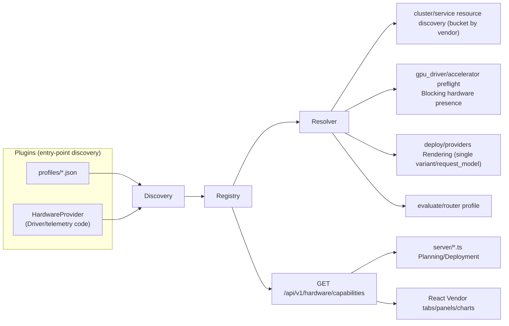

# Proposal: Lens Hardware Provider Plugin Architecture

- **Status:** Draft; core decisions confirmed (§10.3), pending phased implementation.
- **New design document:** `hardware-plugin-architecture.md`.
- **Audience:** Python backend, Node/TS gateway, frontend, deployment, and evaluation maintainers.
- **Related designs:** [Accelerator Observability Services](accelerator-observability-design.md) (the existing and only hardware provider registry), [Cluster Monitoring Service](cluster-monitoring-service-design.md), [Model service v2](model-service-v2-design.md).

---

## 1. Background and goals

Lens currently treats **Intel XPU** as its only first-class accelerator. Integration points, metrics, DRA device classes, image overlays, evaluation profiles, and frontend vendor tabs hardcode `gpu.intel.com` / `xpu` / `intel_gpu`.

Adding NVIDIA, then AMD/Habana and others, by copying Intel branches would spread hardware logic across Python, Node/TS, and React. Integration cost grows with vendor count and risks inconsistent support between layers.

Goals:

1. **One inventory:** enumerate all XPU-specific features/locations and distinguish actual hardware differences from Intel-only implementations.
2. **One plugin mechanism:** define HardwareProvider/HardwareProfile contributions so adding hardware means adding a provider package and declarative profile without new core branches.
3. **One integration checklist:** map every integration point to a plugin-contract field for implementation and acceptance.

**Non-goals:**

- This proposal defines the mechanism/integration points; NVIDIA implementation is a separate subsequent task.
- No new third-party runtime dependency: use standard-library importlib.metadata entry points for both bundled and external plugins (decision 1).
- Preserve Intel behavior and backward compatibility during migration.

---

## 2. Current inventory: XPU-specific features

Organized by runtime layer, with actual locations and hardcoded values forming the factual basis for the integration checklist.

### 2.1 Hardware access: driver/device-plugin installation

| Location | XPU-specific details |
|---|---|
| `llm_d_bench/monitoring/gpu_driver/service.py` | `_DRA_RELEASE_REF = "gpu-v0.11.0"` (Intel DRA Driver), `_DEVICE_PLUGIN_RELEASE_REF = "v0.36.0"` (Intel device plugin), `_NFD_COMMANDS` points to Intel NFD manifests, `_GPU_NODE_LABEL_SELECTOR = "intel.feature.node.kubernetes.io/gpu=true"`, `_is_dra_driver()` / `_is_gpu_plugin()` by `intel-gpu-resource-driver` / `intel-gpu-plugin` name/label matching |
| `llm_d_bench/monitoring/gpu_driver/router.py` | `/api/v1/monitoring/gpu-driver/status`, `/install`, `access_mode ∈ {dra, plugin}` |
| `src/components/ClusterMonitoringStack/gpuDriverBackend.js` | Client wrapper with hardcoded label "Intel GPU" |
| `src/components/CreateClusterWizard.jsx` | `ACCELERATOR_VENDORS = [{ id: 'intel', label: 'Intel GPU', disabled: false }]`; `acceleratorVendor` Intel only |

> The driver-installation layer (`gpu_driver`) has **no registry** and is entirely Intel-specific. It is the first required integration change.

### 2.2 Device discovery and resource models

| Location | XPU-specific details |
|---|---|
| `llm_d_bench/cluster/service.py:859-949` | `_INTEL_GPU_LABEL = "intel.feature.node.kubernetes.io/gpu"`, `_GPU_RESOURCE_PREFIX = "gpu.intel.com/"`, `_gpu_count()` sums by prefix (excluding `/monitoring`) |
| `llm_d_bench/cluster/service.py:154-196` | `component_status()` returns only `intelDevicePlugin`, regex `intel.*(gpu\|device\|resource).*plugin` |
| `llm_d_bench/cluster/service.py:952-988, 1433` | `_GPU_DRIVER = "gpu.intel.com"`, counts devices from DRA ResourceSlices, `kubectl get resourceslices.resource.k8s.io` |
| `llm_d_bench/cluster/service.py:378-449` | `_prometheus_hardware_metrics()`: `vramBytes = hw_memory_size_bytes` (XPUM metric name) |
| `llm_d_bench/cluster/service.py:1333-1419` | `_hardware_summary()` outputs `gpuCount / allocatedGpuCount / availableGpuCount / vramBytes`, consumed by Agentic, Evaluation, and frontend |
| `llm_d_bench/cluster/sdk_discovery.py` | `deviceclasses` / `resourceslices` kubectl queries (generic, but callers hardcode classes) |
| `llm_d_bench/cluster/models.py:168` | `intel_device_plugin: ComponentSummary` hardcoded field name |

### 2.3 Telemetry and observability

| Location | XPU-specific details |
|---|---|
| `llm_d_bench/monitoring/accelerator/registry.py` | **Existing provider registry**: `register()` / `get_provider()` / `capabilities()` + `AcceleratorProvider` protocol |
| `llm_d_bench/monitoring/accelerator/models.py:20-35` | `AcceleratorType = Literal["intel_gpu"]` (closed literal), `INTEL_GPU_RELEASE_NAME = "xpumd"`, `INTEL_GPU_DEFAULT_NAMESPACE = "intel-xpumd"` |
| `llm_d_bench/monitoring/accelerator/intel_gpu.py` | xpumd chart repo/version, `discover_status()`, `preflight()`, `prepare_nodes()`, `install_argv()`, `configure_monitoring()` (Grafana dashboard patch) |
| `llm_d_bench/monitoring/accelerator/service.py:174-253` | Grafana dashboard discovery by `"xpumd"` / `"xpu"` / `"intel"` keyword matching |
| `llm_d_bench/monitoring/profiling/xpu_metrics.py` | `XPUM_QUERIES` (`hw_gpu_utilization_ratio`, `hw_memory_usage_bytes`), `device_allocations()` resolve `gpu.intel.com` DRA claim, PCI BDF regex |
| `llm_d_bench/monitoring/profiling/service.py:32` | Direct import of `xpu_metrics`, Flow Map assembly hardcodes XPUM |
| `llm_d_bench/evaluate/router.py:2379-2397` | `"source": "xpumd-direct"`, direct scrape of `/api/v1/namespaces/intel-xpumd/services/http:xpumd:8080/proxy/metrics` |

> Only telemetry is partially pluggable: its provider registry exists, but profiling joins, PromQL, Grafana discovery, and direct evaluation scraping remain Intel-specific.

### 2.4 Deployment rendering

| Location | XPU-specific details |
|---|---|
| `llm_d_bench/deploy/capabilities.py` | Four providers declare `"accelerators": ["xpu"]` (hardcoded); frontend uses this to determine availability |
| `llm_d_bench/deploy/providers/gpu_selection.py` | `PRISM_GPU_PCI_ALLOWLIST`, CEL `device.attributes["gpu.intel.com"].pciAddress in [...]` |
| `llm_d_bench/deploy/providers/baseline_vllm.py:262-301` | claim name `intel-claim`, `deviceClassName: "gpu.intel.com"`, request name `"intel"` |
| `llm_d_bench/deploy/providers/optimized_baseline.py:107-111, 547` | `accelerator_count == tensor_parallel_size` single-node XPU overlay constraint; DRA claim-count rewriting |
| `llm_d_bench/deploy/providers/pd_disaggregation.py:105-110` | Search ResourceClaimTemplate for `deviceClassName == "gpu.intel.com"` |
| `llm_d_bench/deploy/providers/precise_prefix_cache_routing.py:493` | Validate that overlay contains ResourceClaimTemplate |
| `llm_d_bench/deploy/providers/configuration_manifest.py:55-60` | `source.get("accelerator") != "xpu"` reject directly; `modelServer` allowlist |
| `llm_d_bench/deploy/runtime/composition.py:750, 777, 868-880` | overlay hardcoded path `modelserver/xpu/vllm`; `adapter_type="optimized-baseline-xpu"`; readiness deployment `optimized-baseline-xpu-vllm-decode` |

> Deployment hardware differences reduce to five variables: device class/extended resource, claim/request name, node-selector label, upstream vendor directory (`xpu`/`gpu`), and overlay root. They are currently scattered across providers. NVIDIA uses `gpu`, not `cuda`, as its directory.

### 2.5 Evaluation

| Location | XPU-specific details |
|---|---|
| `llm_d_bench/evaluate/router.py:2674-2702` | `driver_profiles = {"gpu.intel.com": "intel-xpu"}`; infer profile from deviceClassName extracted by regex from renderedManifest; fallback `"intel-xpu"` |
| `llm_d_bench/evaluate/router.py:2972, 3185` | Pass to benchmark chart: `--set accelerator.profile=intel-xpu` |
| `llm_d_bench/evaluate/router.py:2634-2674` | Adjust smoke workload by accelerator profile |
| `src/components/OptimizationEvaluateWorkspaceV2.jsx:708` | Hardcoded frontend message "For this Intel XPU cluster the resolved runtime profile is intel-xpu." |

### 2.6 Configuration/planning: capability and guide validation

| Location | XPU-specific details |
|---|---|
| `llm_d_bench/configuration/capability.py:22-27` | AIC `system_name`, `accelerator_count`, backend resolution; call AIConfigurator `check_support` |
| `llm_d_bench/configuration/validators.py:28-60` | Validate topology accelerator counts against hardware budgets (generic names, hardcoded hardware source) |
| `llm_d_bench/configuration/guide_settings.py:67-69` | special case `deviceClassName == "dranet-rdma"` |
| `server/candidateSearch.ts:46-62` | `acceleratorForSystem()`: `/bmg\|max_\|xpu\|b60\|pvc/i ? 'xpu' : 'cuda'` — Guess hardware from AIC system-name regex |

### 2.7 Agentic planning

| Location | XPU-specific details |
|---|---|
| `llm_d_bench/agentic/facts.py:55-63, 346` | Use cluster overview vramBytes/gpuCount as the accelerator abstraction; `HardwareDescriptor(accelerator="cluster")` |
| `llm_d_bench/agentic/generator.py:513-517` | Read hardware from cluster overview |
| `llm_d_bench/agentic/benchmark_evidence.py:26-220` | `accelerator_runtime` Match scoring (`accelerator_runtime == query.accelerator_runtime`) |

> Agentic is already hardware-independent, using the accelerator abstraction. It still needs correct VRAM/cudaMem metrics and accelerator_runtime values to match evidence correctly.

### 2.8 Node/TypeScript gateway

| Location | XPU-specific details |
|---|---|
| `server/guidePlanning.ts:152-214` | `clusterProfile()` generates deviceClasses[] from deviceclasses and ResourceSlices |
| `server/guidePlanning.ts:472, 588-596` | by `/gpu\|gaudi\|xpu\|tpu/i` recognizes GPU device classes; `dranet-rdma` special case; `/^(?:gpu\.\|.*\.gpu\.\|nvidia\.com\|amd\.com)/` allowlist |
| `server/guidePlanning.ts:170, 200-201` | Tests resolve `xpu`/`rdma-nic` requests to `gpu.intel.com` / `rdma.intel.com` |
| `server/planningDiscovery.ts:21-51` | Query `deviceclasses.resource.k8s.io`, `resourceslices.resource.k8s.io` |
| `server/deploy.ts:24-48, 195-278` | `KNOWN_GOOD = { id: 'optimized-baseline-xpu', accelerator: 'xpu' }`, `ob deploy guide ... -e xpu` |
| `server/candidateSearch.ts:46` | See above |

### 2.9 Frontend

| Location | XPU-specific details |
|---|---|
| `src/components/CreateClusterWizard.jsx:45-52` | Accelerator step + Vendor tabs (Intel only) |
| `src/components/ClusterMonitoringStack/AcceleratorObservabilityPanel.jsx` | default `activeType='intel_gpu'`, default namespace `intel-xpumd` |
| `src/components/ClusterMonitoringStack/acceleratorObservabilityBackend.js` | default `accelerator || 'intel_gpu'` |
| `src/components/OptimizationClusterOverview.jsx:71, 663` | check `components.intelDevicePlugin` |
| `src/components/OptimizationEvaluateWorkspaceV2.jsx:708` | Intel XPU message |
| `src/components/benchmark-results/guideProfiles.js`, `ResourceExplorer.jsx` | Chart titles "GPU / XPU Utilization", `gpu_utilization_percent` and other metric names |

---

## 3. Gaps preventing quick hardware integration

1. Only observability has a registry. Driver installation, discovery, profiling joins, deployment rendering, and evaluation profiles lack extension points.
2. No single hardware identity authority: Intel uses xpu/intel_gpu/gpu.intel.com/intel.feature.node.kubernetes.io/gpu/intel-xpu/xpumd. NVIDIA has Lens/AIC cuda, benchmark nvidia, and upstream gpu (§10.4). Humans currently keep them consistent.
3. Cross-language contracts are missing. Python, Node DRA planning, and frontend tabs all need identity; Node guesses by regex and frontend uses intel_gpu defaults.
4. Closed types (`AcceleratorType = Literal["intel_gpu"]`, `"accelerators": ["xpu"]`, ACCELERATOR_VENDORS) require core edits for every new device.

Use a declarative hardware-profile contract consumed through resolvers in every layer, rather than adding vendor-name branches.

---

## 4. Plugin mechanism

### 4.1 Principles

1. **Data first, code when required:** express most differences in HardwareProfile; provider code owns command-executing driver installation and telemetry discovery.
2. **Single authority:** each accelerator has one canonical profile.id, such as intel-xpu/nvidia. Declare all aliases, benchmark profiles, upstream variant/vendor, classes, resource prefixes, labels, image architecture, and AIC patterns in the profile (§10.4).
3. **Resolve properties, not names:** call resolve_by_device_class instead of branching on vendor substrings.
4. **Backward compatibility:** Intel profile values must equal existing constants; retain delegating compatibility constants during migration.
5. **Data-only cross-language contract:** Python is authoritative; Node/UI consume `/api/v1/hardware/capabilities` or generated JSON, never duplicate definitions.

### 4.2 Three contribution tiers

```
Tier 1  Declarative HardwareProfile (JSON-compatible data)
        └── Covers 80%: class / label / prefix / metric queries / image arch / evaluation profile

Tier 2  HardwareProvider code (optional Python)
        └── Driver installation, telemetry discovery, overlay hooks

Tier 3  Deployment assets: guide overlays / Helm values / kustomize directories
        └── Referenced by profile.deployment.overlay_root and shipped with the provider
```

Tier 1 is the minimum. Tier 2 is needed only for automatic driver installation or custom telemetry. Overlay assets follow established directories without core-code changes.

### 4.3 Unified HardwareProfile contract

The authority is `llm_d_bench/hardware/profiles/*.json`, validated by schema.json. Python loads the following frozen dataclasses for typed internal use (decision 2).

```python
@dataclass(frozen=True)
class HardwareProfile:
    id: str                         # Canonical name: "intel-xpu" | "nvidia"
    display_name: str               # "Intel GPU" | "NVIDIA GPU"
    vendor: str                     # "intel" | "nvidia"

    # --- Naming alignment (see §10.4) ---
    accelerator_keys: tuple[str, ...] = ()      # Lens/AIC key: ("xpu","intel_gpu") / ("cuda","nvidia")
    benchmark_profile: str = ""                 # benchmark accelerator.profile: intel-xpu / nvidia
    upstream_variant: str = ""                  # Upstream overlay directory + accelerator-variant labels: xpu / gpu
    upstream_vendor: str = ""                   # accelerator-vendor labels: intel / nvidia

    # --- Resource model ---
    request_model: str = "dra"                    # "dra" | "extended-resource"
    device_classes: tuple[str, ...] = ()          # DRA: ("gpu.intel.com",) / ("gpu.nvidia.com",)
    resource_prefixes: tuple[str, ...] = ()       # Extended resources: ("gpu.intel.com/",) / ("nvidia.com/gpu",)
    monitor_resource_suffixes: tuple[str, ...] = ()   # Scheduling markers to exclude, such as "monitoring"
    node_label_selector: Mapping[str, str] = {}        # {"intel.feature.node.kubernetes.io/gpu": "true"}
    dranet_device_class: str | None = None             # "dranet-rdma" and other optional network devices

    # --- Access / Driver / Hardware presence ---
    access_modes: tuple[str, ...] = ()                 # ("dra","plugin")
    driver: DriverContribution | None = None
    presence: HardwarePresence | None = None           # Blocking presence probe (§10.3 decision 17, identical for Intel/NVIDIA)

    # --- Telemetry ---
    telemetry: TelemetryContribution | None = None

    # --- Deployment ---
    deployment: DeploymentContribution

    # --- Evaluation / Planning / UI ---
    evaluation_profile: str = ""                       # = benchmark_profile
    planning: PlanningContribution = field(default_factory=PlanningContribution)
    ui: UiContribution = field(default_factory=UiContribution)
```

Nested structures:

```python
@dataclass(frozen=True)
class AccessModeDriver:
    """Installation settings for one access mode (device plugin / DRA / vendor-specific)."""
    manifest_ref: str | None = None           # kustomize/helm ref
    chart_version: str | None = None          # Helm chart version
    repo: str | None = None                   # Helm repo
    min_kubernetes_version: str | None = None # Minimum Kubernetes version for this mode
    daemonset_matchers: tuple[NameMatcher, ...] = ()  # name/namespace/label matching
    monitoring_flag: str | None = None        # e.g. "-enable-monitoring"
    options: Mapping[str, Any] = field(default_factory=dict)  # Vendor-specific options

@dataclass(frozen=True)
class DriverContribution:
    installer: str                     # "kustomize" | "helm"
    modes: Mapping[str, AccessModeDriver] = field(default_factory=dict)  # key = access mode
    nfd_manifest_refs: tuple[str, ...] = ()   # Prerequisites shared by both modes

    def mode(self, access_mode: str) -> AccessModeDriver | None:
        return self.modes.get(access_mode)

@dataclass(frozen=True)
class HardwarePresence:
    """Blocking hardware-presence probe used by preflight (Intel & NVIDIA alike).

    Apply/ensure the vendor's node-feature rules, then wait bounded for at
    least one node label; if none appears, fail fast (e.g. 422) instead of
    letting the driver/plugin/telemetry sit at 0 ready pods for minutes.
    """
    node_label_selector: Mapping[str, str]       # {"feature.node.kubernetes.io/pci-10de.present": "true"}
    ensure_refs: tuple[str, ...] = ()            # NFD/NodeFeatureRule refs to apply first
    timeout_seconds: float = 90.0
    poll_interval_seconds: float = 5.0

@dataclass(frozen=True)
class TelemetryContribution:
    provider_id: str | None            # Reuse monitoring/accelerator registry, e.g. "intel_gpu"
    # Device/cluster metrics (XPUM/DCGM): complete PromQL for cluster pages
    device_metrics: Mapping[str, str] = {}   # {"utilization":"DCGM_FI_DEV_GPU_UTIL", ...}
    # Bare metric names, units, and extra matchers for selector injection by profiling/evaluate
    # Missing/empty metric means unsupported; callers skip it (empty disables)
    device_metric_sources: Mapping[str, DeviceMetricSource] = {}
    #   {"framebuffer_used": {"metric":"DCGM_FI_DEV_FB_USED","unit":"bytes",
    #                          "scale":1048576,"match":{}}}
    label_schema: Mapping[str, str] = {}     # node/pci/device label-name mapping
    allocation_join: str | None = None       # "dra" | "extended-resource" | "none"
    # Pod metrics (native vLLM, pod labels, no join; NVIDIA uses these for per-pod attribution)
    pod_metrics: Mapping[str, str] = {}      # {"gpu_cache_usage":"vllm:gpu_cache_usage_perc", ...}
    scrape_path: str | None = None           # Direct-scrape path template, e.g. namespace/service proxy

@dataclass(frozen=True)
class DeploymentContribution:
    overlay_root: str                  # "guides/optimized-baseline/modelserver/{variant}/vllm"
    arch: str                          # Upstream vendor directory: "xpu" | "gpu" (= upstream_variant)
    device_class: str                  # DRA deviceClassName (required for request_model=dra)
    claim_request_name: str            # "intel" | "nvidia" (required for request_model=dra)
    node_selector: Mapping[str, str] = {}
    resource_name: str | None = None   # extended resource, e.g. "nvidia.com/gpu"
    supports_pci_allowlist: bool = False

@dataclass(frozen=True)
class PlanningContribution:
    aic_system_patterns: tuple[str, ...] = ()   # Regexes matching AIC system names
    default_backend: str = "vllm"
    device_class_allow_pattern: str = ""        # Allowlist for Node planning

@dataclass(frozen=True)
class UiContribution:
    icon: str = "Cpu"
    labels: Mapping[str, str] = {}
```

### 4.4 HardwareProvider code

Hardware requiring executable behavior implements this protocol in `llm_d_bench/hardware/registry.py`:

```python
class HardwareProvider(Protocol):
    def profile(self) -> HardwareProfile: ...

    # Hardware presence (blocking; profile.presence by default, provider-overridable)
    async def ensure_presence(self, *, cluster_id: str | None) -> None: ...

    # Driver installation (Tier 2a, monitoring/gpu_driver)
    async def driver_status(self, access_mode: str, *, cluster_id: str | None) -> dict: ...
    async def install_driver(self, access_mode: str, *, cluster_id: str | None) -> dict: ...

    # Optional telemetry provider (Tier 2b, delegated to monitoring/accelerator registry)
    def telemetry_provider_id(self) -> str | None: ...

    # Optional overlay rendering hook (Tier 2c)
    async def render_overlay(self, guide_id: str, values: dict) -> None: ...
```

### 4.5 Registration and discovery: entry points required

**Decision (§10): profiles are JSON; discovery must use Python entry points.** No implicit import-time registration bypass. Bundled Intel/NVIDIA follow the same path through pyproject.toml declarations.

New `llm_d_bench/hardware/` package:

```
llm_d_bench/hardware/
├── __init__.py
├── schema.json         # HardwareProfile JSON Schema for validation
├── models.py           # JSON → typed runtime dataclass
├── registry.py         # Registry + register_profile/register_provider
├── discovery.py        # importlib.metadata.entry_points load
├── resolver.py         # resolve_by_device_class / prefix / label / aic_system / accelerator_key
├── profiles/           # JSON profile (authoritative data)
│   ├── intel_xpu.json
│   └── nvidia.json
├── providers/          # Optional Python provider (drivers/telemetry)
│   ├── intel_xpu.py
│   └── nvidia.py
└── router.py           # GET /api/v1/hardware/capabilities
```

Bundled declarations in pyproject.toml; third-party packages declare equivalent entries:

```toml
[project.entry-points."llm_d_bench.hardware.profiles"]
intel-xpu = "llm_d_bench.hardware.providers.intel_xpu:load_profiles"
nvidia    = "llm_d_bench.hardware.providers.nvidia:load_profiles"

[project.entry-points."llm_d_bench.hardware.providers"]
intel-xpu = "llm_d_bench.hardware.providers.intel_xpu:IntelXpuProvider"
nvidia    = "llm_d_bench.hardware.providers.nvidia:NvidiaProvider"
```

- load_profiles() reads and returns one or more bundled JSON profiles.
- discovery.py enumerates/loads importlib.metadata.entry_points(group=...), validates JSON Schema, then registers them.
- **Unregistered hardware cannot be selected for deployment/evaluation.** Explicit accelerator keys/classes/resource prefixes must resolve; otherwise fail, never silently fall back (§4.7, decision 4). **D5 boundary:** discovery only marks unknown hardware unsupported and continues without blocking cluster overview.

Registration API:

```python
register_profile(profile: HardwareProfile) -> None
register_provider(provider: HardwareProvider) -> None
all_profiles() -> list[HardwareProfile]
resolve_by_device_class(device_class: str) -> HardwareProfile | None
resolve_by_resource(resource_key: str) -> HardwareProfile | None     # Prefix matching
resolve_by_node_label(labels: Mapping[str, str]) -> HardwareProfile | None
resolve_by_upstream_variant(variant: str, vendor: str | None = None) -> HardwareProfile | None
resolve_by_accelerator_key(key: str) -> HardwareProfile | None        # "xpu"/"cuda"/"intel_gpu"/"nvidia"
resolve_by_aic_system(system_name: str) -> HardwareProfile | None
require_accelerator(key: str) -> HardwareProfile                     # Unregistered → raise error
```

### 4.6 Cross-language consumption

- **One JSON authority:** Python loads profiles internally; other languages reuse the same JSON.
- **REST:** `GET /api/v1/hardware/capabilities` → `{"version": ..., "profiles": [...]}`. Node fetches/caches at startup with TTL/version invalidation; frontend reads the same API or gateway proxy.
- **Node:** guidePlanning device-class allowlists, candidateSearch acceleratorForSystem, and deploy KNOWN_GOOD consult profiles instead of independent regexes.
- **Frontend:** vendor tabs, default accelerator type/namespace, and chart titles derive from profile.ui.

> Invalidate cross-language caches using HardwareCapabilitiesResponse.version (all profile IDs + content hashes) to prevent stale Node/UI mappings.

### 4.7 Resolution and composition rules

1. **Upstream labels first:** llm-d.ai/accelerator-variant (xpu/gpu/...) and llm-d.ai/accelerator-vendor (intel/nvidia/...) identify hardware authoritatively. Use resolve_by_upstream_variant directly. Upstream kustomizations already supply these labels; do not reverse-infer from device class.
2. **DRA:** resolve ResourceClaimTemplate.deviceClassName through resolve_by_device_class.
3. **Extended resources:** match node status.allocatable keys against resource_prefixes.
4. **Node labels:** match node_label_selector.
5. **Planning inputs:** resolve accelerator keys xpu/cuda/nvidia through resolve_by_accelerator_key.
6. **Resolve per class/claim, not per plan:** clusterProfile().deviceClasses is already a list. Different claims may resolve to different profiles.
7. **Support heterogeneous clusters:** multiple vendors in one plan are valid; do not reject a second vendor. Homogeneous clusters are a special case.
8. **One variant per deployment (decision):** render one profile's overlay/image arch (= upstream_variant). Discovery/resolution supports multiple profiles, but roles cannot mix vendors; composition.py keeps one overlay root per guide. Separate prefill/decode vendors require a changed decision.
9. **request_model controls shape/validation:** dra (Intel) requires ResourceClaimTemplate.deviceClassName. extended-resource (NVIDIA default) requires no claim and instead validates resource_name in container resources.limits/requests; Node counts extended resources too. Shapes are not interchangeable.
10. **Unregistered boundary (4 + D5):** explicit selection of unknown classes/prefixes/accelerator keys raises ACCELERATOR_NOT_REGISTERED, never guessing or silently degrading. Cluster discovery marks unknown classes unsupported and continues.
11. Multiple profiles matching a key are a registration conflict: reject at load/startup, not later at runtime.

---

## 5. Hardware integration checklist

This table is the core deliverable: integration point → current location → hardcoding → plugin-contract field. Accept implementation row by row.

| # | Layer | Integration point | Current location | Current hardcoding | Plugin contract fields |
|---|---|---|---|---|---|
| 1 | Driver | DRA driver installation | `monitoring/gpu_driver/service.py` | Intel DRA/NFD refs | `driver.modes["dra"].manifest_ref`, `driver.nfd_manifest_refs` |
| 2 | Driver | device plugin installation | `monitoring/gpu_driver/service.py` | Intel plugin ref + `-enable-monitoring` (Intel=kustomize, NVIDIA=`nvdp/nvidia-device-plugin` helm) | `driver.modes["plugin"].manifest_ref`, `driver.installer`, `driver.modes["plugin"].monitoring_flag` |
| 3 | Driver | Driver DaemonSet recognition | `monitoring/gpu_driver/service.py` | `_is_dra_driver`/`_is_gpu_plugin` | `driver.modes["dra"].daemonset_matchers`, `driver.modes["plugin"].daemonset_matchers` |
| 4 | Driver/Preflight | **Blocking hardware-presence probe** | `gpu_driver/service.py:155` (already fail-fast); `accelerator/intel_gpu.py` `gpu_nodes` currently **warning-only** | Intel label + 90s wait; none for NVIDIA | `presence.HardwarePresence` (`node_label_selector` / `ensure_refs` / `timeout_seconds`), make both Intel and NVIDIA **blocking** |
| 5 | Driver | GPU node labels | `monitoring/gpu_driver/service.py` | `intel.feature.node.kubernetes.io/gpu` | `node_label_selector` / `presence.node_label_selector` |
| 6 | Resources | request shape | `baseline_vllm.py`/`guidePlanning.ts` assumes ResourceClaimTemplate is required | DRA only | `request_model` (`dra` Intel / `extended-resource` NVIDIA) |
| 7 | Resources | GPU count (extended resource) | `cluster/service.py:936` | `gpu.intel.com/` prefix | `resource_prefixes`, `monitor_resource_suffixes` |
| 8 | Resources | GPU count (DRA ResourceSlices) | `cluster/service.py:952` | `_GPU_DRIVER="gpu.intel.com"` | `device_classes` |
| 9 | Resources | Device-plugin component status | `cluster/service.py:154` | return `intelDevicePlugin` | `profile.id` → component key |
| 10 | Resources | VRAM metric name | `cluster/service.py:392` | `hw_memory_size_bytes` | `telemetry.device_metrics["vram"]` |
| 11 | Resources | Cluster hardware summary | `cluster/service.py:1333` | Single aggregate, hardcoded source | Bucket by vendor + `totalGpuCount` (decision D4) |
| 12 | Telemetry | telemetry provider registry | `monitoring/accelerator/registry.py` | Registry exists, but type is closed | `TelemetryContribution.provider_id` |
| 13 | Telemetry | Accelerator provider literal | `accelerator/models.py:20` | `Literal["intel_gpu"]` | change to `str` + profile validation |
| 14 | Telemetry | Device/cluster-level PromQL | `profiling/xpu_metrics.py` | `XPUM_QUERIES` / `hw_*` | `telemetry.device_metrics` |
| 15 | Telemetry | **Pod metric attribution** | `profiling/xpu_metrics.py` DRA join (XPU-specific) | XPU relies on DRA allocation joins | `telemetry.pod_metrics` (vLLM `vllm:gpu_*`, by pod labels, NVIDIA `allocation_join="none"`) |
| 16 | Telemetry | metric labels schema | `profiling/xpu_metrics.py` | `pci_bdf`/`node`/`com_intel_subdevice_id` | `telemetry.label_schema` |
| 17 | Telemetry | allocation join | `profiling/xpu_metrics.py:25` | `gpu.intel.com` + PCI BDF regex | `telemetry.allocation_join="dra"` (XPU)/`"none"` (NVIDIA) |
| 18 | Telemetry | Grafana dashboard discovery | `accelerator/service.py:174` | `xpumd`/`xpu`/`intel` keywords | `ui.labels` / provider hook |
| 19 | Evaluation | Direct device-metric scraping | `evaluate/router.py:2397` | `intel-xpumd/.../xpumd:8080` | `telemetry.scrape_path` |
| 20 | Deployment | Provider-supported accelerators | `deploy/capabilities.py` | `"accelerators": ["xpu"]` | Generate via resolver, not hardcoded |
| 21 | Deployment | DRA device class | `baseline_vllm.py:296`, `pd_disaggregation.py:110` | `gpu.intel.com` | `deployment.device_class` |
| 22 | Deployment | claim / request name | `baseline_vllm.py:262, 296` | `intel-claim` / `"intel"` | `deployment.claim_request_name` |
| 23 | Deployment | extended resource name | manifest rendering (NVIDIA upstream) | None (NVIDIA not integrated) | `deployment.resource_name` (`nvidia.com/gpu`) |
| 24 | Deployment | nodeSelector | Rendered manifests | Intel label | `deployment.node_selector` |
| 25 | Deployment | PCI allowlist | `deploy/providers/gpu_selection.py` | `gpu.intel.com` CEL | `deployment.supports_pci_allowlist` + device class |
| 26 | Deployment | Overlay root / architecture directory | `deploy/runtime/composition.py:750, 868` | `modelserver/xpu/vllm` | `deployment.overlay_root`, `deployment.arch` (= `upstream_variant`) |
| 27 | Deployment | readiness deployment name | `composition.py:785, 880` | `*-xpu-vllm-decode` | Generated from deployment.arch |
| 28 | Deployment | accelerator == xpu validation | `configuration_manifest.py:55` | `!= "xpu"` | `resolve_by_accelerator_key` + `deployment.arch` |
| 29 | Deployment | Required ResourceClaimTemplate validation | `helm_kustomize.py:262` etc. | Assumes DRA | `request_model` determines requirement (extended-resource exempt) |
| 30 | Deployment | TP single-node constraint | `optimized_baseline.py:107` | XPU overlay constraint | profile deployment constraint fields |
| 31 | Evaluation | runtime profile mapping | `evaluate/router.py:2678` | `{"gpu.intel.com":"intel-xpu"}` | `benchmark_profile` + `device_classes`/`resource_prefixes` |
| 32 | Evaluation | profile inference | `evaluate/router.py:2697` | regex + fallback `intel-xpu` | Label-first resolver (§4.7) |
| 33 | Evaluation | bench `accelerator.profile` | `evaluate/router.py:2972,3185` | `intel-xpu` | `benchmark_profile` (NVIDIA=`nvidia`) |
| 34 | Configuration | AIC system recognition | `server/candidateSearch.ts:46` | regex `bmg/max_/xpu/b60/pvc` | `planning.aic_system_patterns` + `accelerator_keys` |
| 35 | Configuration | device class allowlist | `server/guidePlanning.ts:596` | `/gpu\.\|nvidia\.com\|amd\.com/` | `planning.device_class_allow_pattern` |
| 36 | Configuration | dranet-rdma special case | `guide_settings.py:69`, `guidePlanning.ts:592` | `"dranet-rdma"` | `dranet_device_class` |
| 37 | Configuration | AIC capability parameters | `configuration/capability.py` | `aic_system_name`/`accelerator_count` | profile → AIC system mapping |
| 38 | Agentic | accelerator_runtime | `agentic/benchmark_evidence.py:26` | String comparison (already generic) | `benchmark_profile` as runtime value |
| 39 | UI | Vendor tabs | `CreateClusterWizard.jsx:52` | `ACCELERATOR_VENDORS=[intel]` | `all_profiles()` |
| 40 | UI | Accelerator-panel defaults | `AcceleratorObservabilityPanel.jsx:46` | `'intel_gpu'`/`intel-xpumd` | profile `id`/`ui` |
| 41 | UI | Device-plugin card | `OptimizationClusterOverview.jsx:71` | `intelDevicePlugin` | resolver component key |
| 42 | UI | Evaluation profile label | `OptimizationEvaluateWorkspaceV2.jsx:708` | hardcoded intel-xpu | `benchmark_profile` |
| 43 | UI | Chart metric titles | `guideProfiles.js`, `ResourceExplorer.jsx` | "GPU / XPU", `gpu_utilization_percent` | `ui.labels` + `telemetry.*_metrics` key |
| 44 | Gateway | `KNOWN_GOOD` | `server/deploy.ts:48` | `accelerator: 'xpu'` | resolver + `accelerator_keys` |
| 45 | Gateway | planning device class | `server/guidePlanning.ts:472` | `/gpu\|gaudi\|xpu\|tpu/` | resolver via `/api/v1/hardware/capabilities` |
| 46 | Gateway | **Name mapping** | None (each layer guesses) | — | `upstream_variant`/`upstream_vendor`/`accelerator_keys`/`benchmark_profile` (§10.4) |

> Point 38 is already generic and only needs correct profile values. UI entries need profile.ui metadata but reuse component structure. Points 4/6/15/29 are actual new differences for NVIDIA.

---

## 6. NVIDIA integration example

Add a package: for a bundled provider, use `llm_d_bench/hardware/profiles/nvidia.json` plus providers/nvidia.py and entry-point registration. Required assets are one JSON profile, an optional provider, and upstream overlays.

```jsonc
// llm_d_bench/hardware/profiles/nvidia.json
{
  "id": "nvidia",
  "display_name": "NVIDIA GPU",
  "vendor": "nvidia",

  // Cross-layer naming (§10.4)
  "accelerator_keys": ["cuda", "nvidia"],   // Lens/AIC
  "benchmark_profile": "nvidia",            // llm-d-benchmark accelerator.profile
  "upstream_variant": "gpu",                // Upstream directory modelserver/gpu + accelerator-variant
  "upstream_vendor": "nvidia",              // accelerator-vendor

  "request_model": "extended-resource",     // NVIDIA primary path; see device_classes for DRA
  "device_classes": ["gpu.nvidia.com"],     // DRA path only
  "resource_prefixes": ["nvidia.com/gpu"],
  "node_label_selector": {"feature.node.kubernetes.io/pci-10de.present": "true"},
  "access_modes": ["plugin", "dra"],        // plugin=extended resource (default)

  "driver": {
    "installer": "helm",
    // Separate by access mode; one key for single-mode hardware; additional modes need no schema change
    "modes": {
      "plugin": {
        "manifest_ref": "nvidia-device-plugin",             // chart name
        "chart_version": "0.17.4",                          // pin latest validated version
        "repo": "https://nvidia.github.io/k8s-device-plugin",
        "daemonset_matchers": [{"name_contains": "nvidia-device-plugin"}],
        // Vendor-specific installation parameters belong in options, parsed by each provider
        // nfd_enabled/gfd_enabled=true: Install NFD (0.15.3) and GPU Feature Discovery with nvdp
        //   NFD labels GPU nodes feature.node.kubernetes.io/pci-10de.present;
        //   device-plugin affinity, DCGM exporter nodeSelector, and hardware probes use this label
        //    (GFD additionally writes nvidia.com/gpu.product/family/count, etc.)
        // runtime_class_name: Pin plugin pods to the cluster NVIDIA RuntimeClass; otherwise containers cannot access
        //   NVML; the device plugin reports "invalid device discovery strategy" (observed on A100/Kubernetes 1.25.2)
        "options": {"nfd_enabled": true, "gfd_enabled": true, "runtime_class_name": "nvidia"}
      },
      "dra": {
        "manifest_ref": "nvidia-dra-driver-gpu",
        "chart_version": "25.8.0",
        "repo": "https://helm.ngc.nvidia.com/nvidia",
        "min_kubernetes_version": "1.32.0"                  // DRA needs k8s >= 1.32
      }
    }
  },
  // Blocking presence preflight: fail fast without feature.node.kubernetes.io/pci-10de.present (same for Intel)
  "presence": {
    "node_label_selector": {"feature.node.kubernetes.io/pci-10de.present": "true"},
    "timeout_seconds": 90
  },

  "telemetry": {
    "provider_id": "nvidia",
    // Device/cluster-level: DCGM exporter (separate chart, pin latest validated version)
    // DCGM FB metrics use MiB; convert to bytes in PromQL before returning to the cluster page
    "device_metrics": {
      "utilization": "DCGM_FI_DEV_GPU_UTIL",
      "framebuffer_used": "1024 * 1024 * DCGM_FI_DEV_FB_USED",
      "vram": "1024 * 1024 * (DCGM_FI_DEV_FB_FREE + DCGM_FI_DEV_FB_USED)",
      // DCGM lacks memory read/write byte throughput; use standard memory-bandwidth utilization as a proxy
      "memory_bandwidth_utilization": "DCGM_FI_PROF_DRAM_ACTIVE"
    },
    "label_schema": {"node": "Hostname", "device": "gpu", "uuid": "UUID"},
    "allocation_join": "none",
    // Pod level: use native vLLM metrics directly (by pod labels, no DRA join required)
    "pod_metrics": {
      "gpu_cache_usage": "vllm:gpu_cache_usage_perc",
      "gpu_memory_usage": "vllm:gpu_memory_usage_bytes"
    }
  },

  "deployment": {
    "overlay_root": "guides/{guide}/modelserver/{variant}/vllm",
    "arch": "gpu",                              // = upstream_variant
    "device_class": "gpu.nvidia.com",           // DRA path only
    "claim_request_name": "nvidia",             // DRA path only
    "node_selector": {"feature.node.kubernetes.io/pci-10de.present": "true"},
    "resource_name": "nvidia.com/gpu",          // extended-resource path
    "supports_pci_allowlist": false
  },
  "evaluation_profile": "nvidia",               // = benchmark_profile
  "planning": {
    "aic_system_patterns": ["h100|h200|b200|a100|l40|l4|nvidia"],
    "device_class_allow_pattern": "^(gpu\\.nvidia\\.com|nvidia\\.com)"
  },
  "ui": {"icon": "Gpu", "labels": {"vendor": "NVIDIA", "metric_group": "GPU"}}
}
```

Companion changes:
- llm-d upstream supplies `guides/*/modelserver/gpu/vllm/...` (Tier 3, gpu = NVIDIA); Lens does not author these overlays. gpu/vllm/base uses nvidia.com/gpu extended resources; only GKE RDMA uses gpu.nvidia.com DRA.
- Add NvidiaProvider to the accelerator registry: install nvdp/nvidia-device-plugin through Helm, not host drivers; independently install a pinned dcgm-exporter chart symmetrically with xpumd. Read DCGM device and vLLM pod metrics.
- Change AcceleratorType from Literal to str, validating every value against registered profiles (decision 4).

Core changes replace hardcoding with resolver calls without `if nvidia` branches. Future hardware adds another package with the same shape.

---

## 7. Phased implementation

**Phase 0 — Extraction and compatibility (no behavior change)**
- Add hardware/schema.json, discovery, models, registry, resolver, and router.
- Discover profiles/providers through llm_d_bench.hardware entry-point groups, including Intel.
- Extract intel_xpu.json with exactly existing values; retain constants delegating to resolvers.

**Phase 1 — Telemetry/observability (lowest risk)**
- Open AcceleratorType in monitoring/accelerator/models.py; the existing registry implements TelemetryContribution.provider_id.
- Inject profile queries/labels into profiling/xpu_metrics.py; resolve evaluation scraping paths/profile mappings.
- Add `/api/v1/hardware/capabilities`.

**Phase 2 — Discovery, presence, and drivers**
- Resolve cluster GPU counts, component status, and VRAM; bucket hardware summaries by vendor (D4).
- Extract HardwareProvider.driver_* from gpu_driver/service.py; Intel wraps existing logic and preserves routes.
- Use blocking HardwarePresence preflight: preserve Intel _ensure_intel_gpu_hardware_detected (90s/422); make accelerator gpu_nodes checks blocking rather than warnings; add equivalent NVIDIA label discovery.

**Phase 3 — Rendering/planning (request_model + one variant)**
- Profiles own accelerator capabilities and provider classes/claims/selectors/extended resources through deploy/providers/hardware_profile.py.
- dra still requires/rewrites claims; extended-resource skips claims and updates resource_name in container requests/limits (§4.7 rule 9). Node requires claims only when the guide actually contains ResourceClaimTemplate.
- Keep one overlay root/variant per guide in composition.py, without mixed-vendor roles (§4.7 rule 8).
- guidePlanning/candidateSearch consume capabilities and recognize multi-vendor deviceClasses; deploy.ts KNOWN_GOOD remains the Intel known-good configuration.

**Phase 4 — UI**
- Drive CreateClusterWizard vendor tabs, AcceleratorObservabilityPanel defaults, and chart titles from profiles.

**Phase 5 — NVIDIA pilot**
- Add nvidia profile/provider and upstream modelserver/gpu overlays; verify driver installation → presence → discovery → deployment → DCGM/vLLM telemetry → nvidia evaluation profile.
- Delivered: profiles/nvidia.json (extended-resource, gpu.nvidia.com, nvdp/nvidia-device-plugin 0.17.4, nvidia/nvidia-dra-driver-gpu 25.8.0; separate driver.modes.plugin/dra); providers/nvidia.py (profile, read-only presence, Helm driver installation/status); monitoring/accelerator/nvidia_gpu.py (type nvidia_gpu, dcgm-exporter 4.8.4, matching telemetry.provider_id). Entry points are registered; hardware query parameter chooses drivers.
- Remaining: real-cluster end-to-end verification with upstream modelserver/gpu overlays; unavailable offline without a cluster.

After each phase, run relevant pytest and npm run build. Synchronize docs/fern for UI/API/callable changes as required by AGENTS.md.

---

## 8. Test strategy

- **Contracts:** every JSON profile validates; IDs/classes/prefixes do not conflict; every alias resolves uniquely; unknown accelerator keys fail (decision 4).
- **Discovery:** mock third-party importlib.metadata entry points; test loading, validation, failure isolation, and load-time conflicts.
- **Compatibility:** after phases 0/1, existing Intel tests in tests/python/test_configuration.py, monitoring/accelerator/test_accelerator.py, monitoring/gpu_driver/test_gpu_driver.py, and deploy/providers/test_* must pass unchanged.
- **Cross-language:** guidePlanning/guideConfiguration server tests assert profile-driven resolution; add capabilities snapshots.
- **Heterogeneous clusters:** planDocuments with gpu.intel.com DRA and nvidia.com/gpu extended requests resolves each claim/role to the correct profile/arch without errors.
- **Request model:** dra requires claims/classes; extended-resource skips claims and validates container resource_name; reject shape mismatches.
- **Presence:** Intel/NVIDIA fail fast after bounded waits without matching labels, never entering a five-minute readiness poll; matching labels pass.
- **Aliases:** gpu+nvidia, xpu+intel, cuda, and nvidia resolve correctly; evaluation_profile matches benchmark_profile.
- **NVIDIA integration:** fake kubectl/Helm runners following FakeRunner in test_accelerator.py cover device-plugin installation, DCGM/vLLM discovery, and pod attribution.

---

## 9. Risks and non-goals

**Risks:**
- Profile drift across Python/Node/UI: mitigate with one REST authority, versioning, and contract tests.
- Missing overlay arch directories: validate overlay_root at load time and before deployment.
- Third-party security/compatibility: entry points load executable code in process. Validate JSON profiles, allowlist providers/versions, and isolate loading errors so one failure does not disable registered hardware.
- Opening Literal to str weakens static checks: compensate with registered-profile runtime and DTO validation.
- Heterogeneous complexity: bucket counts/metrics by vendor (accelerators[] plus compatible totalGpuCount); preserve homogeneous behavior. Overlays remain single-variant, without role-specific vendors.
- DRA versus extended-resource shape mismatches: make request_model required at profile top level and validate in both Node/Python.
- Upstream naming drift: centralize cuda (Lens/AIC), nvidia (benchmark), and gpu (upstream) in §10.4's single profile mapping.

**Non-goals:**
- Do not unify RDMA/network-device abstractions here; retain dranet-rdma as a profile field for separate extension.
- Vendors need not embed drivers/overlays; reference official driver versions and upstream llm-d assets.
- Heterogeneous discovery resolves per claim/profile, but each deployment stays single-variant (§4.7 rule 8); no mixed vendors across roles.

---

## 10. Appendix

### 10.1 Target directory structure

```
llm_d_bench/hardware/
├── __init__.py
├── schema.json         # HardwareProfile JSON Schema
├── models.py
├── discovery.py        # importlib.metadata entry_points load
├── registry.py
├── resolver.py
├── profiles/
│   ├── intel_xpu.json
│   └── nvidia.json
├── providers/
│   ├── intel_xpu.py
│   └── nvidia.py
└── router.py

llm_d_bench/monitoring/accelerator/     # Retain: register TelemetryContribution.provider_id implementations
llm_d_bench/monitoring/gpu_driver/      # Retain routes; delegate implementation to HardwareProvider.driver_*
```

### 10.2 Data flow



### 10.3 Confirmed decisions

These decisions were confirmed by the user in the original hardware-plugin design conversation before NVIDIA integration.

**Mechanism choices**

1. **Entry points are mandatory:** bundled Intel/NVIDIA and third parties use the same profile/provider discovery path declared in pyproject.toml; no import-time bypass.
2. **JSON profiles are authoritative:** profiles/*.json validated by JSON Schema, loaded into typed Python objects, reused directly across languages.
3. **Heterogeneous and homogeneous clusters are supported, but each deployment uses one variant.** Resolve per claim/class; retain one overlay/image arch per guide in composition.py. Role-specific vendors require renewed confirmation.
4. **Open AcceleratorType to str but validate registration.** Explicit unknown accelerator keys/classes/prefixes fail without silent fallback; conflicts fail at load time.

**Integration scope (D1–D7 / ND1–ND6)**

5. **D1:** Do not install NVIDIA kernel drivers/GPU Operator. Host drivers are preinstalled; Lens installs only device plugins or declarative DRA.
6. **D2/ND5:** Install a separate dcgm-exporter chart, pinned to the latest validated version, symmetrically with XPU telemetry; no driver-installing GPU Operator.
7. **D3:** Use upstream main's NVIDIA modelserver/gpu/vllm overlays with nvidia.com/gpu; Lens does not author overlays.
8. **D4:** Bucket cluster statistics by vendor and retain totalGpuCount compatibility.
9. **D5:** Discovery marks unknown classes unsupported and continues; explicit deployment/evaluation use raises ACCELERATOR_NOT_REGISTERED.
10. **D6:** Third-party entry points require an allowlist; default to bundled/officially signed plugins.
11. **D7:** llm-d guides explicitly select hardware.
12. **ND1:** NVIDIA defaults to extended-resource/device plugin; gpu.nvidia.com DRA is declaratively supported but not default.
13. **ND2:** NVIDIA Lens/AIC key is cuda (§10.4).
14. **ND3:** Intel/NVIDIA get full profiles/providers; amd/cpu/tpu/npu/iluvatar/metax/... initially get read-only declarative profiles.
15. **ND4:** Install pinned nvdp/nvidia-device-plugin via Helm, not host drivers.
16. **ND6:** NVIDIA upstream directory/variant is gpu, not cuda; no cuda/ directory.
17. **Presence preflight:** Intel/NVIDIA both block and fail fast after bounded waits without vendor labels, not a five-minute ready poll. Intel gpu_driver already does this; accelerator gpu_nodes must change from warning to blocking.

**Research conclusions (R1–R2)**

18. **R1:** Use vLLM `vllm:gpu_*` pod metrics by pod labels, without DRA joins. DCGM is device/cluster-only; NVIDIA allocation_join="none". Intel retains XPUM + DRA joins.
19. **R2:** Benchmark accelerator.profile values are nvidia, intel-xpu, intel-i915, intel-xe, intel-gaudi, amd, google; NVIDIA uses nvidia.

Under AGENTS.md, these decisions apply only within their approved scope. Cross-vendor TP groups, mixed-vendor roles, floating driver versions, or other material changes require renewed explicit confirmation. Current constraint: one variant per deployment.

### 10.4 Naming map and upstream sources

One profile reconciles different names for the same hardware across three layers:

| profile field | NVIDIA | Intel (XPU) | Source |
|---|---|---|---|
| `id` (Canonical name) | `nvidia` | `intel-xpu` | benchmark `ACCELERATOR_PROFILES` |
| `accelerator_keys` | `["cuda","nvidia","nvidia_gpu"]` | `["xpu","intel_gpu"]` | AIC= `xpu`/`cuda` (`server/candidateSearch.ts:46`); Observability provider type= `intel_gpu`/`nvidia_gpu` (`accelerator/models.py`, `accelerator/registry.py`) |
| `benchmark_profile` | `nvidia` | `intel-xpu` | `llm-d-benchmark/llmdbenchmark/parser/cluster_resource_resolver.py` `ACCELERATOR_PROFILES`; `config/templates/values/defaults.yaml` |
| `upstream_variant` | `gpu` | `xpu` | `~/.cache/lens/repos/llm-d/main/guides/*/modelserver/{gpu,xpu}` and kustomization `llm-d.ai/accelerator-variant` |
| `upstream_vendor` | `nvidia` | `intel` | kustomization `llm-d.ai/accelerator-vendor` |
| `request_model` | `extended-resource` (default), `dra` optional | `dra` | NVIDIA base uses `nvidia.com/gpu`; XPU uses `resource-claim-template.yaml`/`gpu.intel.com` |
| `resource_prefixes` | `["nvidia.com/gpu"]` | `["gpu.intel.com/"]` | `cluster/service.py:860` |
| `device_classes` | `["gpu.nvidia.com"]` | `["gpu.intel.com"]` | `gke-rdma-template.yaml`; XPU claim |
| `node_label_selector` | `{"feature.node.kubernetes.io/pci-10de.present":"true"}` | `{"intel.feature.node.kubernetes.io/gpu":"true"}` | Upstream manifests |
| `evaluation_profile` | `nvidia` (= `benchmark_profile`) | `intel-xpu` | Same as benchmark |

Upstream references from Lens's actual `~/.cache/lens/repos/llm-d/main` checkout, commit `7921182`:

- NVIDIA device plugin: `nvdp/nvidia-device-plugin` helm chart **0.17.4** (`docs/infrastructure/providers/aks/nvidia-device-plugin.helmfile.yaml`).
- NVIDIA DRA driver: `nvidia/nvidia-dra-driver-gpu` **25.8.0** (`docs/infrastructure/providers/gke/README.md:101`).
- GPU Operator (**Not used**, includes drivers): `nvidia/gpu-operator` v25.3.4.
- Recommended driver version: CUDA 12.9.1 → Host driver 575.x (`docs/getting-started/accelerators.md`).
- DCGM metric name: `DCGM_FI_DEV_GPU_UTIL` / `DCGM_FI_DEV_FB_USED` / `DCGM_FI_DEV_POWER_USAGE` (`llm-d-benchmark/docs/metrics_collection.md`).
- vLLM Pod metrics: `vllm:gpu_cache_usage_perc` / `vllm:gpu_memory_usage_bytes` (Same source).
- benchmark `ACCELERATOR_PROFILES` / `defaults.yaml` `accelerator.type: nvidia`, `dra.claimTemplates.nvidia.class: gpu.nvidia.com`.

> Version policy: driver/DCGM manifest_ref and chart_version values are pinned to the latest validated versions. Upgrades are separate changes, not floating versions in this proposal.