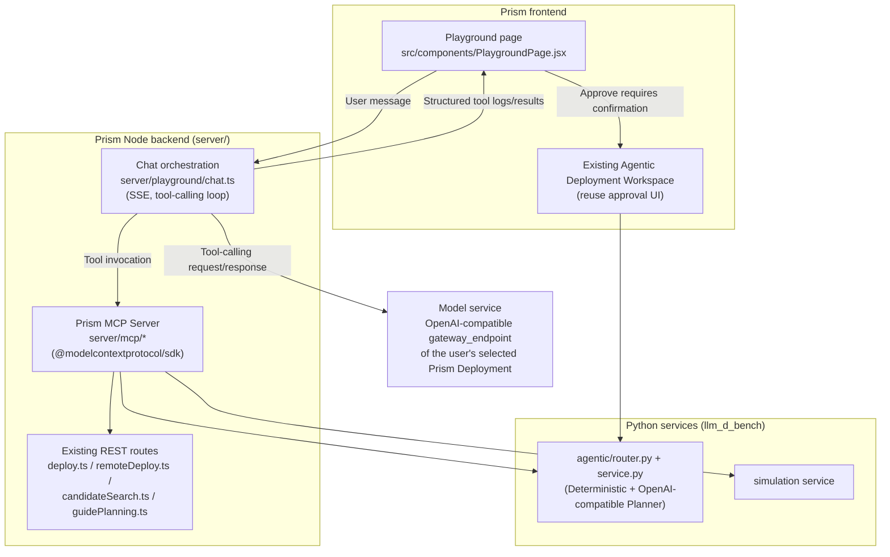
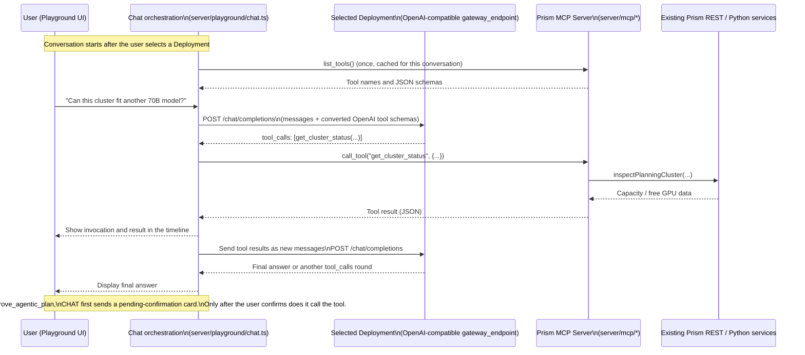

# Prism MCP Tools and Playground Design

> Draft. Wrap existing Prism cluster, model market, Agentic Deployment, and Simulation
> capabilities as MCP (Model Context Protocol) tools. Add a **Playground** page for
> "Talk with your Prism": natural-language conversation in which a model service uses
> tool calling to query Prism and perform controlled management operations.

## 1. Goals and non-goals

**Goals**

1. Expose existing, well-bounded backend services as standard MCP tools: cluster status,
   benchmark/candidate retrieval, Agentic deployment plans, and Simulation. Support both
   the built-in Playground and future external MCP clients such as Claude Desktop,
   Copilot, and other agent platforms.
2. Add "Talk with your Prism" to Playground. **The user selects an existing Prism Deployment
   as the conversation model service**, using their own deployed model instead of configuring
   another external LLM key. The model can query cluster/benchmark data and generate Agentic
   recommendations, but approval/deployment requires **explicit user confirmation**.
3. Reuse the Agentic Deployment guardrails in `agentic-deployment-architecture.zh-CN.md`:
   the LLM selects/scores only within the server-validated candidate space; it cannot generate
   arbitrary configurations or bypass approval to change cluster state.

**Non-goals**

- No general-purpose agent executing unrestricted Kubernetes/kubectl commands.
- No conversation model bypassing the two-stage `awaiting_approval` flow.
- No publicly writable MCP endpoint in Phase 1 (see §7).

## 2. Existing reusable capabilities

Prism already separates service logic from REST routes. MCP tools can wrap these capabilities
without reimplementing business logic.

| Domain | Existing implementation | Key paths |
| --- | --- | --- |
| Cluster/capacity facts | `server/planningDiscovery.ts` (`inspectPlanningCluster`) | Read-only |
| Deploy PoC (local/simple deployment) | `server/deploy.ts` | `/api/deploy-poc/{config,start,status,validate,teardown}` |
| Remote deployment | `server/remoteDeploy.ts` | `/api/remote-deploy/{defaults,fingerprint,test,start,status,logs,teardown}` |
| Candidate/benchmark retrieval | `server/candidateSearch.ts` | `/api/candidate-support`, `/api/candidate-search` |
| Guide catalog/planning | `server/guidePlanning.ts` | `/api/guide-planning/{catalog,prepare,plan}` |
| **Agentic Deployment (core)** | `llm_d_bench/agentic/router.py` | `POST /api/agentic-deployments` (create plan) `GET /api/agentic-deployments` (list) `GET /api/agentic-deployments/{id}` (details) `POST /api/agentic-deployments/{id}/select` `POST /api/agentic-deployments/{id}/refine` (Recalculate) `POST /api/agentic-deployments/{id}/approve` (the sole cluster-changing write) |
| Simulation | `/api/simulation/*` in `simulation-runner-design.md` | Read-only access and task submission |
| Prometheus/cluster monitoring | `llm_d_bench/monitoring/{cluster_stack,profiling,accelerator,deployment}` | Existing PromQL wrappers (`_query`/`_query_range`), Grafana/Prometheus links, cluster-stack status |

Agentic Deployment already resembles constrained tool calling: `DeterministicPlanner`
generates/filters candidates; `OpenAICompatiblePlanner` selects/scores only server-provided IDs;
`approve` is the only cluster-changing action and requires explicit invocation. Reuse this
security model for MCP tools rather than inventing a separate permission system.

## 3. Overall architecture

- **MCP Server adds no business logic.** It is a thin wrapper over existing REST/service
  functions: schema validation, invocation, and result shaping.
- **Chat orchestration** owns Prism's tool-calling loop; the browser does not connect directly
  to MCP. It sends user messages, system prompts, and tool schemas to the model, executes tool
  requests, and feeds results into subsequent rounds until a final answer. Server-side audit,
  permission filtering, and approval blocking do not depend on the frontend or model behaving well.
- **Approval reuses existing UI.** For cluster-changing tools such as `approve_plan`, Chat
  returns a pending invocation. The actual `approve` REST call is triggered by the existing
  `AgenticDeploymentWorkspace` button, preserving mandatory human confirmation.

### 3.1 Connecting Playground, Deployment, and Prism MCP tools

- **Deployment (the selected model)** interprets the message, chooses tools, and explains results.
  It does not connect directly to Prism data/clusters or speak MCP. It exposes an ordinary
  OpenAI-compatible chat-completions endpoint accepting `tools=[...]`.
- **Prism MCP Server** queries capacity/Prometheus, creates plans, and invokes approval. It speaks
  MCP (`list_tools`/`call_tool`) independently of the client: Playground or a future IDE agent.
- **Chat orchestration** translates protocols and enforces access. It speaks OpenAI
  `tools`/`tool_calls` to Deployment and MCP to the server; those endpoints never communicate
  directly with each other.

Changing the selected Deployment requires no MCP Server change. The same tool catalog works
with any Deployment supporting tool calling.

1. Deployment must support function calling/tool parameters; otherwise this flow cannot run.
   Playground must filter or warn in the selector (§6).
2. Convert MCP JSON schemas into OpenAI `tools` format inside Chat orchestration. Both use JSON
   Schema but have different envelopes; neither endpoint needs to know about the other.
3. Chat checks risk after receiving `tool_calls` and before `call_tool`: read-only calls proceed;
   write/approval calls wait for confirmation (§4.2/4.3). Neither model restraint nor MCP-only
   validation substitutes for this gate.

## 4. Draft MCP tool catalog

Classify tools by read/write semantics and risk. Phase 1 exposes read-only tools only.

### 4.1 Read-only (Phase 1)

| Tool | Description | Existing capability |
| --- | --- | --- |
| `get_cluster_status` | Current session capacity, free GPUs, and node status | `inspectPlanningCluster` |
| `search_benchmark_candidates` | Verified benchmark candidates by model/accelerator/workload | `/api/candidate-search`, `/api/candidate-support` |
| `get_guide_catalog` | Available provider/accelerator/model-server/variant guides | `/api/guide-planning/catalog` |
| `list_agentic_plans` | Current session plans and statuses | `GET /api/agentic-deployments` |
| `get_agentic_plan` | Plan candidates, score source, and evidence | `GET /api/agentic-deployments/{id}` |
| `get_simulation_result` | Completed Simulation result | `/api/simulation/tasks/{id}` |
| `list_ready_deployments` | Current-session ready deployments exposing OpenAI-compatible gateways, aggregating PoC/remote/deployed Agentic runs | `/api/deploy-poc/status`, `/api/remote-deploy/status`, `GET /api/agentic-deployments` filtered by `status=deployed` |
| `get_deployment_endpoint` | Resolve `gateway_endpoint` and served model ID for conversation | `gateway_endpoint` in `deploy-poc/validate` |

### 4.1b Prometheus/monitoring data (read-only, Phase 1)

Existing cluster-level integration in `llm_d_bench/monitoring/*` installs kube-prometheus-stack
through `cluster_stack`. Profiling, accelerator, and deployment services read metrics through
port-forward tunnels using `_query`/`_query_range` (`/api/v1/query`, `/api/v1/query_range`).
These production paths already cover idle GPUs, KV-cache hit rates, and EPP phase duration.
Wrap them as read-only tools.

| Tool | Description | Existing capability |
| --- | --- | --- |
| `get_flow_map_metrics` | GPU idle/utilization flow map for a cluster/time window | `llm_d_bench/monitoring/profiling/router.py` `GET /flow-map` |
| `get_kv_cache_metrics` | Deployment KV-cache settings and hit-rate snapshot | `_cache_queries` + `_query`/`_query_range` in `profiling/service.py` |
| `get_epp_phase_metrics` | EPP phase-duration distributions | `_epp_phase_queries` in `profiling/service.py` |
| `get_monitoring_links` | Clickable Grafana dashboard and Prometheus links for a cluster/accelerator | `accelerator/router.py` `GET /{accelerator}/links`, `cluster_stack/router.py` `GET /links` |
| `get_cluster_stack_status` | Prometheus/Grafana/Operator/CRD readiness | `cluster_stack/router.py` `GET /status` |
| `query_prometheus_metric` (optional, Phase 2 assessment) | Restricted instant/range query over known metric names, not arbitrary PromQL | Reuse `_query`/`_query_range`; server allowlists names and mandates namespace/deployment matchers; reject caller-composed PromQL |

Guardrails:

- Reuse backend port-forward tunnels and service accounts (`_prometheus_local_port`,
  `_discover_prometheus_service_account`, etc.). MCP tools do not hold in-cluster Prometheus
  addresses or credentials directly.
- For `query_prometheus_metric`, accept only metric names and label filters; construct allowlisted
  PromQL server-side to prevent unauthorized cross-namespace or expensive high-cardinality queries.
- Monitoring UI links do not grant Grafana operations such as dashboard edits or alert creation;
  those writes are outside this design.

### 4.2 Plan generation and editing (Phase 2)

| Tool | Description | Existing capability | Guardrail |
| --- | --- | --- | --- |
| `create_agentic_plan` | Model/cluster/cache plus optional SLO/workload/preference → `awaiting_approval` recommendation | `POST /api/agentic-deployments` | DeterministicPlanner and hard constraints still bound candidates; model cannot introduce new candidates |
| `select_plan_candidate` | Change selection among returned candidates | `POST .../select` | Validated candidate IDs only |
| `refine_agentic_plan` | Recalculate with new preference | `POST .../refine` | Replace old preference and refresh facts/filtering |
| `run_simulation` | Submit trace-replay/AIPerf Simulation | `/api/simulation/tasks` | Read-only cluster access; no side effects |

### 4.3 Cluster-changing tools (Phase 3, explicit confirmation)

| Tool | Description | Existing capability | Guardrail |
| --- | --- | --- | --- |
| `approve_agentic_plan` | Approve and deploy | `POST .../approve` | Chat suspends the call and returns it to the UI; the user clicks Approve before execution. Existing server capacity/deployability revalidation remains |
| `teardown_deployment` | Remove a deployment | `/api/deploy-poc/teardown`, `/api/remote-deploy/teardown` | UI confirmation and audit logging |

> A model request alone never executes a cluster-changing tool. A human confirmation action is
> required, matching the existing `awaiting_approval -> user approval` flow; the model merely
> initiates the request.

## 5. MCP Server implementation

- **Location:** `server/mcp/` (TypeScript). Reuse exported `server/*.ts` services such as
  `inspectPlanningCluster`. Forward Python Agentic calls through existing internal HTTP
  (Node → FastAPI), not direct database/file access.
- **Dependency:** official TypeScript `@modelcontextprotocol/sdk`.
- **Transport:** stdio for local development/MCP Inspector; Streamable HTTP for hosting, mounted
  as `mcpRouter` at `/api/mcp` in `server/server.js`, sharing existing `oauthRouter`/`limiter`
  authentication and rate limits.
- **Authentication:** reuse session/cluster context (`clusterSession.ts`). Each call carries
  current Prism session credentials; MCP does not own a separate permission model.
- **Schema:** reuse/export existing REST zod/Pydantic validation rather than rewriting it.

## 6. Playground frontend

- Add top-level Playground navigation with multiple use cases; "Talk with your Prism" comes first.
- **Select a Deployment before conversation.** Populate a dropdown/card selector through
  `list_ready_deployments`, showing current-session ready deployments with `gateway_endpoint`
  from PoC known-good/smoke, Remote Deploy, or deployed Agentic runs. Show namespace, model,
  accelerator, and source (PoC/Remote/Agentic).
- After selection, Chat resolves endpoint/model through `get_deployment_endpoint`. The user's
  own Prism-deployed model drives the conversation; no separate external LLM is configured.
- If no ready Deployment exists, direct the user to Model Market/Deploy. There is no hidden
  fallback to an external LLM. Warn about or filter models without tool support (§8).
- Layout: chat/Markdown on the left, a **tool timeline** on the right. Reuse existing components
  and Agentic evidence/score-source presentation. Show each tool name, arguments, and results
  transparently for explanation and audit.
- High-risk timeline entries such as approve/teardown become confirmation cards using existing
  approval UI. Backend execution waits for a user click.
- Chat owns conversation context so repeated tool calls can reuse the same `run_id` or
  `session_id`, rather than requiring the model to resubmit every parameter each time.

## 7. Phased delivery

| Phase | Scope | Result |
| --- | --- | --- |
| 1 | Read-only tools (§4.1) and chat UI | Ask about free GPUs or verified H100 + vLLM benchmarks |
| 2 | Plan generation/editing (§4.2), no real deployment | Generate recommendations and recalculate preferences in conversation |
| 3 | Approve/teardown (§4.3), mandatory UI confirmation and audit | Conversation initiates deployment; a human performs the final action |
| 4 | External MCP clients at `/api/mcp` | Requires separate API-key/OAuth-scope design outside this document |

## 8. Open questions

1. **Decided:** Chat uses the selected Deployment's `gateway_endpoint`, independently of Agentic
   External Planner configuration (`ai_provider_id`). Remaining questions: detect tool support
   through a server/variant allowlist or startup probe; how to warn in the selector; whether to
   allow plain question-answering without tools for unsupported models.
2. Where should tool audit logs live, and can existing audit/telemetry storage be reused?
3. Do Phase 3 confirmations require a second password/role gate beyond login plus confirmation?
4. What authenticates the Phase 4 external endpoint: API keys or GitHub OAuth tokens?

## 9. Phase 1 implementation status (delivered)

The following was implemented and locally verified: MCP handshake/list_tools/call_tool,
end-to-end Playground SSE, `npm run build`, and existing `server/*.test.ts` tests passed.

- `server/mcp/internal.ts`: internal fetch wrapper for tools calling Prism's REST APIs.
- `server/mcp/tools.ts`: read-only catalog containing `get_deploy_status`, `get_deploy_validation`,
  `list_ready_deployments`, `list_agentic_plans`, `get_agentic_plan`, `get_guide_catalog`,
  `get_cluster_stack_status`, and `get_flow_map_metrics`.
- `server/mcp/server.ts` + `server/mcp/router.ts`: stateless Streamable HTTP server at
  `POST /api/mcp`, also directly usable by external MCP clients as required in §3.
- `server/playground/chat.ts`: `GET /api/playground/deployments` for the selector and
  `POST /api/playground/chat` for SSE (`tool_call`, `tool_result`, `blocked`, `message`,
  `error`, `done`). Every non-`read` tool is blocked without execution, implementing §3.1's gate.
- `src/components/Playground/PlaygroundPage.jsx` + `playgroundBackend.js`: select Cluster first,
  then Deployment; chat occupies the main left area, selectors the right sidebar, with a tool
  timeline. The Deployment selector shows **all** known deployments and readiness, disabling
  unavailable entries without hiding their status. Integrated in `src/App.jsx`
  (`currentView === 'playground'`) and the new top-level Playground/"Chat with Lens" navigation.

**Known limitations:**

1. `list_ready_deployments` probes only PoC namespaces `prism-deploy-poc` and `prism-smoke-test`.
   Remote and Agentic outputs lack stable run-to-namespace/endpoint associations and need a
   separate small task.
2. Cluster selection currently enforces frontend ordering only: select/open/reuse its session
   before choosing a Deployment. `GET /api/deploy-poc/status` and `/api/deploy-poc/validate`
   do not yet filter by `clusterSessionId` (POST start/teardown do). The list is therefore **not
   truly filtered by cluster**; real filtering awaits multi-cluster PoC queries.
3. `search_benchmark_candidates` remains **unimplemented**. Its complex
   `workload`/`searchConfig`/`manualConfig`/`sourceIds` body needs a correct schema, not a rushed wrapper.
4. Phase 2/3 write/approval tools remain unimplemented. Chat's risk gate is ready: new tools not
   marked `read` automatically use the blocked branch without orchestration changes.

## 10. References

- `agentic-deployment-architecture.zh-CN.md`
- `AGENTIC_DEPLOY_IMPLEMENTATION_PLAN.md`
- `agentic-planning-evidence-and-rag.zh-CN.md`
- `simulation-runner-design.md`
- `cluster-monitoring-service-design.md`
- `llm_d_bench/agentic/router.py`
- `llm_d_bench/monitoring/profiling/service.py` (Prometheus `_query`/`_query_range` wrappers)
