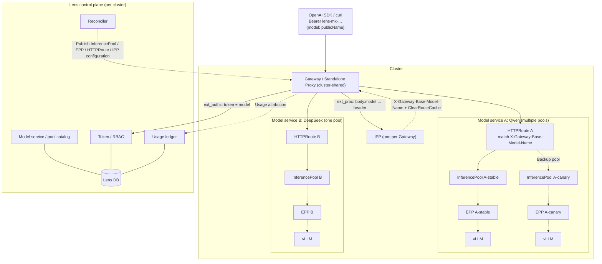
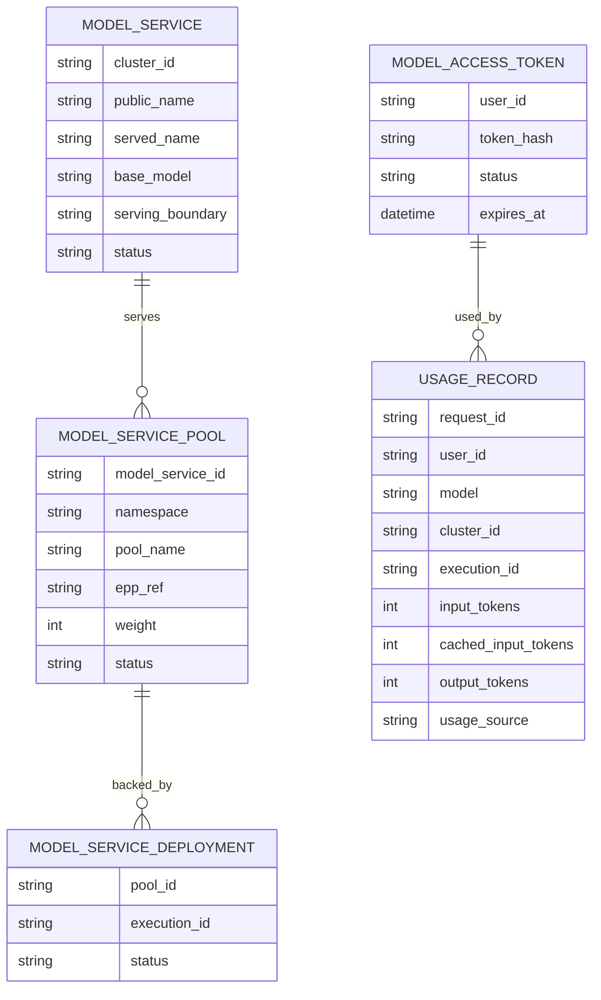

# Lens Model Service Design (Per Cluster, Native llm-d)

Each cluster exposes its own OpenAI-compatible endpoint. The community llm-d data plane (Gateway/Proxy + IPP + InferencePool + EPP) serves every model service in that cluster. Lens supplies only control-plane capabilities absent from the community stack.

## 1. Goals and scope

- Configure services per cluster; users call the cluster endpoint by model name.
- Multiple models and LoRA within one cluster.
- User tokens, model-service authorization, and cluster-specific visible models.
- Usage ledger by user/model/cluster and four token categories.

Out of scope: cross-cluster routing, custom Lens proxies/schedulers, quotas/billing, and rate limits. Community HTTPRoute owns weighted multi-pool splitting; Lens only renders configuration.

## 2. Design principles

- Reuse community capabilities; implement only missing capabilities in Lens.
- Lens does not carry inference bytes or select endpoints/replicas.
- Publish standard llm-d / GAIE / Gateway API resources only.
- Keep cluster boundaries: one model service routes to **one** pool/EPP. llm-d-router watches a single named InferencePool per EPP, and its gateway chart puts one pool in each HTTPRoute. Lens therefore does not weight across pools; with multiple members, use the highest-priority active member.

## 3. Capability ownership

| Capability | Owner |
| --- | --- |
| Gateway/Proxy, TLS, HA | Community + provider |
| Multi-model/LoRA payload routing | Community IPP |
| Pool endpoint set | Community InferencePool |
| Load/KV/prefix endpoint scheduling | Community EPP |
| Model-name rewriting | Community InferenceModelRewrite |
| Charts/CRDs | Community `llm-d-router-*`, `payload-processor` |
| Usage/metrics | Community Envoy/EPP/vLLM metrics |
| Model catalog/publication | Lens |
| Token issuance/validation | Lens |
| Model-service authorization/visibility | Lens |
| Usage ledger | Lens |
| Publication reconciliation/audit/lifecycle | Lens |
| UI/documentation | Lens |

## 4. Overall architecture



One shared Gateway per cluster; each deployment provides its own `InferencePool` + EPP without a proxy. Each model service gets one HTTPRoute referencing **one** InferencePool. Solid arrows show routing/data; dashed arrows show ext_proc/control interactions.

## 5. Cluster preparation and versions

Data-plane components have three layers:

- **Shared cluster (at cluster creation):** Gateway API / GAIE CRDs, provider, **Gateway**, IPP.
- **Deployment:** model server + EPP + InferencePool, 1:1, no Gateway/proxy.
- **Model service (at publication):** HTTPRoute and IPP model mapping, referencing the cluster Gateway and deployment pool.

Pin versions alongside llm-d/llm-d-benchmark in the cluster wizard Software versions step:

| Component | Version field | Source |
| --- | --- | --- |
| llm-d (local Lens use) | `llm_d_ref` | Source checkout |
| llm-d-benchmark (local use) | `llm_d_benchmark_ref` | Source checkout |
| Gateway provider | `gateway_provider` + `gateway_version` | Helm chart / CRD |
| GAIE / Gateway API CRDs | `gie_version` | Official manifests |
| llm-d Router (EPP / Proxy) | `router_version` | Helm chart / image |
| IPP | `ipp_version` | Helm chart / image |

- IPP/Router/provider are cluster components installed as charts/images, not local source caches.
- Select and validate pinned compatible version sets across IPP ↔ Router ↔ GIE ↔ provider ↔ Kubernetes.

### 5.1 Gateway and Deployment semantics

- **Start the shared Gateway at cluster creation:** install Gateway API/GAIE CRDs, provider, Gateway, and IPP (§5), one Gateway per cluster.
- **Deployments do not start their own Gateway/proxy:** use the shared Gateway.
- **Deployments retain their EPP + InferencePool:** create together, EPP:pool 1:1, chart proxy disabled. Pool selectors select pods; scaling changes only pod counts.
- **Model services generate HTTPRoute:** `parentRefs` targets the cluster Gateway; `backendRefs` targets one pool for the highest-priority active member, with IPP model mapping.

Deployment order: create pool/EPP and wait for readiness, then publish the model service HTTPRoute.

## 6. Domain model



- `public_name`: model name requested by users.
- `served_name`: model name accepted by the downstream engine.
- `base_model`: IPP model-mapping pool key for LoRA; equals served_name without LoRA.
- `serving_boundary`: `gateway` (Gateway API) or `standalone` (Proxy sidecar).
- `MODEL_SERVICE_POOL`: a service routes to one InferencePool+EPP at a time, choosing the highest-priority active member; no cross-pool weighting.
- `MODEL_SERVICE_DEPLOYMENT`: deployment backing a pool, for display and usage attribution.

## 7. Request flow

```mermaid
sequenceDiagram
    participant C as Client
    participant GW as Gateway / Standalone Proxy
    participant IPP as IPP
    participant AUTH as Lens ext_authz
    participant EPP as EPP
    participant V as vLLM
    C->>GW: POST /v1/chat/completions (Bearer lens-mk-…)
    GW->>IPP: ext_proc
    IPP-->>GW: X-Gateway-Model-Name / Base-Model-Name + ClearRouteCache
    GW->>AUTH: ext_authz (token + model headers)
    AUTH->>AUTH: token→user; model→service in this cluster; check access
    alt Invalid token / denied
        AUTH-->>GW: 401 / 404
    else Allowed
        AUTH-->>GW: Identity headers
        GW->>GW: HTTPRoute by Base-Model-Name → InferencePool
        GW->>EPP: ext_proc
        EPP-->>GW: x-gateway-destination-endpoint
        GW->>V: Forward; return SSE
        GW--)AUTH: Usage attribution
    end
```

## 8. Authorization

Standard Envoy **ext_authz** points to Lens; no custom ext_proc or subset.

- Input: Authorization and IPP-injected X-Gateway-Model-Name.
- Processing: validate token → resolve public_name within the cluster → check access.
- Output: identity headers (hashed x-lens-user-id); no destination.
- Rejection: 401/404, without distinguishing missing resources from forbidden ones.

Authorization is at **model-service level**; EPP owns endpoint selection.

## 9. Control-plane components

| Module | Responsibility |
| --- | --- |
| Catalog | Per-cluster service/pool CRUD; associate deployments with pools at publication; derive served_name/serving_boundary |
| Tokens | Issue/revoke/reset; plaintext shown once |
| Authz | Model-service authorization; identical visibility and invocation rules |
| Reconciler | Render/apply community resources, wait for readiness, audit |
| Usage | Collect community usage, attribute by execution, persist idempotently |
| Visibility API | Per-cluster `/v1/models` returns only public_name values visible to this token in that cluster |

## 10. Published resources

Each deployment provides its own InferencePool + EPP (§5.1). Model publication creates one HTTPRoute (`parentRefs` → cluster Gateway; `backendRefs` → highest-priority active pool) and IPP model mapping. llm-d has one EPP per pool; Lens does not weight across pools:

```yaml
# Provided by deployment (one set per deployment)
apiVersion: inference.networking.k8s.io/v1
kind: InferencePool
metadata: { name: qwen, namespace: inference }
spec:
  selector: { matchLabels: { llm-d.ai/model: qwen, llm-d.ai/pool: stable } }
  targetPorts: [{ number: 8000 }]
  endpointPickerRef: { name: qwen-epp, port: { number: 9002 }, failureMode: FailClose }
---
apiVersion: inference.networking.k8s.io/v1
kind: InferencePool
metadata: { name: qwen-new, namespace: inference }
spec:
  selector: { matchLabels: { llm-d.ai/model: qwen, llm-d.ai/pool: canary } }
  targetPorts: [{ number: 8000 }]
  endpointPickerRef: { name: qwen-new-epp, port: { number: 9002 }, failureMode: FailClose }
---
# Published by model service
apiVersion: gateway.networking.k8s.io/v1
kind: HTTPRoute
metadata: { name: qwen, namespace: inference }
spec:
  parentRefs: [{ name: llm-d-inference-gateway }]
  rules:
    - matches:
        - headers:
            - { type: Exact, name: X-Gateway-Base-Model-Name, value: "Qwen/Qwen3-32B" }
      backendRefs:
        - { group: inference.networking.k8s.io, kind: InferencePool, name: qwen }
```

```yaml
apiVersion: v1
kind: ConfigMap
metadata: { name: qwen-model-map, namespace: inference, labels: { inference.llm-d.ai/ipp-managed: "true" } }
data:
  baseModel: "Qwen/Qwen3-32B"
  adapters: |
    - food-review-1
---
apiVersion: llm-d.ai/v1alpha1
kind: PayloadProcessorConfig
metadata: { name: ipp, namespace: inference }
spec:
  plugins:
    - { type: body-field-to-header, parameters: { fieldName: model, headerName: X-Gateway-Model-Name } }
    - { type: base-model-to-header }
  profiles:
    - name: default
      plugins: { request: [{ pluginRef: body-field-to-header }, { pluginRef: base-model-to-header }] }
```

One Gateway serves multiple models. Each model has one HTTPRoute referencing **one** InferencePool + EPP.

Layering: Gateway owns cross-pool weights, but llm-d uses one EPP per pool and its official gateway chart places one pool per HTTPRoute, so Lens renders no multi-pool weights. Within a pool, EPP performs inference-aware `Filter→Score→Pick` scheduling for KV/queue/prefix. Lens renders pool/model mapping, not scheduling logic.

## 11. My services page

- Group services by cluster, displaying public_name, status, and invocation examples.
- Show each cluster's own base URL/examples; call that cluster's endpoint.
- User-level tokens work across clusters; visible models are filtered by user + cluster.

## 12. Health and lifecycle

Publication flow:

```
Select cluster + deployment (already supplies InferencePool + EPP)
 -> Derive serving contract (served_name)
 -> Render/apply HTTPRoute + IPP configuration
 -> Wait for Gateway / HTTPRoute / InferencePool readiness
 -> Probe the model
 -> Mark Ready
```

| Dimension | Evidence |
| --- | --- |
| Configuration ready | Gateway/HTTPRoute conditions, endpointPickerRef, selector |
| Transport reachable | Gateway listener, DNS, certificate, readiness |
| Pool available | EPP candidates and ready model server |
| Correct model | Served-name/adapter probe |

Disable/delete/update handle desired/observed revisions and draining. Deleting one model does not uninstall shared Gateway/IPP.

## 13. Usage

- Collection: reuse Envoy/engine/EPP usage and metrics.
- Attribution: record the final selected execution; use the known granularity when uncertain.
- Idempotency: deduplicate by request_id; without engine usage mark `usage_source=estimated`.

## 14. Error contract

| Condition | Response |
| --- | --- |
| Invalid/revoked token | 401 |
| Missing/forbidden model | 404 |
| No healthy destination | 503 |
| Body too large | 413 |

Do not replay generative requests unconditionally. Once SSE output starts, failure terminates that stream.

## 15. Implementation sequence

| Phase | Delivery |
| --- | --- |
| A | Per-cluster model-service schema, serving-contract derivation, per-cluster `/v1/models` |
| B | Reconcile InferencePool/HTTPRoute/IPP/EPP resources, ext_authz, provider preflight |
| C | Production provider TLS, HA, draining, and usage attribution |

## 16. Acceptance

| Case | Expected |
| --- | --- |
| Multiple models + LoRA in one cluster | Public name → IPP → base model → correct pool; body.model retains adapter |
| Multiple members for one model | One HTTPRoute references one pool: highest-priority active member; no cross-pool weighting |
| Long prompt | Correct body bounds; IPP supplies model header |
| Cluster visibility | Each cluster's `/v1/models` returns only models visible to the token there |
| Provider wiring | HTTPRoute → InferencePool → EPP |
| Metric association | Each pool uses its own EPP load |
| Publication lifecycle | Traceable desired/observed revisions; no false Ready; deletion retains shared Gateway/IPP |
| Usage | Execution attribution; correct SSE/cancel/failure sources; no duplicate accounting |
| HA | Consistent authorization/visibility across control-plane instances |