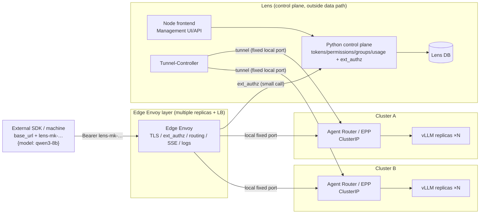
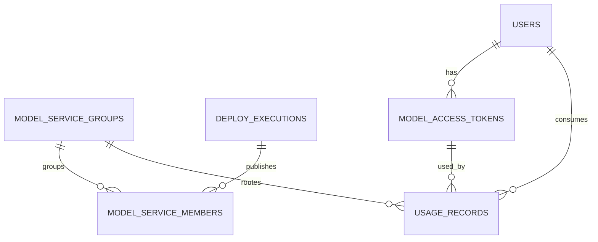

# Lens Model Service Design: A Unified Model-Name Endpoint, Cross-Cluster Routing, and User Tokens

> Status: **Design proposal**. This document defines the design without changing code.
> All new schemas require human approval before implementation through
> [`llm_d_bench/db/migrations/README.md`](../../llm_d_bench/db/migrations/README.md)
> (see §15 and §17).
>
> Core design: **one public base_url**, **model names** as the only routing input,
> aggregation of same-model backends **across clusters**, and **random selection**
> after permission filtering. Model-service access **requires a user token**;
> users can **manage their own tokens in the UI**.
>
> **The data plane is decoupled from Lens**: **Edge Envoy** carries traffic;
> Lens/Python provides only the **control plane and ext_authz authorization**,
> outside the request data path. High traffic therefore does not overload Lens
> and avoids its single-instance limitation.
>
> **Excluded from this version**: quotas/balances, pricing/billing, and rate limits
> (§1.3), which need separate designs.
>
> Related documents: [`AGENTS.md`](../../AGENTS.md),
> [Workflow](../../.agents/skills/workflow/SKILL.md),
> [Backend](../../.agents/skills/backend/SKILL.md),
> [Database](../../.agents/skills/database/SKILL.md),
> [UI](../../.agents/skills/ui/SKILL.md),
> [Auth](../../.agents/skills/auth/SKILL.md),
> [Deployment](../../.agents/skills/deployment/SKILL.md),
> [Reuse map](../../docs/reuse-map.md), and
> [Auth/RBAC design](auth-rbac-design.md).

---

## 0. Design Overview

### 0.1 In One Sentence

Expose **one base_url**, served by **Edge Envoy** (an independently scalable data
plane). Users supply only a **model name**. Edge Envoy calls the Python control
plane through **ext_authz** for **token validation → model-name resolution →
permission filtering → random selection**, then routes to the selected cluster's
**Agent Router/EPP**, which selects a vLLM replica. Lens handles control and
authorization only; **traffic bytes do not pass through Lens**.

### 0.2 Core Capabilities

| Capability | Problem addressed | Key design |
| --- | --- | --- |
| **Unified model-name endpoint** | Users need not know clusters or deployments | Model name is the routing key; one Edge Envoy base URL |
| **Multiple backends across clusters** | One model can have services in multiple clusters | `model_service_groups` (1) → `model_service_members` (N) |
| **Permission filtering, then random selection** | Select only backends the user may access | Per-execution `authorize` and selection inside ext_authz |
| **Data plane independent of Lens** | High traffic and multiple replicas | Edge Envoy carries bytes; Python handles one authorization call |
| **User tokens** | Stable credentials for machines outside clusters | `model_access_tokens`, SHA-256 only, reset/revoke support |
| **Token management UI** | Self-service create/reset/revoke/view | §5.5 and §12.2; plaintext returned once |
| **Usage metering** | Token consumption by user/model | Edge Envoy access logs → Python `usage_records` |

### 0.3 Architecture Highlights (Approach 2)

- **Edge Envoy**: the sole public entry point, with multiple replicas and an LB;
  handles TLS, ext_authz, model routing, SSE, and access logs. **Bypasses Lens**.
- **Python control plane**: the authority for tokens, permissions, model groups,
  and usage; exposes **ext_authz** and scales independently (no process-local
  state on the authorization path).
- **Per-cluster Agent Router/EPP**: routing and load balancing within a cluster;
  llm-d reuses its EPP, while plain vLLM uses Agent Router.
- **Tunnel-Controller**: maintains tunnels from Edge Envoy to each cluster's
  Agent Router at fixed local ports; **outside the request data path**.

### 0.4 Scope

- **Included**: token authentication and UI management, model-name routing,
  cross-cluster aggregation, permission filtering, random selection, the Edge
  Envoy data plane, per-cluster Agent Router, Tunnel-Controller, and usage counts.
- **Deferred for separate designs**: quotas/balances, pricing/billing, and
  concurrency/RPM/TPM limits.

---

## 1. Requirements and Goals

### 1.1 Formal Requirements

```
Entry point   : One public base_url, regardless of the number of managed clusters
Backends      : Multiple services for one model, within or across clusters
User input    : Only the model name
Routing       : 1) Check the user's access to the model service
                2) Randomly select from the authorized service set
Access control: A user token is required
Management    : Users manage tokens in the UI (create/reset/revoke/view)
Constraint    : High traffic must not overload Lens (outside the data path)
```

### 1.2 Goals

1. **One public endpoint**: a single base URL for all model services in all clusters.
2. **Model name as routing key**: users name the model; the system selects a backend.
3. **Backend aggregation**: use multiple deployments of the same model within/across clusters.
4. **Permissions first**: select only authorized services; do not reveal unauthorized resources.
5. **Configurable selection**: random by default, with weighted and per-user affinity support.
6. **Token access**: accept only model tokens, separate from login sessions.
7. **Self-service token UI**: create/reset/revoke and inspect recent use.
8. **Scalable data plane**: scale Edge Envoy independently; keep Lens/Python outside the data path.
9. **Usage metering**: count tokens by user, model, and cluster.

### 1.3 Non-Goals for This Version

- **No quotas/balances**: no account/plan balances, overdrafts, or reservation/settlement.
- **No pricing/billing**: no unit prices, charges, bills, payments, or invoices.
- **No rate limits**: no concurrency/RPM/TPM limits or 429 responses.
- No shared entry point across Lens instances; one instance and one database.
- No multi-cluster Gateway API federation (MCS/GVK); use Tunnel-Controller tunnels.
- Do not replace the vLLM scheduler or implement KV cache; only pass `user_id`.

---

## 2. Overall Architecture

### 2.1 Components

| Component | Responsibility | In the data path? |
| --- | --- | --- |
| **Edge Envoy** | Public endpoint; TLS, ext_authz, model routing, SSE, access logs | **Yes** (multiple replicas possible) |
| **Python control plane** | Tokens/permissions/groups/usage; ext_authz; management APIs | No (one authorization call per request) |
| **Node frontend** | Management UI/API reverse proxy and pages; **no model traffic** | No (UI/management only) |
| **Per-cluster Agent Router/EPP** | Cluster routing, replica LB, KV awareness (llm-d) | Yes (within cluster) |
| **Tunnel-Controller** | Edge Envoy → per-cluster Agent Router tunnels | No (establishes tunnels only) |
| **deploy domain** | Reachable execution endpoints | No |

> Change from the previous version: **Edge Envoy** replaces Node in the data plane; Node serves management and pages only.

### 2.2 Architecture Diagram



### 2.3 Decoupling the Data Plane from Lens

- **Only Edge Envoy carries bytes**: `SDK → Edge Envoy → Agent Router/EPP → vLLM`.
  Node and Python handle a small `ext_authz` call and usage recording, outside the data path.
- **Horizontal scaling**: stateless Edge Envoy supports multiple replicas + LB;
  Lens does not need to scale with inference traffic.
- **Cross-cluster access**: no Gateway API federation. **Tunnel-Controller** uses
  existing `ensure_port_forward(cluster_id)` to maintain one tunnel per cluster
  at a **fixed local port**. Edge Envoy points static upstreams
  (`127.0.0.1:<fixed>`) at each cluster's Agent Router.

> Lens is currently a single-instance design (embedded PostgreSQL, the process-local
> tunnel registry `utils/kubernetes.py:_port_forwards`, the in-memory task table in
> `server/deploy.ts`, etc.). Replicating it directly would break state. Edge Envoy
> lets Lens remain a single-instance control plane whose load is independent of
> model traffic.

### 2.4 Trust Boundaries

1. External machines hold only **model tokens**, which cannot access Lens management APIs.
2. Python decides token validity, permissions, and model groups; Edge Envoy follows ext_authz for authorization/routing.
3. Edge Envoy → Python ext_authz uses an internal secret (HMAC headers or mTLS).
4. **Edge Envoy strips forged internal headers**; ext_authz headers use the `x-lens-` prefix.
5. Model tokens and login-session tokens use separate namespaces and tables and are not interchangeable.
6. Backends (vLLM/EPP) and Agent Router expose only ClusterIP; Edge Envoy is the sole public endpoint.

---

## 3. Core Concepts

| Concept | Meaning | Entity |
| --- | --- | --- |
| **Model Group (public model)** | User-supplied model name; public aggregation unit | `model_service_groups` |
| **Model Member (model service)** | A published execution (possibly multiple replicas/EPP) | `model_service_members` |
| **Agent Router/EPP** | Cluster routing entry point | Deployment located by cluster |
| **Edge Envoy** | Data plane for the sole global entry point | Deployment (multiple replicas possible) |
| **Tunnel-Controller** | Maintains Edge→cluster Agent Router tunnels | Small Lens-managed service |
| **Access Token** | Machine credential for model-service access | `model_access_tokens` |

One `group` has N `member` records; each `member` points to an `execution` and a
`cluster`. The request `model` field matches `group.name`.

---

## 4. Data Model

> All tables are **new** and require human approval (§17) before Alembic implementation.
> Use `models/<name>.py` + `dao/<name>.py`, registered in
> [`llm_d_bench/db/models/__init__.py`](../../llm_d_bench/db/models/__init__.py).

### 4.1 ER Diagram



### 4.2 `model_service_groups` (Public Models and Routing Groups)

| Column | Type | Nullable | Description |
| --- | --- | --- | --- |
| `id` | `String(36)` | No | PK, uuid4 |
| `name` | `String(100)` | No | **User-supplied model name**, unique |
| `model_ref` | `String(200)` | No | Normalized identifier (display/grouping) |
| `display_name` | `String(200)` | No | Display name |
| `description` | `Text` | No | default `""` |
| `selection_policy` | `String(16)` | No | `random` \| `weighted` \| `affinity`, default `random` |
| `status` | `String(16)` | No | `active` \| `disabled` |
| `created_by_user_id` | `String(36)` | Yes | FK `users.id` SET NULL |
| `created_at` / `updated_at` | `UTCDateTime` | No | |
| `version_id` | `Integer` | No | Optimistic lock |

Index: `uq_model_service_groups_name` (unique). `/v1/models` deduplicates at this level.

### 4.3 `model_service_members` (Model-Service Members)

| Column | Type | Nullable | Description |
| --- | --- | --- | --- |
| `id` | `String(36)` | No | PK |
| `group_id` | `String(36)` | No | FK `model_service_groups.id` CASCADE |
| `execution_id` | `String(36)` | No | deploy execution_id |
| `cluster_id` | `String(32)` | No | Hosting cluster; also determines the Edge Envoy upstream |
| `target_namespace` | `String(253)` | No | Backend namespace |
| `target_service` | `String(253)` | No | Backend Service name (EPP or vLLM) |
| `target_port` | `Integer` | No | Backend port (EPP 80 / vLLM 8000) |
| `endpoint_kind` | `String(32)` | No | `vllm` \| `llm-d-epp` |
| `weight` | `Integer` | No | Selection weight, default 1 |
| `priority` | `Integer` | No | Higher values have higher priority, default 0 |
| `status` | `String(16)` | No | `active` \| `disabled` \| `unhealthy` |
| `health_json` | `JSONVariant` | Yes | Latest health-probe result |
| `last_health_at` | `UTCDateTime` | Yes | |
| `owner_user_id` / `owner_group_id` | `String(36)` | Yes | Ownership |
| `published_by_user_id` | `String(36)` | Yes | FK SET NULL |
| `created_at` / `updated_at` | `UTCDateTime` | No | |
| `version_id` | `Integer` | No | |

Constraint: `UNIQUE(group_id, execution_id)`; indexes
`ix_members_group_status(group_id, status)` and `ix_members_cluster(cluster_id)`.

### 4.4 `model_access_tokens` (User Model-Service Tokens)

> **Store hashes only**. Return plaintext once, on creation/reset.

| Column | Type | Nullable | Description |
| --- | --- | --- | --- |
| `id` | `String(36)` | No | PK |
| `user_id` | `String(36)` | No | FK `users.id` CASCADE |
| `name` | `String(100)` | No | Display name, default `default` |
| `token_hash` | `String(64)` | No | `SHA-256(plaintext)`, unique |
| `token_hint` | `String(16)` | No | First 8 plaintext characters for UI identification |
| `status` | `String(16)` | No | `active` \| `revoked` |
| `expires_at` | `UTCDateTime` | Yes | Optional expiry |
| `last_used_at` | `UTCDateTime` | Yes | Throttled updates |
| `last_used_ip` | `String(64)` | Yes | Audit |
| `created_at` / `revoked_at` | `UTCDateTime` | No/Yes | |
| `version_id` | `Integer` | No | Optimistic lock |

Indexes: `uq_model_access_tokens_hash` (unique),
`ix_model_access_tokens_user(user_id, status)`.

### 4.5 `usage_records` (Usage Ledger)

**One row per inference**: record user, model, cluster, and four token categories
(**counts only, no charges**).

| Column | Type | Nullable | Description |
| --- | --- | --- | --- |
| `id` | `String(36)` | No | PK |
| `request_id` | `String(64)` | No | unique, idempotent |
| `user_id` | `String(36)` | No | FK `users.id` SET NULL, index |
| `token_id` | `String(36)` | Yes | Used `model_access_tokens.id` |
| `group_id` | `String(36)` | Yes | Selected model group |
| `group_name` | `String(100)` | Yes | Denormalized for reporting |
| `cluster_id` | `String(32)` | Yes | Selected cluster |
| `execution_id` | `String(36)` | Yes | Selected deployment |
| `model_ref` | `String(200)` | No | Model identifier |
| `provider` | `String(32)` | No | `vllm`, etc. |
| `input_tokens` | `BigInteger` | No | Uncached input |
| `cached_input_tokens` | `BigInteger` | No | Cached input |
| `cache_write_tokens` | `BigInteger` | No | Cache write |
| `output_tokens` | `BigInteger` | No | Output |
| `usage_source` | `String(16)` | No | `engine` \| `estimated` |
| `status` | `String(16)` | No | `success` \| `error` \| `cancelled` |
| `error_code` | `String(64)` | Yes | |
| `streaming` | `Boolean` | No | |
| `ttft_ms` / `duration_ms` | `Integer` | Yes | |
| `client_ip` / `user_agent` | `String(64)` / `String(512)` | Yes | |
| `created_at` | `UTCDateTime` | No | index |

Indexes: `uq_usage_records_request(request_id)`, `(user_id, created_at)`,
`(group_id, created_at)`, `(cluster_id, created_at)`, and `(execution_id, created_at)`.

---

## 5. User Tokens and Token Management

> The model-service endpoint **requires** a token: a machine identity entirely separate from browser login sessions.

### 5.1 Generation and Format

- Plaintext format: `lens-mk-<43 base64url characters>` (32 random bytes), with prefix `lens-mk-`.
- Store only `token_hash = SHA-256(plaintext)` in the DB, **reusing**
  [`auth/security.py:45 hash_session_token`](../../llm_d_bench/auth/security.py).
  Return plaintext only once in the create/reset response.
- Store the first 8 plaintext characters in `token_hint`; display `lens-mk-abcd…`.

### 5.2 Lifecycle and Validation

| Operation | Semantics | Permission |
| --- | --- | --- |
| List | Name, hint, status, `last_used_at/ip`; **never plaintext** | `model-service:token:manage` (self) |
| Create | Generate a named token; return plaintext once | Same |
| **Reset/regenerate** | Revoke the current active token; issue a new one and return plaintext once | Same |
| Revoke | Set `revoked`; invalidate immediately | Same |
| Copy | One-time frontend copy (`useClipboard`); unavailable after closing | Same |

- Reset revokes **all** active tokens by default (one primary token per user);
  individual-token resets are also supported.
- Python validates each Edge Envoy request through **ext_authz**. An optional
  5–15s cache bounds revocation propagation delay to the cache TTL.

### 5.3 Difference from Login Sessions

| | Login session | Model-service token |
| --- | --- | --- |
| Purpose | Lens management UI/API | Model inference only |
| Table | `sessions` | `model_access_tokens` |
| Transport | httpOnly Cookie / Bearer | `Authorization: Bearer lens-mk-…` |
| Permissions | Full RBAC | `model-service:inference:use` + resource scope only |
| Reset | Logout/password change | User self-service reset |

### 5.4 Security Constraints

- Never log tokens; errors must not echo anything beyond the token hint.
- Optional `expires_at`; no expiry by default, but revocable.
- Record `last_used_at`/`last_used_ip` so users can spot unusual activity.
- On exposure, users reset with one click; admins can revoke with an `audit_log` entry.
- Edge Envoy and access logs show only `token_hint`, never plaintext.

### 5.5 Self-Service Token UI

- Entry: separate `?view=model-tokens`, or an Access tokens section in `?view=model-service`.
- Columns: name, `token_hint`, status, last-use time/IP, creation time, actions.
- Actions: **Create** (`Modal` for name → plaintext once + copy + warning),
  **Reset** (`Modal` + `useSubmission` confirmation), **Revoke** (`ConfirmDeleteModal`).
- Show plaintext once, with copy and an “I have saved it” checkbox; unavailable after closing.
- Use `AsyncState` for loading/error/empty and `usePolling` to refresh last_used silently.
- Empty state: “No access tokens yet. Create one to call model services with the OpenAI SDK.”

---

## 6. Routing and Authorization (ext_authz)

### 6.1 Responsibilities

- **Edge Envoy**: no DB queries or business decisions. Pass `authorization`, the
  model name, and request metadata to ext_authz, then forward using returned routing headers.
- **Python control plane (ext_authz endpoint)**: validate token, resolve model name,
  filter permissions, and select; return “allow + target cluster/member” or “deny”.

### 6.2 ext_authz Protocol

Configure Envoy `envoy.filters.http.ext_authz` as an **HTTP service** (or gRPC):

```
Edge Envoy → POST /api/v1/internal/model-gateway/authorize   (protected by internal secret)
  headers: authorization: Bearer lens-mk-…
           x-request-id, x-forwarded-for
           x-lens-model: <model extracted from body>   # see 6.3
  body (optional): first 8KB of request body (with_request_body)

Python → 200 OK
  x-lens-user-id: <irreversible hash of user_id>
  x-lens-cluster: <selected cluster id>          # for Envoy header-match routing
  x-lens-member: <selected execution_id>
  x-lens-model: <normalized model name>
Or Python → 401/403/404/503 (problem+json), returned unchanged by Envoy
```

- Envoy routing: a catch-all route triggers ext_authz, then the **`x-lens-cluster`**
  header selects the corresponding upstream (one static upstream per cluster).
- Selection (`random`/`weighted`/`affinity`) runs in **Python** (§6.4).

### 6.3 Extracting the Model Name from the Body

ext_authz sees only headers by default. Two options (D11):

- **A (recommended)**: enable `with_request_body { max_request_bytes: 8192 }` in
  `ext_authz`; Python reads `model` directly from the JSON body (near the start; 8KB suffices).
- **B**: a preceding `ext_proc` (gRPC; llm-d EPP uses a similar mechanism on 9002)
  extracts `model` into `x-lens-model` before ext_authz.

### 6.4 Resolution Flow (Python)

```
resolve(model_name, token, user):
  token valid?                                  # no → 401 token_invalid/revoked
  group = groups[name]                          # no → 404 model_not_found
  members = active(group) ∩ not unhealthy
  authorized = [m for m in members if
                authorize(user, "model-service:inference:use", ResourceRef(execution(m)))]
  if not authorized:                            # → 404 (treated as missing to prevent disclosure)
      raise model_not_found
  return select(authorized, group.selection_policy)
```

### 6.5 Selection Policies

| Policy | Semantics | Use case |
| --- | --- | --- |
| `random` (default) | Uniform random selection within the authorized subset | User-requested default behavior |
| `weighted` | Random selection weighted by `member.weight` | Backends with different capacities/replica counts |
| `affinity` | Consistent hashing of `(user_id, group_id)` | **Preserve prefix/KV cache**, stable per user |

> Per-request random selection repeatedly invalidates a user's prefix cache.
> Prefer `affinity` when prefix caching matters (random distribution, stable per user).
> See §17 D1.

### 6.6 Failures and Retries

- **Within a cluster**: Agent Router/EPP handles replica retries and unhealthy exclusion.
- **Across clusters**: v1 selects one cluster per request; Envoy `retry_policy` retries
  the **same target**. Switching backends requires another ext_authz call and is deferred (D7).
- All authorized backends unhealthy → `503`; no candidates → `404`.

---

## 7. Request Sequence

```mermaid
sequenceDiagram
    participant C as Client(external machine)
    participant E as Edge Envoy
    participant P as Python(ext_authz)
    participant L as Agent Router/EPP
    participant V as vLLM

    C->>E: POST /v1/chat/completions<br/>Bearer lens-mk-… {model:"qwen3-8b"}
    E->>P: ext_authz (token + model + body)
    P->>P: token→user; group; permission filtering; select()
    alt invalid token / no candidates
        P-->>E: 401 / 404
        E-->>C: problem+json
    else allowed
        P-->>E: 200 + x-lens-user-id/cluster/member
        E->>E: match upstream by x-lens-cluster (fixed local-port tunnel)
        E->>L: forward (inject x-lens-user-id)
        L->>L: replica LB / EPP KV routing
        L->>V: inference
        V-->>L: SSE … usage
        L-->>E: stream unchanged
        E-->>C: stream unchanged
        E->>P: access log/usage event → record-usage
    end
```

---

## 8. Permission Model

- **Authorize by execution/resource**, reusing
  [`auth/policy.py:89 authorize`](../../llm_d_bench/auth/policy.py) + `scope.py`
  for `model-service:inference:use`.
- Visibility: creator ∪ owner group ∪ cluster scope ∪ explicit resource shares.
- A member's `cluster_id` reuses cluster scope: access to cluster A allows only A's members.
- Visibility and call authorization **must share one rule/function** (`/v1/models` and ext_authz).
- Return `404 model_not_found` for both unauthorized and missing resources to avoid existence leaks (§17 D2).
- Optional (D3): `model_service_group_grants` authorizes an entire model name.

---

## 9. Usage Metering

- **Source**: Edge Envoy JSON access logs with `x-lens-user-id`, `x-lens-member`,
  `x-lens-cluster`, `x-lens-model`, `x-request-id`, four token categories (dynamic
  metadata from Envoy AI filters), and latency.
- **Recording**: batch logs into `usage_records` through an internal endpoint/collector
  (idempotent `request_id`). Alternative: ext_proc calls Python during responses (D12).
- **Fallback**: estimate locally and set `usage_source=estimated` if the engine returns no usage.
- **Dimensions**: user, user_group, model name, cluster, execution, provider, token category.
- Metrics: token/request counts, success rate, latency percentiles (**no charges**).

---

## 10. Edge Envoy, Agent Router, and Tunnel-Controller

### 10.1 Edge Envoy (Data Plane)

- Sole public entry point and TLS termination; stateless, independently scalable, multiple replicas + LB.
- Filter chain: `ext_authz` (→ Python) → router (upstream by `x-lens-cluster`) → access logs.
- Static upstream: one `127.0.0.1:<fixed_port>` per cluster, provided by Tunnel-Controller.
- Strip forged `x-lens-*` client headers; trust only ext_authz-injected values.

### 10.2 Agent Router/EPP (Per Cluster)

- llm-d clusters: **reuse** Envoy/EPP (e.g. `<release>-epp.<ns>.svc:80`) for KV-aware routing and replica LB.
- Plain vLLM clusters: Agent Router manages `Backend`→`vllm` Service, using kube-proxy replica balancing.
- Expose only ClusterIP, never publicly.

### 10.3 Tunnel-Controller

- Maintain one tunnel per cluster to the Agent Router Gateway data-plane Service,
  with a **fixed local port**, reusing
  `ensure_port_forward(..., local_port=<fixed>, cluster_id=…)` for static Edge references.
- Rebuild disconnected tunnels without changing ports; **outside the request data path**,
  so a single instance is sufficient.
- Cluster registry: `cluster_id → {router_namespace, router_service, router_port, fixed_local_port}`.

### 10.4 Security

- Edge Envoy → Python ext_authz uses an internal secret (HMAC/mTLS).
- Agent Router accepts traffic only through Edge Envoy tunnels (ClusterIP + network policy).
- Backends expose only ClusterIP; Edge Envoy is the sole public endpoint.

---

## 11. Public API and Examples

### 11.1 Connection Details Shown to Users

```
Base URL : https://models.lens.example.com/v1       # Edge Envoy
API Key  : lens-mk-…                               # The user's token
Model    : qwen3-8b                                # Automatic cross-cluster selection
```

### 11.2 Endpoints

| Method | Path | Authentication | Description |
| --- | --- | --- | --- |
| POST | `/v1/chat/completions` | Model token | Supports SSE |
| POST | `/v1/completions` | Same | |
| POST | `/v1/embeddings` | Same | |
| GET | `/v1/models` | Same | **Deduplicated model names** accessible to the user |

> `/v1/models` may forward to a Python read-only endpoint or return an Edge Envoy
> static list cached by `x-lens-user-id`. See D13 for implementation details.

### 11.3 Examples

```bash
curl https://models.lens.example.com/v1/models \
  -H "Authorization: Bearer lens-mk-…"

curl https://models.lens.example.com/v1/chat/completions \
  -H "Authorization: Bearer lens-mk-…" \
  -H "Content-Type: application/json" \
  -d '{"model":"qwen3-8b","messages":[{"role":"user","content":"Hello"}],"stream":true}'
```

```python
from openai import OpenAI

client = OpenAI(base_url="https://models.lens.example.com/v1", api_key="lens-mk-…")
client.chat.completions.create(model="qwen3-8b", messages=[...])
```

### 11.4 Error Contract

Reuse RFC 7807 `application/problem+json`
([`utils/problems.py:12-26`](../../llm_d_bench/utils/problems.py)), with codes
`token_invalid`, `token_revoked`, `model_not_found`, and `no_healthy_backend`.

---

## 12. UI Design

### 12.1 User Model Services Page (`?view=model-service`)

- Show available model names, status, and OpenAI SDK/curl examples.
- Link to token management (§12.2).
- Reuse `ModulePage`/`ModuleHeader`/`AsyncState`.

### 12.2 User Access Tokens Page (`?view=model-tokens`)

- List name, hint, status, last_used, and creation time.
- Create/reset/revoke (§5.5); show plaintext once with copy and warning.
- Reuse `Modal`, `useSubmission`, `useClipboard`, `ConfirmDeleteModal`, `Badge`, and `PaginationControls`.

### 12.3 User Usage Page (`?view=usage`)

- Stacked bars for four token categories with stable colors, request-count time
  series, model rankings, and a detail table.
- Reuse `ChartContainer`/`ChartTooltip`/`ChartLegend`/`CHART_SERIES`.

### 12.4 Administration Pages

| Page | Content | Permission |
| --- | --- | --- |
| Model services | Publish executions to groups (select/create group, weight, priority, enable/disable) | `model-service:group:manage` |
| Usage reports | Filter by user/group/model/cluster | `usage:report:read` |

---

## 13. APIs and Permission Codes

> Python serves management/user APIs through the Node frontend proxy; register
> routes in [`auth/routes.py`](../../llm_d_bench/auth/routes.py). Edge Envoy serves
> data-plane `/v1/*`; these are not native Node routes.

### 13.1 User APIs (Python)

| Method | Path | Permission |
| --- | --- | --- |
| GET/POST | `/api/v1/model-service/tokens` | `model-service:token:manage` (self) |
| POST | `/api/v1/model-service/tokens/regenerate` | Same |
| DELETE | `/api/v1/model-service/tokens/{id}` | Same |
| GET | `/api/v1/model-service/models` | `model-service:inference:use` |
| GET | `/api/v1/model-service/usage/timeseries` | `model-service:usage:read` (self) |
| GET | `/api/v1/model-service/usage/records` | Same |

### 13.2 Admin APIs (Python)

| Method | Path | Permission |
| --- | --- | --- |
| GET/POST/PATCH/DELETE | `/api/v1/model-service/admin/groups[/{id}]` | `model-service:group:manage` |
| GET/POST/PATCH/DELETE | `/api/v1/model-service/admin/members[/{id}]` | `model-service:group:manage` |
| GET | `/api/v1/model-service/admin/clusters` | `model-service:group:manage` |
| GET | `/api/v1/model-service/admin/usage` | `usage:report:read` |

### 13.3 Internal APIs (Edge Envoy ↔ Python, Internal Secret)

| Method | Path | Description |
| --- | --- | --- |
| POST | `/api/v1/internal/model-gateway/authorize` | **ext_authz**: Token + model name → permissions → selection |
| POST | `/api/v1/internal/model-gateway/record-usage` | Batch-record four token categories (idempotent) |
| GET | `/api/v1/internal/model-gateway/models` | Model names accessible to the user (for `/v1/models`) |

### 13.4 Permission Codes and View Mapping

Add permission codes in `auth/permissions.py`:

`model-service:token:manage`, `model-service:inference:use`,
`model-service:usage:read`, `model-service:group:manage`, and `usage:report:read`.

Add frontend view mappings in `src/features/auth/permissions.js`:

| `?view=` | Minimum visibility permission |
| --- | --- |
| `model-service` | `model-service:inference:use` |
| `model-tokens` | `model-service:token:manage` |
| `usage` | `model-service:usage:read` |
| `admin/model-service` | `model-service:group:manage` |
| `admin/usage` | `usage:report:read` |

Keep `LeftNavigation.jsx`, `src/App.jsx`, `auth/routes.py`, and `server/auth.ts` synchronized.

---

## 14. Environment Variables

| Variable | default | Description |
| --- | --- | --- |
| `LENS_MODEL_GATEWAY_ENABLED` | `false` | Whether enabled |
| `LENS_MODEL_GATEWAY_PUBLIC_URL` | Empty | Base URL users copy; if empty, derive from request host + saved Edge port |
| `LENS_EDGE_ENVOY_REPLICAS` | `1` | Edge Envoy replica count |
| `LENS_MODEL_GATEWAY_AUTHZ_URL` | `http://127.0.0.1:8081/api/v1/internal/model-gateway/authorize` | ext_authz target |
| `LENS_MODEL_GATEWAY_AUTHZ_SECRET` | Reuse `LENS_INTERNAL_AUTH_SECRET` | Edge→Python internal secret |
| `LENS_MODEL_GATEWAY_ROUTING_POLICY` | `random` | Default selection policy (overridable by group) |
| `LENS_MODEL_AGENT_TUNNEL_PORT_BASE` | `19000` | Starting fixed local port for cluster tunnels |
| `LENS_MODEL_GATEWAY_INFER_START_TIMEOUT_SECONDS` | `600` | Disconnect timeout before inference starts |

---

## 15. Migration, Tests, and Phases

### 15.1 Migration

1. Obtain human schema approval first (§17).
2. Add `db/models/*.py` and register in `db/models/__init__.py`.
3. **Review every line** after `alembic revision --autogenerate`.
4. Tests use in-memory SQLite `create_all`, not migrations.

### 15.2 Tests

- Pure functions: model-name resolution, selection (random/weighted/affinity), usage normalization.
- Control plane: token validation, permissions, 404, record-usage idempotency, ext_authz headers.
- Edge Envoy: deny/allow, header routing, SSE passthrough, forged-header stripping (configuration/integration tests).
- Tunnel-Controller: fixed ports and reconnection.
- Frontend: client parsing, token-list rendering, chart-data transformation.
- Commands: `make test-js`, `make test-python`, `npm run type-check`, `npm run lint`.

### 15.3 Phases

| Phase | Deliverables |
| --- | --- |
| **P0 Control-plane foundation** | Schema approval; tokens + groups + `usage_records`; token UI; admin model-service page; permissions |
| **P1 Data plane** | Edge Envoy + ext_authz; Tunnel-Controller; Agent Router/EPP; model→group→permissions→random selection |
| **P2 Enhancements** | Weighted/affinity; usage reports/charts; group ACL; automatic health degradation; Edge replicas |
| **P3 Evolution** | Cross-cluster failover; dynamic upstreams (xDS/DFP); edge rate limiting |
| **Later** | Quotas/balances, pricing/billing, rate limits (separate designs) |

---

## 16. Reuse Map (Reuse First)

| Capability | Existing candidate | Decision |
| --- | --- | --- |
| Token primitives | `auth/security.py hash_session_token/generate_session_token` | **Direct reuse** |
| Internal signing | `auth/security.py sign_internal/verify_internal`, `server/internalAuth.ts` | **Direct reuse** (for Edge→Python) |
| Authorization | `auth/policy.py authorize` + `scope.py` | **Extend catalog**, preserve algorithm |
| Endpoint resolution/tunnels | `deploy/endpoint.py resolve_deployment_endpoint`, `utils/kubernetes.py ensure_port_forward(cluster_id, local_port)` | **Direct reuse** (Tunnel-Controller) |
| Execution identifier | `deploy/contracts.py DeploymentExecution.execution_id` | **Direct reuse** |
| LLM routing | llm-d EPP (`<release>-epp`) | **Reuse** as `llm-d-epp` backend |
| Data-plane proxy | Edge Envoy + ext_authz (Envoy AI filters for usage) | **Introduce** (new component, Apache-2.0) |
| Provider calls | `ai_providers/client.py`, `playground/chat.ts` | **Extend**: add usage_adapter |
| DB foundation | `db/base.py DeclarativeDtoMixin`, `db/dao/base.py BaseDao` | **Direct reuse** |
| Background tasks | `auth/maintenance.py` periodic pattern | **Reuse pattern** (health/cleanup) |
| Charts/pages | `ui/charts/*`, `ui/StatCard`, `ui/ModulePage`, `shared/AsyncState`, `hooks/usePolling\|useClipboard\|useSubmission` | **Direct reuse** |
| Error contract | `utils/problems.py` | **Extend** code set |

New domain modules: `llm_d_bench/model_service/` (token, group, usage, ext_authz,
usage_adapter), Edge Envoy configuration, and Tunnel-Controller manifests.

---

## 17. Decision Records and Items Requiring Human Approval

| ID | Decision | Options | Recommendation |
| --- | --- | --- | --- |
| D1 | Selection policy | Abstract strategy layer + `random` only | **Decided by user**: implement the `SelectionStrategy` abstraction and registry; register uniform `random` and per-group `round_robin` now; add `weighted`/`affinity` later |
| D2 | Unauthorized response | Explicit 403 / concealed 404 | **Decided by user: 404**, preventing existence leaks |
| D3 | Permission granularity | Per-execution only / additional group authorization | Per-execution in v1; reserve group ACL support |
| D4 | Model-name source | Reuse `model_ref` / independent friendly `name` | Independent `name` |
| D5 | Cluster entry point | Agent Router / reuse EPP | **Agent Router by default**; llm-d clusters may reuse EPP |
| D6 | Data-plane location | Edge Envoy (this document) / Node | **Edge Envoy**, keeping Lens outside the data path |
| D7 | Cross-cluster failover | Retry same target / rerun ext_authz to switch | Same target in v1; switching deferred to P3 |
| D8 | Multiple replicas, one backend | Agent Router→ClusterIP / pod port-forward | **Agent Router→ClusterIP** |
| D9 | Quotas/pricing/rate limits | Defer / implement now | **Excluded from this version** |
| D10 | All new schemas | — | **Human approval required before generating migrations** |
| D11 | ext_authz model extraction | Read 8KB body / ext_proc header extraction | **Read body** for simplicity |
| D12 | Usage recording | Collect access logs / ext_proc callback | Access logs: asynchronous, nonblocking |
| D13 | `/v1/models` | Edge forwards to Python / static Edge cache | Python is authoritative; short Edge cache |
| D14 | Edge data-plane product | Hand-written native Envoy / Agent Router (formerly Envoy AI Gateway) | **Decided by user: Agent Router**; migrate static Envoy configuration to CRDs (`AIGatewayRoute`/`AIServiceBackend`/`GatewayConfig` + Envoy Gateway) |
| D15 | end-user role | Retain workloads/evaluation/simulation/etc. / model-service consumption only | **Decided by user**: end-user has only `model-service:token:manage`, `model-service:inference:use`, and `model-service:usage:read`, all self-scoped. Workloads, evaluation, simulation, Lens Assistant, clusters, storage, model cache, external providers, and observability belong to maintainer/admin |
| D16 | Model Service create/edit/delete/enable/disable | Maintainer writes under D15 defaults / admin-only writes | **Decided by user, revised**: only admins manage Model Service **entities/groups** (`model-service:group:manage`: create/edit/delete/enable/disable, including selection policy itself) and the shared cross-cluster Edge data plane (`model-service:gateway:manage`: global reconcile/probe/reload-edge, Edge start/stop/restart/ports). Maintainers retain read-only visibility (`model-service:group:read`) and two write capabilities within accessible clusters: publish/edit/remove a deployment as a service provider and adjust its parameters under the **current** selection policy (e.g. weighted weight, via `model-service:member:manage`), and install/uninstall/start/stop that cluster's Agent Router (`model-service:router:manage`). Member operations enforce `require_cluster_access` in the service/router layer; router operations retain that check. `PATCH /admin/groups/{id}` still requires `model-service:group:manage` overall; publishing providers does not relax it. This matches the earlier cluster-visibility scope correction |
| D17 | Agent Router installation completion | Complete on successful `kubectl apply` / wait for Envoy Gateway convergence | **Decided by user**: after successful `kubectl apply`, `install_agent_router` (including member-publication-triggered `reconcile_cluster`) polls the target `Gateway`'s `status.conditions[type=Programmed]` until `True` or timeout (default 30s, interval 2s, both configurable through `GatewayOpsService` constructor arguments). Apply only means the controller **received** desired state; conversion to xDS and delivery to Envoy takes seconds. Returning immediately allowed the first request (e.g. immediate post-install/publication `curl`) to hit that window and fail with `upstream connect error ... Connection refused`, while a retry succeeded. On timeout, still return `succeeded`, but set `detail.programmed=false` and say “Still converging”; do not block callers such as automatic reconciliation or falsely claim readiness |


---

## 18. Risks and Open Questions

1. **Edge Envoy availability**: multiple replicas + LB; local tunnel-port upstreams must match across replicas (Tunnel-Controller provides tunnels per replica or shared network namespace).
2. **ext_authz latency**: one Python call per request needs low latency/short caching; lower load than streaming, but monitor QPS and latency.
3. **Tunnel consistency**: fixed ports and a single Tunnel-Controller require reconnection and port-conflict handling.
4. **Selection and caching**: random selection reduces prefix/KV-cache benefits; affinity may create hotspots.
5. **Permission consistency**: `/v1/models` and ext_authz must share authorization logic.
6. **Token propagation**: short caches create a revocation window bounded by TTL.
7. **Usage accuracy**: Edge logs and AI-filter usage depend on configuration; retain `usage_source` for fallback auditing.
8. **Model-name governance**: administrators must define group creation ownership and avoid spelling drift.
9. **Permission synchronization**: update all four permission/view locations or startup validation/navigation will fail.
10. **Envoy configuration**: CRDs, certificates, and upgrades add operational cost; pin versions and integrate deployment.

---

## 19. Migration to Agent Router (Formerly Envoy AI Gateway)

> D14 changes the data-plane product from hand-written native Envoy to **Agent
> Router** (Apache-2.0, an Agentic AI Foundation project). This section defines
> the target architecture and migration path.

### 19.1 Prerequisites (Agent Router 1.1 Compatibility Matrix)

| Dependency | Required version |
| --- | --- |
| Envoy Gateway | v1.8.1+ (Envoy Proxy v1.38.x) |
| Kubernetes | v1.32+ |
| Gateway API CRDs | v1.5.x |

Install CRDs (`ai-gateway-crds-helm`) before the application (`ai-gateway-helm`)
in `envoy-ai-gateway-system`. **This is a Kubernetes-native control plane**;
it cannot run standalone on the Lens host like the current Edge.

### 19.2 CRD Mapping (Replacing Hand-Written Envoy Configuration)

| Current implementation | Agent Router |
| --- | --- |
| `edge_config.py` listener/route/cluster | `GatewayClass` + `Gateway`; `AIGatewayRoute` (model-name match) |
| Static upstream per cluster | One `AIServiceBackend` per backend (local Service or cross-cluster address) |
| ext_authz → Python `authorize` | Envoy Gateway `SecurityPolicy` extAuth (HTTP/gRPC) → Python |
| Routing header `x-lens-cluster` | `AIGatewayRoute` header match, injected by extAuth |
| Usage parsing | Agent Router ExtProc / `AIGatewayRoute` metering (`GatewayConfig`) |

### 19.3 Data-Plane Placement (**Decided: Option B, One Agent Router per Cluster**)

> Decision: **one Agent Router per cluster (regional gateway) + a thin global Lens router**.
> This needs no cross-cluster network; Lens tunnels continue to bridge clusters.
> Lens filters per-execution permissions at request time, avoiding the hub approach's
> conflict between static routing and dynamic authorization. Deployment changes affect
> only their cluster (Lens reads the DB per request; each Agent Router watches CRDs).
> Tradeoff: Lens remains in the data path for thin forwarding; each cluster has a control plane.

Implementation (delivered in this task):
- `llm_d_bench/model_service/agent_router_config.py` renders cluster members into
  `GatewayClass`/`Gateway`/`ClientTrafficPolicy`/`Backend`/`AIServiceBackend`/
  `AIGatewayRoute`, routing by `x-ai-eg-model` + `x-lens-member`.
- `gateway_ops.install_agent_router`/`uninstall_agent_router` apply/delete per cluster.

**Background member↔CRD reconciliation is implemented** (see §19.7): publishing
or deleting members installs/updates/uninstalls that cluster's Agent Router and reloads Edge.

### 19.4 Edge Envoy and ext_authz Implementation Details (Delivered)

The following `edge_config.py` static-configuration details were corrected through testing with Envoy v1.31:

1. **A catch-all route and `clear_route_cache: true` are required**. Envoy skips
   ext_authz when no route matches (`getPerRouteFlags`: `route==null → skip_check_`).
   Matching per-cluster routes using ext_authz-injected `x-lens-cluster` would therefore
   deadlock. Match a catch-all (`direct_response 404`), run ext_authz, inject headers,
   then recalculate routing through `clear_route_cache`.
2. **Do not remove injected headers with `request_headers_to_remove`**. ext_authz
   overwrites them through `allowed_upstream_headers`; removal would discard
   `x-lens-member`, which Agent Router needs.
3. **Field placement**: `request_headers_to_remove` belongs to `RouteConfiguration`,
   not HCM; `with_request_body` belongs to `ExtAuthz`, not `HttpService`.
4. **Authorization path**: v1.31 `HttpService` supports only `path_prefix` and builds
   `path_prefix + client path`. Set `path_prefix=/api/v1/internal/model-gateway/authorize`;
   Python accepts `/api/v1/internal/model-gateway/authorize/{rest:path}` and ignores the suffix.
5. **Response headers**: Python reads the token from `Authorization` and `model`
   from the body, returning `x-lens-user-id` (hash), `x-lens-cluster`, `x-lens-member`,
   `x-lens-model`, and `x-ai-eg-model`. Allow `x-lens-*` and `x-ai-eg-model` upstream.
6. **Agent Router**: `AIServiceBackend` points through `Backend` (gateway.envoyproxy.io)
   to `service.namespace.svc:port`. Envoy Gateway's **Backend extension is disabled
   by default**, causing HTTPRoute `ResolvedRefs=False` and 500 `direct_response`.
   Reconciliation sets `envoy-gateway-config: extensionApis.enableBackend=true` and
   restarts `envoy-gateway` automatically.
7. **ext_authz preserves the original HTTP method**. Envoy calls authorization using
   the client method; a POST-only `/authorize` returns 405 for `GET /v1/models`
   (and PUT/DELETE…). Accept all forwarded methods; `/v1/models` validates the token
   without requiring a model. Register each method as PUBLIC in `auth/routes.py`.
8. **The control plane serves `/v1/models` (D13)**. Edge adds a `prefix: /v1/models`
   route to `control_plane` ahead of cluster routes/404. Python exposes OpenAI-compatible
   `GET /v1/models`, validating model tokens and reusing `list_models_for_user`.
   Agent Router cannot serve it because it does not know token-specific visibility.
9. **Usage Lua (D12)**: the Edge chain is `sanitize Lua → ext_authz → usage Lua → router`.
   Sanitize strips forged `x-lens-*`/`x-ai-eg-model` before authorization. During responses,
   usage Lua collects the last 32KB through `bodyChunks` and parses `usage` (OpenAI
   `prompt_tokens/completion_tokens`, `cached_tokens`; Anthropic
   `input_tokens/output_tokens/cache_*`). It asynchronously calls `record-usage`,
   attributing usage through ext_authz-injected `x-lens-token`; missing usage uses
   `usageSource=estimated`. Do not record `/v1/models`.

### 19.5 Automated Deployment and Recovery (Delivered)

The backend derives the entire data plane **from published members**, without manual scripts:

- **Startup bootstrap**: `api/main.py` launches a background task. Its first run calls
  `reconcile_cluster` (install/update Agent Router CRDs) + `reload_edge` for each
  cluster with active members.
- **Periodic recovery**: `LENS_MODEL_RECONCILE_INTERVAL_SECONDS` (default 300)
  periodically ensures tunnels, Edge configuration, and the Edge process.
- **Member changes**: create/update/delete and group-delete cascades trigger
  `reconcile_cluster` + `reload_edge` through `BackgroundTasks`.
- **Tunnel-Controller**: discovers each Agent Router Gateway data-plane Service
  (`-l gateway.envoyproxy.io/owning-gateway-name=lens-agent-router`, in
  `envoy-gateway-system`) and opens a fixed-port tunnel. On discovery failure,
  fall back to `LENS_MODEL_AGENT_NAMESPACE`/`LENS_MODEL_AGENT_SERVICE`.
- **Edge Envoy lifecycle**: `LENS_EDGE_ENVOY_RUNTIME` selects the runtime (default `binary`):
  - `binary` (default): automatically download/cache the static Envoy binary at
    `<edge-config-directory>/bin/envoy-<version>-linux-<arch>`.
    `LENS_EDGE_ENVOY_VERSION` defaults to `1.31.0`; `LENS_EDGE_ENVOY_BINARY` selects
    an existing binary; `LENS_EDGE_ENVOY_BINARY_URL` overrides the download source.
    Run in the background, write `<edge-config-directory>/envoy.pid`, and terminate
    the old PID on restart. No Docker or manual Envoy installation needed.
  - `docker`: automatically `docker run/restart` the `lens-edge-envoy` container
    (`--network host` + configuration mount), using `LENS_EDGE_ENVOY_IMAGE`.
  - `auto`: use Docker if available, otherwise `binary`.
  - `command`: delegate through `LENS_EDGE_ENVOY_RELOAD_COMMAND` to a supervisor such as systemd.
  - `none`: write configuration only; external restart required.

  Configuration defaults to `~/.local/state/lens/edge/envoy.yaml`, overridden by
  `LENS_EDGE_ENVOY_CONFIG_PATH`.

### 19.6 Data-Plane Lifecycle Management (Delivered)

The **Data plane** panel at `?view=admin/model-service` and backend `gateway_ops`
cover the complete path. `DataPlaneTopology` uses SVG and absolutely positioned cards:
**Model gateway** contains **Edge Envoy** and **Model services** (public names and
member counts); **Lens control plane** sits above, connected by a dashed `ext_authz`
line. **Clients / SDK** is on the left; **Cluster router** rows (status dot, name,
☰ menu) are on the right, connected by tunnels. A dashed `CRD` line connects the
control plane to cluster routers. Layout is deterministic from data and scrolls horizontally.

- **Edge lifecycle**: `POST gateway/edge/{start,stop,restart}`. For `binary`, stop sends
  `SIGTERM` to the PID in the pidfile and removes the file; for `docker`, run
  `docker stop`; `command` returns “Externally managed”. Start reuses
  `_render_and_start_edge` (render + start).
- **Editable Edge port**: saved in `<edge-directory>/edge-settings.json`
  (`EdgeSettings.listenPort`); precedence is **settings file > default 8443**,
  with no environment override. The tunnel local-port base (default 19000) is
  also configurable in this UI/file, falling back to `LENS_MODEL_AGENT_TUNNEL_PORT_BASE`;
  collisions advance to the next port automatically. Before start/save, check
  `llm_d_bench/utils/ports.py::port_available`; report failure on a conflict.
- **Agent Router lifecycle**: discover the data-plane Deployment in `envoy-gateway-system`
  by `gateway.envoyproxy.io/owning-gateway-name=lens-agent-router`.
  `router/start`/`router/stop` scale to 1/0, retaining CRDs for quick recovery;
  Install/Uninstall still reconcile CRDs.
- **Status**: `GatewayStatus.edge` (runtime/state/pid/listenPort/portAvailable/binary|container)
  plus per-cluster `routerState`/`routerDeployment`/`readyReplicas`/`desiredReplicas`/
  `tunnelEndpoint`. Record every lifecycle action in `model_service_gateway_operations`.

### 19.7 Anthropic Compatibility
When using Agent Router, check whether its **Supported Endpoints / Providers**
cover Anthropic `/v1/messages` and schema translation to OpenAI/vLLM backends
(`capabilities/llm-integrations/supported-endpoints`). Otherwise, follow the
third-party-library guidance and use LiteLLM or a thin translation layer.

### 19.8 Migration Steps (Historical)
1. Meet §19.1 versions in the target cluster; install CRDs and application.
2. Generate/apply `Gateway`/`AIGatewayRoute`/`AIServiceBackend` manifests from
   groups/members using the new `agent_router_config.py`, reusing `gateway_ops`.
3. Configure `SecurityPolicy` extAuth → Python `/internal/model-gateway/authorize`.
4. Switch traffic: point `LENS_MODEL_GATEWAY_PUBLIC_URL` to the Agent Router Gateway.
5. Retire hand-written `edge_config.py`/Tunnel-Controller, or keep the thin layer in option B.
