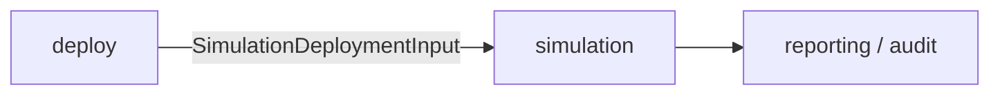

# Simulation Module Contracts

## Purpose

The `simulation` module accepts immutable deployment evidence from `deploy`
and discovery metadata from `configuration`, runs trace-based load simulations
against an LLM serving endpoint, and produces latency, throughput, and error
results for audit, reporting, and future `benchmark` consumers.

It does not manage deployments, select workloads, or interpret model
capabilities. Those are `deploy`, `benchmark`, and `configuration`
responsibilities.



## Architecture

Simulation is a long-running service with equivalent REST and Python APIs. The
REST router serializes the same domain objects returned by the Python API; it
does not implement a separate business path. Simulation persists task state on
disk and manages a bounded pool of concurrent backend subprocesses. Two
backends are supported:

| Backend | Display Name | Trace Formats |
|---|---|---|
| `aiperf` | AIPerf | mooncake_trace, bailian_trace, baseten_trace, burst_gpt_trace, weka_public_dataset |
| `trace-replayer` | Trace Replayer | mooncake_trace, bailian_trace |

The `Backend` base validates the common trace replay and SLO contract. Each
current backend is a `CommandBackend` responsible for its additional
validation, CLI invocation, subprocess execution, and result parsing.

Backend components import the public Python API from
`llm_d_bench.simulation`. Python calls return typed domain objects where a
model exists and raise `SimulationConfigurationError` for domain errors. REST
routes translate the same errors into HTTP responses and serialize the objects
to JSON.

## Scenarios

Three scenarios classify the simulation workload:

| Scenario | Display Name | Description |
|---|---|---|
| `chat` | Chat | Conversational and general assistant traffic |
| `api-calling` | Tool & API Use | Tool-use, agent, and business API traffic |
| `coding` | Code Generation | Code generation and software engineering traffic |

Trace datasets are assigned to exactly one scenario. A task's scenario must
match its dataset's scenario.

## Discovery

Discovery endpoints are read-only and do not mutate simulation state.

### Backend Discovery

#### Endpoint

```
GET /api/simulation/backends
```

#### Python

```python
from llm_d_bench.simulation import list_backends

backends: list[BackendDescriptor] = list_backends()
```

Returns the descriptor for every registered backend:

```python
BackendDescriptor(
    name: str,
    display_name: str,
    api_version: int,
    available: bool,
    version: str | None,
    unavailable_reason: str | None,
    scenarios: list[dict],
    capabilities: dict,
)
```

`capabilities` includes `trace_formats` and per-format capabilities such as
`supports_scale_factor`, `supports_trace_range`, and `trace_range_mode`.
Callers use this to determine valid backend/dataset/scenario combinations
before creating a task.

### Scenario Discovery

#### Endpoint

```
GET /api/simulation/scenarios
```

#### Python

```python
from llm_d_bench.simulation import list_scenarios

scenarios: list[ScenarioDescriptor] = list_scenarios()
```

Returns the union of all scenarios across all backends. Each scenario entry
carries its `supported_backends`.

```python
ScenarioDescriptor(
    name: str,
    display_name: str,
    description: str,
    supported_backends: list[str],
)
```

### Trace Dataset Discovery

#### Endpoint

```
GET /api/simulation/trace-datasets
```

#### Python

```python
from llm_d_bench.simulation import trace_registry

catalog: list[dict[str, Any]] = trace_registry.list()
```

Returns the catalog of known trace datasets. Each dataset carries its name,
supported backends, trace format, scenario, download URL, SHA-256 checksum,
license, source repository, and description.

```python
TraceDatasetDescriptor(
    name: str,
    supported_backends: list[str],
    trace_format: str,
    scenario: str,
    url: str,
    sha256: str,
    license: str,
    source_repository: str,
    description: str,
)
```

### Trace Dataset Download

#### Endpoint

```
POST /api/simulation/trace-datasets/download
```

#### Python

```python
from llm_d_bench.simulation import BaseTrace

download: dict[str, Any] = await BaseTrace.download(dataset, force=False)
```

Downloads a trace dataset file to the local trace root. Accepts an optional
`force` flag to re-download an existing file.

```python
TraceDatasetDownloadRequest(
    dataset: str,
    force: bool = False,
)
```

### Trace Dataset Timeline

#### Endpoint

```
GET /api/simulation/trace-datasets/{dataset_name}/timeline
```

#### Python

```python
from llm_d_bench.simulation import get_trace_timeline

timeline: dict[str, Any] = await get_trace_timeline(dataset_name, bins=800)
```

Returns a pre-computed density histogram of trace request timestamps for
visualization. Accepts an optional `bins` parameter (50–2000, default 800).

### Model Discovery

#### Endpoint

```
POST /api/simulation/models/discover
```

#### Python

```python
from llm_d_bench.simulation import discover_models

models: dict[str, Any] = await discover_models(endpoint_url)
```

Probes an OpenAI-compatible `/v1/models` endpoint and returns the list of
available model IDs.

```python
ModelDiscoveryRequest(
    endpoint_url: str,
)
```

## Task Creation

`SimulationTaskCreateRequest` is the create command that enqueues a new
simulation task:

### Endpoint

```
POST /api/simulation/tasks
```

### Python

```python
from llm_d_bench.simulation import create_task

task: SimulationTask = await create_task(request)
```

```python
SimulationTaskCreateRequest(
    name: str,
    description: str,
    scenario: Literal["chat", "api-calling", "coding"],
    backend: Literal["aiperf", "trace-replayer"],
    endpoint_mode: Literal["external", "in-cluster"],
    endpoint_namespace: str | None,
    endpoint_service: str | None,
    endpoint_url: str,
    model_name: str,
    trace_dataset: str,
    trace_path: str,
    duration_seconds: int,
    scale_factor: float,
    trace_start_seconds: float,
    trace_end_seconds: float | None,
    trace_timeout_seconds: int,
    fixed_schedule: bool,
    stream: bool,
    backend_options: dict[str, Any],
)
```

| Field | Meaning |
|---|---|
| `scenario` | Must match the selected trace dataset's scenario. |
| `backend` | Must be `aiperf` or `trace-replayer`. |
| `endpoint_mode` | `external` for user-provided URLs; `in-cluster` for Kubernetes service endpoints resolved via `endpoint_namespace` and `endpoint_service`. |
| `endpoint_url` | Required HTTP or HTTPS URL of the OpenAI-compatible chat completions endpoint. |
| `model_name` | The model to pass in each request's `model` field. |
| `trace_dataset` | A dataset name from the trace datasets catalog (e.g. `mooncake-arxiv`). |
| `trace_path` | Filesystem path to the trace file, resolved via the trace catalog. |
| `duration_seconds` | Request issuance window. Overridden when `trace_end_seconds` is set: the duration is computed as `(trace_end - trace_start) / scale_factor`. After this window closes, the backend waits for issued requests to complete before producing the result. |
| `scale_factor` | Synthesis speedup ratio (> 0). Only supported when the backend declares per-format `supports_scale_factor`. |
| `trace_start_seconds` / `trace_end_seconds` | Optional trace time range. Only supported when the backend declares `supports_trace_range`. |
| `trace_timeout_seconds` | Maximum subprocess wall-clock time before the runner kills it. |
| `fixed_schedule` | If true, the backend replays trace inter-arrival gaps faithfully. If false, it issues requests as fast as concurrency allows. Must be `False` for `aiperf_public_dataset` sources. |
| `stream` | Whether to request streaming responses (`stream: true`). |
| `backend_options` | Backend-specific key-value overrides such as `error_rate_slo`, `ttft_slo`, `tpot_slo`, or `concurrency`. |

Trace-Replayer defaults to 16 token producers, a channel capacity of 32, and 32
worker threads so
prompt generation does not throttle the recorded request schedule. Explicit
`num_producer`, `channel_capacity`, and `threads` options override these defaults.

Validation is performed by the selected `CommandBackend` and may reject
incompatible combinations of dataset, backend, scale factor, and trace range.
The response is HTTP 202 with the new task's ID and initial state. The task
enters `queued` status and is scheduled against a configurable concurrency
semaphore (environment variable `SIMULATION_MAX_CONCURRENT_TASKS`, default 1).

## Task Stop

Stops a running or queued task:

### Endpoint

```
POST /api/simulation/tasks/{task_id}/stop
```

### Python

```python
from llm_d_bench.simulation import stop_task

await stop_task(task_id)
```

No request body is required. The task transitions to `cancelled` (if running,
the backend subprocess receives a termination signal). Idempotent: calling
stop on an already-cancelled or completed task is a no-op.

## Task Rerun

Creates a new task from an existing completed, failed, or cancelled task:

### Endpoint

```
POST /api/simulation/tasks/{task_id}/rerun
```

### Python

```python
from llm_d_bench.simulation import rerun_task

task: SimulationTask = await rerun_task(task_id)
```

No request body is required. The new task copies all configuration from the
original. Its name is suffixed with ` · rerun <new_task_id>`. The original
task is not modified. Returns HTTP 202.

## Task Deletion

Deletes a completed, failed, or cancelled task and its on-disk artifacts:

### Endpoint

```
DELETE /api/simulation/tasks/{task_id}
```

### Python

```python
from llm_d_bench.simulation import delete_task

await delete_task(task_id)
```

The task must not be `queued` or `running`. Deleting an active task is
rejected with HTTP 409. On success the task directory is removed from disk.

## Task Observation

### Task Detail

#### Endpoint

```
GET /api/simulation/tasks/{task_id}
```

#### Python

```python
from llm_d_bench.simulation import get_task

task: SimulationTask | None = await get_task(task_id)
```

Returns the full `SimulationTask` for the given ID. While a task is `running`,
the response includes a `live_summary` field with real-time metrics computed
from the backend's partial output artifacts.

On first retrieval of a `completed` task, the response lazily computes and
persists derived timelines (completion timeline, latency timeline, throughput
timeline, error timeline, status code breakdown) into the result's `summary`.
Subsequent queries return the cached timelines.

Returns HTTP 404 if the task does not exist.

### Task Listing

#### Endpoint

```
GET /api/simulation/tasks
```

#### Python

```python
from llm_d_bench.simulation import list_tasks

page: SimulationTaskListPage = await list_tasks(
    status=status,
    scenario=scenario,
    backend=backend,
    offset=offset,
    limit=limit,
)
```

Supports filtering by `status`, `scenario`, `backend`, `model`, `dataset`,
`trace_format`, `endpoint`, `created_after`, `created_before`, and free-text
`search`. Returns a paginated response:

```python
SimulationTaskListPage(
    tasks: list[SimulationTask],
    total: int,
    offset: int,
    limit: int,
    counts: dict[str, int],
    facets: dict[str, list[str]],
)
```

`counts` provides status breakdowns (`queued`, `running`, `completed`,
`failed`, `cancelled`). `facets` enumerates known backends, models, datasets,
trace formats, and endpoints across all tasks.

Tasks are returned newest-first with large fields elided: `logs`, `artifacts`,
`per_request`, and `backend_metrics` are stripped from list results. Running
tasks in the list include a `live_summary`.

## Main Output: SimulationTask

`SimulationTask` is the lifecycle object persisted to disk and returned by all
task endpoints. It corresponds to `TaskModel` in the implementation.

```python
SimulationTask(
    id: str,
    name: str,
    description: str,
    scenario: Literal["chat", "api-calling", "coding"],
    status: SimulationTaskStatus,
    endpoint_mode: Literal["external", "in-cluster"],
    endpoint_namespace: str | None,
    endpoint_service: str | None,
    endpoint_url: str,
    model_name: str,
    simulation: SimulationConfig,
    prompt: SimulationPrompt,
    task_dir: str,
    progress_percent: float,
    progress_message: str,
    logs: list[str],
    result: SimulationResult | None,
    error_message: str | None,
    created_at: str,
    started_at: str | None,
    completed_at: str | None,
    owner_pid: int | None,
    owner_instance_id: str | None,
)
```

Supported lifecycle states:

```text
queued -> running -> completed
                  -> failed
                  -> cancelled
```

| Field | Meaning |
|---|---|
| `id` | 8-character lowercase hexadecimal, generated by the service. |
| `status` | Current lifecycle state. |
| `endpoint_mode` | `external` for a user-provided URL; `in-cluster` for a Kubernetes service reference. |
| `endpoint_url` | The resolved OpenAI-compatible endpoint URL used by the backend. |
| `model_name` | The model name sent in each request. |
| `simulation` | Immutable simulation configuration (see `SimulationConfig`). |
| `prompt` | Immutable trace and dataset reference (see `SimulationPrompt`). |
| `task_dir` | Absolute path to the task's on-disk directory under `SIMULATION_TASK_ROOT`. |
| `progress_percent` | 0–100 progress indicator updated by the backend runner. |
| `progress_message` | Human-readable phase description. |
| `logs` | Up to `SIMULATION_MAX_TASK_LOG_LINES` (default 500) timestamped log lines. |
| `result` | Populated only when `status` is `completed`. |
| `error_message` | Populated only when `status` is `failed`. |
| `owner_pid` / `owner_instance_id` | Process and service instance ownership for detecting stale `running` tasks after a restart. |

### SimulationConfig

```python
SimulationConfig(
    backend: Literal["aiperf", "trace-replayer"],
    backend_options: dict[str, Any],
    duration_seconds: float,
    num_requests: None,
    stream: bool,
    warmup_enabled: Literal[False],
    grace_period_seconds: float,
)
```

`num_requests` and `warmup_enabled` are reserved for future use and always
`None` and `False` respectively.

### SimulationPrompt

```python
SimulationPrompt(
    type: Literal["trace"],
    dataset: SimulationDataset,
    trace: SimulationTrace,
)

SimulationDataset(
    name: str | None,
    scenario: Literal["chat", "api-calling", "coding"] | None,
    tokenizer: str | None,
)

SimulationTrace(
    path: str,
    format: Literal[
        "mooncake_trace",
        "bailian_trace",
        "baseten_trace",
        "burst_gpt_trace",
        "weka_public_dataset",
    ],
    fixed_schedule: bool,
    timeout_seconds: float,
    synthesis_speedup_ratio: float,
    start_seconds: float,
    end_seconds: float | None,
)
```

## Result Output: SimulationResult

`SimulationResult` is the parsed backend output, populated when the task
reaches `completed` status.

```python
SimulationResult(
    run_id: str,
    backend: Literal["aiperf", "trace-replayer"],
    backend_version: str | None,
    summary: dict[str, Any],
    artifacts: list[SimulationArtifact],
    per_request: list[SimulationRequestResult],
    backend_metrics: dict[str, Any],
    warnings: list[str],
)
```

| Field | Meaning |
|---|---|
| `run_id` | Unique run identifier, distinct from `task.id`. |
| `backend_version` | Detected backend version string. |
| `summary` | Aggregated metrics dictionary. Includes key-value pairs for latency distributions (`ttft_ms`, `tpot_ms`, `e2e_latency_ms`), throughput (`throughput_rps`, `output_tokens_per_second`), success/failure counts, and SLO compliance. After lazy enrichment it also includes `completion_timeline`, `latency_timeline`, `ttft_timeline`, `tpot_timeline`, `throughput_timeline`, `error_timeline`, `status_code_breakdown`, and optional `status_code_issues`. |
| `artifacts` | References to on-disk stdout, stderr, and backend-specific output files. |
| `per_request` | Per-request records with latency, token counts, status codes, and metadata. |
| `backend_metrics` | Backend-specific operational metrics (e.g., AIPerf profile phase metrics). |
| `warnings` | Non-fatal issues encountered during parsing. |

### SimulationRequestResult

`SimulationRequestResult` is the backend-independent shape used when normalized
per-request records are included in a result. Full native request streams remain
available through `per_request` artifacts; additional backend-specific values
may be retained as extension fields.

```python
SimulationRequestResult(
    request_id: str | int | None,
    status_code: int | None,
    successful: bool | None,
    error: str | None,
    started_at_seconds: float | None,
    completed_at_seconds: float | None,
    latency_ms: float | None,
    ttft_ms: float | None,
    tpot_ms: float | None,
    input_tokens: float | None,
    output_tokens: float | None,
    metadata: dict[str, Any],
)
```

### SimulationArtifact

```python
SimulationArtifact(
    kind: str,
    path: str,
    media_type: str,
)
```

Each artifact references an on-disk file within the task's artifact directory.

## Response Code Issue Detail

### Endpoint

```
GET /api/simulation/tasks/{task_id}/response-code-issues
```

### Python

```python
from llm_d_bench.simulation import get_response_code_issues

page: SimulationResponseCodeIssuePage = await get_response_code_issues(
    task_id,
    status_code,  # int, or None for failures without an HTTP status
    offset=0,
    limit=100,
)
```

Returns paginated per-request records that match a specific HTTP status code.
Accepts `status_code` (100–599, or `unknown` for non-HTTP failures), `offset`,
and `limit` query parameters. Each issue entry includes the request's
timestamp, latency, token counts, and error metadata.

```python
SimulationResponseCodeIssuePage(
    task_id: str,
    status_code: int | None,
    items: list[dict[str, Any]],
    total: int,
    offset: int,
    limit: int,
)
```

## Public Projection for Deploy

`simulation` consumes `SimulationDeploymentInput` from `deploy` (defined in
the deploy module contract). Simulation uses the deployment's execution ID,
artifact, endpoint, namespace, and resource snapshot to construct a
`SimulationTaskCreateRequest`. Simulation must not substitute current mutable
cluster state for these deployment execution snapshots.

## Lifecycle Invariants

1. A task ID is immutable once assigned and never reused.
2. A `running` task discovered after a service restart is marked `failed`
   with an appropriate error message.
3. Only one task per ID may run at a time. The concurrency semaphore
   (`SIMULATION_MAX_CONCURRENT_TASKS`) gates queued task dispatch.
4. Cancelling a task sends a termination signal to the backend subprocess
   with a configurable grace period. If the subprocess does not exit, it is
   force-killed.
5. Task data on disk is written atomically via a temporary file and `os.replace`.
6. Deleting a task removes its entire task directory. This operation is
   irreversible.

## REST and Python API Compatibility

The Lens dashboard consumes the REST API. Other backend components consume
the Python API from `llm_d_bench.simulation`. Both surfaces execute the same
catalog, lifecycle, observation, and trace functions. REST responses may add a
transport envelope such as `{"task_id": ..., "status": ..., "task": ...}`;
the Python API returns the typed domain object directly.

The public Python surface is:

```python
from llm_d_bench.simulation import (
    BaseTrace,
    create_task,
    delete_task,
    discover_models,
    get_response_code_issues,
    get_task,
    get_trace_timeline,
    list_backends,
    list_scenarios,
    list_tasks,
    rerun_task,
    stop_task,
    trace_registry,
)
```

Simulation and benchmark remain parallel consumers of deploy output. The
existing Evaluate API and Guide adapter are not consumers of these contracts.
