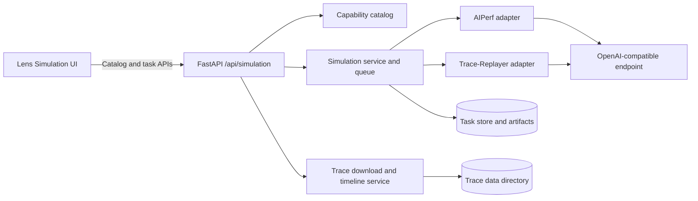
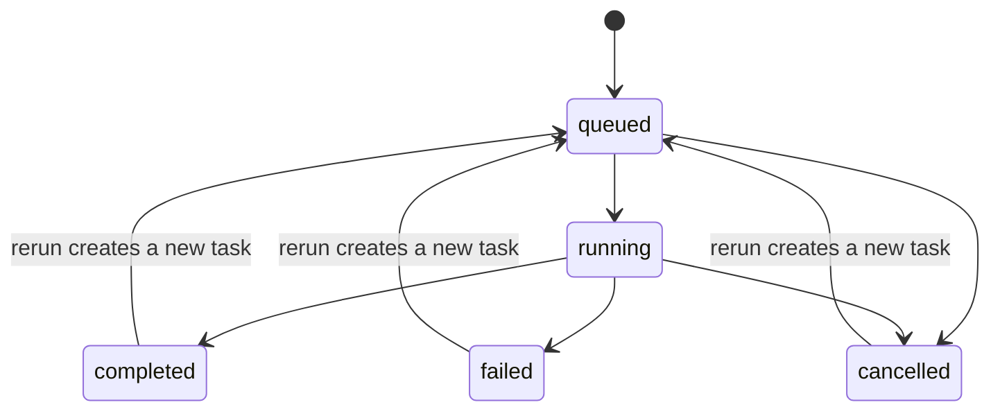

# Lens Simulation Design and API Contract

> Implementation contract for the current `/api/simulation` service. This document
> describes deployed behavior, not the future unified Run/TCO target architecture.

## 1. Scope and design principles

Simulation replays registered LLM request traces against an OpenAI-compatible
inference endpoint. The browser does not construct backend commands. It reads the
backend and dataset catalogs, submits a capability-valid task, and renders the
normalized result returned by OptimalBench.

The implementation follows these rules:

1. **Native capability only.** A dataset is supported only when the selected
   benchmark backend natively loads its trace format. OptimalBench does not convert
   an unsupported format to claim backend support.
2. **Server-authoritative capabilities.** Backend, dataset, range, scale, and
   advanced-option compatibility are enforced by the API even when the UI has
   already hidden an invalid combination.
3. **Backend-neutral results.** AIPerf and Trace-Replayer outputs are normalized
   into the same `SimulationSummary` shape. Backend-native data remains available
   in `backend_metrics`.
4. **Durable tasks.** Each task and its artifacts are persisted below
   `SIMULATION_TASK_ROOT`; queued tasks resume after service restart.
5. **Safe trace access.** Local trace paths must resolve inside
   `TRACE_REPLAY_DATA_DIR`.

## 2. Component model



### 2.1 Ownership

| Component | Responsibility |
|---|---|
| Router | HTTP validation, status-code mapping, live-result enrichment |
| Simulation service | task state machine, persistence, queueing, restart recovery |
| Backend adapter | backend-specific validation, command construction, result parsing |
| Trace catalog | native dataset registration, secure download, checksums |
| Timeline service | bounded density index, replay-range validation |
| Lens UI | capability-driven controls and normalized-result presentation |

## 3. Task lifecycle



- Task IDs are eight lowercase hexadecimal characters.
- `POST /tasks` persists the task before returning `202`.
- Stop is asynchronous and initially returns `cancelling`; persisted terminal
  state is `cancelled`.
- Rerun never mutates the source task. It creates a new task with copied immutable
  configuration.
- `GET /tasks/{id}` derives missing normalized timelines from persisted artifacts
  for older completed tasks.

## 4. Native capability matrix

| Trace format | AIPerf | Trace-Replayer | Start/end | Scale factor |
|---|---:|---:|---|---|
| `mooncake_trace` | Yes | Yes | AIPerf: start/end; Trace-Replayer: end only, start fixed at 0 | Trace-Replayer only |
| `bailian_trace` | Yes | Yes | AIPerf: start/end; Trace-Replayer: end only, start fixed at 0 | Trace-Replayer only |
| `baseten_trace` | Yes | No | AIPerf | AIPerf |
| `burst_gpt_trace` | Yes | No | AIPerf | No |
| `weka_public_dataset` | Yes | No | No | No |

Registered datasets:

| Dataset | Scenario | Format | Native backends |
|---|---|---|---|
| `mooncake-arxiv` | `chat` | `mooncake_trace` | both |
| `mooncake-conversation` | `chat` | `mooncake_trace` | both |
| `mooncake-synthetic` | `chat` | `mooncake_trace` | both |
| `mooncake-toolagent` | `api-calling` | `mooncake_trace` | both |
| `bailian-trace-a` | `chat` | `bailian_trace` | both |
| `bailian-trace-b` | `api-calling` | `bailian_trace` | both |
| `bailian-thinking` | `chat` | `bailian_trace` | both |
| `bailian-coder` | `coding` | `bailian_trace` | both |
| `baseten-synthetic` | `chat` | `baseten_trace` | AIPerf |
| `burstgpt-conversation` | `chat` | `burst_gpt_trace` | AIPerf |
| `burstgpt-api` | `api-calling` | `burst_gpt_trace` | AIPerf |
| `weka-claude-code` | `coding` | `weka_public_dataset` | AIPerf |
| `weka-claude-code-subagents-256k` | `coding` | `weka_public_dataset` | AIPerf |

Azure Conversation/Coder are intentionally absent because neither backend
natively supports the Azure trace format.

## 5. Configuration rules

### 5.1 Common SLA metadata

SLA values are stored in `simulation.backend_options`. They control result
presentation and do not become AIPerf CLI flags.

| Key | Type/unit | Constraint |
|---|---|---|
| `ttft_slo` | number, seconds | `>= 0` |
| `tpot_slo` | number, seconds | `>= 0` |
| `error_rate_slo` | number, percent | `0..100` |

### 5.2 AIPerf options

| Key | Type | Constraint/applicability |
|---|---|---|
| `random_seed` | integer | `>= 0` |
| `num_profile_runs` | integer | `1..10`, default `1` |
| `profile_run_cooldown_seconds` | number | `>= 0`; only when runs > 1 |
| `concurrency` | integer | `>= 1`; Weka only |
| `max_context_length` | integer | `>= 1`; Weka only |
| `trace_idle_gap_cap_seconds` | number | `>= 0`; Weka only |

### 5.3 Trace-Replayer options

| Key | Type/unit |
|---|---|
| `num_producer` | integer |
| `channel_capacity` | integer |
| `threads` | integer |
| `early_stop_error_threshold` | number |
| `metric_percentiles` | non-empty number array |
| `tokenizer_config` | server-managed path |

## 6. API conventions

- Base path: `/api/simulation`
- Media type: `application/json`
- Timestamps: ISO 8601 strings, normally UTC with `Z`
- Percent values: `0..100`, not fractions
- Latency values in normalized results: milliseconds
- Throughput: requests/second or tokens/second
- Unknown request fields are rejected with `422`

### 6.1 Error schema

All route errors use FastAPI's standard envelope:

```ts
type ErrorResponse = {
  detail: string | ValidationIssue[];
};

type ValidationIssue = {
  loc: Array<string | number>;
  msg: string;
  type: string;
  input?: unknown;
  ctx?: Record<string, unknown>;
};
```

## 7. Reusable response schemas

```ts
type BackendName = "aiperf" | "trace-replayer";
type ScenarioName = "chat" | "api-calling" | "coding";
type TaskStatus = "queued" | "running" | "completed" | "failed" | "cancelled";
type TraceFormat =
  | "mooncake_trace"
  | "bailian_trace"
  | "baseten_trace"
  | "burst_gpt_trace"
  | "weka_public_dataset";

type Scenario = {
  name: ScenarioName;
  display_name: string;
  description: string;
  supported_backends?: BackendName[];
};

type AdvancedOption = {
  name: string;
  label: string;
  minimum?: number;
  maximum?: number;
  default?: number;
  trace_formats?: TraceFormat[];
};

type TraceFormatCapability = {
  supports_trace_range: boolean;
  trace_range_mode?: "start_end" | "duration" | "none";
  supports_scale_factor: boolean;
};

type BackendCapabilities = {
  prompt_kinds: ["trace"];
  arrival_patterns: string[];
  supports_duration: boolean;
  supports_request_count: boolean;
  supports_request_rate: boolean;
  supports_streaming: boolean;
  supports_per_request_results: boolean;
  supports_cancellation: boolean;
  supports_trace_range: boolean;
  scale_factor_trace_formats: TraceFormat[];
  trace_format_capabilities: Partial<
    Record<TraceFormat, TraceFormatCapability>
  >;
  advanced_options?: AdvancedOption[];
  default_tokenizer_configured?: boolean;
  managed_tokenizer?: boolean;
  trace_formats: TraceFormat[];
};

type BackendDescriptor = {
  name: BackendName;
  display_name: string;
  api_version: 1;
  available: boolean;
  version: string | null;
  unavailable_reason: string | null;
  managed_installation: boolean;
  scenarios: Scenario[];
  capabilities: BackendCapabilities;
};

type DatasetPreset = {
  name: string;
  supported_backends: BackendName[];
  filename: string;
  trace_format: TraceFormat;
  scenario: ScenarioName;
  license?: string;
  source_repository?: string;
  description: string;
  downloaded: boolean;
  path: string;
  size_bytes: number | null;
  source_type?: "aiperf_public_dataset";
  public_dataset?: string;
  url?: string;
  sha256?: string;
  generator?: string;
  transform?: {
    type: string;
    value?: string;
  };
};

type SimulationConfig = {
  backend: BackendName;
  backend_options: Record<string, unknown>;
  duration_seconds: number;
  num_requests: null;
  stream: boolean;
  warmup_enabled: false;
  grace_period_seconds: number;
};

type DatasetRef = {
  name: string | null;
  scenario: ScenarioName | null;
  tokenizer: string | null;
};

type TraceRef = {
  path: string;
  format: TraceFormat;
  fixed_schedule: boolean;
  timeout_seconds: number;
  synthesis_speedup_ratio: number;
  start_seconds: number;
  end_seconds: number | null;
};

type Artifact = {
  kind: string;
  path: string;
  media_type: string;
};

type Distribution = {
  mean_ms: number;
  p50_ms?: number;
  p90_ms?: number;
  p95_ms?: number;
  p99_ms?: number;
  min_ms?: number;
  max_ms?: number;
  std_ms?: number;
  count?: number;
  sum_ms?: number;
  unit?: string;
};

type CompletionTimelinePoint = {
  start_seconds: number;
  end_seconds: number;
  arrived_requests: number;
  completed_requests: number;
  successful_requests: number;
  failed_requests: number;
  cumulative_arrived: number;
  cumulative_completed: number;
};

type LatencyTimelinePoint = {
  start_seconds: number;
  end_seconds: number;
  request_count: number;
  request_arrival_rps: number;
  average_latency_ms: number | null;
  p95_latency_ms: number | null;
};

type ThroughputTimelinePoint = {
  start_seconds: number;
  end_seconds: number;
  arrived_requests: number;
  completed_requests: number;
  output_tokens: number;
  request_arrival_rps: number;
  request_completion_rps: number;
  token_throughput_tps: number;
};

type ErrorTimelinePoint = {
  start_seconds: number;
  end_seconds: number;
  failed_requests: number;
  error_rate_percent: number;
  cumulative_failures: number;
};

type StatusCodeBucket = {
  status_code: number | null;
  count: number;
  percentage: number;
};

type SimulationSummary = {
  total_requests: number;
  successful_requests: number;
  failed_requests: number;
  success_rate: number;
  duration_seconds: number;
  throughput_rps: number;
  throughput_tps: number;
  total_input_tokens: number;
  total_output_tokens: number;
  input_throughput_tps?: number;
  total_throughput_tps?: number;
  request_error_rate?: number;
  effective_concurrency?: number;
  latency: Distribution | null;
  ttft: Distribution | null;
  tpot: Distribution | null;
  drift?: Distribution | {
    p50_ms?: number;
    p90_ms?: number;
    p99_ms?: number;
  } | null;
  completion_timeline: CompletionTimelinePoint[];
  latency_timeline: LatencyTimelinePoint[];
  ttft_timeline: LatencyTimelinePoint[];
  tpot_timeline: LatencyTimelinePoint[];
  throughput_timeline: ThroughputTimelinePoint[];
  error_timeline: ErrorTimelinePoint[];
  status_code_breakdown: StatusCodeBucket[];
};

type SimulationResult = {
  run_id: string;
  backend: BackendName;
  backend_version: string | null;
  summary: SimulationSummary;
  artifacts: Artifact[];
  per_request: Record<string, unknown>[];
  backend_metrics: Record<string, unknown>;
  warnings: string[];
};

type SimulationTask = {
  id: string;
  name: string;
  description: string;
  scenario: ScenarioName;
  status: TaskStatus;
  endpoint_mode: "external" | "in-cluster";
  endpoint_namespace: string | null;
  endpoint_service: string | null;
  endpoint_url: string;
  model_name: string;
  simulation: SimulationConfig;
  prompt: {
    type: "trace";
    dataset: DatasetRef;
    trace: TraceRef;
  };
  task_dir: string;
  progress_percent: number;
  progress_message: string;
  logs: string[];
  result: SimulationResult | null;
  error_message: string | null;
  created_at: string;
  started_at: string | null;
  completed_at: string | null;
  owner_pid: number | null;
  owner_instance_id: string | null;
  live_summary?: SimulationSummary;
};
```

`ttft` and `tpot` are `null` when AIPerf runs without streaming. The result
contains a warning explaining how to enable these metrics.

## 8. Endpoint contracts

### 8.1 `GET /backends`

Returns the authoritative backend capability catalog.

Request: no body or query parameters.

```ts
type BackendsResponse = {
  backends: BackendDescriptor[];
};
```

Status codes: `200`.

### 8.2 `POST /models/discover`

Queries the endpoint's OpenAI-compatible `/v1/models` API. Redirects are not
followed; timeout is 10 seconds; maximum response size is 1 MiB.

```ts
type ModelDiscoveryRequest = {
  endpoint_url: string; // 1..2000 chars, absolute HTTP(S) URL
};

type ModelDiscoveryResponse = {
  endpoint: string;
  models: string[]; // unique, sorted, non-empty model IDs
};
```

Status codes:

- `200`: models discovered.
- `400`: connection, HTTP, size, JSON, or response-shape failure.
- `422`: request-schema failure.

### 8.3 `GET /scenarios`

Request: no body or query parameters.

```ts
type ScenariosResponse = {
  scenarios: Array<Scenario & { supported_backends: BackendName[] }>;
};
```

Status codes: `200`.

### 8.4 `GET /trace-datasets`

Returns all registered native dataset presets and their local availability.

```ts
type TraceDatasetsResponse = {
  data_dir: string;
  presets: DatasetPreset[];
};
```

Status codes: `200`.

### 8.5 `POST /trace-datasets/download`

```ts
type DownloadTraceRequest = {
  preset: string; // non-empty registered preset name
  force?: boolean; // default false
};

type DownloadTraceResponse = {
  path: string;
  trace_format: TraceFormat;
  sha256: string;
  metadata_path: string;
  size_bytes: number;
};
```

Status codes:

- `200`: trace is available and validated.
- `400`: unknown preset, download, checksum, format, or filesystem failure.
- `429`: concurrent trace-download limit reached.
- `422`: request-schema failure.

Weka public datasets are managed by AIPerf and are already reported as
`downloaded`; this endpoint is for locally stored presets.

### 8.6 `GET /trace-datasets/{dataset_name}/timeline`

Path:

- `dataset_name: string` — registered preset name.

Query:

- `bins: integer` — default `800`, range `50..2000`.

```ts
type TimelineBin = {
  start_seconds: number; // relative to the first source record
  end_seconds: number;
  request_count: number;
};

type TraceTimelineResponse = {
  dataset: string;
  trace_format: TraceFormat;
  request_count: number;
  duration_seconds: number;
  source_size_bytes: number;
  bin_width_seconds: number;
  bins: TimelineBin[];
};
```

Status codes:

- `200`: timeline returned.
- `404`: unknown preset.
- `409`: trace is unavailable or does not support timeline selection.
- `422`: invalid `bins`.
- `500`: timeline/index construction failure.

`weka_public_dataset` is managed remotely by AIPerf and has no local timeline;
its timeline request returns `409` even though the catalog marks it as
`downloaded`.

### 8.7 `GET /tasks`

Query parameters:

| Name | Type/default | Rule |
|---|---|---|
| `status` | `TaskStatus?` | exact match |
| `scenario` | `ScenarioName?` | exact match |
| `search` | `string?` | max 200; trimmed, non-empty |
| `backend` | `BackendName?` | exact match |
| `model` | `string?` | max 200, exact match |
| `dataset` | `string?` | max 200, exact match |
| `trace_format` | `TraceFormat?` | exact match |
| `endpoint` | `string?` | max 500, case-insensitive substring |
| `created_after` | ISO datetime? | inclusive |
| `created_before` | ISO datetime? | inclusive |
| `offset` | integer, `0` | `>= 0` |
| `limit` | integer, `10` | `1..100` |

```ts
type TaskCounts = Record<TaskStatus, number>;

type TaskFacets = {
  backends: BackendName[];
  models: string[];
  datasets: string[];
  trace_formats: TraceFormat[];
  endpoints: string[];
};

type TaskListResponse = {
  tasks: SimulationTask[];
  total: number;
  offset: number;
  limit: number;
  counts: TaskCounts; // counts before filtering
  facets: TaskFacets; // facets before filtering
};
```

List entries intentionally omit heavy content:

- `logs` is `[]`.
- `result.artifacts`, `result.per_request` are `[]`.
- `result.backend_metrics` is `{}`.
- Running entries may include `live_summary`.

Status codes: `200`, `422`, `500`.

### 8.8 `POST /tasks`

```ts
type CreateSimulationTaskRequest = {
  name?: string; // default "Trace simulation"
  description?: string; // default ""
  scenario: ScenarioName;
  backend?: BackendName; // default "trace-replayer"
  endpoint_mode?: "external" | "in-cluster"; // default "external"
  endpoint_namespace?: string | null;
  endpoint_service?: string | null;
  endpoint_url: string; // absolute HTTP(S)
  model_name: string; // non-empty
  trace_dataset: string; // registered preset, non-empty
  trace_path: string; // exact preset path/public-dataset key, non-empty
  duration_seconds?: number; // integer >= 1, default 60
  scale_factor?: number; // > 0, default 1
  trace_start_seconds?: number; // >= 0, default 0
  trace_end_seconds?: number | null; // > 0 when present
  trace_timeout_seconds?: number; // integer >= 1, default 3600
  fixed_schedule?: boolean; // default true
  stream?: boolean; // default true
  backend_options?: Record<string, unknown>; // default {}
};

type CreateSimulationTaskResponse = {
  task_id: string;
  status: "queued";
  task: SimulationTask;
};
```

Server-side semantic validation includes:

- backend availability and native dataset/format support;
- scenario-to-dataset binding;
- registered filename/public-dataset key and trace-root containment;
- range and scale capability;
- `trace_start_seconds == 0` when `trace_range_mode` is `duration`;
- non-empty selected range;
- backend-specific options and SLA ranges.

When `trace_end_seconds` is present, `duration_seconds` is normalized to
`ceil((end - start) / scale_factor)`, minimum one second.

Status codes:

- `202`: task persisted and queued.
- `400`: semantic/capability/configuration failure.
- `422`: request-schema failure.
- `500`: unexpected task creation failure.

### 8.9 `GET /tasks/{task_id}`

Path:

- `task_id: string` — persisted task ID.

Response: `SimulationTask`. A running task additionally contains
`live_summary`. Completed results can be enriched and re-persisted with timelines
or detected backend version.

Status codes: `200`, `404`.

### 8.10 `GET /tasks/{task_id}/response-code-issues`

Query:

| Name | Type/default | Rule |
|---|---|---|
| `status_code` | required string | `"unknown"` or integer `100..599` |
| `offset` | integer, `0` | `>= 0` |
| `limit` | integer, `100` | `1..500` |

```ts
type ResponseCodeIssue = {
  request_number: number;
  request_id: string | null;
  status_code: number | null;
  error: string | null;
  started_at_seconds: number | null;
  latency_ms: number | null;
  input_tokens: number | null;
  output_tokens: number | null;
};

type ResponseCodeIssuesResponse = {
  task_id: string;
  status_code: number | null;
  total: number;
  issues: ResponseCodeIssue[];
};
```

Status codes: `200`, `404`, `422`.

### 8.11 `POST /tasks/{task_id}/stop`

Request: no body.

```ts
type StopTaskResponse = {
  task_id: string;
  status: "cancelling";
};
```

Status codes:

- `200`: cancellation requested.
- `400`: task cannot be stopped in its current state.
- `404`: task not found.
- `500`: unexpected stop failure.

### 8.12 `POST /tasks/{task_id}/rerun`

Request: no body. The new task copies endpoint, workload, range, streaming, SLA,
and backend options from the source.

```ts
type RerunTaskResponse = {
  task_id: string; // new task ID
  status: "queued";
  task: SimulationTask;
};
```

Status codes:

- `202`: new task persisted and queued.
- `400`: source task is active or copied configuration is no longer valid.
- `404`: source task not found.
- `500`: unexpected rerun failure.

### 8.13 `DELETE /tasks/{task_id}`

Request: no body.

```ts
type DeleteTaskResponse = {
  task_id: string;
  status: "deleted";
};
```

Status codes:

- `200`: task metadata and task directory deleted.
- `404`: task not found.
- `409`: active task cannot be deleted.
- `500`: unexpected deletion failure.

## 9. Persistence and operational configuration

| Environment variable | Purpose |
|---|---|
| `SIMULATION_TASK_ROOT` | task JSON and artifacts |
| `TRACE_REPLAY_DATA_DIR` | approved local trace root |
| `AIPERF_EXECUTABLE` | AIPerf command |
| `TRACE_REPLAYER_EXECUTABLE` | Trace-Replayer command |
| `TRACE_REPLAYER_TOKENIZER` | default Trace-Replayer tokenizer |
| `SIMULATION_BACKEND_CACHE_DIR` | managed backend installations |
| `SIMULATION_MAX_CONCURRENT_TASKS` | worker concurrency |
| `SIMULATION_MAX_CONCURRENT_DOWNLOADS` | trace download concurrency |
| `SIMULATION_MAX_TASK_LOG_LINES` | retained task log lines |

The current store is filesystem-backed and intended for the Lens-managed
single-service deployment. The future unified Run architecture may replace this
storage implementation without changing the capability and normalized-result
semantics documented here.
