# Migrating Backend Structured Data to a Relational Database: SQLAlchemy Data Access Layer Design

## 1. Background and Goals

The backend (`llm_d_bench/`) currently persists all structured data using a "one JSON file per record" pattern: each module (`storage`, `deploy`, `model_cache`, `ai_providers`, `configuration`, `evaluate`, `agentic`, `monitoring`) implements its own nearly identical `XxxStore` class, using `pathlib.Path` + `threading.Lock` + temporary-file atomic replacement (`tmp` → `os.replace`) to guarantee write safety within a single process.

This pattern has the following problems:

1. **Cannot support multi-process / multi-replica deployment**: file locks are only effective within a process. Once the backend is horizontally scaled (multiple uvicorn workers or multiple Pod replicas), races and dirty reads can occur.
2. **Weak query capability**: all filtering/sorting/joining "by field" must first `list()` and fully load everything, then process it in Python. Performance will degrade significantly as record counts grow (for example, `list()` in `storage/store.py` and `deploy/run_store.py` both do full `glob` + deserialization).
3. **Duplicated implementations**: there are 7+ nearly identical Store classes (`create/get/list/save/delete` + JSON serialization + atomic write), differing only in directory and model type, with no unified abstraction.
4. **Difficult migration / backup / auditing**: there is no schema version management. Field changes depend on permissive `model_validate` parsing and handwritten migration functions (such as `run_store.py::_migrate_legacy_records`, `evaluate/router.py::_migrate_legacy_records`).
5. **Deployment is constrained**: data is scattered across inconsistent paths such as `~/.cache/llm-d-bench/...`, `~/.llm-d-bench/...`, and `~/.llm_d_bench/...` (see "Appendix A"), making unified backup/migration inconvenient.

**Goal**: introduce a unified Data Access Layer (DAL) based on **SQLAlchemy 2.x** (ORM + Core), and migrate the current JSON-file-based persistence modules to a relational database, while:

- supporting users who want to **connect to their own already deployed database** (that is, an "external mode" using a standard connection string to a self-managed PostgreSQL/MySQL instance);
- also supporting **zero-configuration embedded PostgreSQL** ("embedded mode," where the backend process starts and carries a local PostgreSQL instance automatically, removing the burden of a separate database deployment for the user);
- keeping the current public method signatures of the Store classes unchanged as much as possible (`create/get/list/save/delete`, etc.), so the changes stay in the implementation layer and the impact on `router.py` / `service.py` callers is minimized.

Out of scope for this design:

- Unstructured artifacts (model weight files, log tail files, kubeconfig generated by Ansible, raw benchmark output directories from evaluate, etc.) — these are large and naturally file-system objects, so they will remain on disk/PVC, and the database will store only **reference paths**.
- Pure in-memory runtime task state in `cluster/bootstrap/models.py::BootstrapJobStore`, `cluster/sessions`, and `monitoring` — these are transient state that exists only for the lifetime of the process (job progress, SSH sessions), not data that must persist across processes or restarts, so they are not migrated in this round (see Section 8).

## 2. Current-State Survey: File Storage Pattern Inventory

The modules in the codebase that match the "use JSON files as a database" pattern are as follows (all are variations of `create/get/list/save/delete` + `threading.Lock` + atomic write):

| Module | Store class | On-disk directory (default) | Record granularity |
|---|---|---|---|
| `llm_d_bench/storage/store.py` | `StorageVolumeStore` | `~/.cache/llm-d-bench/storage/volumes/*.json` | One storage volume per file |
| `llm_d_bench/deploy/run_store.py` | `JsonDeploymentRunStore` | `~/.llm-d-bench/deploy/{runs,executions}/*.json` | One deployment run / one execution per file |
| `llm_d_bench/model_cache/store.py` | `ModelCacheStore` | `~/.llm-d-bench/model-cache/entries/*.json` | One model cache entry per file |
| `llm_d_bench/ai_providers/store.py` | `AIProviderStore` | `~/.cache/llm-d-bench/ai-providers/*.json` | One external AI Provider per file |
| `llm_d_bench/configuration/service.py` | Module-level functions (no class) | `~/.cache/llm-d-bench/configurations/.artifacts/*.json` | One configuration artifact per file |
| `llm_d_bench/evaluate/router.py` | Module-level functions (`_save/_get/_records`) | `~/.llm_d_bench/run_store/evaluate/{runs,workflows}/*.json` | One benchmark run / one workflow per file |
| `llm_d_bench/agentic/benchmark_store.py` | `JsonBenchmarkRecordStore` | `~/.llm-d-bench/agentic/benchmarks/*.json` | One benchmark evidence record per file |
| `llm_d_bench/monitoring/accelerator/operations.py` | `AcceleratorOperationStore` | `~/.llm-d-bench/monitoring/operations/*.json` | One asynchronous installation operation per file |
| `llm_d_bench/monitoring/cluster_stack/operations.py` | `OperationStore` | Same pattern as above (cluster stack installation operations) | One installation operation per file |
| `llm_d_bench/simulation/service.py` | Module-level functions (`save_task`/`load_task`, using `asyncio.Lock` instead of `threading.Lock` because this module is async) | `~/.cache/llm-d-bench/simulations/<id>/task.json` | One load-test task per file |

Shared code pattern (using `storage/store.py` as an example):

```python
class StorageVolumeStore:
    def __init__(self, base_dir=None):
        self._base = Path(base_dir) if base_dir else Path.home() / ".cache" / "llm-d-bench" / "storage"
        self._volumes_dir = self._base / "volumes"
        self._volumes_dir.mkdir(parents=True, exist_ok=True)
        self._lock = threading.Lock()

    def create(self, volume): ...  # error if exists; otherwise atomically write JSON
    def get(self, volume_id): ...  # read a single file by path
    def list(self): ...  # full glob("*.json") load and sort
    def save(self, volume): ...  # overwrite only if it already exists
    def delete(self, volume_id): ...  # unlink(missing_ok=True)
```

This is exactly the target interface that the DAL abstraction layer should unify.

## 3. Overall Architecture

```
                     ┌──────────────────────────────┐
                     │        router.py (FastAPI)    │
                     └───────────────┬───────────────┘
                                     │ Calls existing Store interface (signature unchanged)
                     ┌───────────────▼───────────────┐
                     │   DAO layer (one per module)  │  <- llm_d_bench/db/dao/*.py
                     │   StorageVolumeDao, etc.      │
                     └───────────────┬───────────────┘
                                     │ Uses
        ┌────────────────────────────▼───────────────────────────┐
        │   llm_d_bench/db/ unified data-access infrastructure   │
        │   engine.py   session.py   base.py   models/*.py  migrations/ │
        └────────────────────────────┬───────────────────────────┘
                                     │ SQLAlchemy Engine
              ┌──────────────────────┼──────────────────────┐
              │                                             │
   ┌──────────▼───────────┐                     ┌───────────▼────────────┐
   │ External mode        │                     │ Embedded mode           │
   │ User provides        │                     │ `pgserver` starts a     │
   │ DATABASE_URL         │                     │ local PostgreSQL        │
   │ (Postgres/MySQL/...) │                     │ instance                │
   └──────────────────────┘                     └─────────────────────────┘
```

### 3.1 Layer responsibilities

| Layer | Directory | Responsibility |
|---|---|---|
| **Configuration layer** | `llm_d_bench/db/config.py` | Parse `DATABASE_URL` / embedded-mode environment variables and decide which engine to use |
| **Bootstrap layer** | `llm_d_bench/db/bootstrap.py` | Start/stop `pgserver` in embedded mode; perform connectivity probing in external mode |
| **Engine / session layer** | `llm_d_bench/db/engine.py`, `session.py` | Create `Engine` / `sessionmaker`, provide a `session_scope()` context manager |
| **Model layer** | `llm_d_bench/db/models/*.py` | SQLAlchemy ORM models (one file per business module, such as `storage.py`, `deploy.py`) |
| **Migration layer** | `llm_d_bench/db/migrations/` (Alembic) | Schema version management; `upgrade head` automatically creates/evolves tables |
| **DAO layer** | `llm_d_bench/db/dao/*.py` | Replace the internal implementation of existing `XxxStore` classes while keeping public method signatures compatible |
| **Migration script** | `llm_d_bench/db/legacy_import.py` | One-time import of legacy JSON files into the database (see Section 7) |

### 3.2 Why SQLAlchemy (instead of using psycopg directly / hand-writing SQL per module)

- The records in the current 7 modules are all **Pydantic models + JSON blobs**, with nested fields (such as `DeploymentCase.create_request`, `ConfigurationArtifactRecord.deployable_configuration`). SQLAlchemy's `JSONVariant` (`JSON`/`JSONB`) column type can directly accommodate these nested dicts, enabling a hybrid model of "relational columns for metadata fields (convenient for indexing/filtering/sorting), JSON columns for nested content (to avoid over-normalization)" with the lowest refactoring cost.
- SQLAlchemy supports both PostgreSQL and other database dialects (MySQL/SQLite). Combined with the requirement that "external mode may use the user's own PostgreSQL/MySQL," SQLAlchemy Core's dialect-agnostic DDL/DML is safer than hand-written SQL.
- Alembic (the migration tool in the SQLAlchemy ecosystem) naturally solves the problem of each module hand-writing `_migrate_legacy_records`, replacing it with standard versioned migrations.

## 4. Database connection modes: external vs embedded

### 4.1 Configuration items

Add the following environment variables (centrally read by `llm_d_bench/db/config.py`):

| Environment variable | Description | Default |
|---|---|---|
| `LLM_D_BENCH_DB_MODE` | `external` \| `embedded` | If unset: `external` when `DATABASE_URL` exists, otherwise `embedded` |
| `DATABASE_URL` | SQLAlchemy connection string in external mode, e.g. `******host:5432/llm_d_bench` | None (required in external mode) |
| `LLM_D_BENCH_DB_POOL_SIZE` / `LLM_D_BENCH_DB_MAX_OVERFLOW` | Connection pool parameters | `5` / `10` |
| `LLM_D_BENCH_EMBEDDED_PG_DATA_DIR` | PostgreSQL data directory in embedded mode | `~/.llm-d-bench/embedded-pg/data` |
| `LLM_D_BENCH_EMBEDDED_PG_PORT` | Embedded PostgreSQL listen port (`0` = use Unix socket, do not listen on TCP) | `0` (Unix socket only, more secure) |

### 4.2 External mode (`external`)

> **Be careful to distinguish two different kinds of "database/cluster" to avoid confusion**: the PostgreSQL discussed here is the metadata store for the **Lens backend application itself** (the storage volumes, deployment runs, evaluation records, etc. listed in §2), used by the `llm_d_bench` process for reads and writes. It is completely different from the **target k8s clusters being evaluated/deployed and registered/managed in Lens** (the `Cluster` records in `cluster/registry.py`; those clusters themselves will also be stored as records in this database—see `cluster-creation-wizard-design.md` §3.0/§4.0). PostgreSQL must not be deployed onto, or bound to, one of those target k8s clusters.
- The user maintains a PostgreSQL instance themselves (MySQL is also allowed as long as the SQLAlchemy dialect + migration scripts support it) specifically for **the Lens backend service itself** — it can be an independent VM/container, a managed cloud database (RDS, etc.), or a StatefulSet/managed instance inside the deployment environment of the Lens backend (for example, the k8s cluster that runs Lens itself), but it is **not** and should not be one of the target llm-d clusters managed/evaluated by Lens. Put the connection string into `DATABASE_URL` (or a Helm/K8s Secret).
- `llm_d_bench/db/engine.py` directly creates the engine with `create_engine(DATABASE_URL, pool_pre_ping=True, ...)`.
- On startup, execute a connectivity probe (`SELECT 1`) + `alembic upgrade head`; if probing fails, log a clear startup error and prevent the service from starting (avoiding the case where "the database is unavailable but the service pretends to be healthy").
- Recommended driver: `psycopg[binary]` (PostgreSQL). If MySQL support is desired, add `pymysql`; both are **optional dependencies** (`extras`), while the core dependency only pins SQLAlchemy itself.

### 4.3 Embedded mode (`embedded`)

- Target scenarios: single-machine/dev environments, demos, CI, where users do not want to or cannot deploy a database themselves.
- Use **`pgserver`** (a pip-installable embedded PostgreSQL published on PyPI, bundling cross-platform prebuilt PostgreSQL binaries and providing an API like `pgserver.get_server(data_dir)` to "start a real PostgreSQL server in-process," with optional `pgvector` support):
  - Advantages: it is real PostgreSQL (not a SQLite simulation), shares the same Alembic migration scripts and ORM models as external mode, and **avoids the split of maintaining two SQL dialects and two test suites**; it can be installed with `pip install` and does not require the user to preinstall `postgres`/Docker on the system.
  - The data directory defaults to `~/.llm-d-bench/embedded-pg/data` (overridable via `LLM_D_BENCH_EMBEDDED_PG_DATA_DIR`); on first startup, `pgserver` runs `initdb` automatically.
  - By default it listens only on a Unix domain socket (no TCP port), and the DSN returned by `pgserver` is fed directly into SQLAlchemy's `create_engine`, reducing the attack surface.
  - When the backend process exits (including normal FastAPI `lifespan` shutdown), call `server.cleanup()`/`stop()` to avoid leaving child processes behind.
- Key implementation (`llm_d_bench/db/bootstrap.py`, pseudocode):

```python
def start_embedded_postgres(data_dir: Path) -> str:
    import pgserver

    server = pgserver.get_server(data_dir)  # first call auto-runs initdb and starts
    return server.get_uri()  # like postgresql://.../?host=<unix-socket-dir>


@asynccontextmanager
async def lifespan(app: FastAPI):
    database_url, embedded_handle = resolve_database_url()  # choose either external or embedded
    engine = create_engine(database_url, ...)
    run_migrations(engine)  # alembic upgrade head
    app.state.db_engine = engine
    yield
    engine.dispose()
    if embedded_handle is not None:
        embedded_handle.cleanup()
```

- Production / multi-replica deployments should use external mode; embedded mode is suitable only for single-replica deployment, and the documentation will explicitly state that "multi-replica deployment must switch to an external database."

### 4.4 Trade-off table for the two modes

| Dimension | External (`external`) | Embedded (`embedded` / `pgserver`) |
|---|---|---|
| Deployment prerequisites | User must provision/manage a database | None; works with `pip install` |
| Multi-replica / high availability | Supported | Not supported (local single-machine data) |
| Backup / operations | Handled by user/DBA; can use existing PG ecosystem tools | Requires additional backup of `data_dir` (a `pg_dump` scheduled job can be added later; out of scope here) |
| Performance / resource usage | Separate process; does not consume backend-process resources | Shares host resources with backend |
| Applicable scenarios | Production / multi-replica / long-running | Local development, demo, single-machine deployment, CI |

## 5. Database schema design (including foreign-key relationships)

### 5.1 Entity relationship diagram (ER diagram)

The current state is "one isolated JSON directory per module." Relationships between modules (such as `ModelCacheEntry.storage_volume_id`, `DeploymentCase.execution_id`) are merely **string fields**, with no referential-integrity guarantees at all — deleting a referenced Storage volume/Execution will not produce a database-level error; it will only result in a "dangling reference" when read. After migrating to a relational database, all of these string fields become **real foreign-key constraints**, with the following relationships:

```mermaid
erDiagram
    CLUSTERS ||--o{ STORAGE_VOLUMES : "cluster_id (RESTRICT)"
    CLUSTERS ||--o{ MODEL_CACHE_ENTRIES : "cluster_id (RESTRICT)"
    CLUSTERS ||--o{ DEPLOYMENT_BATCHES : "cluster_id (SET NULL, nullable)"
    CLUSTERS ||--o{ DEPLOYMENT_EVIDENCES : "cluster_id (SET NULL, nullable)"
    CLUSTERS ||--o{ CONFIGURATION_ARTIFACTS : "cluster_id (SET NULL, nullable)"
    CLUSTERS ||--o{ EVALUATE_RUNS : "cluster_id (SET NULL, nullable)"
    CLUSTERS ||--o{ EVALUATE_WORKFLOWS : "cluster_id (SET NULL, nullable)"
    CLUSTERS ||--o{ MONITORING_ACCELERATOR_OPERATIONS : "cluster_id (SET NULL, nullable)"
    CLUSTERS ||--o{ MONITORING_CLUSTER_STACK_OPERATIONS : "cluster_id (SET NULL, nullable)"
    CLUSTERS ||--o{ SIMULATION_TASKS : "endpoint_cluster_id (SET NULL, nullable)"

    STORAGE_VOLUMES ||--o{ MODEL_CACHE_ENTRIES : "storage_volume_id (RESTRICT)"

    DEPLOYMENT_BATCHES ||--o{ DEPLOYMENT_JOBS : "batch_id (CASCADE)"
    DEPLOYMENT_EVIDENCES ||--o{ DEPLOYMENT_JOBS : "evidence_id (SET NULL, nullable)"
    DEPLOYMENT_JOBS }o--o| DEPLOYMENT_JOBS : "parent_job_id (SET NULL, self, nullable)"
    CONFIGURATION_ARTIFACTS }o--o| CONFIGURATION_ARTIFACTS : "edited_from_artifact_id (SET NULL, self, nullable)"

    DEPLOYMENT_EVIDENCES ||--o{ EVALUATE_RUNS : "deployment_evidence_id (SET NULL, nullable)"
    CONFIGURATION_ARTIFACTS ||--o{ EVALUATE_RUNS : "configuration_artifact_id (SET NULL, nullable)"

    EVALUATE_WORKFLOWS ||--o{ EVALUATE_WORKFLOW_CASES : "workflow_id (CASCADE)"
    DEPLOYMENT_BATCHES ||--o{ EVALUATE_WORKFLOW_CASES : "deployment_batch_id (SET NULL, nullable)"
    EVALUATE_RUNS ||--o{ EVALUATE_WORKFLOW_CASES : "evaluation_run_id (SET NULL, nullable)"

    EVALUATE_RUNS ||--o{ AGENTIC_BENCHMARK_RECORDS : "evaluate_run_id (SET NULL, nullable)"

    DEPLOYMENT_EVIDENCES ||--o{ SIMULATION_TASKS : "endpoint_deployment_evidence_id (SET NULL, nullable)"
    DEPLOYMENT_BATCHES ||--o{ SIMULATION_TASKS : "endpoint_deployment_batch_id (SET NULL, nullable, legacy)"
    DEPLOYMENT_JOBS ||--o{ SIMULATION_TASKS : "endpoint_deployment_job_id (SET NULL, nullable, legacy)"

    AI_PROVIDERS {
        string id PK
        string name
        string provider_type
    }
```



> Naming note: the three deployment-related tables are renamed to `deployment_batches` (batches) / `deployment_jobs` (schedulable work items split from a batch) / `deployment_evidences` (immutable evidence produced by a work item's execution), which expresses their hierarchy and responsibility differences more clearly than the old `deployment_runs` / `deployment_cases` / `deployment_executions` (see the explanations at the start of §5.4.6–§5.4.8). This is only a table/column rename **at the database layer**. The corresponding FastAPI/Pydantic DTO class names (`DeploymentRun` / `DeploymentCase` / `DeploymentExecution`) remain unchanged, and no code changes are implied by the names alone.

`AI_PROVIDERS` is listed separately in the diagram with no relationship lines — it is global configuration (credentials for external inference services), belongs to no cluster, and intentionally has no `cluster_id` foreign key.

**Principles for choosing foreign-key delete behavior**:

| Strategy | Where used | Reason |
|---|---|---|
| `RESTRICT` (forbid deleting parent row) | `storage_volumes.cluster_id`, `model_cache_entries.storage_volume_id` | This matches strong validation that already exists at the application layer — `StorageVolumeInUseError` (deleting a volume is forbidden when referenced by Model Cache / deployment execution), and cluster deletion is forbidden when the cluster has Storage volumes (`cluster-creation-wizard-design.md` §8.4). The database constraint is the "last line of defense" for this business rule, preventing orphan records when the Service layer is bypassed and the database is manipulated directly |
| `CASCADE` (cascade-delete child rows when parent row is deleted) | `deployment_batches.id → deployment_jobs.batch_id`, `evaluate_workflows.id → evaluate_workflow_cases.workflow_id` | These two cases are essentially "a JSON array field split into a table" (`DeploymentRun.cases`, workflow `cases`). The child rows have no independent meaning away from the parent row, so deleting the parent should naturally delete them too, equivalent to the original semantics of "delete the whole JSON file and the embedded array disappears with it" |
| `SET NULL` (set FK to null when parent row is deleted) | All other cross-module references (`cluster_id` in deploy/evaluate/configuration/monitoring/simulation, `deployment_evidence_id`, `configuration_artifact_id`, `parent_job_id`, `edited_from_artifact_id`, `evaluation_run_id`, `simulation_tasks.endpoint_deployment_evidence_id/endpoint_deployment_batch_id/endpoint_deployment_job_id`, etc.) | These are historical references with an "evidence/audit" nature — even if the referenced cluster/execution/configuration artifact is deleted later, the evaluation records, deployment jobs, and simulation tasks that reference it still have independent retention value (for example, the comment in `configuration/service.py::delete_configuration_artifact` already states that "the workflow case embeds an immutable copy of the configuration, and deleting the catalog entry should not invalidate historical evidence"). Therefore neither `CASCADE` nor `RESTRICT` is used; the reference may be nulled while preserving the referencing row |

### 5.2 General principles of field design (columns vs JSONVariant vs arrays vs split tables)

The user requested that "every field of every table must be listed clearly," so this version of the design **abandons** the earlier mixed scheme of "large payload JSON column + a few projected columns," and switches to **field-by-field expansion**. The rules for deciding how a Pydantic field should be stored are as follows (matched by priority, top to bottom):

| # | DTO field characteristic | Storage form | Example |
|---|---|---|---|
| 1 | Scalar (`str`/`int`/`float`/`bool`/`datetime`/`Enum`/`Literal`) | A dedicated column of the corresponding type | `status`, `name`, `created_at` |
| 2 | A nested **single** submodel (one-to-one `BaseModel`, such as `ProxyConfigDTO`, `LocalDiskSpec`, `VersionedPayload`) | **Expand into dedicated prefixed columns** (new rule in this revision, replacing the old "put the entire submodel into one JSON column") | `ProxyConfigDTO.http_proxy` → column `proxy_http_proxy` |
| 3 | `dict[str, Any]`, where the Pydantic source model is **intentionally left as free-form** (`content`, `provenance`, `monitoring_setup`, `resource_snapshot.value`, `extra`) | A `JSONVariant` column (custom SQLAlchemy type, `JSON().with_variant(JSONB, "postgresql")`, using `JSONB` on PostgreSQL and degrading to normal `JSON` on other dialects) | `deployable_configuration.content` |
| 4 | `list[str]`, where the elements **have no independent identity** and are not referenced by other tables | An `ArrayVariant` column (custom SQLAlchemy type, `ARRAY(Text).with_variant(JSON, "sqlite")`, using native arrays on PostgreSQL and degrading to `JSON` on SQLite and other dialects without array types) | `depends_on`, `evidence_refs`, `known_nodes` |
| 5 | `list[NestedModel]`, where instances of the child model **are referenced by other fields / other tables in the same data** (have an independent lifecycle and need to be searchable/joinable) | Split into an **independent child table** + foreign key | `DeploymentRun.cases` → table `deployment_jobs` |
| 6 | `list[NestedModel]`, where the child model **is not referenced**, and is purely "a set of detail snapshots carried by this record itself" | Store the whole value as a `JSONVariant` array column (do not split into a table) | `DeploymentCreateRequest.configuration_artifacts`; the `agentic` module has no such field |

After applying Rule 2, this design **no longer contains** any case where "an entire submodel is put into a single JSON column" — only fields that match Rule 3/6 remain JSON-typed columns, and those fields were already `dict[str, Any]` in the original Pydantic model, or their content is itself not meaningful for querying (detail snapshots).

The field lists in §5.4 below uniformly use **SQLAlchemy types** (`String(n)` / `Text` / `Integer` / `BigInteger` / `Float` / `Boolean` / `DateTime(timezone=True)` / `ARRAY(Text)` / `JSONVariant`, etc.) rather than SQL types from any specific database dialect (such as PostgreSQL `VARCHAR` / `TIMESTAMPTZ` / `DOUBLE PRECISION`), to preserve portability under the assumption that "external/embedded are both PostgreSQL, but tests may use SQLite"; the `n` in `String(n)` is the maximum field length, so a separate length column is no longer listed.

Other common conventions:

- All primary keys keep each module's current string ID generation rule (for example, `storage-{uuid4().hex[:8]}`), rather than being converted to auto-increment integers, to avoid breaking API response bodies; lengths uniformly reserve room for "prefix + `-` + 32 hex chars (`uuid4().hex` full length)," unless the current implementation is known to be shorter (for example, current cluster IDs are `uuid4().hex[:8]`, 8 characters with no prefix).
- All `created_at` / `updated_at` / timestamp columns uniformly use `DateTime(timezone=True)`; `created_at` uses `server_default=func.now()`, and `updated_at` additionally uses `onupdate=func.now()`.
- Enum fields are stored as `String(n)` + `CheckConstraint("col IN (...)")` (do not use PostgreSQL native `ENUM`, to avoid migrations as heavy as `ALTER TYPE` whenever a new enum value is added).
- Large integers such as amounts/byte counts use `BigInteger`; ratios/rates/durations and other floating quantities use `Float`.
- Unless otherwise specified, string columns default to `nullable=False, default=""` (matching `str = ""` defaults on the Pydantic side), and dict/array columns default to `nullable=False, default=dict` / `default=list` (matching `Field(default_factory=...)` on the Pydantic side).
- All tables that **may still be updated after creation** (that is, tables whose field tables include `updated_at`, or whose state itself can transition) uniformly add a `version_id` column (`Integer, NOT NULL, default=1`), handed over to SQLAlchemy's optimistic locking mechanism (`__mapper_args__ = {"version_id_col": ...}`) so that on every `UPDATE` it automatically increments by 1 and includes the old version in the `WHERE` clause, preventing one concurrent transaction from overwriting another in a read-modify-write sequence (dirty write / lost update). Only **append-only tables** that are never updated after creation (`configuration_artifacts`, `agentic_benchmark_records`) do not need this column. The complete design for transaction boundaries, isolation levels, and optimistic/pessimistic locking is described in §6.7.

### 5.3 Special notes on naming and derived fields

Before expanding each table, clarify two easy-to-confuse points that will appear in the field tables below:

1. **Two different things both named `ConfigurationArtifact`**: `llm_d_bench.deploy.contracts.ConfigurationArtifact` (a **temporary reference** embedded in `DeploymentCreateRequest` / `DeploymentExecution`, with only a few fields such as `artifact_id`, matching Rule 6 and stored as `JSONVariant`) and `llm_d_bench.configuration.models.ConfigurationArtifactRecord` (a **saved configuration-artifact catalog entry**, corresponding to the standalone `configuration_artifacts` table, whose primary key is also `artifact_id`). The foreign key `evaluate_runs.configuration_artifact_id` points to the **latter** (the saved catalog entry), not the former.
2. **`agentic_benchmark_records.evaluate_run_id` is a best-effort derived column, not a strict `FOREIGN KEY`**: in the current code, `benchmark_id = f"evaluate:{task_id}"` (`agentic/facts.py`), meaning the namespace of `benchmark_id` currently has only one source (evaluate tasks), but the `BenchmarkRecord` DTO itself does not declare any field pointing to evaluate — future prefixes are entirely possible (for example, manually submitted benchmark tests). Therefore, this column is derived in the application layer by parsing whether `benchmark_id` looks like `evaluate:<id>`, and **does not create a database-level foreign-key constraint** (no `ON DELETE` semantics; it is purely a nullable auxiliary indexed column). In the field table it is marked as "(soft reference, not FK)".
3. **`monitoring_*_operations.cluster_id` is likewise a best-effort derived column**: `AcceleratorStatusResponse.context` / `namespace` is only a kubeconfig context-name string. The application layer must match it against the kubeconfig of registered clusters in the `clusters` table to reverse-lookup a `cluster_id`; if no match is found, it remains null. This is the Rule-2 case of "cross-module reference where the source has no direct ID": it becomes a nullable real foreign key (`SET NULL`), but the write timing is "after the application layer completes the matching," rather than being expanded directly from the DTO.

### 5.4 Per-table field design

For each table below: column name, SQL type, length/precision, nullable, primary key, foreign key (including `ON DELETE` strategy), default value, and description (including source DTO field path) are given.

#### 5.4.1 `clusters`

**Function**: stores the connection information (kubeconfig, proxy configuration) and metadata for each k8s target cluster that Lens has connected to / brought under management. This is the root table to which almost all other business tables belong by `cluster_id`.

Corresponds to `llm_d_bench.cluster.registry.Cluster` (actual implemented fields, not a draft).

| Column name | SQLAlchemy type | Nullable | PK | FK | Default | Description (source field) |
|---|---|---|---|---|---|---|
| `id` | String(8) | NOT NULL | ✅ | - | - | `uuid4().hex[:8]`, no prefix |
| `name` | String(200) | NOT NULL |  |  | - | `name` |
| `description` | Text | NOT NULL |  |  | `''` | `description` |
| `kubeconfig` | Text | NOT NULL |  |  | - | Raw `kubeconfig`; **application-layer encryption before persistence is recommended**, see §10 |
| `draft` | Boolean | NOT NULL |  |  | `False` | `draft`; true while the wizard is unfinished, and filtered by default in `list_clusters()` |
| `ready` | Boolean | NOT NULL |  |  | `False` | Cache of the latest `--raw=/readyz` probe result |
| `proxy_mode` | String(16) | NOT NULL |  |  | `'auto'` | `proxy_mode`; `CHECK IN ('auto','custom')` |
| `proxy_http_proxy` | Text | NULL |  |  | - | `http_proxy` (effective when `mode='custom'`) |
| `proxy_https_proxy` | Text | NULL |  |  | - | `https_proxy` |
| `proxy_no_proxy` | Text | NULL |  |  | - | `no_proxy` |
| `proxy_detected_http_proxy` | Text | NULL |  |  | - | Auto-detection snapshot (`mode='auto'`) |
| `proxy_detected_https_proxy` | Text | NULL |  |  | - | Same as above |
| `proxy_detected_no_proxy` | Text | NULL |  |  | - | Same as above |
| `proxy_detected_at` | DateTime(timezone=True) | NULL |  |  | - | Same as above |
| `proxy_detection_error` | Text | NULL |  |  | - | Same as above |
| `llm_d_ref` | String(128) | NULL |  |  | - | `llm_d_ref` |
| `llm_d_benchmark_ref` | String(128) | NULL |  |  | - | `llm_d_benchmark_ref` |
| `llm_d_repo_path` | Text | NULL |  |  | - | `llm_d_repo_path` |
| `llm_d_benchmark_repo_path` | Text | NULL |  |  | - | `llm_d_benchmark_repo_path` |
| `created_at` | DateTime(timezone=True) | NOT NULL |  |  | `func.now()` |  |
| `updated_at` | DateTime(timezone=True) | NOT NULL |  |  | `func.now()` | `onupdate=func.now()` |
| `version_id` | Integer | NOT NULL |  |  | `1` | Optimistic-lock version number (SQLAlchemy `version_id_col`); see §6.7 for the concurrent dirty-write prevention mechanism |

Unique constraint: `uq_clusters_name(name)`. This is the root table and has no foreign keys to other tables; it is referenced by the 10 relationship lines in the diagram in §5.1 (plus the newly added `simulation_tasks.endpoint_cluster_id`).

#### 5.4.2 `storage_volumes`

**Function**: stores persistent storage volumes registered by users for a cluster (exactly one of local disk / NFS / dynamic PVC), used by modules such as Model Cache for mounting.

Corresponds to `llm_d_bench.storage.contracts.StorageVolume`. The three mutually exclusive one-to-one submodels `local_disk` / `nfs` / `dynamic_pvc` are expanded into prefixed columns according to Rule 2, and the application layer (reusing the existing Pydantic `model_validator`) guarantees that only the prefixed column set matching `kind` is non-null in a given row.

| Column name | SQLAlchemy type | Nullable | PK | FK | Default | Description |
|---|---|---|---|---|---|---|
| `id` | String(40) | NOT NULL | ✅ | - | - | `storage-{uuid4().hex[:8]}` |
| `cluster_id` | String(8) | NOT NULL |  | `clusters.id` **RESTRICT** | - | `cluster_id` |
| `name` | String(63) | NOT NULL |  |  | - | `name` (DNS-1123 label) |
| `kind` | String(16) | NOT NULL |  |  | - | `CHECK IN ('local-disk','nfs','dynamic-pvc')` |
| `status` | String(16) | NOT NULL |  |  | `'pending'` | `CHECK IN ('pending','ready','failed','deleting')` |
| `capacity` | String(16) | NOT NULL |  |  | - | `capacity`, e.g. `"100Gi"` |
| `used_bytes` | BigInteger | NULL |  |  | - | `used_bytes` |
| `read_only` | Boolean | NOT NULL |  |  | `True` | `read_only` |
| `purposes` | ARRAY(Text) | NOT NULL |  |  | `'{}'` | `purposes` (enum string array, Rule 4) |
| `local_disk_host_path` | Text | NULL |  |  | - | `local_disk.host_path` (required when `kind='local-disk'`) |
| `nfs_server` | String(255) | NULL |  |  | - | `nfs.server` (required when `kind='nfs'`) |
| `nfs_path` | Text | NULL |  |  | - | `nfs.path` |
| `dynamic_pvc_storage_class` | String(253) | NULL |  |  | - | `dynamic_pvc.storage_class` (required when `kind='dynamic-pvc'`) |
| `dynamic_pvc_namespace` | String(253) | NULL |  |  | - | `dynamic_pvc.namespace` |
| `dynamic_pvc_access_mode` | String(32) | NULL |  |  | - | `dynamic_pvc.access_mode` |
| `pvc_name` | String(253) | NULL |  |  | - | `pvc_name` (backfilled after successful creation) |
| `pv_name` | String(253) | NULL |  |  | - | `pv_name` |
| `known_nodes` | ARRAY(Text) | NOT NULL |  |  | `'{}'` | `known_nodes` (Rule 4) |
| `failure_detail` | Text | NULL |  |  | - | `failure_detail` |
| `created_at` | DateTime(timezone=True) | NOT NULL |  |  | `func.now()` |  |
| `updated_at` | DateTime(timezone=True) | NOT NULL |  |  | `func.now()` |  |
| `version_id` | Integer | NOT NULL |  |  | `1` | Optimistic-lock version number; see §6.7 |

Unique constraint: `uq_storage_volumes_name(name)`. Indexes: `(cluster_id)`, `(kind)`, `(status)`.

#### 5.4.3 `model_cache_entries`

**Function**: stores model files that have already been downloaded / are being downloaded onto a storage volume, along with per-node download progress, to avoid downloading the same model repeatedly.

Corresponds to `llm_d_bench.model_cache.contracts.ModelCacheEntry`. `source` (`ModelSource`) and `token_source` (`TokenSource`) are expanded according to Rule 2; `node_progress: list[NodeDownloadStatus]` matches Rule 6 (detail snapshot, not split into a table).

| Column name | SQLAlchemy type | Nullable | PK | FK | Default | Description |
|---|---|---|---|---|---|---|
| `id` | String(48) | NOT NULL | ✅ | - | - | `model-cache-{uuid4().hex[:8]}` |
| `cluster_id` | String(8) | NOT NULL |  | `clusters.id` **RESTRICT** | - | `cluster_id` |
| `storage_volume_id` | String(40) | NOT NULL |  | `storage_volumes.id` **RESTRICT** | - | `storage_volume_id` |
| `source_kind` | String(16) | NOT NULL |  |  | - | `source.kind`; `CHECK IN ('huggingface','model-catalog')` |
| `source_huggingface_repo_id` | String(255) | NULL |  |  | - | `source.huggingface.repo_id` |
| `source_huggingface_revision` | String(255) | NULL |  |  | `'main'` | `source.huggingface.revision` |
| `source_model_catalog_entry_id` | String(64) | NULL |  |  | - | `source.model_catalog.catalog_entry_id` |
| `source_display` | Text | NOT NULL |  |  | - | Derived column, equivalent to `ModelSource.display_name()`, used for the uniqueness constraint for deduplication |
| `token_source_mode` | String(16) | NOT NULL |  |  | `'none'` | `token_source.mode`; `CHECK IN ('none','existing-secret','host')` |
| `token_source_namespace` | String(253) | NULL |  |  | - | `token_source.namespace` |
| `token_source_name` | String(253) | NULL |  |  | - | `token_source.name` |
| `status` | String(16) | NOT NULL |  |  | `'pending'` | `CHECK IN ('pending','downloading','ready','failed')` |
| `cache_path` | Text | NOT NULL |  |  | - | `cache_path` |
| `size_bytes` | BigInteger | NULL |  |  | - | `size_bytes` |
| `node_progress` | JSONVariant | NOT NULL |  |  | `'[]'` | `node_progress` (Rule 6, snapshot of `list[NodeDownloadStatus]`) |
| `failure_detail` | Text | NULL |  |  | - | `failure_detail` |
| `created_at` | DateTime(timezone=True) | NOT NULL |  |  | `func.now()` |  |
| `updated_at` | DateTime(timezone=True) | NOT NULL |  |  | `func.now()` |  |
| `version_id` | Integer | NOT NULL |  |  | `1` | Optimistic-lock version number (download progress for the same model may be updated concurrently by callbacks from multiple nodes); see §6.7 |

Unique constraint: `uq_model_cache_volume_source(storage_volume_id, source_display)` (replaces the full-table deduplication scan in the original `find_by_volume_and_source`). Indexes: `(cluster_id)`, `(status)`.

#### 5.4.4 `ai_providers`

**Function**: stores credentials for user-configured external inference services (OpenAI/Anthropic-compatible APIs), for use by modules such as Agentic that need large-model capabilities.

Corresponds to `llm_d_bench.ai_providers.contracts.AIProvider`. This is global configuration with no `cluster_id`, and its fields are basically all scalars.

| Column name | SQLAlchemy type | Nullable | PK | FK | Default | Description |
|---|---|---|---|---|---|---|
| `id` | String(48) | NOT NULL | ✅ | - | - | `ai-provider-{uuid4().hex[:8]}` |
| `name` | String(200) | NOT NULL |  |  | - | `name` |
| `base_url` | String(2048) | NOT NULL |  |  | - | `base_url` |
| `model` | String(200) | NOT NULL |  |  | - | `model` |
| `api_key` | Text | NOT NULL |  |  | `''` | `api_key`; **sensitive field, encrypted storage is recommended**, see §10 |
| `provider_type` | String(16) | NOT NULL |  |  | `'openai'` | `provider_type`; `CHECK IN ('openai','anthropic')` |
| `timeout_seconds` | Float | NOT NULL |  |  | `30` | `timeout_seconds`; `CHECK (0 < x <= 120)` |
| `created_at` | DateTime(timezone=True) | NOT NULL |  |  | `func.now()` |  |
| `updated_at` | DateTime(timezone=True) | NOT NULL |  |  | `func.now()` |  |
| `version_id` | Integer | NOT NULL |  |  | `1` | Optimistic-lock version number; see §6.7 |

Unique constraint: `uq_ai_providers_name(name)`.

#### 5.4.5 `configuration_artifacts`

**Function**: stores immutable deployment-configuration artifacts generated and "published" by the Configuration module (rendered content + checksum + provenance info), for consumption by Deploy.

Corresponds to `llm_d_bench.configuration.models.ConfigurationArtifactRecord`. `deployable_configuration` (`DeployableConfiguration`) and `configuration_file` (`ConfigurationFile`) are expanded according to Rule 2, using prefixes `dc_` and `cf_` respectively; `cluster_id` / `edited_from_artifact_id` are queryable derived columns extracted from the `dc_provenance` JSONVariant field.

| Column name | SQLAlchemy type | Nullable | PK | FK | Default | Description |
|---|---|---|---|---|---|---|
| `artifact_id` | String(36) | NOT NULL | ✅ | - | - | `artifact_id` (standard `uuid4()` form) |
| `schema_version` | String(64) | NOT NULL |  |  | `'configuration-artifact.v1'` | `schema_version` |
| `revision` | Integer | NOT NULL |  |  | `1` | `revision` |
| `status` | String(16) | NOT NULL |  |  | `'published'` | `status`; `CHECK IN ('published')` |
| `dc_schema_version` | String(64) | NOT NULL |  |  | `'deployable-configuration.v1'` | `deployable_configuration.schema_version` |
| `dc_type` | String(32) | NOT NULL |  |  | - | `deployable_configuration.type` |
| `dc_format` | String(32) | NOT NULL |  |  | - | `deployable_configuration.format` |
| `dc_content` | JSONVariant | NOT NULL |  |  | - | `deployable_configuration.content` (Rule 3, free-form) |
| `dc_provider_ref` | String(255) | NOT NULL |  |  | - | `deployable_configuration.provider_ref` |
| `dc_checksum` | String(128) | NOT NULL |  |  | - | `deployable_configuration.checksum` |
| `dc_provenance` | JSONVariant | NOT NULL |  |  | `'{}'` | `deployable_configuration.provenance` (Rule 3) |
| `cf_type` | String(32) | NOT NULL |  |  | - | `configuration_file.type` |
| `cf_file_name` | String(255) | NOT NULL |  |  | - | `configuration_file.file_name` |
| `cf_format` | String(32) | NOT NULL |  |  | - | `configuration_file.format` |
| `cf_path` | String(1024) | NOT NULL |  |  | - | `configuration_file.path` |
| `cf_size` | BigInteger | NOT NULL |  |  | - | `configuration_file.size` |
| `cf_sha256` | String(64) | NOT NULL |  |  | - | `configuration_file.sha256` |
| `cluster_id` | String(8) | NULL |  | `clusters.id` **SET NULL** | - | Derived from `dc_provenance.cluster_ref.id` |
| `edited_from_artifact_id` | String(36) | NULL |  | `configuration_artifacts.artifact_id` **SET NULL** (self-reference) | - | Derived from `dc_provenance.edited_from_artifact_id` |
| `created_at` | DateTime(timezone=True) | NOT NULL |  |  | `func.now()` |  |

Indexes: `(cluster_id)`, `(created_at)`.

#### 5.4.6 `deployment_batches`

**Function**: stores the top-level request and aggregated status for a deployment launched in batch from multiple configurations (see the earlier explanation of the responsibility differences among the three deploy tables).

Corresponds to `llm_d_bench.deploy.contracts.DeploymentRun` (excluding `cases`, see §6.5). The table name uses `deployment_batches` (batches) rather than reusing the DTO class name `DeploymentRun`; see the naming note below the diagram in §5.1 for the reason.

| Column name | SQLAlchemy type | Nullable | PK | FK | Default | Description |
|---|---|---|---|---|---|---|
| `id` | String(36) | NOT NULL | ✅ | - | - | `id` (`uuid4()`) |
| `status` | String(24) | NOT NULL |  |  | `'queued'` | `status`; `CHECK IN ('queued','running','succeeded','partially_succeeded','failed','cleaned','cancelling','cancelled')` |
| `source_configurations` | JSONVariant | NOT NULL |  |  | - | `source_configurations` (Rule 6, `list[DeployableConfiguration]`; at least one item enforced by the application layer) |
| `failure_policy` | String(16) | NOT NULL |  |  | `'continue'` | `failure_policy`; `CHECK IN ('stop','continue')` |
| `provenance` | JSONVariant | NOT NULL |  |  | `'{}'` | `provenance` (Rule 3) |
| `cluster_id` | String(8) | NULL |  | `clusters.id` **SET NULL** | - | Derived from `provenance.cluster_ref.id` |
| `created_at` | DateTime(timezone=True) | NOT NULL |  |  | `func.now()` |  |
| `started_at` | DateTime(timezone=True) | NULL |  |  | - | `started_at` |
| `finished_at` | DateTime(timezone=True) | NULL |  |  | - | `finished_at` |
| `version_id` | Integer | NOT NULL |  |  | `1` | Optimistic-lock version number (the batch's aggregated `status` is backfilled concurrently as jobs complete); see §6.7 |

Indexes: `(cluster_id)`, `(status)`, `(created_at)`.

#### 5.4.7 `deployment_jobs`

**Function**: stores a single deployment work item split from a batch, which can be scheduled/retried independently (corresponding to one `provider_ref + component` combination, supporting dependency ordering and retry chains after failures).

Corresponds to `llm_d_bench.deploy.contracts.DeploymentCase` (split from the `DeploymentRun.cases` array, Rule 5). The table name uses `deployment_jobs` (schedulable work items split from a batch, supporting retries/dependencies) rather than reusing the DTO class name `DeploymentCase`. `create_request` (`DeploymentCreateRequest`) is expanded according to Rule 2 with prefix `create_request_`; its internal `deployment_policy` / `cluster_snapshot` (both `VersionedPayload | None`) are expanded one level further with prefixes `create_request_deployment_policy_` / `create_request_cluster_snapshot_`; `configuration_artifacts: list[ConfigurationArtifact]` (the deploy module's own temporary reference type, not the `configuration_artifacts` table) matches Rule 6.

| Column name | SQLAlchemy type | Nullable | PK | FK | Default | Description |
|---|---|---|---|---|---|---|
| `id` | String(36) | NOT NULL | ✅ | - | - | `id` |
| `batch_id` | String(36) | NOT NULL |  | `deployment_batches.id` **CASCADE** | - | Owning batch (DTO field name is `run_id`; see the mapping in `column_map` in §6.2) |
| `ordinal` | Integer | NOT NULL |  |  | - | `ordinal`; `CHECK (>= 0)` |
| `source_configuration_ordinal` | Integer | NOT NULL |  |  | - | `source_configuration_ordinal` |
| `provider_ref` | String(255) | NOT NULL |  |  | - | `provider_ref` |
| `component` | String(255) | NOT NULL |  |  | - | `component` |
| `depends_on` | ARRAY(Text) | NOT NULL |  |  | `'{}'` | `depends_on` (Rule 4; IDs of other jobs within the same batch, no per-element FK) |
| `create_request_request_id` | String(36) | NOT NULL |  |  | - | `create_request.request_id` |
| `create_request_input_schema_version` | String(16) | NOT NULL |  |  | `'v1'` | `create_request.input_schema_version` |
| `create_request_configuration_artifacts` | JSONVariant | NOT NULL |  |  | `'[]'` | `create_request.configuration_artifacts` (Rule 6) |
| `create_request_deployment_policy_schema_version` | String(32) | NULL |  |  | - | `create_request.deployment_policy.schema_version` |
| `create_request_deployment_policy_value` | JSONVariant | NULL |  |  | - | `create_request.deployment_policy.value` (Rule 3) |
| `create_request_cluster_snapshot_ref` | String(255) | NULL |  |  | - | Source reference of `create_request.cluster_snapshot` |
| `create_request_cluster_snapshot_schema_version` | String(32) | NULL |  |  | - | `create_request.cluster_snapshot.schema_version` |
| `create_request_cluster_snapshot_value` | JSONVariant | NULL |  |  | - | `create_request.cluster_snapshot.value` |
| `create_request_provenance` | JSONVariant | NOT NULL |  |  | `'{}'` | `create_request.provenance` (Rule 3) |
| `status` | String(16) | NOT NULL |  |  | `'queued'` | `CHECK IN ('queued','rendering','deploying','ready','failed','stopped','cancelling','cancelled','cleaned','cleaned_up')` |
| `attempt` | Integer | NOT NULL |  |  | `1` | `attempt`; `CHECK (>= 1)` |
| `parent_job_id` | String(36) | NULL |  | `deployment_jobs.id` **SET NULL** (self-reference) | - | Points to the original job when a child job is created by retry (DTO field name is `parent_case_id`) |
| `evidence_id` | String(36) | NULL |  | `deployment_evidences.evidence_id` **SET NULL** | - | Related deployment evidence (DTO field name is `execution_id`) |
| `failure_status` | Integer | NULL |  |  | - | `failure.status` |
| `failure_title` | String(255) | NULL |  |  | - | `failure.title` |
| `failure_detail` | Text | NULL |  |  | - | `failure.detail` |
| `failure_code` | String(64) | NULL |  |  | - | `failure.code` |
| `version_id` | Integer | NOT NULL |  |  | `1` | Optimistic-lock version number (the scheduler/worker may advance the same job's status concurrently); see §6.7 |

Indexes: `(batch_id)`, `(evidence_id)`, `(status)`.

#### 5.4.8 `deployment_evidences`

**Function**: stores the immutable evidence left after one actual execution of a deployment job (rendered manifest, usable service endpoint, resource snapshot), for references from Benchmark/Evaluate/auditing.

Corresponds to `llm_d_bench.deploy.contracts.DeploymentExecution`. This is one of the 15 tables with many fields; the table name uses `deployment_evidences` (immutable evidence) rather than reusing the DTO class name `DeploymentExecution`, emphasizing the append-only nature of this table. `artifact` (`DeploymentArtifact`, containing `rendered_payload: VersionedPayload`), `endpoint` (`DeploymentEndpoint | None`), `metadata` (`DeploymentMetadata`), and `resource_snapshot` / `diagnostics` (both `VersionedPayload | None`) are expanded layer by layer according to Rule 2.

| Column name | SQLAlchemy type | Nullable | PK | FK | Default | Description |
|---|---|---|---|---|---|---|
| `evidence_id` | String(36) | NOT NULL | ✅ | - | - | DTO field name is `execution_id` |
| `request_id` | String(36) | NOT NULL |  |  | - | `request_id` (not an FK; indexed only, allowing one request to correspond to multiple evidence rows because of retries) |
| `status` | String(24) | NOT NULL |  |  | - | `CHECK IN ('draft','validated','rendered','deploying','ready','failed','rolling_back','rolled_back','cleaned','cleaned_up')` |
| `artifact_artifact_id` | String(36) | NOT NULL |  |  | - | `artifact.artifact_id` |
| `artifact_artifact_hash` | String(128) | NOT NULL |  |  | - | `artifact.artifact_hash` |
| `artifact_configuration_artifact_ids` | ARRAY(Text) | NOT NULL |  |  | - | `artifact.configuration_artifact_ids` (Rule 4; elements theoretically correspond to `configuration_artifacts.artifact_id`, but no per-element FK is added due to legacy reasons, so only application-layer validation is used) |
| `artifact_source_ref` | String(255) | NULL |  |  | - | `artifact.source_ref` |
| `artifact_manifest_ref` | String(255) | NULL |  |  | - | `artifact.manifest_ref` |
| `artifact_manifest_checksum` | String(128) | NULL |  |  | - | `artifact.manifest_checksum` |
| `artifact_values_checksum` | String(128) | NULL |  |  | - | `artifact.values_checksum` |
| `artifact_rendered_payload_schema_version` | String(32) | NOT NULL |  |  | - | `artifact.rendered_payload.schema_version` |
| `artifact_rendered_payload_value` | JSONVariant | NOT NULL |  |  | `'{}'` | `artifact.rendered_payload.value` |
| `artifact_created_at` | DateTime(timezone=True) | NOT NULL |  |  | - | `artifact.created_at` |
| `endpoint_url` | Text | NULL |  |  | - | `endpoint.url` |
| `endpoint_protocol` | String(16) | NULL |  |  | `'http'` | `endpoint.protocol` |
| `endpoint_service_ref` | String(255) | NULL |  |  | - | `endpoint.service_ref` |
| `endpoint_model_ref` | String(255) | NULL |  |  | - | `endpoint.model_ref` |
| `endpoint_baseline_url` | Text | NULL |  |  | - | `endpoint.baseline_url` |
| `forwarded_endpoint` | Text | NULL |  |  | - | `forwarded_endpoint` |
| `namespace` | String(253) | NULL |  |  | - | `namespace` |
| `monitoring_setup` | JSONVariant | NULL |  |  | - | `monitoring_setup` (Rule 3) |
| `configuration_artifacts` | JSONVariant | NOT NULL |  |  | `'[]'` | `configuration_artifacts` (Rule 6; at least one item is enforced by the application layer) |
| `resource_snapshot_schema_version` | String(32) | NULL |  |  | - | `resource_snapshot.schema_version` |
| `resource_snapshot_value` | JSONVariant | NULL |  |  | - | `resource_snapshot.value` (Rule 3) |
| `provenance` | JSONVariant | NOT NULL |  |  | `'{}'` | `provenance` (Rule 3) |
| `cluster_id` | String(8) | NULL |  | `clusters.id` **SET NULL** | - | Derived from `provenance.cluster_ref.id` |
| `metadata_display_name` | String(120) | NOT NULL |  |  | `''` | `metadata.display_name` |
| `metadata_description` | String(1000) | NOT NULL |  |  | `''` | `metadata.description` |
| `evidence_refs` | ARRAY(Text) | NOT NULL |  |  | `'{}'` | `evidence_refs` (Rule 4) |
| `diagnostics_schema_version` | String(32) | NULL |  |  | - | `diagnostics.schema_version` |
| `diagnostics_value` | JSONVariant | NULL |  |  | - | `diagnostics.value` |
| `created_at` | DateTime(timezone=True) | NOT NULL |  |  | `func.now()` |  |
| `updated_at` | DateTime(timezone=True) | NOT NULL |  |  | `func.now()` |  |
| `version_id` | Integer | NOT NULL |  |  | `1` | Optimistic-lock version number (`metadata_*` and other fields may be updated after creation by read-modify-write); see §6.7 |

Indexes: `(cluster_id)`, `(request_id)`, `(status)`, `(created_at)`.

#### 5.4.9 `evaluate_runs` / 5.4.10 `evaluate_workflows`

**Function**: `evaluate_runs` records one standalone benchmark evaluation run and its results; `evaluate_workflows` records a workflow that orchestrates multiple combinations of "deployment + evaluation" for side-by-side comparison.

`evaluate/router.py` currently has no Pydantic model; it uses free-form `dict`. During migration, add a minimal `EvaluateRunRecord` / `EvaluateWorkflowRecord` layer (`extra="allow"`) as described in §6.6, expanding the currently known queryable/related fields into columns, while putting all remaining unknown or future free-form fields into the `extra` JSONVariant column — a direct application of Rule 3 (an `extra="allow"` field is essentially equivalent to a free-form `dict` in Pydantic). The two tables correspond respectively to the current two types of records separated by directory, `benchmark` and `workflow`; the `kind` column is made constant to the corresponding value (a separate variable is no longer needed, but it is retained to keep one-to-one correspondence with the DTO fields).

`evaluate_runs`:

| Column name | SQLAlchemy type | Nullable | PK | FK | Default | Description |
|---|---|---|---|---|---|---|
| `id` | String(36) | NOT NULL | ✅ | - | - | `id` |
| `kind` | String(16) | NOT NULL |  |  | `'benchmark'` | `CHECK ('benchmark')`, kept symmetrically with `evaluate_workflows.kind` |
| `status` | String(24) | NOT NULL |  |  | - | `status` |
| `cluster_id` | String(8) | NULL |  | `clusters.id` **SET NULL** | - | `cluster_id` |
| `deployment_evidence_id` | String(36) | NULL |  | `deployment_evidences.evidence_id` **SET NULL** | - | `deployment_execution_id` (the DTO field name is kept unchanged, but the persisted column is renamed to `deployment_evidence_id`) |
| `configuration_artifact_id` | String(36) | NULL |  | `configuration_artifacts.artifact_id` **SET NULL** | - | `configuration_artifact_id` (points to a saved catalog entry; see §5.3) |
| `extra` | JSONVariant | NOT NULL |  |  | `'{}'` | All other free-form fields (request parameters, phase metrics, artifact paths, etc.) |
| `created_at` | DateTime(timezone=True) | NOT NULL |  |  | `func.now()` |  |
| `version_id` | Integer | NOT NULL |  |  | `1` | Optimistic-lock version number; see §6.7 |

Indexes: `(cluster_id)`, `(status)`, `(created_at)`.

`evaluate_workflows`:

| Column name | SQLAlchemy type | Nullable | PK | FK | Default | Description |
|---|---|---|---|---|---|---|
| `id` | String(36) | NOT NULL | ✅ | - | - | `id` |
| `kind` | String(16) | NOT NULL |  |  | `'workflow'` | `CHECK ('workflow')` |
| `status` | String(24) | NOT NULL |  |  | - | `status` |
| `cluster_id` | String(8) | NULL |  | `clusters.id` **SET NULL** | - | `cluster_id` |
| `extra` | JSONVariant | NOT NULL |  |  | `'{}'` | All other free-form fields (`report`, `error`, `failed_stage`, `active_case_id`, etc.) |
| `created_at` | DateTime(timezone=True) | NOT NULL |  |  | `func.now()` |  |
| `finished_at` | DateTime(timezone=True) | NULL |  |  | - |  |
| `version_id` | Integer | NOT NULL |  |  | `1` | Optimistic-lock version number (the workflow aggregate status is backfilled while multiple cases finish concurrently); see §6.7 |

Indexes: `(cluster_id)`, `(status)`, `(created_at)`, `(finished_at)`.

#### 5.4.11 `evaluate_workflow_cases`

**Function**: records the execution state of one "deployment + evaluation" combination subtask (`case`) within an evaluation workflow, along with its associated deployment batch / evaluation run.

Split out from `EvaluateWorkflowRecord.cases` (embedded array) (Rule 5 — the case is referenced by other tables / queried independently, and there are already standalone deployment/evaluation relationships in the current implementation).

| Column name | SQLAlchemy type | Nullable | PK | FK | Default | Description |
|---|---|---|---|---|---|---|
| `id` | String(36) | NOT NULL | ✅ (composite) | - | - | Embedded case `id` |
| `workflow_id` | String(36) | NOT NULL | ✅ (composite) | `evaluate_workflows.id` **CASCADE** | - | Owning workflow |
| `deployment_batch_id` | String(36) | NULL |  | `deployment_batches.id` **SET NULL** | - | Related deployment batch (DTO field name is `deployment_run_id`) |
| `evaluation_run_id` | String(36) | NULL |  | `evaluate_runs.id` **SET NULL** | - | Related evaluation run |
| `status` | String(24) | NOT NULL |  |  | - | `status` |
| `cleanup_error` | Text | NULL |  |  | - | `cleanup_error` |
| `failed_stage` | String(32) | NULL |  |  | - | `failed_stage` |
| `error` | Text | NULL |  |  | - | `error` |
| `extra` | JSONVariant | NOT NULL |  |  | `'{}'` | All remaining free-form fields |
| `created_at` | DateTime(timezone=True) | NOT NULL |  |  | `func.now()` |  |
| `finished_at` | DateTime(timezone=True) | NULL |  |  | - |  |
| `version_id` | Integer | NOT NULL |  |  | `1` | Optimistic-lock version number; see §6.7 |

The primary key is the **composite `(workflow_id, id)`**: the embedded case `id` (such as `guide-1-1`, `baseline-1`) is unique only within its owning workflow, not globally across workflows; using a single-column `id` primary key would cause a primary-key conflict when a second evaluation inserts a case with the same name (migration `54d6ef61bedf`).

Indexes: `(workflow_id)`, `(status)`.

#### 5.4.12 `agentic_benchmark_records`

**Function**: append-only storage of a complete snapshot of model/hardware/runtime/load/configuration/metrics for each benchmark test, for later retrieval of historical benchmark data (such as Agentic intelligent configuration recommendations).

Corresponds to `llm_d_bench.agentic.benchmark_evidence.BenchmarkRecord`. All 6 nested submodels (`model` / `hardware` / `runtime` / `workload` / `configuration` / `metrics`) are expanded according to Rule 2, making this one of the 15 tables with many fields (the table with the most columns is the newly added `simulation_tasks`; see §5.4.15).

| Column name | SQLAlchemy type | Nullable | PK | FK | Default | Description |
|---|---|---|---|---|---|---|
| `benchmark_id` | String(128) | NOT NULL | ✅ | - | - | `benchmark_id` (e.g. `"evaluate:<uuid>"`) |
| `timestamp` | DateTime(timezone=True) | NOT NULL |  |  | - | `timestamp` |
| `outcome` | String(16) | NOT NULL |  |  | - | `outcome`; `CHECK IN ('succeeded','failed')` |
| `model_model_id` | String(255) | NOT NULL |  |  | - | `model.model_id` |
| `model_family` | String(64) | NOT NULL |  |  | - | `model.family` |
| `model_architecture` | String(16) | NOT NULL |  |  | - | `model.architecture`; `CHECK IN ('dense','moe')` |
| `model_parameter_count_b` | Float | NOT NULL |  |  | - | `model.parameter_count_b` |
| `model_active_parameter_count_b` | Float | NULL |  |  | - | `model.active_parameter_count_b` (MoE only) |
| `model_quantization` | String(64) | NOT NULL |  |  | - | `model.quantization` |
| `model_tokenizer_id` | String(255) | NOT NULL |  |  | - | `model.tokenizer_id` |
| `model_revision` | String(128) | NULL |  |  | - | `model.revision` |
| `hardware_accelerator` | String(64) | NOT NULL |  |  | - | `hardware.accelerator` |
| `hardware_vram_per_gpu_gib` | Float | NOT NULL |  |  | - | `hardware.vram_per_gpu_gib` |
| `hardware_gpu_count` | Integer | NOT NULL |  |  | - | `hardware.gpu_count` |
| `runtime_backend` | String(64) | NOT NULL |  |  | - | `runtime.backend` |
| `runtime_backend_version` | String(64) | NOT NULL |  |  | - | `runtime.backend_version` |
| `runtime_accelerator_runtime` | String(64) | NOT NULL |  |  | - | `runtime.accelerator_runtime` |
| `runtime_driver_version` | String(64) | NULL |  |  | - | `runtime.driver_version` |
| `runtime_container_digest` | String(128) | NULL |  |  | - | `runtime.container_digest` |
| `runtime_git_revision` | String(64) | NULL |  |  | - | `runtime.git_revision` |
| `workload_mean_input_tokens` | Float | NOT NULL |  |  | - | `workload.mean_input_tokens` |
| `workload_p95_input_tokens` | Float | NOT NULL |  |  | - | `workload.p95_input_tokens` |
| `workload_mean_output_tokens` | Float | NOT NULL |  |  | - | `workload.mean_output_tokens` |
| `workload_concurrency` | Float | NOT NULL |  |  | - | `workload.concurrency` |
| `workload_request_rate` | Float | NOT NULL |  |  | - | `workload.request_rate` |
| `workload_shared_prefix_ratio` | Float | NOT NULL |  |  | - | `workload.shared_prefix_ratio` |
| `workload_prefill_fraction` | Float | NOT NULL |  |  | - | `workload.prefill_fraction` |
| `configuration_topology` | String(64) | NOT NULL |  |  | - | `configuration.topology` |
| `configuration_decode_tp` | Integer | NOT NULL |  |  | - | `configuration.decode_tp` |
| `configuration_decode_replicas` | Integer | NOT NULL |  |  | - | `configuration.decode_replicas` |
| `configuration_prefill_tp` | Integer | NULL |  |  | - | `configuration.prefill_tp` |
| `configuration_prefill_replicas` | Integer | NULL |  |  | - | `configuration.prefill_replicas` |
| `configuration_optimizations` | ARRAY(Text) | NOT NULL |  |  | `'{}'` | `configuration.optimizations` (Rule 4) |
| `metrics_ttft_p95_ms` | Float | NULL |  |  | - | `metrics.ttft_p95_ms` |
| `metrics_tpot_p95_ms` | Float | NULL |  |  | - | `metrics.tpot_p95_ms` |
| `metrics_e2e_p95_ms` | Float | NULL |  |  | - | `metrics.e2e_p95_ms` |
| `metrics_throughput_tokens_per_s` | Float | NULL |  |  | - | `metrics.throughput_tokens_per_s` |
| `metrics_error_rate` | Float | NULL |  |  | - | `metrics.error_rate` |
| `failure_reason` | Text | NULL |  |  | - | `failure_reason` |
| `evaluate_run_id` | String(36) | NULL |  | Soft reference, not FK (see §5.3) | - | Parsed from `benchmark_id` |

Indexes: `(timestamp)`, `(model_model_id)`, `(evaluate_run_id)`.

#### 5.4.13 `monitoring_accelerator_operations`

**Function**: records the progress, logs, and result of one asynchronous operation to install/configure accelerator (Intel GPU, via DRA or device-plugin) drivers/plugins for a target cluster — it is an operation-lifecycle audit table, not an accelerator resource inventory table.

Corresponds to `llm_d_bench.monitoring.accelerator.models.AcceleratorOperationResponse`. `logs: list[OperationLogEntry]` matches Rule 6 (structured log details are not split into a table; they are preserved in a JSONVariant array with order/level), while `error: OperationError | None` is expanded according to Rule 2.

| Column name | SQLAlchemy type | Nullable | PK | FK | Default | Description |
|---|---|---|---|---|---|---|
| `operation_id` | String(32) | NOT NULL | ✅ | - | - | `operation_id` (`uuid4().hex`, regex requires 32 lowercase hex chars) |
| `kind` | String(16) | NOT NULL |  |  | `'install'` | `CHECK ('install')` |
| `status` | String(16) | NOT NULL |  |  | - | `CHECK IN ('queued','running','succeeded','failed')` |
| `phase` | String(64) | NOT NULL |  |  | - | `phase` |
| `accelerator` | String(16) | NOT NULL |  |  | - | `accelerator`; `CHECK ('intel_gpu')` |
| `access_mode` | String(16) | NULL |  |  | - | `access_mode`; `CHECK IN ('dra','plugin')` |
| `namespace` | String(253) | NOT NULL |  |  | - | `namespace` |
| `started_at` | DateTime(timezone=True) | NULL |  |  | - | `started_at` |
| `finished_at` | DateTime(timezone=True) | NULL |  |  | - | `finished_at` |
| `exit_code` | Integer | NULL |  |  | - | `exit_code` |
| `logs` | JSONVariant | NOT NULL |  |  | `'[]'` | `logs` (Rule 6) |
| `error_code` | String(64) | NULL |  |  | - | `error.code` |
| `error_message` | Text | NULL |  |  | - | `error.message` |
| `error_retryable` | Boolean | NULL |  |  | `False` | `error.retryable` |
| `cluster_id` | String(8) | NULL |  | `clusters.id` **SET NULL** | - | Reverse-resolved by matching kubeconfig using `context`; see §5.3 |
| `version_id` | Integer | NOT NULL |  |  | `1` | Optimistic-lock version number (background coroutines continually append `logs` / update `phase`); see §6.7 |

Indexes: `(cluster_id)`, `(status)`.

#### 5.4.14 `monitoring_cluster_stack_operations`

**Function**: records the progress, logs, and result of one asynchronous operation to install/configure the llm-d base platform component stack (cluster stack, such as Gateway/CRD/Helm release, excluding accelerator drivers) for a target cluster. Its structure shares the same origin as `monitoring_accelerator_operations` but with a different subject: the former is "install GPU drivers," while the latter is "install the llm-d platform itself."

Corresponds to `llm_d_bench.monitoring.cluster_stack.models.ClusterStackOperationResponse`. The field structure is almost identical to `monitoring_accelerator_operations` (reusing the same `OperationLogEntry` / `OperationError`), except that it lacks `accelerator` / `access_mode` (cluster-stack installation does not distinguish accelerators).

| Column name | SQLAlchemy type | Nullable | PK | FK | Default | Description |
|---|---|---|---|---|---|---|
| `operation_id` | String(32) | NOT NULL | ✅ | - | - | `operation_id` |
| `kind` | String(16) | NOT NULL |  |  | `'install'` | `CHECK ('install')` |
| `status` | String(16) | NOT NULL |  |  | - | `CHECK IN ('queued','running','succeeded','failed')` |
| `phase` | String(64) | NOT NULL |  |  | - | `phase` |
| `namespace` | String(253) | NOT NULL |  |  | - | `namespace` |
| `started_at` | DateTime(timezone=True) | NULL |  |  | - | `started_at` |
| `finished_at` | DateTime(timezone=True) | NULL |  |  | - | `finished_at` |
| `exit_code` | Integer | NULL |  |  | - | `exit_code` |
| `logs` | JSONVariant | NOT NULL |  |  | `'[]'` | `logs` (Rule 6) |
| `error_code` | String(64) | NULL |  |  | - | `error.code` |
| `error_message` | Text | NULL |  |  | - | `error.message` |
| `error_retryable` | Boolean | NULL |  |  | `False` | `error.retryable` |
| `cluster_id` | String(8) | NULL |  | `clusters.id` **SET NULL** | - | Same as above; reverse-resolved from `context` |
| `version_id` | Integer | NOT NULL |  |  | `1` | Optimistic-lock version number; see §6.7 |

Indexes: `(cluster_id)`, `(status)`.

#### 5.4.15 `simulation_tasks`

**Function**: records the configuration, progress, and result of one traffic replay / load-test task initiated against a ready deployment endpoint.

Corresponds to `llm_d_bench.simulation.models.SimulationTask` (the module itself is named "Simulation"; to avoid confusion with the "run/case/execution" terminology of the `deployment_*` series, the table name directly follows the module name). `simulation` (`SimulationConfig`), `prompt` (`SimulationPrompt`, containing `dataset: SimulationDataset` and `trace: SimulationTrace`), and `result` (`SimulationResult | None`) are expanded layer by layer according to Rule 2 into columns prefixed with `simulation_*` / `prompt_dataset_*` / `prompt_trace_*` / `result_*`.

`result.per_request: list[SimulationRequestResult]` contains **one detail row per load-test request** (reaching tens of thousands under high concurrency), so it does not meet the Rule-6 assumption of a "bounded-size snapshot array" — putting the whole thing into one JSONVariant array column would make the row too large, and even reads that only need `summary` would have to move the entire detail payload. Therefore it is handled separately: **stored in an independent file, with only a path reference stored in the database** (`result_per_request_ref`), using the same strategy as "Evaluate harness raw artifacts are not stored in the database, only their paths" (see §9); `task.result.summary` (the aggregate metrics actually read by the frontend) is still stored as a Rule-3 JSONVariant column and is unaffected.

The `live_summary` field is a transient progress snapshot of a running task (the code already explicitly excludes it via `model_dump(..., exclude={"live_summary"})` inside `save_task()`), and **is not persisted**; semantically it belongs in the same category as the pure in-memory runtime state in `cluster/bootstrap` and `monitoring` (see §9).

`endpoint_deployment_run_id` / `endpoint_deployment_case_id` are legacy field names kept in the DTO for compatibility with old records (created before the rename to `deployment_batches` / `deployment_jobs`); the persisted column names are correspondingly updated to `endpoint_deployment_batch_id` / `endpoint_deployment_job_id` to match the new table names.

| Column name | SQLAlchemy type | Nullable | PK | FK | Default | Description |
|---|---|---|---|---|---|---|
| `id` | String(8) | NOT NULL | ✅ | - | - | `id` (8 lowercase hex chars) |
| `name` | String(200) | NOT NULL |  |  | `'Trace simulation'` | `name` |
| `description` | Text | NOT NULL |  |  | `''` | `description` |
| `scenario` | String(16) | NOT NULL |  |  | - | `scenario`; `CHECK IN ('chat','api-calling','coding')` |
| `status` | String(16) | NOT NULL |  |  | - | `CHECK IN ('queued','running','completed','failed','cancelled')` |
| `endpoint_mode` | String(16) | NOT NULL |  |  | `'external'` | `endpoint_mode`; `CHECK IN ('external','in-cluster','deployment')` |
| `endpoint_namespace` | String(253) | NULL |  |  | - | `endpoint_namespace` |
| `endpoint_service` | String(255) | NULL |  |  | - | `endpoint_service` |
| `endpoint_deployment_evidence_id` | String(36) | NULL |  | `deployment_evidences.evidence_id` **SET NULL** | - | DTO field name is `endpoint_deployment_execution_id` |
| `endpoint_deployment_batch_id` | String(36) | NULL |  | `deployment_batches.id` **SET NULL** | - | Legacy field; DTO field name is `endpoint_deployment_run_id` |
| `endpoint_deployment_job_id` | String(36) | NULL |  | `deployment_jobs.id` **SET NULL** | - | Legacy field; DTO field name is `endpoint_deployment_case_id` |
| `endpoint_cluster_id` | String(8) | NULL |  | `clusters.id` **SET NULL** | - | `endpoint_cluster_id` |
| `endpoint_cluster_name` | String(200) | NULL |  |  | - | `endpoint_cluster_name` |
| `endpoint_deployment_name` | String(255) | NULL |  |  | - | `endpoint_deployment_name` |
| `endpoint_url` | Text | NOT NULL |  |  | - | `endpoint_url` |
| `model_name` | String(255) | NOT NULL |  |  | - | `model_name` |
| `simulation_backend` | String(16) | NOT NULL |  |  | - | `simulation.backend`; `CHECK IN ('aiperf','trace-replayer')` |
| `simulation_backend_options` | JSONVariant | NOT NULL |  |  | `'{}'` | `simulation.backend_options` (Rule 3) |
| `simulation_duration_seconds` | Float | NOT NULL |  |  | - | `simulation.duration_seconds` |
| `simulation_stream` | Boolean | NOT NULL |  |  | `True` | `simulation.stream` |
| `simulation_grace_period_seconds` | Float | NOT NULL |  |  | - | `simulation.grace_period_seconds` |
| `prompt_dataset_name` | String(255) | NULL |  |  | - | `prompt.dataset.name` |
| `prompt_dataset_scenario` | String(16) | NULL |  |  | - | `prompt.dataset.scenario` |
| `prompt_dataset_tokenizer` | String(255) | NULL |  |  | - | `prompt.dataset.tokenizer` |
| `prompt_trace_path` | Text | NOT NULL |  |  | - | `prompt.trace.path` |
| `prompt_trace_format` | String(32) | NOT NULL |  |  | - | `prompt.trace.format`; `CHECK IN ('mooncake_trace','bailian_trace','baseten_trace','burst_gpt_trace','weka_public_dataset')` |
| `prompt_trace_fixed_schedule` | Boolean | NOT NULL |  |  | `True` | `prompt.trace.fixed_schedule` |
| `prompt_trace_timeout_seconds` | Float | NOT NULL |  |  | - | `prompt.trace.timeout_seconds` |
| `prompt_trace_synthesis_speedup_ratio` | Float | NOT NULL |  |  | - | `prompt.trace.synthesis_speedup_ratio` |
| `prompt_trace_start_seconds` | Float | NOT NULL |  |  | `0` | `prompt.trace.start_seconds` |
| `prompt_trace_end_seconds` | Float | NULL |  |  | - | `prompt.trace.end_seconds` |
| `task_dir` | Text | NOT NULL |  |  | - | `task_dir` |
| `progress_percent` | Float | NOT NULL |  |  | `0` | `progress_percent`; `CHECK (0 <= x <= 100)` |
| `progress_message` | Text | NOT NULL |  |  | `''` | `progress_message` |
| `logs` | ARRAY(Text) | NOT NULL |  |  | `'{}'` | `logs` (Rule 4) |
| `result_run_id` | String(64) | NULL |  |  | - | `result.run_id` |
| `result_backend` | String(16) | NULL |  |  | - | `result.backend` |
| `result_backend_version` | String(64) | NULL |  |  | - | `result.backend_version` |
| `result_summary` | JSONVariant | NULL |  |  | - | `result.summary` (Rule 3) |
| `result_artifacts` | JSONVariant | NULL |  |  | `'[]'` | `result.artifacts` (Rule 6, `list[SimulationArtifact]`, bounded quantity) |
| `result_per_request_ref` | Text | NULL |  |  | - | Path reference to the persisted detail file for `result.per_request` (see explanation above; not stored directly in the database) |
| `result_backend_metrics` | JSONVariant | NULL |  |  | - | `result.backend_metrics` (Rule 3) |
| `result_warnings` | ARRAY(Text) | NULL |  |  | `'{}'` | `result.warnings` (Rule 4) |
| `error_message` | Text | NULL |  |  | - | `error_message` |
| `created_at` | DateTime(timezone=True) | NOT NULL |  |  | `func.now()` | `created_at` (ISO8601 string in the DTO, converted to `DateTime(timezone=True)` for persistence) |
| `started_at` | DateTime(timezone=True) | NULL |  |  | - | `started_at` |
| `execution_started_at` | DateTime(timezone=True) | NULL |  |  | - | `execution_started_at` |
| `completed_at` | DateTime(timezone=True) | NULL |  |  | - | `completed_at` |
| `owner_pid` | Integer | NULL |  |  | - | `owner_pid` (PID of the process holding the right to run this task, used after restart to decide whether it should be marked failed) |
| `owner_instance_id` | String(36) | NULL |  |  | - | `owner_instance_id` (service instance `uuid4()`) |
| `version_id` | Integer | NOT NULL |  |  | `1` | Optimistic-lock version number (`progress_percent` / `logs` are updated at high frequency by the running load-test coroutine); see §6.7 |

Indexes: `(status)`, `(endpoint_cluster_id)`, `(created_at)`. The three fields `simulation.num_requests` (placeholder field that is always `None` in the DTO), `simulation.warmup_enabled` (always `False`), and `prompt.type` (always `"trace"`) are fixed constant placeholders in Pydantic and are not given columns; `to_dto()` directly fills those constant values back in during reverse assembly.

## 6. DTO ↔ DAO mapping mechanism

FastAPI's route layer has already defined complete request/response DTOs with Pydantic (`StorageVolume`, `DeploymentRun`, `AIProvider`, etc.; see `contracts.py` / `models.py` in each module). This section describes how to **reuse those DTOs** to build the SQLAlchemy DAO layer (ORM Row classes) for the "field-by-field expansion with nested prefixes" described in §5, rather than hand-writing a separate field-mapping function for each table.

### 6.1 Design goals

1. **Single source of truth**: field types, validation rules, and default values are declared only once in the Pydantic DTOs; DAO column declarations are a **mechanical mapping** of DTO structure and do not duplicate business validation logic.
2. **No hand-written repetitive code for nested expansion**: the many patterns in §5 where "submodels expand into prefixed columns" (`proxy.mode → proxy_mode`, `artifact.rendered_payload.value → artifact_rendered_payload_value`) need a **generic, declarative** mechanism, rather than dozens of boilerplate assignments such as `row.proxy_mode = dto.proxy.mode` for each table.
3. **Do not introduce a third model layer**: avoid repeating handwritten conversion functions of the form "DTO → intermediate dict → DAO → intermediate dict → DTO" across 15 tables.
4. **Transaction boundaries and concurrent-write protection are shared infrastructure, not left to each DAO by convention**: all write operations must run inside explicit transactions, and the default isolation level must prevent dirty reads; rows that may be updated concurrently must have a unified dirty-write detection mechanism. These capabilities are placed into the DAO base class in §6.3 and the Session/transaction management in §6.7, and are provided uniformly; DAOs neither need to nor should decide on their own whether to open transactions. See §6.7 for the concrete mechanism.

### 6.2 Declarative column mapping: `column_map`

Core idea: each DAO class declares a `column_map: ClassVar[dict[str, str]]`, where the key is the database column name and the value is a **dot-separated path to the DTO field** (for example, `"proxy.http_proxy"`, `"artifact.rendered_payload.value"`). `from_dto` / `to_dto` use two generic dot-path get/set helper functions to traverse this mapping, so no table-specific field-move code is required. For fields matching Rule 3/6 (`JSONVariant`) and Rule 4 (arrays), the end of the dot path is simply the `dict` / `list` itself (stored and loaded as-is, without further expansion).

```python
# llm_d_bench/db/base.py
from typing import Any, ClassVar, Self
from pydantic import BaseModel
from sqlalchemy.orm import DeclarativeBase


class Base(DeclarativeBase):
    pass


def _dget(obj: Any, path: str) -> Any:
    """Read a nested attribute via a dot-separated path; return None early if any level is None."""
    for part in path.split("."):
        if obj is None:
            return None
        obj = getattr(obj, part)
    return obj.value if isinstance(obj, Enum) else obj  # persist Enum as .value


class DeclarativeDtoMixin:
    """Allow a table to convert bidirectionally with a Pydantic DTO via `column_map`.

    Subclasses only need to declare:
      dto_type    —— which Pydantic model this table corresponds to.
      column_map  —— {database column name: DTO dot-separated path}, covering all business columns of the table
                      except primary keys/timestamps (scalar columns, expanded nested prefixed columns,
                      JSONVariant columns, and array columns are all expressed via the same mapping).
    """

    dto_type: ClassVar[type[BaseModel]]
    column_map: ClassVar[dict[str, str]] = {}

    @classmethod
    def from_dto(cls, dto: BaseModel, **extra_columns: Any) -> Self:
        """FastAPI receives request → Pydantic validation passes → convert to Row to be INSERTed.
        `extra_columns` is used to fill derived columns that cannot be obtained directly from the DTO by dot path
        (for example, `configuration_artifacts.cluster_id` is parsed from provenance; see §5.3)."""
        values = {col: _dget(dto, path) for col, path in cls.column_map.items()}
        values.update(extra_columns)
        return cls(**values)

    def sync_from_dto(self, dto: BaseModel, **extra_columns: Any) -> None:
        """UPDATE scenario: refresh all mapped columns on the same Row object with content from the new DTO."""
        for col, path in self.column_map.items():
            setattr(self, col, _dget(dto, path))
        for col, value in extra_columns.items():
            setattr(self, col, value)

    def to_dto(self) -> BaseModel:
        """After a Row is queried → assemble it back into a Pydantic DTO in reverse according to `column_map`."""
        nested: dict[str, Any] = {}
        for col, path in self.column_map.items():
            _dset(nested, path, getattr(self, col))
        return self.dto_type.model_validate(nested)


def _dset(root: dict, path: str, value: Any) -> None:
    """Write into a nested dict via a dot-separated path, auto-creating intermediate levels; used by `to_dto`
    to restore expanded columns back into nested structure."""
    *parents, leaf = path.split(".")
    node = root
    for part in parents:
        node = node.setdefault(part, {})
    node[leaf] = value
```

Using the `clusters` table as an example, only a single mapping table is needed for the declaration; no handwritten conversion logic is required:

```python
class ClusterRow(Base, DeclarativeDtoMixin):
    __tablename__ = "clusters"
    dto_type = ClusterRecord
    column_map = {
        "name": "name",
        "description": "description",
        "kubeconfig": "kubeconfig",
        "draft": "draft",
        "ready": "ready",
        "proxy_mode": "proxy.mode",
        "proxy_http_proxy": "proxy.http_proxy",
        "proxy_https_proxy": "proxy.https_proxy",
        "proxy_no_proxy": "proxy.no_proxy",
        "proxy_detected_http_proxy": "proxy.detected_http_proxy",
        "proxy_detected_https_proxy": "proxy.detected_https_proxy",
        "proxy_detected_no_proxy": "proxy.detected_no_proxy",
        "proxy_detected_at": "proxy.detected_at",
        "proxy_detection_error": "proxy.detection_error",
        "llm_d_ref": "llm_d_ref",
        "llm_d_benchmark_ref": "llm_d_benchmark_ref",
        "llm_d_repo_path": "llm_d_repo_path",
        "llm_d_benchmark_repo_path": "llm_d_benchmark_repo_path",
    }

    id: Mapped[str] = mapped_column(String(8), primary_key=True)
    name: Mapped[str] = mapped_column(String(200))
    description: Mapped[str] = mapped_column(Text, default="")
    kubeconfig: Mapped[str] = mapped_column(Text)
    draft: Mapped[bool] = mapped_column(Boolean, default=False)
    ready: Mapped[bool] = mapped_column(Boolean, default=False)
    proxy_mode: Mapped[str] = mapped_column(String(16), default="auto")
    proxy_http_proxy: Mapped[str | None] = mapped_column(Text, nullable=True)
    # ... (the remaining proxy_*/llm_d_* columns follow the same pattern; see §5.4.1 for types)
    created_at: Mapped[datetime] = mapped_column(DateTime(timezone=True), server_default=func.now())
    updated_at: Mapped[datetime] = mapped_column(DateTime(timezone=True), onupdate=func.now())
    version_id: Mapped[int] = mapped_column(Integer, nullable=False, default=1)

    __table_args__ = (UniqueConstraint("name", name="uq_clusters_name"),)
    __mapper_args__ = {"version_id_col": version_id}  # enable SQLAlchemy optimistic locking; see §6.7.3
    storage_volumes: Mapped[list["StorageVolumeRow"]] = relationship(back_populates="cluster")
```

`id` is assigned separately by the DAO during `create()` (`uuid4().hex[:8]`) and is not included in `column_map` — `id` belongs to the "generation strategy," not to "moving DTO fields," and it is clearer to separate those responsibilities. The same applies to `version_id`: it is an infrastructure column for concurrency control and does not correspond to any DTO field, so it is also absent from `column_map` and is maintained automatically by SQLAlchemy during `flush()`; business code does not need to read or write it manually.

For Rule 3 (`JSONVariant` free-form fields), Rule 4 (arrays), and Rule 6 (JSONVariant arrays of details), the dot-path value is simply the `dict` / `list` itself. The SQLAlchemy column type is declared as `JSONVariant` / `ARRAY(Text)`, with no need for any special handling outside the `column_map` mechanism:

```python
JSONVariant = JSON().with_variant(JSONB, "postgresql")
ArrayVariant = ARRAY(Text).with_variant(JSON, "sqlite")  # SQLite has no native array type, so degrade to JSON


class DeploymentEvidenceRow(Base, DeclarativeDtoMixin):
    __tablename__ = "deployment_evidences"
    dto_type = DeploymentExecution
    column_map = {
        "request_id": "request_id",
        "status": "status",
        "artifact_artifact_id": "artifact.artifact_id",
        "artifact_configuration_artifact_ids": "artifact.configuration_artifact_ids",  # list[str], Rule 4
        "artifact_rendered_payload_schema_version": "artifact.rendered_payload.schema_version",
        "artifact_rendered_payload_value": "artifact.rendered_payload.value",  # dict, Rule 3
        "configuration_artifacts": "configuration_artifacts",  # list[Model], Rule 6
        "evidence_refs": "evidence_refs",  # Rule 4
        "monitoring_setup": "monitoring_setup",  # Rule 3, nullable
        # ... (remaining columns follow the same pattern; see §5.4.8 for the full list)
    }
    evidence_id: Mapped[str] = mapped_column(String(36), primary_key=True)  # DTO field name is execution_id
    artifact_configuration_artifact_ids: Mapped[list[str]] = mapped_column(ArrayVariant)
    artifact_rendered_payload_value: Mapped[dict] = mapped_column(JSONVariant)
    configuration_artifacts: Mapped[list] = mapped_column(JSONVariant)
    # ...
```

### 6.3 How the DAO layer uses it

All write methods acquire a `Session` from the base class's `self._transaction()` (the `transaction()` context manager from §6.7.2), which already opens a transaction with `READ COMMITTED` isolation, rather than each DAO calling `session_factory.begin()` itself — transaction boundaries, isolation level, and optimistic-lock conflict translation are shared responsibilities of the base class (see §6.7), and subclasses only focus on business logic:

```python
# llm_d_bench/db/dao/base.py
class BaseDao:
    def __init__(self, session_factory: sessionmaker):
        self._session_factory = session_factory

    @contextmanager
    def _transaction(self) -> Iterator[Session]:
        """Unified entry point for write transactions: opens transaction, commits on normal return,
        rolls back on exception; optimistic-lock version conflicts (`StaleDataError`) are uniformly
        converted into `ConcurrentUpdateError` so DAO subclasses / upper layers can catch and retry.
        See §6.7.2/§6.7.3 for the full semantics."""
        with self._session_factory() as session, session.begin():
            try:
                yield session
            except StaleDataError as exc:
                raise ConcurrentUpdateError("row was concurrently modified, retry the operation") from exc

    @contextmanager
    def _read_only(self) -> Iterator[Session]:
        """Read-only queries: no explicit write transaction; they still run under READ COMMITTED isolation
        and therefore naturally never see uncommitted data from other transactions."""
        with self._session_factory() as session:
            yield session


# llm_d_bench/db/dao/storage.py —— replaces llm_d_bench/storage/store.py::StorageVolumeStore
class StorageVolumeDao(BaseDao):
    def create(self, volume: StorageVolume) -> StorageVolume:
        with self._transaction() as session:
            if session.get(StorageVolumeRow, volume.id) is not None:
                raise StorageVolumeStoreError(f"storage volume already exists: {volume.id}")
            row = StorageVolumeRow.from_dto(volume)  # DTO → DAO, driven by column_map
            row.id = volume.id
            session.add(row)
        return volume

    def get(self, volume_id: str) -> StorageVolume | None:
        with self._read_only() as session:
            row = session.get(StorageVolumeRow, volume_id)
            return row.to_dto() if row else None  # DAO → DTO

    def list(self) -> list[StorageVolume]:
        with self._read_only() as session:
            rows = session.scalars(select(StorageVolumeRow).order_by(StorageVolumeRow.created_at, StorageVolumeRow.id))
            return [row.to_dto() for row in rows]

    def save(self, volume: StorageVolume) -> StorageVolume:
        with self._transaction() as session:
            # First fetch the row within the same transaction (including the optimistic-lock version),
            # ensuring that what is read is the latest committed version rather than a possibly stale DTO snapshot
            # held by the caller; sync_from_dto only overwrites columns listed in column_map,
            # and does not touch version_id — on UPDATE, SQLAlchemy automatically includes the fetched version_id in WHERE.
            row = session.get(StorageVolumeRow, volume.id)
            if row is None:
                raise StorageVolumeStoreError(f"storage volume not found: {volume.id}")
            row.sync_from_dto(volume)  # DTO → existing DAO row (UPDATE)
        return volume

    def delete(self, volume_id: str) -> None:
        with self._transaction() as session:
            session.execute(delete(StorageVolumeRow).where(StorageVolumeRow.id == volume_id))
```

Each module keeps its original `XxxStoreError` exception type and `default_store()` singleton factory function, with only the internals pointing to the new DAO implementation, minimizing changes to callers (`router.py` / `service.py`); the new `ConcurrentUpdateError` is uniformly mapped to HTTP `409 Conflict` (add one exception handler in `llm_d_bench/api/errors.py`), and callers retry by convention (re-`get()` the latest row, replay business logic, then `save()` again).

### 6.4 Handling derived columns (not in `column_map`): `cluster_id`, `evaluate_run_id`, etc.

§5.3/§5.4 repeatedly includes cases where "the value of a column cannot be obtained directly from a DTO dot path and must be resolved by the application layer" (such as `deployment_batches.cluster_id` from `provenance.cluster_ref.id`, `configuration_artifacts.edited_from_artifact_id` from `dc_provenance.edited_from_artifact_id`, `monitoring_*.cluster_id` from reverse lookup on `context`, and `agentic_benchmark_records.evaluate_run_id` from parsing the `benchmark_id` prefix). All such columns are uniformly **excluded from `column_map`**, and instead each DAO's `create` / `save` calls a module-level resolver function and passes the results as named arguments to `from_dto(dto, **extra_columns)`:

```python
# llm_d_bench/db/dao/deploy.py
def _resolve_cluster_id(provenance: dict) -> str | None:
    ref = provenance.get("cluster_ref") or {}
    return ref.get("id")


class DeploymentBatchDao(BaseDao):
    def create(self, run: DeploymentRun) -> DeploymentRun:
        with self._transaction() as session:
            row = DeploymentBatchRow.from_dto(run, cluster_id=_resolve_cluster_id(run.provenance))
            row.id = run.id
            row.jobs = [DeploymentJobRow.from_dto(case, batch_id=run.id) for case in run.cases]
            session.add(row)
        return run
```

This makes it obvious in code which columns are pure mappings and which are derived (keyword arguments passed outside `column_map`), without stuffing special-case branch logic into the generic Mixin; inside `create()`, the `batch` row and the set of `jobs` rows are `INSERT`ed together within **the same transaction** (`_transaction()` commits only when the entire `with` block exits normally), so there is no intermediate state where "the batch is already persisted but the jobs are not."

### 6.5 One-to-many split tables: `DeploymentRun.cases`

`cases: list[DeploymentCase]` (Rule 5) is split into the standalone `deployment_jobs` table. SQLAlchemy `relationship` maintains the link between `DeploymentBatchRow` / `DeploymentJobRow`, and `to_dto()` needs to be overridden so that the current child rows can be assembled back into the `cases` field:

```python
class DeploymentBatchRow(Base, DeclarativeDtoMixin):
    __tablename__ = "deployment_batches"
    dto_type = DeploymentRun
    column_map = {
        "status": "status",
        "source_configurations": "source_configurations",
        "failure_policy": "failure_policy",
        "provenance": "provenance",
        "started_at": "started_at",
        "finished_at": "finished_at",
    }  # `cases` is not here — it has its own child-table relationship

    id: Mapped[str] = mapped_column(String(36), primary_key=True)
    cluster_id: Mapped[str | None] = mapped_column(
        ForeignKey("clusters.id", ondelete="SET NULL"), nullable=True, index=True
    )
    jobs: Mapped[list["DeploymentJobRow"]] = relationship(back_populates="batch", cascade="all, delete-orphan")

    def to_dto(self) -> DeploymentRun:
        data = super().to_dto().model_dump(mode="json", by_alias=True)
        data["cases"] = [job.to_dto().model_dump(mode="json", by_alias=True) for job in self.jobs]
        return DeploymentRun.model_validate(data)
```

`evaluate_workflows.cases → evaluate_workflow_cases` uses exactly the same pattern.

### 6.6 Evaluate module: add the minimal DTO layer first, then connect it into this mechanism

`evaluate/router.py` currently stores run/workflow records as free-form `dict`, so §6.2 cannot be applied directly (there is no `dto_type`). During migration, add a minimal Pydantic wrapper layer (`extra="allow"`, without changing the current field structure):

```python
class EvaluateRunRecord(StrictModel):
    model_config = ConfigDict(extra="allow")
    id: str
    kind: Literal["benchmark", "workflow"] = "benchmark"
    status: str
    cluster_id: str | None = None
    deployment_execution_id: str | None = None
    configuration_artifact_id: str | None = None
```

Known queryable/related fields go into `column_map` (`status`, `cluster_id`, etc.), while everything else is collected into the `extra` column via Pydantic `model_extra`:

```python
column_map = {
    "kind": "kind",
    "status": "status",
    "cluster_id": "cluster_id",
    "deployment_evidence_id": "deployment_execution_id",  # persisted column uses evidence terminology; DTO field name unchanged
    "configuration_artifact_id": "configuration_artifact_id",
    "extra": "model_extra",  # landing place for undeclared fields in Pydantic v2 ConfigDict(extra="allow")
}
```

Internally, `_save(record: dict)` becomes `EvaluateRunRecord.model_validate(record)` and then goes through `EvaluateRunRow.from_dto(...)`; `_get` / `_records` symmetrically convert `row.to_dto().model_dump(mode="json")` back into dicts for callers, preserving the rest of `router.py` (which already contains a large amount of direct dict manipulation logic) without change.

### 6.7 DB Session, transaction boundaries, and concurrent-write protection

The "shared logic" of the DB access layer specifically refers to `BaseDao` in §6.3: all DAO subclasses' write methods must go through its `_transaction()`, and must not bypass it to assemble `session_factory.begin()` on their own — that way transaction boundaries, isolation level, and optimistic-lock conflict handling only need to be implemented correctly in one place, and all 15 tables and every module DAO automatically obtain the same dirty-read / dirty-write protection.

#### 6.7.1 Session lifecycle

- Use synchronous `Session` (not `AsyncSession`): the current Store methods are all synchronous, and replacing them with synchronous SQLAlchemy calls does not change the current concurrency model, avoiding the complexity of introducing async SQLAlchemy all at once.
- Open one short-lived session per call (no long-lived resident sessions), combined with a connection pool (`QueuePool`, with configurable `pool_size` / `max_overflow`); the session lifetime never exceeds a single DAO method call.
- Foreign-key constraints are required to be enabled at the database layer by default (PostgreSQL already enables them; if embedded/external testing switches to SQLite, `PRAGMA foreign_keys=ON` is needed, set uniformly in `engine.py` via `event.listens_for(Engine, "connect")`).

#### 6.7.2 Explicit transaction boundaries (Unit of Work)

- **All write operations (`create` / `save` / `delete`, including composite writes across multiple tables such as `DeploymentBatchDao.create` inserting into `deployment_batches` + several `deployment_jobs`) must complete inside a single explicit transaction**: `_transaction()` internally opens a transaction with `session.begin()`. Exiting the `with` block normally means `COMMIT`; any exception causes an overall `ROLLBACK`, preventing intermediate states such as "parent row committed, child row not yet written."
- Read-only queries such as `list` / `get` go through `_read_only()` and do not open explicit transactions (under SQLAlchemy 2.0 each statement still runs inside the database's own implicit read-only transaction), so they do not hold write locks and do not unnecessarily slow concurrent writes.
- A transaction may cover only "one business operation," and must not be held across multiple external calls (such as HTTP requests), preventing long transactions from occupying pool connections and amplifying the conflict window.

```python
# llm_d_bench/db/engine.py
engine = create_engine(
    settings.database_url,
    isolation_level="READ COMMITTED",  # explicit; do not depend on DB dialect defaults (see §6.7.3)
    pool_size=10,
    max_overflow=5,
)
session_factory = sessionmaker(bind=engine, expire_on_commit=False)
```

#### 6.7.3 Isolation level and dirty-read prevention

- The Engine explicitly sets `isolation_level="READ COMMITTED"` (the PostgreSQL default; mapped by the SQLAlchemy dialect to equivalent behavior on SQLite): one transaction **can see only data already `COMMIT`ted by other transactions**, and cannot read intermediate state from another transaction that is not yet committed and may later be rolled back — this is the database-layer guarantee against dirty reads, with no extra work required in application code.
- Do not use the weaker `READ UNCOMMITTED` (PostgreSQL does not actually support that level and behaves like `READ COMMITTED`; but on databases that do support it, it must be explicitly avoided, otherwise dirty data may be read).
- `READ COMMITTED` does not prevent non-repeatable reads / phantom reads. If some query truly needs a consistent snapshot within one transaction (such as report generation), use `REPEATABLE READ` (or `SERIALIZABLE` / `REPEATABLE READ` on PostgreSQL, applied as needed through `session.connection(execution_options={"isolation_level": "REPEATABLE READ"})`) in that specific place rather than making it the default.

#### 6.7.4 Optimistic locking: preventing dirty writes / lost updates (default mechanism)

A "dirty write" (also called a lost update) means that two transactions concurrently read the old version of the same row, each modifies it based on that old version, and then writes it back in sequence, with the later write overwriting the earlier one without noticing. `READ COMMITTED` alone does not prevent this — it only guarantees that dirty data is not read, and cannot control the interval between "read" and "write" during which another transaction may have modified the row.

- §5.2 specifies that all updatable tables carry a `version_id: Mapped[int]` column, and declare it to SQLAlchemy via `__mapper_args__ = {"version_id_col": version_id}` (see the `ClusterRow` example in §6.2).
- During `flush()`, SQLAlchemy automatically generates `UPDATE ... SET version_id = version_id + 1 WHERE id = :id AND version_id = :old_version_id` for each `UPDATE`; if the number of affected rows is 0 (meaning `version_id` has already been changed by another committed transaction), SQLAlchemy raises `StaleDataError`.
- `BaseDao._transaction()` (§6.3) uniformly catches `StaleDataError` and converts it into a business-semantically clearer `ConcurrentUpdateError`, which the API layer maps to `409 Conflict`. Callers handle it as "re-read the latest version → replay business logic → retry the write" rather than letting concurrent overwrites happen silently.
- Example scenarios: `deployment_jobs.status` is advanced concurrently by the scheduler and workers, `monitoring_*_operations.logs` / `phase` are continuously appended/updated by background coroutines, `simulation_tasks.progress_percent` is updated at high frequency by load-test coroutines — these are all typical cases where "the same row is read-modified-written multiple times in a short period," and optimistic locking is the default and lowest-cost protection (no long-held locks, almost zero overhead when conflicts are rare).

#### 6.7.5 Pessimistic locking: scenarios that must be serialized (`SELECT ... FOR UPDATE`)

Optimistic locking assumes conflicts are low-probability events and relies on caller retries after conflict; but some scenarios require that "only one transaction at a time may proceed past this point," either because retries are too expensive or because the semantics require strict mutual exclusion. In those cases, use pessimistic locking instead:

```python
# llm_d_bench/db/dao/deploy.py
def mark_job_scheduled(self, job_id: str) -> DeploymentJob:
    with self._transaction() as session:
        row = session.execute(
            select(DeploymentJobRow).where(DeploymentJobRow.id == job_id).with_for_update()
        ).scalar_one()
        if row.status != "queued":
            raise DeploymentJobNotSchedulableError(job_id, row.status)
        row.status = "rendering"
    return row.to_dto()
```

`with_for_update()` locks this row against other transactions' `SELECT ... FOR UPDATE` / `UPDATE` until the current transaction commits (`SELECT` without locking is unaffected, consistent with `READ COMMITTED` semantics), ensuring that the composite operation of "check `status == 'queued'` and then change it to `'rendering'`" is strictly serialized for the same `job_id`. Use it in scenarios such as "multiple workers competing to claim the same schedulable work item," where duplicate scheduling must be avoided (corresponding to the state-transition entry points of `deployment_jobs` / `simulation_tasks`). Pessimistic locking is used only in such narrow on-demand scenarios, not as the general default (it increases lock waiting; the default remains the optimistic locking in §6.7.4).

#### 6.7.6 Differences in the SQLite test backend

- Unit tests use SQLite (in-memory or temporary file) as the default backend for `session_factory`, replacing real PostgreSQL, but SQLite is a single-writer model (only one connection can write at a time), and `with_for_update()` is silently ignored under the SQLite dialect — behavior in pessimistic-lock paths from §6.7.5 therefore requires additional PostgreSQL integration test coverage (`pgserver` or test containers), while SQLite unit tests validate only the optimistic-lock branch.
- SQLite requires `PRAGMA foreign_keys=ON` (see §6.7.1), and its default transaction mode is `DEFERRED`; when necessary, explicitly issuing `BEGIN IMMEDIATE` via `event.listens_for(engine, "connect")` can improve consistency with PostgreSQL behavior, avoiding false positives where "tests pass on SQLite but concurrent scenarios fail on PostgreSQL."

## 7. Data inventory that needs to migrate into the database

The following is the complete list of structured data covered by this migration, organized by module as **pre-migration storage location → post-migration table name**:

| # | Business module | Original storage location (JSON files) | Target table | Main fields (projected columns) | Notes |
|---|---|---|---|---|---|
| 1 | Storage (storage volumes) | `~/.cache/llm-d-bench/storage/volumes/*.json` | `storage_volumes` | `id, cluster_id, name, kind, status, created_at, updated_at` | `StorageVolume` (including nested specs such as `local_disk` / `nfs` / `dynamic_pvc`) is expanded into `local_disk_*` / `nfs_*` / `dynamic_pvc_*` prefixed columns according to §5.4.2; `known_nodes` is stored as a native array column |
| 2 | Deploy (deployment runs) | `~/.llm-d-bench/deploy/runs/*.json` | `deployment_batches` (+ `cases` split to `deployment_jobs`) | `id, status, created_at, started_at, finished_at` | `DeploymentRun.cases` is split into a standalone child table (§5.4.7); `source_configurations` is stored as a JSONVariant array column (§5.4.6) |
| 3 | Deploy (deployment executions) | `~/.llm-d-bench/deploy/executions/*.json` | `deployment_evidences` | `evidence_id, created_at, updated_at` | `DeploymentExecution` (nested submodels such as `artifact` / `endpoint` / `metadata` / `resource_snapshot` / `diagnostics`) is expanded into corresponding prefixed columns according to §5.4.8; updates to `metadata_*` columns use the explicit transactions + optimistic-lock `version_id` from §6.7, replacing the original in-process lock |
| 4 | Model Cache (model cache entries) | `~/.llm-d-bench/model-cache/entries/*.json` | `model_cache_entries` | `id, cluster_id, storage_volume_id, status, created_at` | Adds a unique index on `(storage_volume_id, source_display)`, replacing the full-table scan deduplication logic in `find_by_volume_and_source`; `source` / `token_source` are expanded into prefixed columns according to §5.4.3 |
| 5 | AI Providers (external inference service credentials) | `~/.cache/llm-d-bench/ai-providers/*.json` | `ai_providers` | `id, name, provider_type, created_at, updated_at` | The `api_key` field contains sensitive credentials; see Section 10 security notes |
| 6 | Configuration (saved configuration artifacts) | `~/.cache/llm-d-bench/configurations/.artifacts/*.json` | `configuration_artifacts` | `artifact_id, created_at` | `ConfigurationArtifactRecord` (`deployable_configuration` / `configuration_file`) is expanded into `dc_*` / `cf_*` prefixed columns according to §5.4.5; the rendered manifest files themselves remain in the on-disk `CONFIGURATION_OUTPUT_DIR`, and the database stores only artifact metadata + checksum |
| 7 | Evaluate (evaluation runs) | `~/.llm_d_bench/run_store/evaluate/runs/*.json` | `evaluate_runs` | `id, kind='benchmark', status, created_at` | Currently free-form `dict` (no Pydantic model); migration adds a minimal schema-validation layer (§6.6), puts known fields into columns, and the rest into the `extra` JSONVariant column (§5.4.9) |
| 8 | Evaluate (comparison workflows) | `~/.llm_d_bench/run_store/evaluate/workflows/*.json` | `evaluate_workflows` (+ `cases` split to `evaluate_workflow_cases`) | `id, kind='workflow', status, created_at, finished_at` | Same as above; the `cases` array is split into a standalone child table (§5.4.11), while remaining free-form fields (`report`, etc.) go into the `extra` JSONVariant column |
| 9 | Agentic (benchmark evidence records) | `~/.llm-d-bench/agentic/benchmarks/*.json` | `agentic_benchmark_records` | `benchmark_id, timestamp` | Append-only (immutable); `save()` is idempotent (skip if already exists), and after migration a unique constraint replaces the old "skip if file exists" check |
| 10 | Monitoring / Accelerator (asynchronous installation operations) | `~/.llm-d-bench/monitoring/operations/*.json` | `monitoring_accelerator_operations` | `operation_id, status, created_at, finished_at` | `recover_interrupted()` semantics remain unchanged: after process restart, rows in `queued/running` are marked `failed` |
| 11 | Monitoring / Cluster Stack (installation operations) | Same pattern (`monitoring/cluster_stack/operations.py`) | `monitoring_cluster_stack_operations` | `operation_id, status, created_at, finished_at` | Same as above |
| 12 | Cluster registry (metadata of connected k8s clusters) | `<clusters_dir>/<id>.json` (`llm_d_bench/cluster/registry.py`) | `clusters` | `id, name, created_at` | See `cluster-creation-wizard-design.md` §3.0/§4.0: this is the "first table" in this database-ization effort, and its availability (that is, Step 0 database setup complete) is a prerequisite for Step 1 of the cluster-creation wizard |
| 13 | Simulation (load-test tasks) | `~/.cache/llm-d-bench/simulations/<id>/task.json` | `simulation_tasks` | `id, status, endpoint_cluster_id, created_at` | `SimulationTask` (nested submodels such as `simulation` / `prompt` / `result`) is expanded into corresponding prefixed columns according to §5.4.15; `result.per_request` (which can contain tens of thousands of request details per task) is not stored in a JSONVariant column but in a standalone file with only a database path reference; `live_summary` is transient runtime state and is not persisted; `resume_queued_tasks()` semantics remain unchanged: after process restart, queued tasks are reloaded/scheduled in `created_at` order |

**Data not migrated** (kept as files / in-memory as they are now; see Section 8 for reasons):

- `cluster/bootstrap/models.py::BootstrapJobStore` (in-process memory dict; can be discarded once a job completes)
- Pure in-memory runtime state such as `cluster/sessions`, `cluster/repo_downloads`
- `simulation/models.py::SimulationTask.live_summary` (transient progress snapshot for running tasks; already explicitly excluded by `save_task()`, not persisted)
- The `simulation/traces.py::BaseTrace` family (trace dataset directories, hardcoded class-attribute configuration in code rather than user-created records, i.e. "configuration as code") and their downloaded/generated `<dataset>.metadata.json` / `<dataset>.timeline.v*.json` files (pure derived cache files)
- **Unstructured artifacts** produced by Evaluate/Deploy/Simulation: raw benchmark output directories (harness artifacts such as `summary_lifecycle_metrics.json` under `_results_root`), rendered manifest files (`CONFIGURATION_OUTPUT_DIR`), temporary Ansible/kubeconfig working directories, and Simulation `result.per_request` detail files — the database keeps only **path references** to them, while the files themselves remain on disk/object storage

## 8. Rollout plan

1. **Add dependencies**: `sqlalchemy>=2.0`, `alembic>=1.13`, `psycopg[binary]>=3` (common driver for external/embedded), `pgserver` (needed only for embedded mode, added as optional dependency `extras.embedded-db` so it is not forced on users who do not need embedded mode).
2. **Create tables**: write the initial Alembic migration (`alembic revision --autogenerate` based on the ORM models in Section 5.1), generating tables 1-11 and 13 (`clusters`, i.e. table 12, is usually created earlier in Phase 0; see the phased rollout recommendations in `cluster-creation-wizard-design.md` §8).
3. **Dual write / one-time import script** (`llm_d_bench/db/legacy_import.py`) — **deprecated**:
   - The database-backed migration has already gone live, and Stores in each domain now read/write the database directly, so **new installations no longer need this script**; it is a historical one-time tool and is **no longer maintained**. Its default old paths and file formats are frozen as they were at the time of migration (the "original storage location" column in §7 is likewise frozen), and the CLI prints a deprecation warning at runtime.
   - If some database still needs to import pre-DB JSON: run the one-time CLI (for example, `python -m llm_d_bench.db.legacy_import --module storage`), traverse the JSON directory, deserialize each record with `model_validate`, and write it to the new table (using `INSERT ... ON CONFLICT DO NOTHING` to keep repeated execution idempotent).
   - Only directories with **zero failures** are renamed to `*.migrated`; if there is any failure, the original directory is preserved for retry (the earlier behavior of "archive even on failure" has already been corrected).
   - Each module runs and rolls back independently, allowing phased rollout (for example, switch lower-risk modules such as `ai_providers` / `configuration` first, then core-path modules such as `deploy` / `evaluate`).
   - After successful import, old JSON directories are renamed to `*.migrated` (not physically deleted immediately), preserving a rollback window.
4. **Switch application code**: change each module's `default_store()` factory function to return the new DAO implementation (signature-compatible as described in Section 5.2), and combine it with feature flags (such as `LLM_D_BENCH_STORAGE_BACKEND=db|file`) to allow per-module canary rollout and one-click fallback to file storage if problems occur.
5. **Verification**: refactor existing Store-focused unit tests such as `test_store.py` / `test_service.py` / `test_router.py` to run the same contract tests against the DAO interface (`create/get/list/save/delete` behavior unchanged), and additionally use SQLite (in-memory) as the test backend so CI does not depend on a real PostgreSQL; for key paths (`deploy` / `evaluate`), add PostgreSQL integration tests (`pgserver` or test containers).
6. **Cleanup**: after confirming stable production operation for a period (for example, 2–4 weeks), remove the `file` fallback branch and the old `*.migrated` directories.

## 9. Why some modules are not migrated

| Data | Reason not migrated |
|---|---|
| In-memory `BootstrapJobStore` state | Its lifecycle is exactly one Kubespray bootstrap job; after a process restart, users are already expected to start it again. The value of persistence is low, and it includes temporary sensitive material such as SSH private keys, so persisting it would instead expand the exposure surface |
| Raw Evaluate/Deploy artifact files (logs, metric JSON, rendered manifests, kubeconfig) | They are large (tens of MB per run), naturally have file semantics (download, `kubectl apply -f`, log tail), and are not suitable for stuffing into relational rows / JSON columns; the database retains only path references |

## 10. Security and compliance notes

- Fields containing sensitive information such as `ai_providers.api_key` and `storage.nfs` / `local_disk` are currently persisted as "whole JSON blobs"; providing **additional encryption after migration** is out of scope for this design. However, it is recommended to create a separate follow-up project for "column-level encryption of sensitive fields" (for example, SQLAlchemy `TypeDecorator` + KMS). This design only guarantees that the database connection string itself (`DATABASE_URL`) is injected through Secret/environment variables and is not written into code or logs.
- Embedded PostgreSQL disables TCP listening by default (Unix socket only), reducing the risk of external exposure due to misconfiguration.
- Database connection strings and the `pgserver` data directory in embedded mode are included in existing `.gitignore` / deployment Secret management conventions and are not distributed with the image/repository.

## 11. Summary of dependency changes (`pyproject.toml`)

```diff
 dependencies = [
     ...
+    "sqlalchemy>=2.0",
+    "alembic>=1.13",
+    "psycopg[binary]>=3.1",
 ]

 [project.optional-dependencies]
+embedded-db = ["pgserver>=0.1.0"]
 dev = [
     "pytest>=8",
     "pytest-asyncio>=0.23",
+    "pytest-alembic>=0.11",
 ]
```

## 12. Appendix A: Current on-disk paths (pre-migration)

```
~/.cache/llm-d-bench/storage/volumes/*.json
~/.cache/llm-d-bench/ai-providers/*.json
~/.cache/llm-d-bench/configurations/.artifacts/*.json
~/.llm-d-bench/deploy/{runs,executions}/*.json
~/.llm-d-bench/model-cache/entries/*.json
~/.llm-d-bench/agentic/benchmarks/*.json
~/.llm-d-bench/monitoring/operations/*.json         # accelerator
~/.llm_d_bench/run_store/evaluate/{runs,workflows}/*.json
~/.cache/llm-d-bench/simulations/<id>/task.json
```

(Historical legacy: the path prefixes are inconsistent across `~/.cache/llm-d-bench`, `~/.llm-d-bench`, and `~/.llm_d_bench`, which is the result of independent evolution in each module; after this migration they are uniformly replaced by `DATABASE_URL` / the embedded data directory, and these path differences no longer need attention.)
