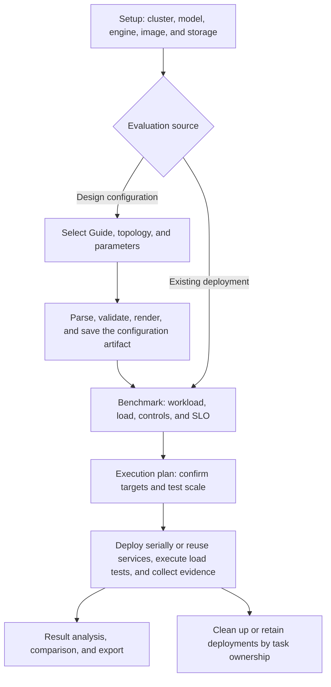

# Evaluation Overall Workflow and Features

Evaluation provides a complete workflow from deployment plan design, control experiment configuration, and load-test execution to result analysis and historical reproduction. It supports both performance and mechanism evaluation for four Guide types and performance checks for existing services, helping determine whether an actual deployment meets expectations, where optimization gains come from, and whether resource cost and SLOs are acceptable.

| Document | Content |
| --- | --- |
| [Overall Workflow and Features](README.md) | Configuration, execution, result analysis, and lifecycle management |
| [Detailed Guide Introduction](guides/README.md) | The mechanisms, inputs, outputs, and evaluation focus of the four Guide types |
| [Parameter Reference](parameters/README.md) | Configuration and evaluation fields, default values, ranges, and constraints |

## 1. Overall Workflow

| Stage | Functions | Output |
| --- | --- | --- |
| Setup | Select cluster, model, engine/image, model storage, and credentials | Unified execution environment |
| Configurations | Create or reuse configurations; choose Guide/variant; set replicas, TP, engine parameters, and topology scans; validate consistency between config and actual resources | Configuration artifacts, manifest, deployment bundle, and source version |
| Benchmark | Set fixed lengths, shared prefixes, repository profiles, or custom YAML; set load levels, baselines, and SLOs | Executable experiment plan |
| Execution plan | Show candidates, baselines, measurement points, and execution scale | Final Case list |
| Execution | Deploy and wait for Ready, or reuse an existing endpoint; call inference-perf through llmdbenchmark; save performance and observability data | Per-point, per-stage results and historical evidence |
| Results | View Guide primary metrics, charts, same-condition comparisons, mechanism evidence, historical resources, and real-time monitoring for available services | Performance judgment, SLO analysis, and capacity analysis |
| Export | Export reports, configuration, reproduction inputs, and evidence | Experiment materials that can be reviewed and reused |

The design-configuration path supports multiple candidates and optional baselines; in the current wizard, the existing-deployment path load-tests only the selected service and does not add a control group. Both new configurations and reused artifacts must match Setup.

## 2. Functional Modules

### 2.1 Environment and Resource Preparation

Set the cluster, model, inference engine, image, model storage, and access credentials in a unified way for reuse by candidate configurations in the current round. Guides and variants are loaded according to cluster source and capabilities, and saved configurations matching the current Setup are filtered.

| Function | Details |
| --- | --- |
| Model and storage checks | Select cached models or shared paths, and verify cache readiness and mount conditions |
| Software source management | Record the Guide repository, requested ref, actual commit, variant, and source files, and associate them with the benchmark source |
| Resource budget switching | Generate recommendations based on Available or Total resources, distinguishing currently available GPU count, physical total, and GPUs required by a single configuration |
| Topology recommendations | Provide model VRAM and TP recommendations; PD can use AIC recommendations, which users may then apply to the configuration |
| Existing service selection | Select from discovered available deployments; when entering a URL, it must also match the endpoint of a discovered deployment |

Resource recommendations are only auxiliary for configuration. Generation and deployment still require validation of Guide and cluster conditions. VRAM requirements inferred from model names are estimates and do not represent measured capacity.

### 2.2 Configuration Design, Editing, and Reuse

The configuration editor supports Guide-based generation, YAML import that satisfies import constraints, and editing/reusing saved artifacts. Multiple configurations share environment settings while separately retaining Guide, topology, and optimization combinations.

| Function | Details |
| --- | --- |
| Topology scan | Expands combinations of replica count, TP, or P:D; the current frontend generates at most 16 topology candidates |
| Role parameter overrides | Set engine parameters and environment variables by Prefill, Decode, or Both, and validate types and same-name conflicts |
| Guide-specific settings | Configure CPU cache, RDMA NICs, and router values, and validate applicability by variant |
| YAML import and editing | Check syntax and resource structure during import; after editing, revalidate declared parameters and resource content |
| Configuration preview | Show model, topology, resource requirements, parameters, generated YAML, and validation feedback |
| Save and reuse | Save validated configurations as Artifacts, which can later be selected, edited, copied, or deleted, and add other Guide configurations for comparison |
| Planning request reuse | Within the same editor, briefly reuse planning requests from the same official source to reduce repeated generation; failed results are not retained, and custom sources do not use this cache |

Configuration generation preserves the model manifest, layered router values, auxiliary resources, source information, and applicable calibration inputs. The render/save/deploy chain validates the model, image, role topology, parameters, environment, storage, and Guide settings, reducing the risk of inconsistency between form configuration and actual deployment. File checksums are used to check content integrity; parameter semantics are confirmed separately through resource-fact validation.

### 2.3 Optimization Combinations and Baseline Design

Users can select the Full Guide and supported baseline strategies for each configuration. The UI shows the composition relationships among EPP, prefix affinity, load awareness, and Guide-specific mechanisms, converts valid combinations into deployable experiment targets, and summarizes the target count.

| Comparison method | Questions it can answer |
| --- | --- |
| Full vs. Load-aware | The contribution of prefix affinity to reuse, throughput, and tail latency |
| Full vs. Prefix-cache aware | The impact of load scoring on hot-spot diversion and queueing |
| Full vs. neutral EPP routing | The difference between the complete strategy and a neutral entry strategy |
| Full vs. Direct vLLM | The performance of the full serving stack relative to a direct inference service |
| Precise vs. Optimized Baseline | The effect of precise cache-location awareness relative to approximate affinity |
| Precise vs. Bypass EPP | The difference when accessing the same set of model Pods through different entry paths |
| Multi-candidate configuration comparison | Performance and cost differences across Guides, resource topologies, or parameter combinations |

Combination selection is constrained by deployment capability. For example, same-Pod baselines must include the Full Guide, and specialized mechanisms also have paired routing requirements. Independent references for PD, Tiered, and Precise may also switch to aggregated deployments at the same time, so not all differences can be attributed to a single routing switch. See the [Guide introduction](guides/README.md) for the definition and comparison conditions of each baseline.

### 2.4 Workload and Load-test Plans

| Function | Details |
| --- | --- |
| Fixed-length scan | Test by ISL/OSL combinations and closed-loop concurrency steps, separately controlling the formal request count for each stage |
| Shared-prefix tests | Configure prefix group count, shared and unique inputs, output length, multi-round reuse, and Poisson arrival-rate steps |
| Profile and custom YAML | Reuse repository workloads, or define data, request mode, and load behavior |
| Quick presets | Provide Quick check, Concurrency sweep, Long inputs, and Guide defaults |
| Pre-submit validation | Check workload-mode exclusivity, numeric ranges, context lengths, selected configurations, and baseline dependencies |
| SLO settings | Configure TTFT and TPOT thresholds and percentiles, as well as success-rate requirements; the API also supports minimum output throughput |
| Execution scale preview | Summarize configuration, baseline, test points, request counts, or load duration, and allow going back to modify Setup, Configurations, and Benchmark |

Concurrency stages control the number of simultaneously in-flight requests, rate stages control the target arrival rate, and `parallelism` controls the number of independent load-generator workers. The execution plan estimates scale based on these different dimensions; deployment, preparation, warm-up, and request draining take additional time.

### 2.5 Task Management, Execution Tracking, and Troubleshooting

The task list supports search, filtering by status/mode/workload, and pagination, showing configuration and traffic summaries, the current Case, and execution phase. Failed tasks retain the failing phase and reason, making it easy to distinguish deployment failures from load-test failures.

| Function | Details |
| --- | --- |
| Stage progress | Track queued, deployment, benchmark, and completion states; the existing-endpoint path skips the deployment stage |
| Deployment details | View the latest attempt for each Case, Ready state, deployment logs, Pods, Kubernetes events, model logs, and readiness checks |
| Task retry | Support retrying failed or canceled multi-workload tasks; rebind available sessions and check whether configurations and deployments can be reused |
| Deployment retry | Provide Retry/Resume for self-managed deployments whose state allows it, preserving historical attempts and relationships |
| Model access recovery | If model access fails, a new access token can be provided for the next deployment retry; it is not written to the configuration Artifact or retry history |
| Cancel and delete | Operate by task or Case, distinguishing services created in this round from borrowed services and handling dependencies for shared services |

Successful Cases are usually retained during retries. If the service depended on by a failed same-Pod baseline no longer exists, the corresponding candidate must be rebuilt and rerun to ensure the baseline still uses the same set of Pods. See Section 5 for specific lifecycle rules.

#### Kubernetes Connection Failures Caused by Proxy Environments

If the deployment is already Ready but benchmarking hits
`Unable to connect to the server: Forbidden` during the `preparing-storage` phase, first check the benchmark process's proxy bypass list,
rather than expanding Kubernetes RBAC permissions based only on `Forbidden`. A proxy refusing the connection can also produce this error.

The runtime parameter `runtime.no_proxy` is merged and deduplicated with the backend process's `NO_PROXY` and `no_proxy`,
and `localhost`, `127.0.0.1`, `.svc`, and `.cluster.local` are added. Proxies are passed into the harness Pod through
`--set harness.extraEnvVars=...`; Helm downloads use an independent proxy wrapper.
The benchmark CLI and its kubectl subprocesses do not inherit `HTTP_PROXY`, `HTTPS_PROXY`, or `ALL_PROXY`
(including lowercase forms), avoiding interference from external proxies with automatic Kubernetes resource discovery. An explicit
`proxy-url` in kubeconfig remains unchanged. There is no need to manually maintain cluster IPs in `NO_PROXY` for the benchmark CLI's cluster access.
Helm and Pods still use the merged bypass list; if they need direct access to the API Server, that list must still include the corresponding addresses.

After updating backend code or the process environment, restart the backend and then retry the failed task; historical failure records do not automatically become successful after the configuration is fixed.

### 2.6 Joint Analysis of Performance, Mechanisms, and Resources

The results page organizes measurement points by experiment conditions and selects primary metrics according to the Guide. Users can move from overall results into a single configuration, length, and load stage, then further inspect metric sources and resource evidence.

| Analysis capability | Details |
| --- | --- |
| Primary metrics and charts | Table/Chart, P95/P99 switching, throughput and latency curves and frontiers, showing behavior under different loads |
| Same-condition comparison | Link configuration, ISL/OSL, and load points to show absolute values and changes for candidates and baselines, avoiding mixing concurrency with RPS |
| Guide-specific evidence | For Baseline, inspect reuse and load distribution; for PD, inspect generation stability and transfer; for Precise, inspect actual reuse and indexing; for Tiered, inspect restore and capacity cost |
| Metric interpretation | Click a metric to view its meaning, raw fields, data source, window, formula, and why it was not collected |
| Historical resource analysis | View collected node, device, Pod, role, and cache signals by configuration, length, load, and time range; support whole-run resource comparison |
| Real-time monitoring | Provide current service monitoring when a live deployment is available, separate from saved historical evidence |
| Result compatibility and backfill | Read different runner report formats; older records can fill in metrics when enough raw files are retained, while missing evidence remains marked missing |

In addition to aggregated metrics, evaluation also adds two kinds of request evidence: per-request SLO goodput validates joint compliance based on request details; automatic KV probing collects complete prompt blocks for successful requests in compatible newly created vLLM deployments and verifies request association and record completeness. See the [Guide introduction](guides/README.md) for KV collection requirements and scope, and the [parameter reference](parameters/README.md) for metric definitions.

## 3. Experiment Organization and Execution

| Object | Meaning |
| --- | --- |
| Guide / variant | Optimization scheme and its engine, hardware, or cache implementation variant |
| Configuration Artifact | A saved deployable configuration and source information |
| BenchmarkPlan | A plan linking configurations, workloads, and baselines |
| Scenario | A set of workloads and SLOs; the API supports multiple scenarios per Plan, while the current wizard submits a single scenario |
| Case | An actually executed candidate group or baseline group |
| Matrix point / Stage | Input/output length combination / a single concurrency or arrival-rate stage |

Targets are executed serially, and the same deployment can be reused across multiple Scenarios. Same-Pod Service baselines follow immediately after the candidate Case they depend on; identical baselines may be deduplicated, and the actual execution volume is determined by the final plan.

Resource budgets are calculated per individual deployment. When preserve deployment is off, independent targets are typically deployed after the previous target is cleaned up; when preserve deployment is on, completed deployments continue to occupy resources. PD GPU count is the sum of the Prefill and Decode sides.

By default, Matrix performs 2 warm-up requests before each sweep, which are not scored, and does not warm up each stage separately. Stages do not automatically clear cache, and same-Pod baselines inherit the candidate's cache; when comparing them, execution order and cache state must be preserved.

For example, 3 targets, 2 length points, 3 concurrency stages, 100 requests per stage, and 1 worker correspond to 18 formal measurement combinations and 1,800 formal requests, excluding warm-up. `parallelism` indicates the number of load-generator workers.

## 4. Result Analysis and Judgment

The results page supports primary metric Table/Chart, P95/P99 switching, throughput and latency comparisons, and Selected result details. Metric details provide source, scope, window, formula, and reasons for absence. Compare compares by the same load mode, length, and stage; Resources shows saved monitoring and resource evidence.

| Result | Judgment definition |
| --- | --- |
| Execution status | `succeeded` means the benchmark execution succeeded; SLO is judged independently |
| `sla.met` | false if any configured target fails; true if all have data and pass; null if there are no targets or evidence is insufficient without a clear failure |
| `maximum_stable_qps` | The highest tested stable target rate: configured SLOs are met, the minimum success-rate requirement is met (99% if unset), and actual req/s reaches at least 95% of the target |
| `slo_goodput_rps` | The maximum actual request throughput among stable stages |
| `metrics.request_slo_goodput` | The number of successful requests simultaneously satisfying configured per-request latency thresholds, divided by the actual complete measurement duration; it cannot be reconstructed from P95/P99 |
| Guide mechanism metrics | Explain performance changes together with routing, engine, cache, and resource evidence; see the [Guide introduction](guides/README.md) for details |

A single load point only indicates performance under that condition, and stable capacity is limited to the tested ladder. Missing data is marked unavailable; whole-run monitoring cannot directly stand in for per-stage measurements, and real-time resource state cannot fill historical missing values.

## 5. Cancellation, Cleanup, and History

| Operation or state | Deployment and record handling |
| --- | --- |
| Completed successfully | By default, clean up self-created deployments from this run; `preserve_deployment` can retain successful candidates, while independent baselines are still cleaned up |
| Failed or canceled | Clean up self-created services from this run; cancellation takes precedence over success-retention options |
| Cancel benchmarking on an existing deployment | Stop the benchmark and retain the borrowed model service |
| Cancel a single Case | Also cancel dependent Cases sharing the same service; other independent Cases may continue |
| Cleanup failure | Remain in `cancelling` and record the reason; retry is possible; backend restart continues unfinished cancellations |
| After deployment cleanup | Collected results, monitoring, resource snapshots, and reports are retained with the task |
| Delete task | Also delete child benchmarks, retry records, and local results; a child record cannot be deleted independently while its parent task still exists |

Historical monitoring is viewed through Recorded monitoring. The application has no time-based automatic expiration policy for records; task and result directories should use persistent storage.

## 6. Exported Content

| File | Content |
| --- | --- |
| Markdown report | Overview, metrics, baselines, per-stage results, and saved configurations |
| `modelserver.yaml` | Model service resources |
| `deployment-bundle.zip` | manifest, router values, source, and available auxiliary resources |
| `reproduction-inputs.json` | Selected scope, configuration, benchmark, and execution source |
| `evidence.json` | Selected metrics, monitoring, resources, and evidence scope |

Export scope depends on what has been saved; external datasets, Secret values, and all dependencies are not automatically packaged.

## 7. Major Optimization Work and Effects

Evaluation optimization covers configuration correctness, experiment controllability, execution reliability, and result interpretability. The table below summarizes engineering improvements and their effects; throughput or latency gains from Guides still need to be confirmed through actual controlled experiments.

| Optimization work | Key implementation points | Effect |
| --- | --- | --- |
| Complete deployment-input persistence | Save the Guide deployment bundle, router overlay layers, auxiliary resources, source commit, and calibration inputs | Preserve routing and Guide dependencies when reusing configurations |
| Cross-layer configuration consistency validation | Verify actual resource facts from input through render, save, and deploy | Detect inactive parameters, role mismatches, and storage inconsistencies early |
| Parameter and planning interaction optimization | Centralize role parameters, resource budgets, topology recommendations, previews, and short-term planning reuse | Reduce repeated configuration and generation wait time, and make experiment variables clearer and traceable |
| Explicit modeling of optimization combinations | Show component composition, support scope, and dependencies, and distinguish independent deployments from same-Pod baselines | Clarify which mechanisms and resources the experiment actually changes |
| Execution and retry association | Serial execution, scenario reuse, baseline deduplication, deployment readiness checks, and historical-attempt linkage | Reduce repeated deployment overhead and preserve the context needed for failure recovery |
| Cancellation and service-ownership management | Cancel shared-service dependencies, clean up by ownership, support retry on failure, and continue cancellations after restart | Protect borrowed services and reduce residual resources after task cancellation |
| Guide-specific result organization | Unified result Explorer showing performance, mechanism, and resource evidence by Guide | Tie performance changes to the corresponding optimization mechanisms |
| Statistical definitions and evidence constraints | Distinguish percentiles, actual/target throughput, whole-run/per-stage, measured/estimated values, and missing values | Reduce misjudgment caused by cross-condition comparison and evidence extrapolation |
| Request-level goodput and KV collection | Align request identity, thresholds, windows, and counts, and explain reasons when integrity is insufficient | Supplement joint-compliance and cache-working-set evidence that aggregated latency cannot express |
| Historical retention and reproduction export | Save monitoring and resource snapshots before cleanup, retain them with the task, and export configurations, reports, and evidence | Make it possible to trace, compare, and reuse experiment materials after deployments are released |
