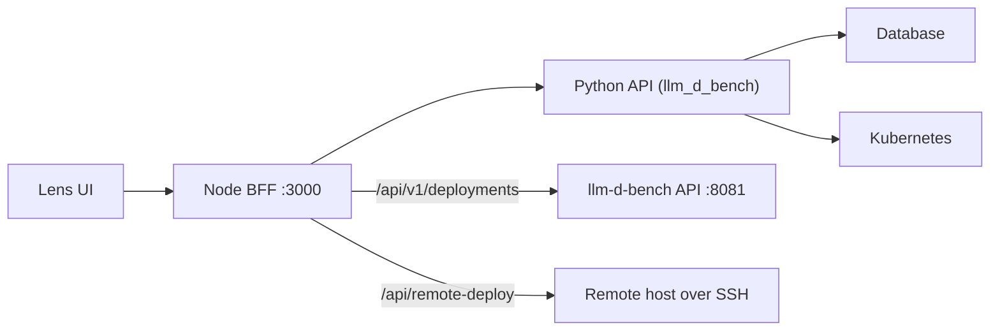

Lens exposes a same-origin HTTP API through the Node BFF; the browser only calls
`/api/...` paths, which Vite proxies to the Node backend in development. The Node
backend forwards domain calls to the Python FastAPI backend (`llm_d_bench`),
which owns validation, persistence and task execution.



## Surfaces

| Surface | Description |
| --- | --- |
| Node BFF | Same-origin `/api/...` routes used by the browser; proxies to the Python API and hosts MCP tooling. |
| Python API | FastAPI routes for deploy, simulation, evaluation, storage, monitoring and auth. |
| MCP tools | Assistant-callable operations generated from backend routes into the MCP catalog. |
| Kubernetes backend | Server-side Kubernetes access over the official Python client, with CLI rollback. |

## Modules

Every Lens module has a dedicated page covering its backend HTTP endpoints and,
where one exists, how to call its Python service layer directly (for internal
scripts, tests or automation) instead of over HTTP:

<CardGroup cols={3}>
  <Card title="Model market" href="/api-reference/modules/model-market">Catalog hand-off (frontend-only catalog).</Card>
  <Card title="Deployments" href="/api-reference/modules/deployments">Runs, executions, cases, access.</Card>
  <Card title="Evaluation" href="/api-reference/modules/evaluation">Guided benchmark tasks.</Card>
  <Card title="Simulation" href="/api-reference/modules/simulation">Trace-based simulation runs.</Card>
  <Card title="Model services" href="/api-reference/modules/model-services">Gateway, providers, selection policies.</Card>
  <Card title="Clusters" href="/api-reference/modules/clusters">Registration, bootstrap, overview.</Card>
  <Card title="Storage" href="/api-reference/modules/storage">Volumes and storage backends.</Card>
  <Card title="Model cache" href="/api-reference/modules/model-cache">Cached model artifacts.</Card>
  <Card title="External providers" href="/api-reference/modules/external-providers">Third-party AI providers.</Card>
  <Card title="Observability" href="/api-reference/modules/observability">Accelerator, cluster stack, GPU driver, profiling.</Card>
  <Card title="Lens Assistant" href="/api-reference/modules/lens-assistant">Node MCP tool catalog.</Card>
  <Card title="Administration" href="/api-reference/modules/administration">Auth, RBAC and system settings.</Card>
</CardGroup>

Every Python backend endpoint is also documented in the generated FastAPI
OpenAPI schema. Regenerate it after backend route changes:

```bash
source .venv/bin/activate
npm run docs:api
```

## Conventions

Every new or modified externally callable API (FastAPI routes, HTTP handlers,
RPC/MCP tools and their request/response contracts) must keep its description
consistent with the implemented behavior, validation, authorization, defaults,
status codes and schemas. See the repository API description requirements in
`.github/instructions/api-documentation.instructions.md`.
